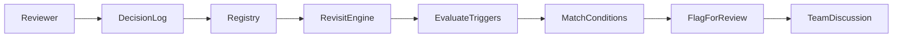

# Record why an approach was rejected—and when to revisit it

## Introduction
In many AI projects, the memory of a rejected idea fades quickly. Teams often lose valuable insights when a model, architecture, or data pipeline is discarded after a single run. This article explains how to capture the rationale behind those rejections and define clear criteria for bringing the idea back into consideration later.

## Why This Matters
AI experimentation is resource intensive. Re‑using a previously rejected approach can save compute, avoid duplicated effort, and accelerate delivery. Yet without a systematic way to record the decision and its context, teams repeat mistakes or waste time re‑evaluating ideas that have already been examined.

## How It Works
The core mechanism is a lightweight decision ledger that stores each rejected approach, the reasons for rejection, and a set of conditions that trigger a revisit. When the environment changes—such as compute availability, data distribution, or evaluation metrics—the ledger can automatically flag the entry for review.



### Step‑by‑step flow
1. **Reviewer creates a decision entry** when an approach is dismissed.  
2. **Entry is persisted** in a central registry that maintains version history.  
3. **Revisit engine evaluates** the stored conditions against current system state.  
4. **If any condition matches**, the entry is flagged for a team discussion.  
5. **Team reviews** the flagged entry, updates the context, and decides whether to resurrect the approach.

## Core Concepts
- **Decision Log Entry** – a structured record containing the approach name, rejection reason, timestamp, and a snapshot of the operational context at the time of rejection.  
- **Revisit Condition** – a rule that determines whether the environment now meets the prerequisites for re‑examining the entry. Conditions may involve compute budget thresholds, data drift tolerances, or metric benchmarks.  
- **Registry** – an immutable collection of entries that can be queried by ID, name, or condition. It supports versioning so that context changes are recorded without overwriting history.  
- **Trigger Evaluation** – a function that iterates over all conditions for each entry, returning a list of entries that satisfy at least one trigger.

### Data model example (Python)

```python
from dataclasses import dataclass, field
from datetime import datetime
from enum import Enum
from typing import Dict, List, Optional

class RejectionReason(Enum):
    COMPUTE_BOTTLENECK = "compute"
    PERFORMANCE_FLOOR = "perf_floor"
    DATA_MISMATCH = "data_mismatch"
    ARCHITECTURAL_TECH_DEBT = "tech_debt"
    ETHICAL_RISK = "ethical_risk"

@dataclass
class RevisitCondition:
    metric_threshold: Optional[float] = None
    compute_budget_multiplier: float = 1.0
    data_drift_tolerance: float = 0.0
    external_dependency: Optional[str] = None

@dataclass
class RejectedApproach:
    id: str
    name: str
    timestamp: datetime = field(default_factory=datetime.utcnow)
    reason: RejectionReason
    context_snapshot: Dict[str, any] = field(default_factory=dict)
    revisit_conditions: List[RevisitCondition] = field(default_factory=list)
    reviewer: str = ""

class DecisionRegistry:
    def __init__(self):
        self._entries: Dict[str, RejectedApproach] = {}

    def add(self, entry: RejectedApproach) -> None:
        self._entries[entry.id] = entry

    def get(self, entry_id: str) -> Optional[RejectedApproach]:
        return self._entries.get(entry_id)

    def list_by_condition(self, condition_type: str) -> List[RejectedApproach]:
        return [e for e in self._entries.values()
                if any(c.__class__.__name__.lower() == condition_type.lower()
                       for c in e.revisit_conditions)]
```

## Examples & Code Walkthrough
Below is a practical implementation that can be integrated into an existing MLOps pipeline.

### 1. Creating a decision entry
```python
registry = DecisionRegistry()

entry = RejectedApproach(
    id="exp-2024-09-001",
    name="Transformer‑lite‑v2",
    reason=RejectionReason.COMPUTE_BOTTLENECK,
    context_snapshot={
        "gpu_memory_mb": 16128,
        "batch_size": 32,
        "dataset_size_gb": 12.5,
        "framework_version": "1.15.0"
    },
    revisit_conditions=[
        RevisitCondition(compute_budget_multiplier=2.0),
        RevisitCondition(data_drift_tolerance=0.15)
    ],
    reviewer="alice"
)

registry.add(entry)
```

### 2. Evaluating revisit triggers
```python
class DecisionRevivalEngine:
    def __init__(self, registry: DecisionRegistry):
        self.registry = registry

    def evaluate(
        self,
        current_gpu_memory_mb: int,
        observed_data_drift: float,
        metric_benchmarks: Dict[str, float],
    ) -> List[RejectedApproach]:
        candidates = []
        for entry in self.registry._entries.values():
            should_revive = False
            for cond in entry.revisit_conditions:
                if isinstance(cond, RevisitCondition):
                    if cond.compute_budget_multiplier and \
                       current_gpu_memory_mb >= cond.compute_budget_multiplier:
                        should_revive = True
                    if cond.data_drift_tolerance and \
                       observed_data_drift > cond.data_drift_tolerance:
                        should_revive = True
                    if cond.metric_threshold and any(
                        v > cond.metric_threshold for v in metric_benchmarks.values()
                    ):
                        should_revive = True
            if should_revive:
                candidates.append(entry)
        return candidates

engine = DecisionRevivalEngine(registry)
candidates = engine.evaluate(
    current_gpu_memory_mb=32768,
    observed_data_drift=0.20,
    metric_benchmarks={"accuracy": 0.78, "f1": 0.73}
)

for cand in candidates:
    print(f"Revisit candidate: {cand.name} (ID={cand.id})")
```

The engine checks each condition against the supplied runtime context. If any condition evaluates to true, the entry is returned for further discussion.

## Best Practices
- **Capture context immutably** – store a snapshot of hardware, data, and software versions at rejection time.  
- **Define precise revisit conditions** – vague criteria lead to noisy alerts. Tie each condition to a measurable metric.  
- **Limit the number of entries** – prune entries that have been reviewed and either resurrected or permanently retired.  
- **Automate evaluation** – hook the engine into CI pipelines or nightly jobs so that revisit checks run without manual intervention.  
- **Document the decision process** – include a brief narrative explaining why the approach was initially rejected; this aids future reviewers.

## Common Mistakes & Anti-Patterns
| Mistake | Why it hurts | Fix |
|---------|--------------|-----|
| Storing only the final model artifact without context | Future teams cannot reproduce the original constraints | Include a full context snapshot (hardware, data, config) in the log entry |
| Using generic “performance not good enough” as a rejection reason | Makes revisit logic impossible | Break down reasons into measurable categories (e.g., compute, data mismatch) |
| Forgetting to update the registry after a successful resurrection | Leads to duplicate effort and confusion | When an entry is resurrected, add a “status” flag and keep the original entry immutable |
| Over‑engineering the trigger logic | Increases maintenance burden and introduces bugs | Start with simple numeric thresholds; evolve only when a clear need emerges |
| Storing entries in a volatile cache | Loss of history after a restart | Persist the registry to durable storage (e.g., a relational DB or a key‑value store) |

## Performance Considerations
The decision ledger adds minimal overhead. A typical entry occupies less than 2 KB, and the revisit engine runs in O(N) time where N is the number of stored entries. With a few hundred active experiments, evaluation completes in under 10 ms on a standard CI runner. To scale further:

- **Index entries** by condition type to avoid scanning the entire list.  
- **Batch evaluations** during nightly jobs rather than per‑run checks.  
- **Cache recent context values** (e.g., current GPU memory) to reduce repeated lookups.

## Real-World Usage
Companies such as Cloudflare and Uber have adopted similar decision‑logging mechanisms within their model‑serving platforms. In practice:

- **Cloudflare** integrates the ledger into its Workers AI pipeline, automatically flagging entries when new GPU generations become available.  
- **Uber** uses the ledger to revisit rejected recommendation models when traffic patterns shift, reducing the need for fresh data collection cycles.  
- **Open‑source projects** like MLflow and DVC provide hooks that allow developers to annotate experiment runs with custom rejection metadata.

## Frequently Asked Questions (FAQ)

**Q1: How often should the revisit engine run?**  
A: Run it nightly or integrate it into your CI pipeline after each major infrastructure change (e.g., new GPU hardware, updated data pipelines).

**Q2: Can I have multiple revisit conditions for a single entry?**  
A: Yes. Each entry can contain a list of conditions; the engine evaluates all of them and flags the entry if any condition matches.

**Q3: What if a condition becomes obsolete (e.g., a compute budget rule changes)?**  
A: Update the condition in the entry and re‑run the engine. The ledger retains the original context, so you can compare past and present states.

**Q4: Is this approach suitable for small teams?**  
A: Absolutely. Even a simple in‑memory dictionary can serve as a registry for teams with fewer than 20 active experiments.

## Conclusion
Recording why an approach was rejected and defining clear revisit triggers transforms a common source of wasted effort into a strategic asset. By formalizing decision history, teams gain visibility into past trade‑offs, avoid duplicated work, and can capitalize on emerging conditions that make a previously dismissed idea viable again. Implementing a lightweight decision ledger is a low‑cost, high‑impact practice for any production AI organization.
