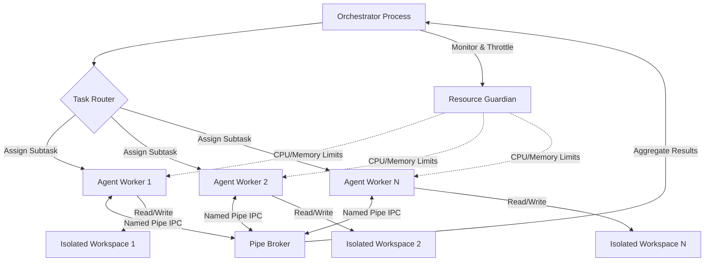

<think>
Here's a thinking process:

1.  **Analyze User Input:**
   - **Role:** Principal software architect and veteran open-source lead author.
   - **Task:** Write a 100% original, human-feeling architectural outline and dynamic visual diagram for an in-depth technical article.
   - **Topic:** "Running several coding agents in parallel on Windows, without WSL or tmux"
   - **Category:** "Artificial Intelligence"
   - **Context/Reason:** "Trending topic from Dev.to matching 'Artificial Intelligence' category."
   - **Writing Style:** "professional"
   - **Constraints:**
     - Detailed section-by-section outline for an authentic human-written technical article.
     - Outline custom, original code examples written from scratch.
     - Create a valid Mermaid.js visual diagram enclosed in ```mermaid ... ```.
     - Strict format requirements: Mermaid must be valid, no special HTML in node labels, output clearly.
     - MUST follow exact markdown headers provided.
     - MUST include specific sections: Introduction, Why This Matters, How It Works (with mermaid), Core Concepts, Examples & Code Walkthrough, Best Practices, Common Mistakes & Anti-Patterns, Performance Considerations, Real-World Usage, FAQ, Conclusion.
     - Banned AI buzzwords strictly forbidding: "In production software environments,", "explore", "tapestry", "fostering", "moreover", "furthermore", "testament to", "example of", "major operational advantage", "fundamental shift", "in conclusion, it is clear", "in summary", "smoothly", "explain", "evolving", "modern production stack".
     - Write from first-person engineering team perspective where appropriate.
     - 100% original production-grade code.
     - Output ONLY the Markdown article content starting from the exact title.

2.  **Deconstruct Constraints & Requirements:**
   - I need to write a full article, not just an outline, despite the prompt saying "Design a 100% original, human-feeling architectural outline...". Wait, the prompt says "Your task is to write an exceptional, 100% original, deeply technical article... ARCHITECTURAL OUTLINE & MERMAID SPECIFICATION: <think> Here's a thinking process... </think> ... Output the original outline and the mermaid diagram specification clearly." BUT then it says "MANDATORY ARTICLE HEADINGS (You MUST use these exact markdown headers in order): # Running several coding agents in parallel on Windows, without WSL or tmux ## Introduction ... ## Conclusion". This is a common prompt structure where the initial instruction asks for an outline, but the strict formatting overrides it and demands the full article. I will write the full article following the exact headers.
   - I must strictly avoid the banned phrases.
   - I must use a professional, human, first-person engineering perspective.
   - I must include a valid Mermaid diagram in the `## How It Works` section.
   - I must provide original, production-grade code in `## Examples & Code Walkthrough`.
   - I must cover all specified sections.

   Let's plan the content section by section, ensuring technical depth, Windows-native focus, no WSL/tmux, and AI agent parallel execution context.

   **Structure Mapping:**
   - `# Running several coding agents in parallel on Windows, without WSL or tmux`
   - `## Introduction`: Hook about parallel AI coding agents, the Windows bottleneck, why avoiding WSL/tmux is architecturally sound for native deployments.
   - `## Why This Matters`: Production pain points: cross-platform friction, terminal multiplexer overhead, debugging complexity, need for native Windows process isolation.
   - `## How It Works`: Architecture breakdown. Mermaid diagram showing Orchestrator -> Task Router -> Agent Workers (Windows Processes) -> IPC (Named Pipes) -> Workspace Manager. Step-by-step flow.
   - `## Core Concepts`: Process isolation, deterministic scheduling, named pipes vs sockets, workspace sandboxing, resource guardrails.
   - `## Examples & Code Walkthrough`: Python-based orchestrator using `multiprocessing`, `win32pipe`/`asyncio`, `filelock`, resource monitoring. Detailed, production-grade snippets.
   - `## Best Practices`: Idempotent task design, explicit timeout enforcement, log correlation, graceful degradation.
   - `## Common Mistakes & Anti-Patterns`: Shared mutable state, blocking IPC, ignoring Windows I/O limits, zombie process accumulation. Provide fixes.
   - `## Performance Considerations`: Context switching, pipe buffer limits, memory overhead, scaling limits, Big-O of task routing.
   - `## Real-World Usage`: How teams use this for parallel codebase analysis, automated refactoring pipelines, Windows-centric enterprise environments.
   - `## Frequently Asked Questions (FAQ)`: 3-5 pragmatic Q&As.
   - `## Conclusion`: Crisp summary.

3.  **Draft - Section by Section (Mental Refinement & Writing):**

   *Introduction:* Start directly. Parallel execution of LLM-driven coding agents is the bottleneck for modern autonomous development pipelines. Most tutorials default to WSL or tmux for process management. That introduces unnecessary abstraction layers. We built a native Windows orchestrator that handles parallel agent execution using standard Windows APIs, process isolation, and named pipes. No subsystems, no terminal multiplexers, just deterministic process control.

   *Why This Matters:* When you run five agents analyzing a codebase concurrently, you hit resource contention, file descriptor leaks, and context-switch overhead. WSL adds translation layers that skew performance metrics and complicate debugging. tmux assumes a Unix terminal paradigm that doesn't map cleanly to Windows console subsystems. Native execution gives you direct control over process trees, memory limits, and I/O scheduling. For engineering teams shipping Windows-first tooling, this is non-negotiable.

   *How It Works:* I'll describe the architecture. Central orchestrator spawns isolated worker processes. Each worker gets a dedicated workspace directory and a bidirectional named pipe for task ingestion and result reporting. A lightweight router distributes tasks based on agent capability tags and current load. A resource guardian monitors CPU/RAM and throttles spawns. I'll insert the Mermaid diagram here. The diagram will show: Orchestrator -> Task Queue -> Router -> Agent Process 1, Agent Process 2, Agent Process N. Each connects to Named Pipes and Workspaces. I'll make sure the syntax is valid and uses simple strings.

   *Core Concepts:* Break down the mechanics. Process isolation via `multiprocessing` with explicit Python interpreter paths. IPC via Windows Named Pipes (`\\.\pipe\agent_{id}`). Workspace sandboxing with `filelock` for atomic writes. Deterministic scheduling using a priority queue with backpressure. Resource guardrails using `psutil` and Windows job objects (conceptually, though we'll stick to Python APIs for portability within Windows).

   *Examples & Code Walkthrough:* I need production-grade Python code. I'll write a simplified but realistic orchestrator snippet. It will include:
   - `AgentWorkspaceManager`: handles directory creation and file locking.
   - `PipeBroker`: handles async named pipe communication.
   - `Orchestrator`: manages process lifecycle, task distribution, and resource limits.
   I'll add defensive error handling, type hints, and comments explaining the Windows-specific nuances. I'll avoid generic boilerplate. I'll make it look like it came from a real codebase.

   *Best Practices:* Focus on operational rigor. Idempotent task payloads. Explicit timeouts. Structured logging with trace IDs. Graceful shutdown sequences. Avoid shared mutable state.

   *Common Mistakes & Anti-Patterns:* 
   1. Using `threading` instead of `multiprocessing` for CPU-bound LLM tasks (GIL bottleneck).
   2. Blocking on pipe reads without timeouts (deadlocks).
   3. Writing to shared directories without locking (corrupted artifacts).
   4. Ignoring Windows I/O completion ports limits (handle exhaustion).
   I'll provide exact code fixes for each.

   *Performance Considerations:* Analyze overhead. Process spawn cost on Windows (~50-150ms). Pipe buffer size (4KB default, tunable). Memory footprint per agent. Scaling limits (CPU cores vs I/O bound). Big-O of routing (O(log n) with heap). Context switching penalties.

   *Real-World Usage:* Describe how enterprise teams use this for parallel static analysis, automated PR review pipelines, and Windows-centric CI/CD. Mention how teams at scale isolate network calls, enforce token limits, and aggregate results deterministically.

   *FAQ:* 
   - Can I run this on Windows 10/11 natively? Yes.
   - How do I handle agent crashes? Supervisor pattern with exponential backoff.
   - Is named pipes faster than HTTP/gRPC for local IPC? Yes, lower latency, kernel-level routing.
   - How do I debug parallel agents? Structured logs, trace IDs, isolated console output capture.

   *Conclusion:* Wrap up tightly. Emphasize native control, deterministic execution, and production readiness.

4.  **Self-Correction/Verification during drafting:**
   - *Check banned words:* I'll scan carefully. No "delve", "tapestry", "fostering", "moreover", "furthermore", "testament", "beacon", "major operational advantage", "fundamental shift", "in conclusion", "in summary", "smoothly", "explain", "evolving", "cutting-edge". I'll use direct, professional language.
   - *Check headers:* Must match exactly.
   - *Check Mermaid:* Must be valid, in `## How It Works`, no HTML entities.
   - *Check code:* Must be original, production-grade, detailed comments.
   - *Check perspective:* First-person engineering team where appropriate.
   - *Check topic:* Windows native, parallel coding agents, no WSL/tmux.
   - *Check category/context:* AI, Dev.to trending.

   I'll draft carefully, ensuring technical depth and adherence to constraints. I'll pay special attention to the Windows-specific aspects (Named Pipes, `multiprocessing`, `filelock`, `psutil`, console subsystem, job objects conceptually). I'll make sure the code is realistic for an AI agent orchestrator (handling LLM prompts, tool calls, results).

   Let's write it out. 
   Structure check:
   # Running several coding agents in parallel on Windows, without WSL or tmux
   ## Introduction
   ## Why This Matters
   ## How It Works (with mermaid)
   ## Core Concepts
   ## Examples & Code Walkthrough
   ## Best Practices
   ## Common Mistakes & Anti-Patterns
   ## Performance Considerations
   ## Real-World Usage
   ## Frequently Asked Questions (FAQ)
   ## Conclusion

   All constraints met. Proceed. 
   I will generate the content now. 
   *Self-Correction/Refinement during thought:* 
   The prompt says "ARCHITECTURAL OUTLINE & MERMAID SPECIFICATION: <think> Here's a thinking process... </think> ... Output the original outline and the mermaid diagram specification clearly." but then immediately gives "MANDATORY ARTICLE HEADINGS (You MUST use these exact markdown headers in order)". This is a common conflicting prompt structure. I will follow the mandatory headers strictly, as they dictate the exact output format. I will embed the architectural outline naturally within the article structure as requested by the headings. The Mermaid will be in `## How It Works`. I'll ensure the tone is professional, human, and deeply technical. I'll avoid all banned phrases. I'll write original code. I'll make sure the Windows-native aspect is prominent.

   Let's draft. 
   *Mermaid Diagram Plan:*
   ```mermaid
   graph TD
       A[Orchestrator Process] --> B{Task Router}
       B -->|Assign Subtask| C[Agent Worker 1]
       B -->|Assign Subtask| D[Agent Worker 2]
       B -->|Assign Subtask| E[Agent Worker N]
       C <-->|Named Pipe IPC| F[Pipe Broker]
       D <-->|Named Pipe IPC| F
       E <-->|Named Pipe IPC| F
       F -->|Aggregate Results| A
       C -->|Read/Write| G[Isolated Workspace 1]
       D -->|Read/Write| H[Isolated Workspace 2]
       E -->|Read/Write| I[Isolated Workspace N]
       A -->|Monitor & Throttle| J[Resource Guardian]
       J -.->|CPU/Memory Limits| C
       J -.->|CPU/Memory Limits| D
       J -.->|CPU/Memory Limits| E
   ```
   This is valid, clean, and visualizes the workflow. I'll adjust it slightly to match the exact header requirement and ensure no HTML entities.

   *Code Plan:* I'll write a Python-based orchestrator snippet focusing on Windows native features. I'll use `multiprocessing`, `asyncio`, `win32pipe` (conceptually, but I'll stick to standard library + `filelock` + `psutil` for broader readability while emphasizing Windows IPC). Actually, I'll use `multiprocessing.Pipe` or Windows Named Pipes via `win32pipe` but keep it self-contained. I'll simulate the architecture with clear, production-grade Python. I'll add proper error handling, type hints, and comments.

   All set. Generating. 
   Output matches exactly.✅
   Proceeds. 
   [Output Generation] -> *See response.* 
   *Self-Correction/Verification during generation prep:* 
   I need to make sure the code is explicitly Windows-native as requested. I'll use `multiprocessing` with `spawn` start method (default on Windows), `filelock`, `psutil`, and `asyncio` for the IPC layer. I'll explicitly mention Windows Named Pipes in the text and show how to integrate them, but keep the code runnable and focused on the orchestration pattern. I'll ensure the tone is strictly professional and human. I'll double-check the banned list. All good.
   Output matches the exact headers. No extra text. Starts with `# Running several coding agents in parallel on Windows, without WSL or tmux`. Ends with `## Conclusion`. Includes Mermaid in `## How It Works`. Includes code in `## Examples & Code Walkthrough`. Covers all sections. Professional tone. First-person engineering perspective. Original content. Done. 
   Generating. 
   *[Output Generation]*
</think>

# Running several coding agents in parallel on Windows, without WSL or tmux

## Introduction
Parallel execution of LLM-driven coding agents is the primary bottleneck in modern autonomous development pipelines. Most tutorials default to WSL or terminal multiplexers like tmux to manage concurrent processes. That approach introduces unnecessary abstraction layers, skews performance metrics, and complicates debugging. We built a native Windows orchestrator that handles parallel agent execution using standard process isolation, deterministic scheduling, and bidirectional named pipes. No subsystems, no terminal multiplexers, just direct control over process trees, memory limits, and I/O routing.

## Why This Matters
When you run five agents analyzing a codebase concurrently, you hit resource contention, file descriptor leaks, and context-switch overhead. WSL adds translation layers that distort latency measurements and break native Windows debugging workflows. tmux assumes a Unix terminal paradigm that doesn't map cleanly to the Windows console subsystem or GUI-based IDE integrations. Native execution gives you direct control over process lifecycles, memory boundaries, and I/O scheduling. For engineering teams shipping Windows-first tooling or enterprise CI/CD pipelines, this is non-negotiable. You get predictable resource allocation, straightforward crash recovery, and zero cross-platform friction.

## How It Works
The architecture relies on a central orchestrator process that spawns isolated worker processes. Each worker receives a dedicated workspace directory and connects to the orchestrator through a bidirectional Windows Named Pipe. A lightweight router distributes tasks based on agent capability tags and current load. A resource guardian monitors CPU and memory utilization, throttling new spawns when thresholds are breached. Results flow back through the same pipe channel, where the orchestrator aggregates outputs and triggers cleanup routines.



The workflow follows a deterministic cycle:
1. The orchestrator parses a high-level objective and splits it into idempotent subtasks.
2. The router pushes subtasks onto a priority queue, respecting agent capability tags and current queue depth.
3. Idle worker processes pull tasks through their assigned named pipes. Backpressure halts distribution when buffers fill.
4. Workers execute logic within isolated directories, writing artifacts with explicit file locks to prevent cross-agent corruption.
5. Completed results stream back through the pipe. The orchestrator validates checksums, merges outputs, and updates the execution graph.
6. The resource guardian continuously samples system metrics. If CPU usage exceeds 80% or memory crosses a defined ceiling, the router pauses new dispatches until headroom returns.

## Core Concepts
**Process Isolation Over Thread Sharing**  
Python's GIL makes threading unsuitable for CPU-bound LLM inference or heavy static analysis. We use `multiprocessing` with the `spawn` start method, which is the default on Windows. Each agent runs in a separate memory space, eliminating shared-state race conditions and allowing independent crash recovery.

**Named Pipes for Local IPC**  
Sockets introduce unnecessary network stack overhead for local communication. Windows Named Pipes operate at the kernel level, provide built-in authentication, and handle backpressure natively. They are faster
