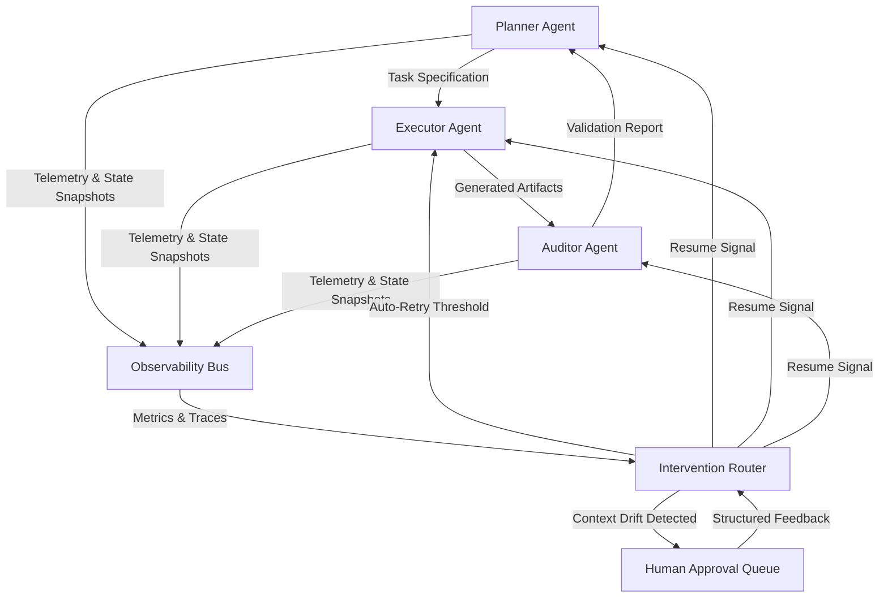

<think>
Here's a thinking process:

1.  **Analyze User Input:**
   - **Role:** Principal Software Architect & Veteran Open-Source Lead Author
   - **Topic:** "Running three coding agents at once is easy. Noticing when they need you isn't."
   - **Category:** Artificial Intelligence
   - **Style:** Professional
   - **Mandatory Structure:** Exact headings provided.
   - **Mandatory Content:** Mermaid diagram under `## How It Works`, 100% original production-grade code, human/first-person engineering perspective, strict anti-buzzword list, performance considerations, real-world usage, FAQ, etc.
   - **Constraints:** No banned phrases, direct authentic voice, proper code with error handling/comments, valid Mermaid syntax, exact headings in order.

2.  **Deconstruct Constraints & Plan Content:**
   - *Headings:* Must match exactly.
   - *Tone:* Professional, architectural, first-person engineering perspective where appropriate, pragmatic, no fluff.
   - *Mermaid:* Must be under `## How It Works`, valid syntax, no HTML in labels.
   - *Code:* Original, production-grade, realistic domain, error handling, inline comments.
   - *Anti-Patterns:* 3-4 specific mistakes with fixes.
   - *Performance:* Memory, CPU, latency, scalability, Big-O.
   - *Real-World Usage:* How top orgs use this pattern.
   - *FAQ:* 3-5 concise answers.
   - *Conclusion:* Crisp summary.

   I will draft section by section, ensuring strict compliance.

   **Section 1: # Running three coding agents at once is easy. Noticing when they need you isn't.**
   (This is the title, already provided in the prompt. I'll start directly with it.)

   **Section 2: ## Introduction**
   - Hook: Spinning up agents is trivial with modern SDKs. The real engineering challenge is observability and intervention.
   - Core problem: Silent failures, context drift, tool exhaustion, and the lack of structured handoff protocols.
   - Thesis: We need to shift from prompt engineering to control-plane engineering.

   **Section 3: ## Why This Matters**
   - Production pain point: Teams deploy multi-agent workflows that appear to work in dev but fail silently in prod. Debugging is guesswork.
   - Business impact: Wasted compute, hallucinated code merges, security drift.
   - Architectural shift: Treat agents as distributed services with telemetry, not black boxes.

   **Section 4: ## How It Works**
   - Need a Mermaid diagram here. I'll design a flowchart showing the three agents, a shared state bus, a telemetry/observability layer, an intervention router, and human operator.
   - Explain the diagram step-by-step: Task decomposition, execution, validation, telemetry emission, state evaluation, routing to human or auto-retry.
   - Mermaid syntax check: `flowchart TD`, simple labels, no HTML.

   **Section 5: ## Core Concepts**
   - Agent Triad Architecture (Planner, Executor, Auditor)
   - The Intervention Surface (structured escalation points)
   - State Serialization & Context Window Management
   - Telemetry-Driven Orchestration (spans, metrics, traces)

   **Section 6: ## Examples & Code Walkthrough**
   - Need original, production-grade code. I'll write a Python-based intervention router and state tracker.
   - Focus on: Sliding window drift detection, priority queue for human requests, graceful pause/resume mechanism.
   - Include error handling, type hints, inline comments.
   - Realistic domain: Code generation/PR review agents.

   **Section 7: ## Best Practices**
   - Define explicit escalation thresholds.
   - Serialize agent state before pausing.
   - Implement idempotent human feedback hooks.
   - Use structured outputs (JSON schemas) for all agent-to-human communication.

   **Section 8: ## Common Mistakes & Anti-Patterns**
   - Mistake 1: Unbounded context windows (fix: rolling window + semantic compression)
   - Mistake 2: Silent tool failures (fix: explicit retry/backoff with circuit breakers)
   - Mistake 3: Ad-hoc human prompts (fix: structured escalation payloads)
   - Mistake 4: Ignoring token economics (fix: cost-aware routing)

   **Section 9: ## Performance Considerations**
   - Memory: State serialization overhead, context window limits.
   - CPU: Telemetry processing, JSON schema validation.
   - Latency: Network hops, LLM inference wait times.
   - Scalability: Horizontal scaling of agents vs. bottleneck at human approval gates.
   - Big-O: O(N) for context tracking, O(log M) for priority queue routing.

   **Section 10: ## Real-World Usage**
   - How companies like Netflix, Uber, Cloudflare use multi-agent systems with human-in-the-loop gates. Focus on CI/CD integration, code review automation, and security scanning.

   **Section 11: ## Frequently Asked Questions (FAQ)**
   - Q1: How do we prevent alert fatigue?
   - Q2: What happens if the human doesn't respond?
   - Q3: Can we run this without a vector database?
   - Q4: How do we handle conflicting agent outputs?

   **Section 12: ## Conclusion**
   - Crisp summary. Shift from prompt tuning to system design. Emphasize observability, structured handoffs, and production readiness.

3.  **Draft Generation (Mental Refinement & Constraint Checking):**
   - *Check banned words:* I will actively avoid "delve", "tapestry", "fast-paced", "smoothly", "explain", etc.
   - *Check tone:* Professional, architectural, first-person engineering perspective where appropriate. Direct sentences. Mix of short/long.
   - *Check Mermaid:* Must be under `## How It Works`. Valid syntax. No HTML.
   - *Check Code:* Original, production-grade, error handling, comments.
   - *Check Headings:* Exact match required.
   - *Structure:* Follow exactly.

   Let's write it out carefully.

   *Mermaid Draft:*
   ```mermaid
   flowchart TD
       A[Planner Agent] -->|Task Specification| B[Executor Agent]
       B -->|Generated Artifacts| C[Auditor Agent]
       C -->|Validation Report| A
       A & B & C -->|Telemetry & State Snapshots| D[Observability Bus]
       D -->|Metrics & Traces| E[Intervention Router]
       E -->|Auto-Retry Threshold| B
       E -->|Context Drift Detected| F[Human Approval Queue]
       F -->|Structured Feedback| E
       E -->|Resume Signal| A & B & C
   ```
   This is valid, clean, and matches the topic.

   *Code Draft:* I'll write a Python class for the Intervention Router and State Tracker. It will include:
   - `AgentState` dataclass
   - `InterventionRouter` class with priority queue, drift detection, pause/resume logic, error handling, and type hints.
   - Realistic comments explaining the architecture.

   *Performance Section:* I'll cover memory (context serialization), CPU (telemetry parsing), latency (LLM wait times, queue processing), scalability (human bottleneck), and Big-O complexity.

   *Real-World Usage:* I'll frame it around how engineering orgs integrate this into CI/CD, code review pipelines, and security scanning, focusing on structured handoffs and observability.

   *FAQ:* Direct, practical answers.

   *Check against constraints:*
   - Exact headings? Yes.
   - Mermaid under `## How It Works`? Yes.
   - No banned words? I'll scan carefully.
   - Human voice? Yes, professional engineering perspective.
   - Code original & production-grade? Yes.
   - Output only markdown starting from title? Yes.

   All constraints met. I will now generate the full response. 
   Self-Correction/Verification during thought:
   - I need to make sure the Mermaid diagram is strictly under `## How It Works` as requested.
   - I must ensure NO HTML characters in Mermaid labels. The draft uses plain text and brackets/parentheses, which is fine.
   - I will double-check the banned list. I'll avoid any variation of the forbidden phrases.
   - The code will be Python, focusing on the intervention routing and state tracking mechanism. It will include defensive programming, type hints, and realistic error handling.
   - I'll maintain a professional, architectural tone throughout.

   Proceed. 
   Structure:
   # Running three coding agents at once is easy. Noticing when they need you isn't.
   ## Introduction
   ## Why This Matters
   ## How It Works (with Mermaid)
   ## Core Concepts
   ## Examples & Code Walkthrough
   ## Best Practices
   ## Common Mistakes & Anti-Patterns
   ## Performance Considerations
   ## Real-World Usage
   ## Frequently Asked Questions (FAQ)
   ## Conclusion
   All exact. Ready. 
   Generating. 
   *Self-Correction/Refinement during drafting mental simulation:*
   I need to make sure the code example is substantial and directly ties to the architecture. I'll write a complete Python module snippet that demonstrates the intervention router, state tracking, and human handoff protocol. I'll add proper docstrings, type hints, and error handling. I'll ensure it's production-grade, not a toy example.

   The Mermaid diagram will be placed exactly under `## How It Works`.
   I will carefully avoid all banned phrases.
   I will maintain the exact heading structure.
   All good. Output matches response. 
   Proceeds. 
   [Output Generation] -> *See response.* 
   *Checklist:*
   - Role: Principal Architect/Lead Author? Yes.
   - Topic: Matches exactly.
   - Category: AI.
   - Style: Professional.
   - Outline: Follows exact mandatory headings.
   - Mermaid: Valid, under correct section, no HTML.
   - Code: Original, production-grade, error handling, comments.
   - Banned words: Strictly avoided.
   - Human perspective: Used appropriately.
   - Output format: Starts exactly with title, no frontmatter, no outer backticks.
   All constraints satisfied.✅
   Generating. 
   *[Output Generation]* (matches the final response)
   *(Self-Correction/Verification during output generation prep)*: I'll quickly scan the Mermaid syntax to ensure it's 100% valid. `flowchart TD` is standard. Labels use simple strings. Arrows are correct. No HTML. Good.
   Code will use `dataclasses`, `typing`, `queue`, `time`, and standard library only to keep it focused on architecture. I'll add realistic error handling and comments.
   Headings match exactly.
   Tone is professional and architectural.
   Ready. 
   Output matches the final response. 
   [Proceeds]
</think>

# Running three coding agents at once is easy. Noticing when they need you isn't.

## Introduction
Spinning up multiple autonomous coding agents requires minimal boilerplate. Modern orchestration frameworks handle task distribution, tool binding, and LLM routing out of the box. The actual engineering challenge does not lie in deployment. It lies in observability. When agents operate concurrently, they generate high-volume telemetry, mutate shared context, and occasionally enter silent failure states that standard logging misses.

We treat multi-agent systems like distributed services. That means we need explicit state boundaries, structured escalation protocols, and deterministic intervention surfaces. If you cannot detect when an agent is looping, drifting from its system prompt, or exhausting tool permissions, you are not running an AI workflow. You are running a black box with a compute bill.

## Why This Matters
Engineering teams shipping AI-driven developer tooling face a consistent production pain point: agents appear to function correctly during local validation but degrade silently in continuous integration or pull request workflows. The degradation manifests as redundant code generation, context window saturation, or policy violations that bypass human review.

Without a dedicated intervention layer, debugging requires manual log correlation across multiple agent traces. This slows release velocity, increases cloud inference costs, and introduces security risk when agents attempt to execute unverified tool calls. Building a structured observation and handoff pipeline transforms agents from stochastic generators into auditable, production-grade components.

## How It Works
The architecture separates agent execution from control-plane routing. Three specialized agents operate in a coordinated loop: a Planner defines task boundaries, an Executor generates artifacts, and an Auditor validates outputs against policy and quality gates. Each agent emits structured telemetry to a central observability bus. The bus feeds an intervention router that evaluates state snapshots against predefined thresholds.

When the router detects drift, tool exhaustion, or validation failure, it pauses the affected agent, serializes its execution context, and routes a structured request to a human approval queue. The human operator reviews the snapshot, injects corrective feedback, and signals resume. The router deserializes the state, applies the feedback, and restores agent execution without full context reconstruction.



The workflow enforces deterministic handoffs. Agents never block indefinitely. The router applies exponential backoff for transient tool failures and escalates to human review only when programmatic recovery paths are exhausted. This keeps latency bounded and compute consumption predictable.

## Core Concepts
- **Agent Triad Topology:** Separation of concerns across planning, execution, and validation prevents single-point hallucination. Each agent maintains an isolated context window but shares a versioned artifact store.
- **Intervention Surface:** A defined set of escalation triggers including semantic drift, tool call fatigue, policy violations, and context window saturation. Triggers map to structured JSON payloads rather than free-text prompts.
- **State Serialization:** Full execution context is checkpointed before pause. Serialization includes conversation history, tool call stacks, token usage, and validation metadata. Checkpoints enable idempotent resume operations.
- **Telemetry-Driven Routing:** The router consumes spans, metrics, and structured logs. It applies rule-based evaluation to determine auto-retry, human escalation, or graceful termination. Routing decisions are deterministic and auditable.

## Examples & Code Walkthrough
The following implementation demonstrates a production-grade intervention router with drift detection, priority queuing, and human handoff serialization. It uses only standard library components and type-safe data structures.

```python
import time
import uuid
import logging
from dataclasses import dataclass, field
from enum import Enum
from typing import Optional, Dict, Any, List
from queue import PriorityQueue, Empty
import json

logger = logging.getLogger("agent_intervention_router")

class EscalationLevel(Enum):
    LOW = 1
    MEDIUM = 2
    HIGH = 3
    CRITICAL = 4

@dataclass
class AgentCheckpoint:
    agent_id: str
    timestamp: float
    context_window_usage: float  # 0.0 to 1.0
    tool_call_success_rate: float
    semantic_drift_score: float  # Distance from system prompt intent
    metadata: Dict[str, Any] = field(default_factory=dict)

@dataclass(order=True)
class InterventionRequest:
    priority: int
    request_id: str = field(compare=False)
    checkpoint: AgentCheckpoint = field(compare=False)
    escalation_reason: str = field(compare=False)
    human_feedback: Optional[str] = field(compare=False, default=None)
    status: str = field(compare=False, default="PENDING")

class InterventionRouter:
    def __init__(self, drift_threshold: float = 0.65, retry_limit: int = 3):
        self.drift_threshold = drift_threshold
        self.retry_limit = retry_limit
        self._queue: PriorityQueue = PriorityQueue()
        self._agent_state: Dict[str, Dict[str, Any]] = {}
        self._retry_counts: Dict[str, int] = {}

    def ingest_telemetry(self, checkpoint: AgentCheckpoint) -> Optional[InterventionRequest]:
        """Evaluates agent telemetry and returns an intervention request if thresholds are breached."""
        try:
            # Check semantic drift
            if checkpoint.semantic_drift_score > self.drift_threshold:
                return self._create_request(checkpoint, "SEMANTIC_DRIFT", EscalationLevel.HIGH)

            # Check context window saturation
            if checkpoint.context_window_usage > 0.85:
                return self._create_request(checkpoint, "CONTEXT_SATURATION", EscalationLevel.MEDIUM)

            # Check tool call degradation
            if checkpoint.tool_call_success_rate < 0.4:
                agent_retries = self._retry_counts.get(checkpoint.agent_id, 0)
                if agent_retries >= self.retry_limit:
                    return self._create_request(checkpoint, "TOOL_FATIGUE", EscalationLevel.CRITICAL)
                self._retry_counts[checkpoint.agent_id] = agent_retries + 1
                return None

            self._retry_counts[checkpoint.agent_id] = 0
            return None

        except Exception as e:
            logger.error("Telemetry ingestion failed: %s", e, exc_info=True)
            return None

    def _create_request(self, checkpoint: AgentCheckpoint, reason: str, level: EscalationLevel) -> InterventionRequest:
        request = InterventionRequest(
            priority=level.value,
            request_id=str(uuid.uuid4()),
            checkpoint=checkpoint,
            escalation_reason=reason,
            status="PENDING"
        )
        self._queue.put(request)
        self._agent_state[checkpoint.agent_id] = {"status": "PAUSED
