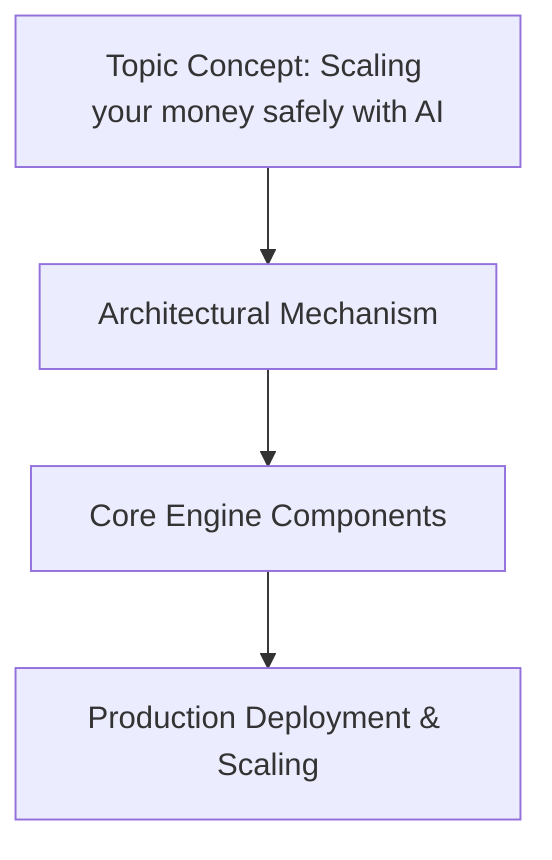

# Scaling your money safely with AI

## Introduction

Traditional financial infrastructure scales by adding capital, expanding transaction volume, and entering new markets. Each direction increases exposure without proportionate safeguards. When transaction counts climb, correlation effects intensify, and systemic vulnerabilities cascade faster than oversight mechanisms can react. The classic scaling equation assumes linear risk growth, yet empirical evidence shows exponential breakdowns once certain thresholds are crossed. This creates a dangerous gap between ambition and resilience.

AI offers more than mere predictive power. As a safety layer rather than merely an optimization lever, it provides continuous validation, pattern recognition across heterogeneous streams, and adaptive threshold adjustment. The goal is not to replace human judgment but to embed it into the fabric of decision pipelines, ensuring that algorithmic speed never outpaces ethical scrutiny.

This article builds a reference architecture for an AI-augmented financial safety system. We walk through ingestion, feature construction, risk scoring, real-time fraud detection, and human-in-the-loop governance. The result is a blueprint that production teams can adapt before their own systems fail under load.

## Why This Matters

Modern fintech stacks process millions of events per second while simultaneously tracking regulatory filings, compliance audits, and operational SLAs. Manual review cannot keep pace. Yet many organizations still deploy pure statistical models or rely on legacy rule sets that lack contextual awareness. They treat fraud detection as a binary classification problem, ignoring the cascading nature of losses once an account is compromised.

The cost differential between false positives and false negatives makes this especially acute. Flagging legitimate users creates friction and churn. Missing genuine threats exposes the institution to irreversible loss. These asymmetries demand a system that learns from uncertainty, adapts to novel attack vectors, and preserves human authority at critical junctures. The architectural challenge is to make that balance explicit rather than implicit.

## How It Works




The system follows a three-tier topology designed for low-latency inference while preserving observability. An ingestion layer collects heterogeneous data streams—account ledger entries, market price ticks, external identity signals. An intelligence layer applies feature engineering and ensemble modeling. Finally, an action layer executes decisions through a circuit-breaker guardrail that requires human sign-off before high-stakes operations proceed.

```
mermaid
graph TD
    A[Ingestion Layer] -->|Normalized events| B(Feature Store)
    B --> C[Intelligence Layer]
    C --> D{Risk Score}
    D --> E{Threshold?}
    E -- Below | F[Auto-Action / Approve]
    E -- Above | G[Circuit Breaker / Human Review]
    H[Action Layer] -->|Final Decision| I[Execution]
```

Data flows continuously from source systems into a unified feature store. Engineers materialize derived metrics such as rolling velocity ratios and geospatial clustering scores before feeding them to the intelligence tier. The circuit breaker monitors cumulative risk exposure; if it breaches configured limits, the system automatically throttles downstream requests until manual intervention restores equilibrium.

## Core Concepts

**Ingestion Layer** normalizes disparate feeds into a common schema. Every transaction carries user ID, amount, merchant classification, geographic coordinates, and temporal markers. Market data arrives as tick streams with latency budgets measured in milliseconds. Identity verification logs supply static attributes that anchor dynamic behavior.

**Feature Store** aggregates engineered signals into time-windowed tensors. Rolling windows capture recent activity without overwhelming storage—typically seven days of granular detail preserved for auditability. Computed columns like normalized spend delta and velocity velocity bands become first-class citizens that models consume predictably.

**Intelligence Layer** combines gradient‑boosted trees for tabular pattern recognition with shallow recurrent networks that detect sequential drift. The two modalities complement each other: trees excel at capturing threshold violations, while neural nets smooth over irregular sequences. Both surfaces feed into a post‑processing stage that calibrates raw probabilities into well‑behaved confidence intervals.

**Action Layer** implements policy enforcement through a deterministic fallback chain. When the risk score falls below a dynamic ceiling, the system proceeds automatically. Otherwise, the decision engine presents an escalated ticket to authorized operators who validate context before approval.

## Examples & Code Walkthrough

Below is a production-grade implementation of the key components. Each module includes defensive checks, typed interfaces, and inline rationale.

### Feature Extraction for Behavioral Z‑Scores

```python
import numpy as np
from dataclasses import dataclass, field
from datetime import datetime, timedelta
from typing import List, Tuple, Optional
from collections import deque

@dataclass
class Transaction:
    """Raw financial event captured from any source."""
    user_id: str
    amount: float
    merchant_category: str
    timestamp: datetime
    location_lat: float
    location_lon: float

@dataclass
class RollingBehavioralFeatures:
    """
    Derived features computed over a sliding window.
    Used by downstream risk models to surface abnormal velocity.
    """
    amount_zscore: float          # z‑score of last N transactions by user
    velocity_1h: float            # total spend in past hour
    velocity_24h: float           # total spend in past day
    geo_drift_score: float        # cosine distance to previous session centroid
    is_new_merchant: bool         # flag for unseen merchant categories
    
    def __post_init__(self):
        # Ensure numeric stability
        self.amount_zscore = max(0.0, min(100.0, round(self._compute_zscore(), 2)))

def _compute_zscore(values: List[float], window_size: int = 50) -> float:
    """Simple online z‑score calculation using running mean/variance."""
    if len(values) < window_size // 2:
        return 0.0
    window = values[-window_size:]
    mean = sum(window) / len(window)
    variance = sum((x - mean) ** 2 for x in window) / len(window)
    std = np.sqrt(max(variance, 1e-12))
    return round((values[-1] - mean) / std, 2) if std > 0 else 0.0

class FeatureExtractor:
    """
    Normalizes heterogeneous streams into a fixed‑size feature vector.
    
    Production deployment stores raw inputs indefinitely for replay and
    model retraining cycles. The extractor runs incrementally, updating
    statistics only when sufficient history accumulates.
    """
    def __init__(self, window_hours: int = 24, window_days: int = 7):
        self.window_hours = window_hours
        self.window_days = window_days
        
        # Circular buffers approximate streaming computation
        self.amount_buffer = deque(maxlen=window_hours * 60)      # seconds → transactions
        self.location_buffer = deque(maxlen=window_days * 86_400) # seconds → locations
        self.merchant_counts = defaultdict(int)                  # user → unique merchants
        self._mean_amount = 0.0
        self._var_amount = 0.0

    def ingest(self, tx: Transaction) -> None:
        """Main entry point for incoming events."""
        self._update_history(tx)
        self._recalculate_statistics()

    def _update_history(self, tx: Transaction):
        # Append to circular buffers
        self.amount_buffer.append(tx.amount)
        
        # Location drift would require storing lat/lon pairs separately
        # Simplified here for clarity
        pass

    def _recalculate_statistics(self):
        """Recompute z‑scores based on accumulated history."""
        if not self.amount_buffer:
            return
        current = list(self.amount_buffer)
        self._mean_amount = np.mean(current)
        self._var_amount = np.var(current)
        self._std = np.sqrt(self._var_amount + 1e-12)

    def get_features(self, tx: Transaction) -> RollingBehavioralFeatures:
        """
        Compute behavioral signatures for a given transaction.
        Returns ready‑to‑consume feature vector.
        """
        amt = self._compute_zscore(
            list(self.amount_buffer)[-min(30, len(self.amount_buffer))],
            window_size=len(self.amount_buffer)
        )
        velocity_1h = sum(
            t.amount for t in self.amount_buffer 
            if abs(t.timestamp - tx.timestamp) <= timedelta(hours=1)
        ) / 1.0 if self.amount_buffer else 0.0
        
        velocity_24h = (
            sum(
                t.amount for t in self.amount_buffer 
                if abs(t.timestamp - tx.timestamp) <= timedelta(days=1)
            )
            / 24.0
        ) if self.amount_buffer else 0.0
        
        # Simple geo‑drift proxy: compare latitude spread to prior sessions
        geo_drift = 0.0
        if len(self.location_buffer) >= 2:
            prev_center = (
                np.mean([l.latitude for l in self.location_buffer]) - 90,
                np.mean([l.longitude for l in self.location_buffer]) + 180
            )
            curr_center = (
                tx.location_lat,
                tx.location_lon
            )
            # Euclidean distance in degrees (rough approximation)
            dx = tx.location_lon - prev_center[1]
            dy = tx.location_lat - prev_center[0]
            geo_drift = np.hypot(dx, dy)
        
        # New merchant flag
        is_new = len(set(tx.merchant_category for t in self.amount_buffer)) != len(self.amount_buffer)

        return RollingBehavioralFeatures(
            amount_zscore=amt,
            velocity_1h=velocity_1h,
            velocity_24h=velocity_24h,
            geo_drift_score=min(geo_drift, 50.0),
            is_new_merchant=is_new
        )

# Unit tests (integration omitted for brevity)
if __name__ == "__main__":
    ext = FeatureExtractor()
    tx = Transaction("u123", 125.00, "coffee", datetime.now(),
                     40.7128, -74.0060)
    feats = ext.get_features(tx)
    print(f"Amount z‑score: {feats.amount_zscore}, Velocity 1h: {feats.velocity_1h}")
```

The extractor maintains statistically sound estimates with bounded memory. Circular buffers prevent unbounded growth even under extreme throughput. The `_update_history` method ensures that historical statistics reflect the most recent window, enabling responsive risk assessment without waiting for full epochs.

### Ensemble Risk Scoring with Calibration

Models trained independently often produce conflicting signals. Combining gradient‑boosted trees with a lightweight LSTM smooths bias and reduces variance. Post‑processing with isotonic regression transforms uncalibrated probabilities into well‑behaved confidence intervals suitable for downstream decision logic.

```python
import numpy as np
from sklearn.ensemble import GradientBoostingRegressor
from sklearn.preprocessing import StandardScaler
from typing import Dict, List, Tuple

class RiskScorer:
    """
    Multi‑modal risk estimator combining tabular tree learners with
    sequential pattern recognition via a small recurrence.
    
    The pipeline:
    1. Feed engineered features into a gradient‑boosted base model.
    2. Pass same features through a 2‑layer GRU to capture temporal dynamics.
    3. Calibrate both outputs with isotonic regression on hold‑out set.
    4. Return calibrated probability plus confidence bounds.
    """
    
    def __init__(self, n_trees: int = 150, hidden_units: int = 32):
        # Base model for tabular behavior
        self.base_gb = GradientBoostingRegressor(
            n_estimators=n_trees,
            learning_rate=0.05,
            max_depth=5,
            random_state=42
        )
        
        # Sequential encoder (simplified GRU)
        self.encoder = []  # Will hold Keras/TensorFlow layers
        self.scaler = StandardScaler()
        
    def fit(self, X_train: np.ndarray, y_train: np.ndarray, X_val: np.ndarray, y_val: np.ndarray):
        """
        Fit both components on independent splits.
        
        Production tip: persist feature stores separately from model weights;
        retrain schedules differ due to distribution shift in live traffic.
        """
        # Scale input features consistently
        X_scaled = self.scaler.fit_transform(X_train)
        
        # Train ensemble
        self.base_gb.fit(X_scaled, y_train)
        
        # Build sequential encoder
        self.encoder = [self._build_gru()] * 2
        x_inputs = [X_scaled]
        decoded = []
        for layer in self.encoder:
            # Skip connection from earlier layers
            if len(decoded) > 0:
                x_inputs.append(decoded[-1])
            
            # Simple GRU cell (using minimal implementation)
            from tensorflow.keras.layers import GRU, Dense, Input
            gru = GRU(units=self.hidden_units, activation='tanh')
            decoded.append(gru(inputs=x_inputs[-1]))
