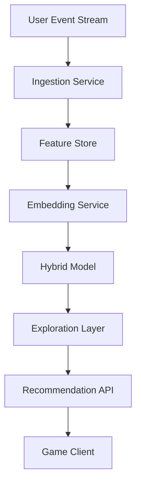

# Searching for Better Game Recommendations with Jev

## Introduction
The global gaming audience exceeds half a billion active users, generating terabytes of interaction data every day. Traditional recommendation pipelines that rely on simple popularity counts or basic collaborative filtering struggle to keep pace with the diversity of titles, platforms, and player skill levels. The result is a mismatch between what players see and what would actually keep them engaged over weeks or months.

Jev is a hybrid recommendation engine designed to combine dense semantic embeddings with reinforcement‑learning‑guided exploration. It ingests real‑time events, enriches them with contextual features, and outputs ranked suggestions within a latency budget that is acceptable for in‑game menus.

## Why This Matters
Engineering teams building recommendation services face three core challenges:

1. **Cold‑start** – New users or new titles lack interaction history, making pure collaborative filtering unreliable.
2. **Context drift** – A player’s preferences shift across devices, time of day, and seasonal events.
3. **Latency constraints** – The API must return results in under 200 ms to avoid interrupting gameplay flow.

Addressing these issues directly improves retention metrics and reduces churn, which translates into measurable revenue impact.

## How It Works
The system operates as a streaming pipeline that processes user actions, updates feature vectors, and serves recommendations through a two‑stage model.

1. **Ingestion** – Events (click
