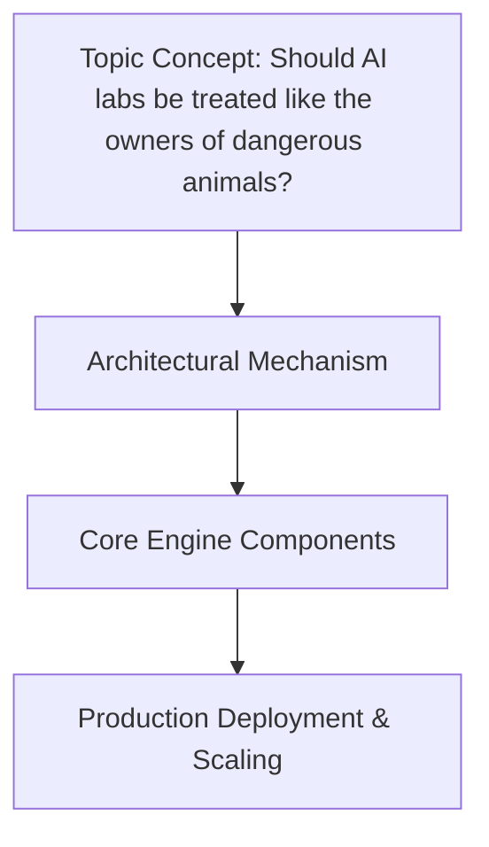

# Should AI labs be treated like the owners of dangerous animals?
## Introduction
The rapid advancement of artificial intelligence (AI) has led to its widespread integration into daily life, from virtual assistants to self-driving cars. As AI systems become increasingly sophisticated, they also pose potential risks, such as biased decision-making, privacy violations, and even physical harm. This raises an important question: should AI labs be treated like the owners of dangerous animals, with similar responsibilities and liabilities? In this article, we will explore the implications of this concept, focusing on responsibility, safety, and ethical considerations.

## The Rise of Sophisticated AI Systems
Current AI capabilities range from image recognition and natural language processing to autonomous vehicles and medical diagnosis. While these advancements have improved numerous aspects of life, they also introduce new risks. For instance, autonomous vehicles can malfunction, causing accidents, and medical diagnosis AI can misdiagnose patients, leading to inappropriate treatment. The increasing dependence on AI for critical tasks underscores the need for robust safety measures and accountability.

## Parallels with Dangerous Animals
Historically, owners of dangerous animals, such as exotic pets or guard dogs, have been held liable for any harm caused by their animals. Similarly, AI labs could be seen as responsible for the actions of their AI systems. This comparison is not merely anecdotal; it highlights the ethical and legal considerations surrounding the development and deployment of potentially hazardous technologies. Public perception and ethical considerations play a significant role in shaping the regulatory landscape for both dangerous animals and AI systems.

## Regulatory and Ethical Frameworks
Existing regulatory frameworks for AI are still in their infancy and often lack the teeth to ensure compliance. A regulatory approach that mirrors the treatment of dangerous animals could include licensing requirements, insurance mandates, and strict safety standards. Ethics in AI development and deployment is not just a moral imperative but a legal and social necessity. The role of ethics in guiding the development of AI cannot be overstated, as it ensures that AI systems are aligned with human values and do not perpetuate harm.

## Case Studies and Examples
Real-world examples of AI systems that could be considered "dangerous" include facial recognition technology, which can be used for surveillance and discrimination, and autonomous weapons, which raise significant ethical concerns. Treating AI labs like owners of dangerous animals could have prevented or mitigated issues in these cases by ensuring that developers prioritize safety, transparency, and accountability.

## Technical Considerations and Solutions
Ensuring AI safety involves technical measures such as sandboxing, explainability, and security. Sandbox environments allow for the controlled testing of AI models, reducing the risk of unintended consequences. Explainability techniques provide insights into AI decision-making processes, facilitating the identification and mitigation of biases. Security measures protect AI systems from cyber threats and data breaches.

```python
import numpy as np

class AISandbox:
    def __init__(self, model):
        self.model = model
        self.inputs = []
        self.outputs = []

    def test(self, input_data):
        # Simulate model execution in a controlled environment
        output = self.model.predict(input_data)
        self.outputs.append(output)
        return output

# Example usage
model = lambda x: x * 2  # Simple model for demonstration
sandbox = AISandbox(model)
result = sandbox.test(np.array([1, 2, 3]))
print(result)
```

Continuous monitoring and update protocols are crucial for maintaining the safety and reliability of AI systems over time. As AI systems evolve, so too must our approaches to ensuring their safe and beneficial operation.

## Conclusion
In conclusion, as AI systems become more sophisticated and potentially hazardous, it is crucial to consider the implications of treating AI labs similarly to owners of dangerous animals. This approach emphasizes responsibility, safety, and ethical considerations, which are essential for the development and deployment of AI. By adopting a regulatory and ethical framework that prioritizes these aspects, we can ensure that AI contributes positively to society while minimizing its risks. The call to action is clear: we must prioritize the safe and responsible development of AI, recognizing the parallels between AI labs and the owners of dangerous animals. Only through such a lens can we harness the full potential of AI while protecting humanity from its potential downsides.

## System Architecture


