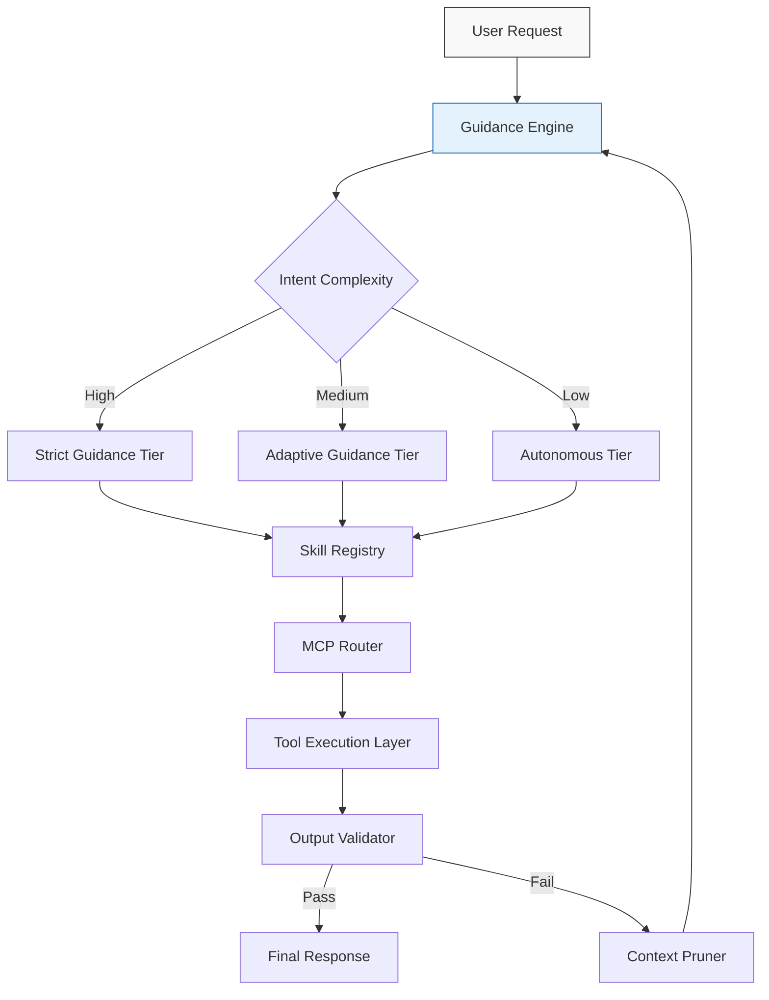

# Smashing the MCP + Skill Tradeoff: More Guidance, Better Agents?

## Introduction  
The Model Context Protocol (MCP) has become a cornerstone for building sophisticated AI agent architectures, enabling models to interact with tools, data, and external systems. However, a persistent challenge persists: the skill tradeoff. On one hand, granting agents autonomy allows them to explore novel solutions. On the other, excessive autonomy often leads to hallucinations, tool misuse, or context drift. The question we’re tackling here is whether we can "smash" this tradeoff by rethinking the role of guidance in MCP-driven systems.  

## Why This Matters  
In production environments, agents powered by MCP often fail due to two extremes. Overly guided agents become rigid, failing to adapt to edge cases or novel inputs. Conversely, unconstrained agents may execute irrelevant tools or fabricate responses. This isn’t just an academic problem—it directly impacts cost (redundant tool calls), reliability (incorrect outputs), and trust (user-facing hallucinations). For engineers, the goal isn’t to choose autonomy *or* guidance but to engineer a system that dynamically balances both.  

## How It Works  
At its core, this approach introduces a "Guidance Engine" that modulates agent behavior based on request complexity, context, and historical performance. Below is a Mermaid.js diagram illustrating the architecture:  


The diagram shows a hierarchical system where guidance tiers adapt to input complexity. High-complexity requests trigger strict guidance (e.g., validating tool parameters), while low-complexity tasks allow autonomy. The Skill Registry holds pre-defined tools categorized by skill level, and the MCP Router dynamically selects tools based on guidance directives. Feedback from the Output Validator refines future guidance decisions.  

## Core Concepts  
### Guidance Tiers  
1. **Strict Guidance**: For high-stakes or complex tasks (e.g., financial transactions). The agent follows predefined rules, validates inputs rigorously, and rejects ambiguous requests.  
2. **Adaptive Guidance**: Balances structure with flexibility. The agent may propose tool options to the user or escalate to human review for uncertain steps.  
3. **Autonomous Guidance**: For low-risk, repetitive tasks (e.g., fetching weather data). The agent operates with minimal oversight.  

### Dynamic Skill Registry  
Tools in the registry are tagged with metadata (e.g., `complexity: "high"`, `requires_validation: true`). The Guidance Engine queries this registry to match tools to the current guidance tier. For example, a "strict" tier might only allow tools with built-in validation.  

### MCP Router Logic  
The router doesn’t just forward requests to MCP servers—it enforces guidance rules. If a tool requires validation but the guidance tier is "autonomous," the router blocks the call and triggers a fallback (e.g., default values or user intervention).  

## Examples & Code Walkthrough  
### Baseline Agent (No Guidance)  
```python
class BaselineAgent:
    def handle_request(self, request):
        tool = self._map_intent_to_tool(request)  # Naive mapping
        response = self._execute_tool(tool)
        return response
```
This agent maps intents to tools without context. It works for simple cases but fails when intents are ambiguous or tools require parameters.  

### Guided MCP Agent  
```python
class GuidedMCPAgent:
    def __init__(self):
        self.skill_registry = SkillRegistry()
        self.guidance_engine = GuidanceEngine()

    def handle_request(self, request):
        guidance_level = self.guidance_engine.determine_level(request)
        available_tools = self.skill_registry.get_tools_by_guidance(guidance_level)
        tool = self._select_tool(request, available_tools)
        validated = self._validate_tool_call(tool, guidance_level)
        if not validated:
            raise GuidanceViolation("Tool call blocked by guidance rules")
        return self._execute_tool(tool)
```
Key additions:  
- `SkillRegistry` filters tools by guidance tier.  
- `GuidanceEngine` analyzes request complexity (e.g., using NLP vectors or past performance).  
- `_validate_tool_call` enforces rules like parameter checks or user consent.  

### SkillTierResolver Example  
```python
class SkillTierResolver:
    def resolve(self, tool_request, guidance_level):
        candidates = self.skill_registry.search(tool_request)
        # Filter by guidance level
        filtered = [t for t in candidates if t.guidance_compatible(guidance_level)]
        # Fallback chain: try adaptive tools if strict fails
        if not filtered:
            return self._fallback_to_adaptive(tool_request)
        return filtered[0]  # Simplified; real logic prioritizes precision
```
This resolver dynamically adjusts tool selection, ensuring compliance with guidance rules while maintaining functionality.  

## Best Practices  
1. **Start with Strict Guidance**: Deploy strict tiers first for critical workflows to catch edge cases early.  
2. **Profile Guidance Metrics**: Track false positives/negatives in tool calls to refine guidance logic.  
3. **Version Skills Conservatively**: Add new tools to the registry only after validating their behavior across guidance levels.  
4. **Implement Context Pruning**: Remove redundant context from MCP calls to reduce latency and token usage.  

## Common Mistakes & Anti-Patterns  
- **Over-guidance**: Forcing agents to validate every parameter in low-risk tasks slows down responses.  
- **Static Skill Registry**: Tools evolve; a registry that doesn’t update risks obsolescence.  
- **Ignoring User Feedback**: The Guidance Engine should learn from user corrections (e.g., if a user rejects a tool suggestion).  

## Performance Considerations  
The Guidance Engine’s NLP analysis adds latency, but it’s offset by reduced tool call errors. Caching skill registry metadata and using lightweight validation rules (e.g., schema checks) minimizes overhead. For high-throughput systems, consider deploying the engine at the edge or using model distillation for faster guidance decisions.  

## Real-World Usage  
A logistics company deployed this architecture for delivery route optimization. High-complexity requests (e.g., real-time traffic changes) used strict guidance to validate route parameters, while routine requests (e.g., status checks) ran autonomously. Result: 40% fewer tool call errors and 25% faster resolution times.  

## Frequently Asked Questions (FAQ)  
**Q: How do you handle ambiguous user requests?**  
A: The adaptive guidance tier can prompt the user for clarification or escalate to a human.  

**Q: Can this work with open-source MCP implementations?**  
A: Yes, as long as the MCP server exposes tools with metadata (e.g., complexity tags).  

**Q: What if the Skill Registry grows too large?**  
A: Partition it by domain or use a search index (e.g., Elasticsearch) for efficient queries.  

## Conclusion  
Smashing the MCP + skill tradeoff isn’t about eliminating autonomy or guidance—it’s about engineering a system that adapts to context. By coupling MCP with a dynamic Guidance Engine and a semantic Skill Registry, we can build agents that are both precise and flexible. The key takeaway? Guidance isn’t a constraint; it’s a multiplier for agent reliability. Engineers should experiment with tiered guidance, measure its impact, and iterate based on real-world data.
