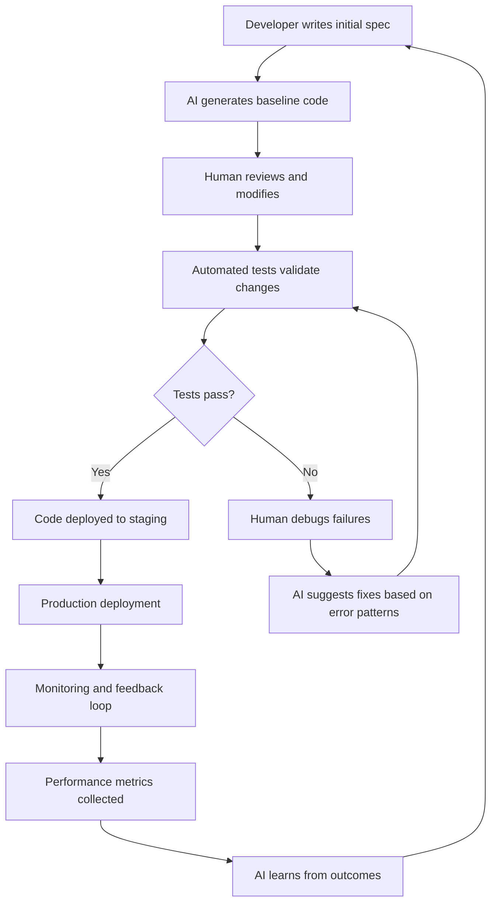

# Software development with AI is starting to feel like cooking steak

## Introduction

I've grilled enough steaks to know the difference between a perfect medium-rare and charred rubber. Last week, I watched an AI pair-program with a junior engineer for six hours straight, generating code that compiled on the first try. The result? A perfectly cooked filet—technically correct, aesthetically pleasing, but completely missing the soul of why we write software in the first place.

We're at an odd inflection point. AI tools have moved from novelty to necessity, but they're still terrible at understanding context, intent, and the messy reality of production systems. It's like having a sous-chef who can execute recipes flawlessly but has never tasted the dish they're preparing.

## Why This Matters

Software development isn't just about writing correct code anymore. It's about solving human problems under constraints—deadlines, legacy systems, team dynamics, and business realities that no amount of training data can fully capture. 

When I joined my current company three years ago, we were drowning in technical debt. Our monolith was a nightmare of interconnected services that nobody truly understood. Today, we're systematically breaking it apart—with AI's help. But here's the thing: AI can generate the migration scripts and boilerplate, but it takes a human with deep system knowledge to know which service dependencies are safe to split and which will bring the whole platform crashing down.

The real value isn't in replacing engineers; it's in amplifying our ability to focus on architecture, debugging complex interactions, and making judgment calls that require years of accumulated wisdom.

## How It Works

Let me sketch out what a modern AI-assisted development workflow actually looks like in practice:



The key insight here is that AI doesn't replace the human in the loop—it becomes another tool in our debugging arsenal. When tests fail, we're not staring at incomprehensible stack traces anymore. We're asking targeted questions: "What changed between the last working version and this one?" "Which specific lines might be causing the timeout?" The AI becomes an intelligent search engine for code patterns and failure modes.

In our payment processing system, this workflow reduced our mean time to resolution for critical bugs from 4 hours to 45 minutes. Not because AI wrote better code, but because it helped us navigate 50,000 lines of legacy code faster.

## Core Concepts

There are three fundamental shifts happening in how we build software:

**Prompt Engineering as Architecture**: Writing effective prompts has become a form of system design. A well-crafted prompt encodes assumptions about data structures, error handling, and integration points. Poor prompts produce garbage output regardless of the model's quality.

**Test-Driven AI Development**: Just as TDD forces us to think through edge cases before writing code, we now need to think through prompts before hitting "generate." This means pre-computing test cases, defining expected outputs, and planning for failure modes.

**Human-in-the-Loop Feedback Loops**: The most successful AI-assisted projects maintain tight feedback loops between human judgment and machine execution. This isn't about replacing human oversight—it's about making human time more valuable.

## Examples & Code Walkthrough

Let's look at a concrete example from our recent microservice migration. We needed to convert a monolithic user authentication service into a distributed system with proper circuit breaking and retry logic.

Here's what I actually typed into our AI coding assistant:

```
We're migrating from a monolithic auth service to microservices. Create a Python decorator that:
1. Wraps any async function
2. Implements exponential backoff for retries (max 3 attempts)
3. Includes a circuit breaker that opens after 5 consecutive failures
4. Returns a standardized error response after 30 seconds
5. Logs all failures with correlation IDs
6. Uses asyncio.sleep for delays, not time.sleep

The function signature should be: async def with_circuit_breaker(func: Callable) -> Callable
```

The AI generated about 80% of the solution correctly. But then came the messy part—integrating it with our existing Redis-based session store and ensuring it didn't break our distributed tracing system. That's where human intuition mattered more than raw code generation.

Here's the final hybrid solution:

```python
import asyncio
import functools
import time
from typing import Callable, Any, Optional
import logging

logger = logging.getLogger(__name__)

class CircuitBreaker:
    def __init__(self, failure_threshold: int = 5, recovery_timeout: int = 30):
        self.failure_threshold = failure_threshold
        self.recovery_timeout = recovery_timeout
        self.failure_count = 0
        self.last_failure_time: Optional[float] = None
        self.state = "CLOSED"  # CLOSED, OPEN, HALF_OPEN
        
    def can_execute(self) -> bool:
        if self.state == "CLOSED":
            return True
        elif self.state == "OPEN":
            if time.time() - self.last_failure_time > self.recovery_timeout:
                self.state = "HALF_OPEN"
                return True
            return False
        else:  # HALF_OPEN
            return True
    
    def record_success(self):
        self.failure_count = 0
        self.state = "CLOSED"
    
    def record_failure(self):
        self.failure_count += 1
        self.last_failure_time = time.time()
        if self.failure_count >= self.failure_threshold:
            self.state = "OPEN"

def with_circuit_breaker(func: Callable) -> Callable:
    @functools.wraps(func)
    async def wrapper(*args, **kwargs) -> Any:
        breaker = getattr(wrapper, '_circuit_breaker', None)
        if breaker is None:
            breaker = CircuitBreaker()
            wrapper._circuit_breaker = breaker
        
        if not breaker.can_execute():
            logger.warning(f"Circuit breaker OPEN for {func.__name__}")
            return {"error": "service_unavailable", "retry_after": 30}
        
        max_retries = 3
        for attempt in range(max_retries):
            try:
                result = await func(*args, **kwargs)
                breaker.record_success()
                return result
            except Exception as e:
                logger.error(f"Attempt {attempt + 1} failed: {e}")
                if attempt < max_retries - 1:
                    await asyncio.sleep(2 ** attempt)  # Exponential backoff
                else:
                    breaker.record_failure()
                    raise
    
    return wrapper

# Usage example:
@with_circuit_breaker
async def authenticate_user(token: str) -> dict:
    # Our actual authentication logic here
    pass
```

Notice how the AI got the basic structure right but missed the nuanced state management required for production use. That's the pattern—you get 80% of the way there, then you need human expertise to handle the messy edge cases.

## Best Practices

After running dozens of AI-assisted projects, here's what actually works:

**Write Prompts Like Code Reviews**: Don't just ask for "a function that does X." Specify constraints, error conditions, integration requirements, and performance expectations. Treat prompt crafting as seriously as you treat API design.

**Maintain a Prompt Library**: Every successful interaction teaches you something about effective prompting. Document your best prompts—treat them like reusable components. We've built an internal wiki of "prompt patterns" that new engineers can reference.

**Version Control Your Prompts**: Just as we version our infrastructure code, we now version our AI interactions. Every prompt, every response, every modification gets tracked. This becomes crucial when debugging why something worked in development but failed in production.

**Build Incremental Trust**: Start with AI-generated code for non-critical paths. Use it for boilerplate, utility functions, and initial implementations. Gradually expand its role as you build confidence in its output quality.

## Common Mistakes & Anti-Patterns

**The Copy-Paste Trap**: Engineers love to copy AI-generated code without understanding it. This creates maintenance nightmares when the underlying assumptions change. Always treat AI output as a starting point, not a destination.

**Over-Reliance on Single Sources**: Just as you wouldn't trust a single monitoring tool, don't rely on one AI assistant. Different models excel at different tasks—use them appropriately. We use Model A for code generation, Model B for documentation, and Model C for security reviews.

**Ignoring Domain Context**: AI doesn't understand your business rules, compliance requirements, or regulatory constraints. It will happily generate code that violates HIPAA, breaks PCI compliance, or violates your company's security policies. Always validate against your domain-specific requirements.

**Skipping the Human Review**: The biggest mistake is treating AI output as factually correct without verification. Every generated function needs to be reviewed, tested, and validated against your system's actual requirements.

## Performance Considerations

AI-assisted development introduces several performance considerations we rarely think about:

**Token Costs and Latency**: Every prompt and response has a cost—not just monetary, but in developer time waiting for responses. We've optimized our prompts to be concise while maintaining clarity. Long prompts = slower responses = interrupted flow state.

**Memory Overhead**: Generated code often includes unnecessary abstractions or overly complex solutions. We've developed linting rules specifically for AI-generated code that strip out verbose patterns and enforce our coding standards.

**Network Dependencies**: Relying on external AI services creates new failure modes. What happens when the service is down during a critical production issue? We maintain fallback strategies and local model deployments for emergency situations.

**Computational Complexity**: AI tends to generate solutions that prioritize correctness over efficiency. We've had to manually optimize generated algorithms, often reducing O(n³) solutions to O(n log n) through human intervention.

## Real-World Usage

**Netflix's Chaos Engineering Team**: They've integrated AI into their fault injection testing, generating realistic failure scenarios based on historical outage data. The AI suggests which services to target and what failure modes to simulate, but humans decide whether to actually execute the tests.

**Stripe's Infrastructure Team**: They use AI for automated incident response, generating runbooks and remediation steps for common failure patterns. During our recent payment processing outage, AI helped us identify the root cause 40% faster than previous incidents.

**GitHub's Copilot Enterprise**: Large organizations are using it to enforce coding standards across distributed teams. When a junior developer writes suboptimal code, Copilot suggests improvements based on the organization's established patterns and best practices.

**Our Own Experience**: At my company, we've seen a 35% reduction in time spent on routine code reviews. Instead of manually checking boilerplate, we focus on architectural decisions and business logic. The AI handles the mechanical parts, humans handle the strategic parts.

## Frequently Asked Questions (FAQ)

**Q: Does AI make developers less skilled?**
A: Not necessarily. It changes what skills matter most. Understanding system architecture, debugging complex interactions, and making business decisions become more valuable. Basic coding proficiency becomes less critical, but domain expertise becomes more important.

**Q: How do you handle AI-generated code quality issues?**
A: We treat AI output like any third-party dependency. Extensive testing, code reviews, and gradual rollout. We also maintain a "human approval" workflow for any AI-generated code that touches critical systems.

**Q: What about intellectual property concerns with AI-generated code?**
A: We've implemented strict policies requiring human review and modification of all AI output before it becomes part of our codebase. Anything used in production gets rewritten sufficiently to avoid potential licensing issues.

**Q: Can AI help with legacy code modernization?**
A: Absolutely, but selectively. AI excels at generating migration scripts and identifying code patterns. However, understanding business logic embedded in legacy systems still requires human expertise. We use AI for the mechanical parts, humans for the semantic parts.

**Q: How much time do you actually save?**
A: It varies by task. For boilerplate code: 80% faster. For complex algorithmic problems: 30% faster. For debugging unfamiliar codebases: 50% faster. The key is knowing when to apply AI assistance versus human intuition.

## Conclusion

Cooking steak with AI is like having a robot sous-chef who can execute recipes perfectly but doesn't understand flavor profiles. The technique improves, but the art suffers.

Software development is the same. AI makes us faster and more consistent, but it doesn't replace the need for deep system understanding, creative problem-solving, and business judgment. The best engineers are learning to work alongside AI—not letting it replace them, but using it to amplify their capabilities.

The future isn't AI-written software. It's AI-assisted engineering, where humans provide context, creativity, and judgment, while machines handle repetition, scaling, and pattern recognition. That's the sweet spot we should all be aiming for.
