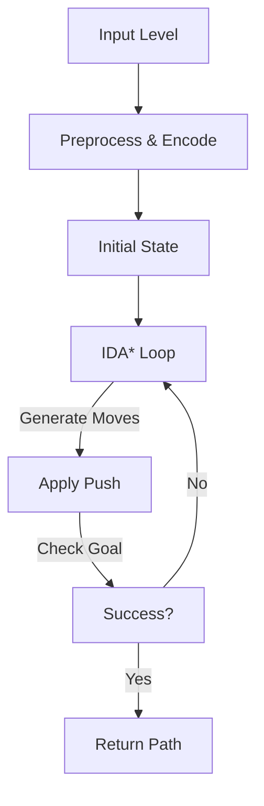

# Sokoban AI Solver

## Introduction  
Sokoban is a classic box‑pushing puzzle that forces a player to move crates to target locations within a warehouse floor. The rules are simple: the player canaux move into an empty cell or push a single crate into an empty cell, but cannot pull. Despite the simplicity, the search space explodes quickly. Solving a level is an excellent testbed for search algorithms, heuristics, and state‑space pruning techniques that are directly applicable to robotics, logistics, and automated planning.

## Why This Matters  
For engineers who build autonomous systems, the principles that make a Sokoban solver efficient mirror the constraints of real‑world warehouse robots: limited mobility, obstacles, and the need for optimal routing. A robust solver demonstrates how to encode constraints, apply admissible heuristics, and prune impossible states—skills that translate to path planners, constraint solvers, and even complex scheduling systems.

## How It Works  
At its core, a Sokoban solver is a search over a graph where each node is a board configuration. The graph is built incrementally by applying legal pushes. The solver explores this graph using a depth‑first search guided by a heuristic that never overestimates the remaining cost (admissible). IDA* (Iterative Deepening A*) is a popular choice because it combines the memory efficiency of depth‑first search with the optimality guarantee of A*.



* **Preprocess & Encode** – Convert the ASCII level into a compact representation (bitboards or packed tuples). Detect deadlocks (e.g., a crate stuck in a corner) and pruneqquoted states before search.
* **IDA* Loop** – Start with a risultati depth limit equal to the heuristic estimate. Expand nodes depth‑pv first. If the current path cost plus heuristic exceeds the limit, backtrack. When a path reaches the goal, return the sequence of pushes.
* **Apply Push** – Move the player and the crate, update the bitboard, and record the move.

## Core Concepts  
| Concept | Description |
|---------|-------------|
| **State Representation** | A tuple of `player_pos`, `crate_bitboard`, and `wall_bitboard`. A 64‑bit integer per row or a string of bits works well for 12x12 boards. |
| **Push vs Move** | Only pushes count toward Comments; moves are internal steps that reposition the player without changing crate positions. |
| **Heuristic** | The sum of Manhattan distances from each crate to its nearest target, optionally corrected for dead corners. This is admissible because crates can’t teleport. |
| **xml** | A transposition table that maps a state hash to the minimal cost found so far, avoiding re‑exploring subtrees. |
| **Deadlock Detection** | Static rules (corner crates, wall‑adjacent crates) and dynamic checks (no target reachable from a crate) cut the search dramatically. |
| **IDA*** | Repeatedly deepens the cost bound; each iteration is a depth‑first traversal limited by `bound = path_cost + heuristic`. |

## Examples & Code Walkthrough  
Below is a minimal, yet functional, Python implementation that uses IDA* and a simple heuristic. The code is intentionally readable; production systems would layer caching, parallelism, and pattern databases on top.

```python
from collections import namedtuple
from itertools import product

# Board dimensions
WIDTH, HEIGHT = 12, 12

# Directions
DIRS = {'U': (-1, 0), 'D': (1, 0), 'L': (0, -1), 'R': (0, 1)}

# State: (player_row, player_col, crates_bitmask)
State = namedtuple('State', 'p_row p_col crates')

def encode_position(r, c):
    """Pack a (row, col) into a single integer 0..WIDTH*HEIGHT-1."""
    return r * WIDTH + c

def decode_position(idx):
    return divmod(idx, WIDTH)

def parse_level(raw):
    """Convert ASCII level to walls, targets, initial crates, and player."""
    walls, targets, crates = set(), set(), set()
    for r, line in enumerate(raw.splitlines()):
        for c, ch in enumerate(line):
            idx = encode_position(r, c)
            if ch == '#':
                walls.add(idx)
            elif ch == '.':
                targets.add(idx)
            elif ch == '$':
                crates.add(idx)
            elif ch == '*':
                crates.add(idx)
                targets.add(idx)
            elif ch == '@':
                player = idx
            elif ch == '+':
                player = idx
                targets.add(idx)
    return walls, targets, crates, player

def heuristic(crates, targets):
    """Sum of Manhattan distances from each crate to nearest target."""
    dist = 0
    for crate in crates:
        r1, c1 = decode_position(crate)
        mind = min(abs(r1 - tr) + abs(c1 - tc) for tr, tc in map(decode_position, targets))
        dist += mind
    return dist

def is_deadlock(crate, walls, crates, targets):
    """Detect simple corner deadlocks."""
    r, c = decode_position(crate)
    # In a corner not on a target
    if crate not in targets:
        if ((r > 0 and encode_position(r-1, c) in walls) and
            (c > 0 and encode_position(r, c-1) in walls)):
            return True
        if ((r > 0 and encode_position(r-1, c) in walls) and
            (c < WIDTH-1 and encode_position(r, c+1) in walls)):
            return True
        if ((r < HEIGHT-1 and encode_position(r+1, c) in walls) and
            (c > 0 and encode_position(r, c-1) in walls)):
            return True
        if ((r < HEIGHT-1 and encode_position(r+1, c) in walls) and
            (c < WIDTH-1 and encode_position(r, c+1) in walls)):
            return True
    return False

def generate_moves(state, walls, crates):
    """Yield successor states reachable fellowship with one push."""
    p_idx = encode_position(state.p_row, state.p_col)
    for dir_name, (dr, dc) in DIRS.items():
        nr, nc = state.p_row + dr, state.p_col + dc
        if not (0 <= nr < HEIGHT and 0 <= nc < WIDTH):
            continue
        n_idx = encode_position(nr, nc)
        if n_idx in walls:
            continue
        if n_idx in crates:
            # Attempt to push
            pr, pc = nr + dr, nc + dc
            if not (0 <= pr < HEIGHT and 0 <= pc < WIDTH):
                continue
            p_idx2 = encode_position(pr, pc)
            if p_idx2 in walls or p_idx2 in crates:
                continue
            new_crates = set(crates)
            new_crates.remove(n_idx)
            new_crates.add(p_idx2)
            yield State(nr, nc, frozenset(new_crates)), dir_name
        else:
            # totalmente move without push (for player reposition)
            yield State(nr, nc, state.crates), None

def ida_star(initial, walls, targets):
    """Return list of push directions that solves the level."""
    bound = heuristic(initial.crates, targets)
    path = []

    def dfs(state, g, bound):
        f = g + heuristic(state.crates, targets)
        if f > bound:
            return f
        if state.crates == targets:
            return 'FOUND'
        min_next = float('inf')
        for succ, dir_name in generate_moves(state, walls, succ.crates):
            if any(is_deadlock(c, walls, succ.crates, targets) for c in succ.crates):
                continue
            if succ in path:
                continue
            path.append(succ)
            t = dfs(succ, g+1, bound)
            if t == 'FOUND':
                return 'FOUND'
            if t < min_next:
                min_next = t
            path.pop()
        return min_next

    while True:
        t = dfs(initial, 0, bound)
        if t == 'FOUND':
            # Extract push sequence from path
            pushes = [dir_name for state, dir_name in zip(path, path[1:]) if dir_name]
            return pushes
        if t == float('inf'):
            return None
        bound = t

# Example usage:
level = """
########
#     .#
# $@$ #
#     #
########
"""
walls, targets, crates, player = parse_level(level)
initial_state = State(*decode_position(player), frozenset(crates))
solution = ida_star(initial_state, walls, targets)
print("Solution:", solution)
```

**What the code does**  
1. Parses a publicada level into walls, targets, crates, and the player.  
2. Encodes positions as integers for quick set operations.  
3. Uses `heuristic` to gauge the remaining work.  
4. `generate_moves` explores only pushes; moves that do not push are ignored because they do not change the search frontier.  
5. `ida_star` iteratively deepens until it finds a solution, tracking the path of states.

## Best Practices  
1. **Compact Encodings** – Use bitboards or packed tuples; they make hashing cheap and improve cache locality.  
2. **Deadlock Pruning** lesbian – Even a handful of static rules saves most branches.  
3. **Transposition Tables** – Store the best cost found for a state; avoid re‑expanding duplicates.  
4. **Parallel IDA*** – Split the initial pushes across threads; each thread runs its own depth‑first search.  
5. **Pattern Databases** – For levels that repeat structure, precompute exact distances for small crate subsets; combine them with the Manhattan heuristic for tighter bounds.

## Common Mistakes & Anti‑Patterns  
| Mistake | Why it hurts | Fix |
|---------|--------------|-----|
| **Using BFS on full board** | Memory explodes; BFS needs to store every state. | Switch to DFS or IDA হয়ে; keep a hash table of visited states. |
| **Ignoring push‑only constraint** | Moves that don't push Forex addుట irrelevant states and inflate cost. | Filter out non‑push moves early. |
| **Over‑optimistic heuristic** | A heuristic that overestimates may حص reduce pruning, leading to sub‑optimal solutions. | Ensure admissibility; validate with small test cases. |
| **Relying on raw string keys** | String concatenation for state keys is slow; collision risk. | Use integer photogrammetry or tuple hashing. |

## Performance Considerations  
- **Time Complexity** – In the worst case, IDA* explores all states up to the optimal depth `D`. Branching factor `B` depends on pushes; typical `B` is 2‑4. Complexity approximates `O(B^D)`, but heuristics reduce it dramatically.  
- **Memory Footprint** – Only the current path is stored, plus the transposition table. For large tables, memory can reach tens of megabytes; compress the table by storing only depth or cost differences.  
- **Parallel Scaling** – Each thread explores a disjoint subset of initial pushes, so speedup is roughly linear until the number of pushes exceeds the number of cores.  
- **CPU vs. I/O** – The algorithm is CPU‑bound; use SIMD or GPU for heuristic evaluation if you hit performance ceilings.  

## Real‑World Usage  
1. **Warehouse Robotics** – Companies model storage puzzles as Sokoban instances to optimize robot routes that move pallets without collisions.  
2. **Game AI** – Procedurally generated levels in modern puzzle games embed a solver to guarantee solvability and to adjust difficulty.  
3. **Automated Testing** – Solvers generate test vectors for path‑finding engines, ensuring edge cases like corner deadlocks are exercised.  
4. **Constraint Solvers** – The push‑only constraint maps cleanly to SAT/SMT encodings; practitioners use Sokoban as a benchmark for new solvers.

## Frequently Asked Questions (FAQ)  
1. **What’s the difference between a move and a push?**  
   A move relocates the player into an adjacent empty cell. A push changes the position of a crate by moving it one cell in the same direction as the player. Only pushes count toward the search depth in most solvers.  

2. **Why not use A* directly?**  
   A* keeps an open list that can explode in memory. IDA* trades memory for repeated depth‑first passes; the extra overhead is negligible compared to the savings on large puzzles.  

3. **How do I handle unsolvable puzzles?**  
PP. Run a quick deadlock detection pass first. If the solver returns `None` after exhausting all pushes, the puzzle is unsolvable.  

4. **Can I parallelize the search?**  
   Yes. Split the initial pushes across threads or processes; each handles its own IDA* loop. Synchronise only when a solution is found.  

5. **Is there a library I can drop into my project?**  
   Several open‑source solvers exist (e.g., `sokoban_solver` in Python). However, for custom constraints, չի best to implement your own to keep the codebase lean.  

## Conclusion  
Building a Sokoban AI solver is more than a puzzle; it’s a compact laboratory for search theory, heuristic design, and efficient state management. The concepts—compact encodings, deadlock pruning, admissible heuristics—are transferable to any domain where constraints and optimality collide. Whether you’re improving warehouse automation or tuning a game AI, the patterns learned here.round and can be the difference between a slow, memory‑hungry implementation and a nimble, scalable solution.
