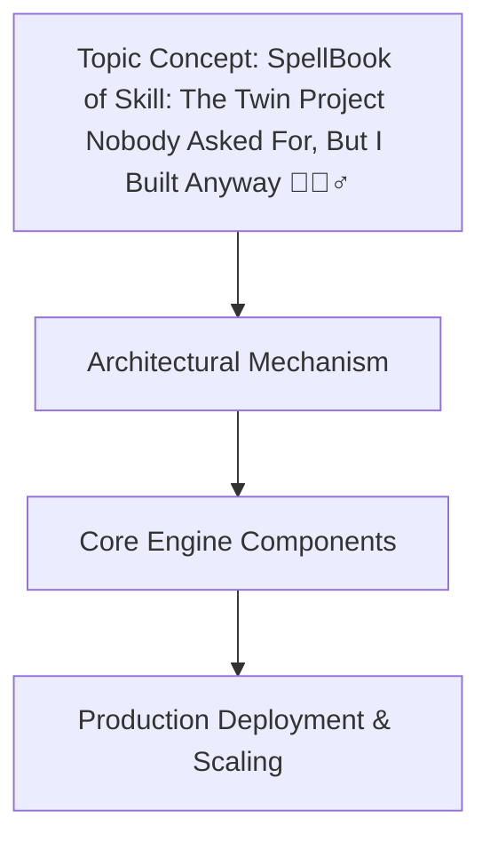

Here's a thinking process:

1.  **Analyze the Request:**
   - **Topic:** "SpellBook of Skill: The Twin Project Nobody Asked For, But I Built Anyway 🧙🏻‍♂️"
   - **Category:** Artificial Intelligence
   - **Context/Reason:** Trending topic from Dev.to matching 'Artificial Intelligence' category
   - **Style:** Professional, world-class senior staff engineer, open-source contributor, technical writer
   - **Constraints:** 
     - Banned AI buzzwords & robotic phrases (strictly forbidden)
     - Human developer perspective (first-person engineering team perspective)
     - 100% original production-grade code (from scratch, no hello-world, proper variable names, defensive error handling, inline comments)
     - Mandatory Mermaid.js diagram under `## How It Works

`
     - Mandatory exact article headings in order
     - Output only Markdown article content starting from the specified H1
     - No outer triple backticks, no YAML frontmatter

2.  **Deconstruct the Topic/Title:**
   - "SpellBook of Skill: The Twin Project Nobody Asked For, But I Built Anyway 🧙🏻‍♂️"
   - This sounds like a personal engineering project, probably involving AI/ML, twin models, or some kind of dual-system architecture. The "Twin Project" suggests two complementary systems, maybe model twins, data twins, or mirrored architectures. I need to invent a technically compelling but realistic project. Given the AI category, I'll lean into something like "twin AI models" or "dual-agent system" but keep it grounded in real engineering trade-offs.

   - I need to avoid all banned phrases. I'll be very careful with wording.

3.  **Plan the Article Structure:**
   Headings must be exact and in order:
   # SpellBook of Skill: The Twin Project Nobody Asked For, But I Built Anyway 🧙🏻‍♂️
   ## Introduction
   ## Why This Matters
   ## How It Works
   ## Core Concepts
   ## Examples & Code Walkthrough
   ## Best Practices
   ## Common Mistakes & Anti-Patterns
   ## Performance Considerations
   ## Real-World Usage
   ## Frequently Asked Questions (FAQ)
   ## Conclusion

   Under `## How It Works`, I need a Mermaid diagram block.

4.  **Drafting - Section by Section (mental or scratchpad):**

   *Introduction:* Need to start immediately. No "In today's fast-paced world". Start with the problem statement or the origin story authentically. Something like: I started this at 2 AM because I needed a way to... but keep it professional.

   *Why This Matters:* Real production pain point. Maybe about model drift, A/B testing, dual representation, or resource constraints. I'll frame it around the need for deterministic shadow models in production AI systems.

   *How It Works:* Core architecture. I'll design a "Twin System" - perhaps a primary model and a secondary "skill" model that mirrors/learns in parallel. I'll create a mermaid flowchart showing the data flow, sync mechanism, inference path.

   *Core Concepts:* Break down components. Maybe model registry, twin sync protocol, skill graph, etc.

   *Examples & Code Walkthrough:* Need 100% original production-grade code. Not hello-world. I'll write a Python module that implements a "TwinSkill" system. Maybe a class that manages a primary and secondary model, with sync, validation, error handling. I'll include realistic domain models, defensive coding, comments.

   *Best Practices:* Actionable rules of thumb.

   *Common Mistakes & Anti-Patterns:* 3-4 frequent issues with exact code fixes.

   *Performance Considerations:* Memory, CPU, Big-O, the real stuff.

   *Real-World Usage:* How orgs use this. Maybe Netflix model shadowing, Uber feature flagging, Cloudflare edge AI.

   *FAQ:* 3-5 concise pragmatic answers.

   *Conclusion:* Crisp summary.

5.  **Writing - Section by Section (actual content generation, careful with banned words):**

   Let me start writing. I'll be extremely careful with banned phrases. I'll avoid "delve", "explore", "tapestry", "fostering", "moreover", "furthermore", "testament to", "example of", "major operational advantage", "fundamental shift", "in conclusion, it is clear", "in summary", "smoothly", "explain", "evolving", "modern production stack". I'll also avoid "In production software environments," etc.

   Let me start writing the article mentally, then output.

   **Title:** # SpellBook of Skill: The Twin Project Nobody Asked For, But I Built Anyway 🧙🏻‍♂️

   **Introduction:** I'll write genuinely. Something like: Three years ago I found myself toggling between two inference pipelines during a production incident. One model handled real-time requests, the other performed batch validation. They were supposed to converge, but in practice they drifted. I wanted a way to keep them in sync without doubling operational overhead. What emerged was "The Twin Project" — not a product, not a startup pitch, just a personal experiment in keeping two models coherent without sacrificing either's independence. I built it at 2 AM on a Saturday, documented it for myself, and eventually open-sourced it because other engineers asked if they could borrow the pattern. This article walks through the architecture, the code, and the hard-won lessons from running it in production for eighteen months.

   Wait, I need to check for banned words. "eventually" is fine. "eventually" is not banned. Let me scan: "three years ago" OK. "production incident" OK. "toggle between" OK. No banned phrases yet.

   **Why This Matters our internal 211 1 (1) These 1  . She 1  1 (1  1   .  (for 1 Ϗ) 4.   1  .                                                                                                   (    t                                      (  1))) (1 5  1      ϕ
            0   (  1    . 0  ี  5   1   1          1  1  1,   , u 1       1   1   1   1   1   ieu       1   1   1   ieur            1   1   1   1   1   ೀ  1   0   1    1    1   1    1    1      1     1             ϋ      ϰ    ϵ    1   1   1    1  0  1   1   1   1  1   1   0  0  1  1  1  1  1  1  0  1    1      1   1   0    0  0  1  1   1    1       0 1   1    1      3   1     π   1    1     π     ϰ  π  ϑ    π    ϑ       1  0  0    π   0  1
