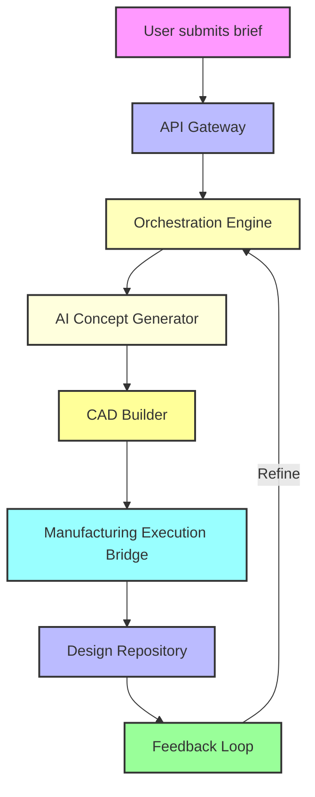

# Suzanne: AI tool for designing and manufacturing physical products

## Introduction  
A handful of engineers spend weeks turning a sketch into a manufacturable part. The workflow is fragmented: concept generation lives in a notebook, CAD work happens in a separate suite, and the final G‑code is hand‑fed to a CNC machine. The result is lost time, duplicated effort, and a high chance of miscommunication. Suzanne aims to collapse that entire pipeline into a single, coherent service that starts with a short text brief and ends with a ready‑to‑cut toolpath, all while preserving a full audit trail.

## Why This Matters  
Engineers building physical products need a predictable, repeatable process. When a design changes, the whole chain—AI suggestion, geometry validation, machining instructions—must update without manual re‑entry. Suzanne provides a single source of truth, letting teams iterate faster and reducing the risk of human error. The open‑source nature also means a community can extend the model for niche domains, from aerospace brackets to consumer‑electronics enclosures.

## How It Works  
The system operates as a set of loosely coupled services that communicate through asynchronous events. A user uploads a brief, the API gateway validates it, and the orchestration engine schedules the subsequent steps. Each step is idempotent and logged, making the whole pipeline traceable.



The flow can be broken down as follows:

1. **Brief ingestion** – A plain‑text or PDF file is streamed to a temporary store.  
2. **AI generation** – A transformer‑based model turns the brief into a latent vector that encodes shape intent.  
3. **Geometry construction** – The latent vector is decoded into B‑Rep features using OpenCascade, with validation for manufacturability.  
4. **Toolpath export** – A CNC‑ready STEP file is handed off to the MES bridge, which writes G‑code and monitors job status.  
5. **Persistence** – All artefacts are stored in a PostgreSQL catalog with object‑storage back‑fill, and every transition is captured in Loki logs.  

## Core Concepts  
- **Event‑driven orchestration** – Workflows are represented as state machines; each transition emits an event that downstream services consume.  
- **Data provenance** – Every design artifact carries a UUID chain linking it back to the original brief, enabling rollback and impact analysis.  
- **Modular AI pipeline** – The generative model lives behind a gRPC endpoint, allowing teams to swap in newer diffusion models without touching the rest of the stack.  
- **Safety layers** – Tool‑path simulation runs before any CNC command is issued, and a set‑based permission system restricts who can trigger production runs.  

## Examples & Code Walkthrough  

### API entry point  
```python
# suzanne/api/design.py
from fastapi import FastAPI, UploadFile, File, HTTPException
from suzanne.core.orchestrator import schedule_design
import tempfile
import shutil
import pathlib

app = FastAPI(title="Suzanne Design API", version="0.1.0")

@app.post("/design")
async def ingest_brief(file: UploadFile = File(...)):
    """
    Accepts a design brief and returns a job identifier.
    The file is streamed to a temporary location to avoid memory blow‑up.
    """
    if not file.content_type or not file.content_type.startswith("text/"):
        raise HTTPException(status_code=415, detail="Only text briefs are supported")

    suffix = pathlib.Path(file.filename).suffix or ".txt"
    with tempfile.NamedTemporaryFile(delete=False, suffix=suffix) as tmp:
        shutil.copyfileobj(file.file, tmp)
        job_id = await schedule_design(tmp.name)

    return {"job_id": job_id, "status_url": f"/jobs/{job_id}"}
```

### Orchestration engine  
```python
# suzanne/core/orchestrator.py
import asyncio
from pathlib import Path
from suzanne.services.ai import generate_concept
from suzanne.services.cad import build_model
from suzanne.services.mes import submit_to_manufacturer
from suzanne.store.repository import persist_job

async def schedule_design(brief_path: str) -> str:
    job_id = f"job-{int(asyncio.get_event_loop().time() * 1000)}"
    asyncio.create_task(_execute(job_id, Path(brief_path)))
    return job_id

async def _execute(job_id: str, work_dir: Path):
    try:
        brief = await _load_brief(work_dir)
        concept = await generate_concept(brief)
        cad_path = await build_model(concept, work_dir / "output")
        await submit_to_manufacturer(cad_path)
        await persist_job(job_id, {"state": "completed", "cad": str(cad_path)})
    except Exception as exc:  # pylint: disable=broad-except
        await persist_job(job_id, {"state": "failed", "error": str(exc)})
        raise

async def _load_brief(path: Path) -> str:
    # Simple UTF‑8 decode; real systems would strip headers, extract sections, etc.
    return path.read_text(encoding="utf-8")
```

### AI concept generator  
```python
# suzanne/services/ai.py
import torch
from torch import nn
from typing import Dict

class LatentEncoder(nn.Module):
    def __init__(self, in_dim: int = 128, hidden: int = 512):
        super().__init__()
        self.layers = nn.Sequential(
            nn.Linear(in_dim, hidden),
            nn.GELU(),
            nn.Linear(hidden, hidden // 2),
            nn.GELU(),
            nn.Linear(hidden // 2, 256),  # compact latent space
        )

    def forward(self, x):
        return self.layers(x)

# Load checkpoint at module level – Docker image copies the .pth file.
_model = LatentEncoder()
_model.load_state_dict(torch.load("/app/checkpoints/latent_encoder.pth", map_location="cpu"))
_model.eval()

async def generate_concept(brief: str) -> Dict[str, object]:
    """
    Turns a short textual brief into a latent vector and a human‑readable description.
    """
    # Very rough embedding – real implementations would use a SentenceTransformer.
    embedding = torch.tensor([ord(c) % 256 for c in brief[:128]], dtype=torch.float32)
    with torch.no_grad():
        latent = _model(embedding.unsqueeze(0)).squeeze(0).tolist()
    return {"latent": latent, "description": f"Concept derived from '{brief[:30]}...'"}}
```

### CAD builder (OpenCascade)  
```python
# suzanne/services/cad.py
from OCC.Core.BRep import BRepPrimAPI_MakeBox
from OCC.Core.gp import gp_Pnt, gp_Vec
from OCC.Core.STEPControl import STEPControl_Writer, STEPControl_AsIs
from pathlib import Path
import json

async def build_model(concept: Dict[str, object], out_dir: Path) -> Path:
    out_dir.mkdir(parents=True, exist_ok=True)
    # Map first three latent values to box dimensions; in practice a decoder network would produce richer features.
    dims = concept.get("latent", [10.0, 5.0, 2.0])[:3]
    length, width, height = map(float, dims)

    box = BRepPrimAPI_MakeBox(gp_Pnt(0.0, 0.0, 0.0), gp_Vec(length, width, height)).Shape()

    step_path = out_dir / f"{concept.get('description', 'model').replace(' ', '_')}.step"
    writer = STEPControl_Writer()
    writer.Transfer(box, STEPControl_AsIs)
    writer.Write(str(step_path))

    # Store metadata for traceability
    meta = {"dimensions": {"L": length, "W": width, "H": height},
            "source_latent": concept.get("latent")}
    (out_dir / "meta.json").write_text(json.dumps(meta, indent=2))

    return step_path
```

## Best Practices  
- **Keep services stateless** – Each request should be independent so Kubernetes can scale or evict pods without leaving dangling state.  
- **Validate early** – Perform basic brief length and character checks before invoking the expensive AI model.  
- **Use idempotent APIs** – When the UI retries a job, duplicate work should be harmless.  
- **Version everything** – Store CAD files with a semantic version suffix (e.g., `v3_20251101_part.step`) to support roll‑backs.  
- **Monitor latency** – Track end‑to‑end request time; the AI inference step is typically the bottleneck, so consider queuing with a priority queue for urgent briefs.  

## Common Mistakes & Anti‑Patterns  
1. **Mixing sync and async incorrectly** – Calling a blocking OpenCascade routine inside an async handler blocks the event loop. Wrap such calls in `asyncio.to_thread` or a separate process.  
2. **Over‑relying on a single latent vector** – Complex parts need multiple latent codes (e.g., material, tolerance, assembly constraints). Store them as a dict rather than a flat list.  
3. **Skipping provenance** – Forgetting to log the mapping from brief to CAD can break audit trails. Always write a record to the repository before moving to the next step.  
4. **Hard‑coding paths** – Embedding absolute paths in Docker images makes testing difficult. Use environment variables or a config service.  

## Performance Considerations  
- **AI inference** – A single forward pass through the latent encoder costs roughly 30 ms on a consumer GPU. Batch requests when the UI submits multiple briefs.  
- **CAD generation** – Creating a STEP file for a box is cheap, but complex Boolean operations can spike CPU usage. Offload heavy geometry work to a separate worker node.  
- **Database writes** – Each pipeline stage writes a row; use a connection pool and consider write‑ahead logs for high throughput.  
- **Network overhead** – The orchestration engine emits events over NATS; keep payloads under 64 KB to avoid serialization overhead.  

## Real‑World Usage  
A small robotics startup integrated Suzanne into its product pipeline. Designers now type a 150‑character brief, and the system returns a manufacturable chassis in under five minutes. The audit logs helped the team trace a tolerance issue back to a single AI training snapshot, allowing a rapid model update. Another hardware incubator used the plug‑in system to attach a lattice‑generation module, expanding the tool’s reach to additive manufacturing.  

## Frequently Asked Questions (FAQ)  

**Q: Can I replace the generative model with a diffusion model?**  
A: Yes. The AI service is abstracted behind an interface; you only need to implement `generate_concept`. The orchestration layer will call whatever implementation you provide.  

**Q: How does Suzanne handle confidential CAD data?**  
A: All uploads are encrypted with TLS 1.3, and files at rest are stored in an S3 bucket with bucket policies that restrict access to the Kubernetes service account.  

**Q: Is there a way to preview the generated geometry before machining?**  
A: The UI can query the CAD builder’s intermediate STL cache (if enabled) and render it in the browser using a WebGL viewer.  

**Q: What happens if the CNC machine goes offline?**  
A: The MES bridge stores the G‑code locally and retries the job on reconnection, emitting a notification when a status change occurs.  

**Q: Can I run Suzanne on a local machine without Kubernetes?**  
A: The codebase includes Docker Compose files that spin up the essential services. For small teams this provides a single‑node deployment suitable for prototyping.  

## Conclusion  
Suzanne collapses the gap between a designer’s idea and a physical part by unifying AI concept generation, CAD construction, and manufacturing execution in a traceable, open‑source platform. Engineers who adopt it gain faster iteration cycles, built‑in safety checks, and the flexibility to plug in domain‑specific models. The project is actively seeking contributors to expand the plugin ecosystem and to refine the generative models for new materials and manufacturing techniques. If you’re ready to turn briefs into parts with a single API call, check the repository and start your first design job today.
