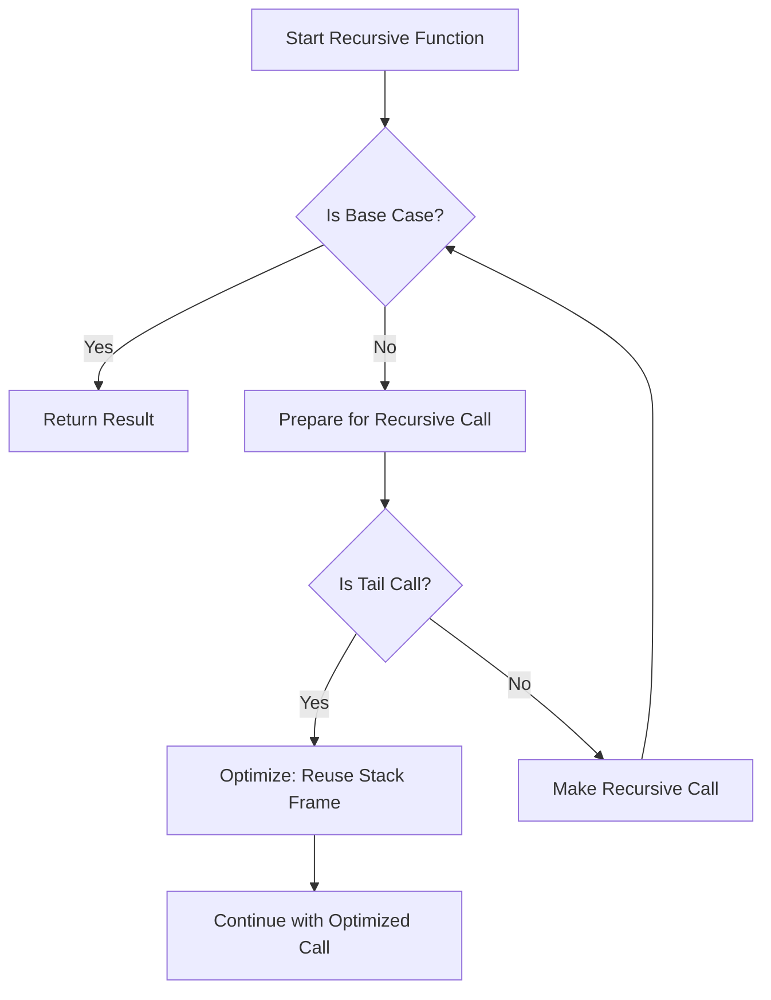

# Unlocking Efficient Recursion: Tail-Call Optimization in C for Artificial Intelligence Applications
## Introduction
Recursion is a fundamental concept in computer science, and its importance cannot be overstated, especially in Artificial Intelligence (AI) algorithms. Many AI techniques, such as tree search, dynamic programming, and backtracking, rely heavily on recursive functions. However, deep recursion can pose significant challenges, including stack overflow errors, which can bring a program to its knees. In recent years, tail-call optimization has emerged as a solution to enhance the efficiency of recursive functions in C, a language that has been a cornerstone of systems programming for decades. In this article, we will explore the world of recursion, explore the limitations of traditional recursive approaches, and discuss how tail-call optimization can help mitigate these issues.

## Why This Matters
As AI applications become increasingly complex, the need for efficient recursive functions grows. Traditional recursive approaches can lead to stack overflow errors, causing programs to crash or become unresponsive. Tail-call optimization offers a way to optimize recursive functions, reducing the risk of stack overflow and making AI applications more reliable and efficient. This is particularly important in applications where recursive functions are used extensively, such as in natural language processing, computer vision, and expert systems.

## How It Works
To understand how tail-call optimization works, let's first examine how recursion works. When a function calls itself recursively, a new stack frame is created, and the function's parameters and local variables are stored on the stack. This process continues until the base case is reached, at which point the function starts returning, and the stack frames are destroyed. The key insight behind tail-call optimization is that if the last thing a function does is call itself recursively, the current stack frame can be reused for the recursive call. This eliminates the need to create a new stack frame, reducing the risk of stack overflow.



## Core Concepts
To implement tail-call optimization, we need to understand the concept of tail recursion. A function is said to be tail recursive if the last thing it does is call itself recursively. In other words, the function's return value is the result of the recursive call. To optimize a recursive function for tail calls, we need to ensure that the function is tail recursive and that the compiler supports tail-call optimization.

## Examples & Code Walkthrough
Let's consider a simple example of a recursive function in C that calculates the factorial of a number. The traditional recursive implementation is shown below:

```c
// Custom example: Recursive factorial calculation
int factorial(int n) {
    if (n == 0) {
        return 1;
    } else {
        return n * factorial(n-1);
    }
}
```

This implementation is not tail recursive, as the last thing the function does is multiply the result of the recursive call by `n`. To make this function tail recursive, we can use an accumulator to store the result of the recursive calls:

```c
// Custom example: Tail-recursive factorial calculation
int factorial_tail(int n, int acc) {
    if (n == 0) {
        return acc;
    } else {
        return factorial_tail(n-1, n * acc);
    }
}
```

## Best Practices
To optimize recursive functions for tail calls, follow these best practices:

* Ensure that the function is tail recursive by making the last thing it does a recursive call.
* Use an accumulator to store the result of the recursive calls.
* Check that the compiler supports tail-call optimization.

## Common Mistakes & Anti-Patterns
When implementing tail-call optimization, watch out for the following common mistakes:

* Not ensuring that the function is tail recursive.
* Not using an accumulator to store the result of the recursive calls.
* Not checking that the compiler supports tail-call optimization.

## Performance Considerations
Tail-call optimization can significantly improve the performance of recursive functions by reducing the risk of stack overflow. However, the actual performance gain depends on the specific use case and the compiler's implementation of tail-call optimization.

## Real-World Usage
Tail-call optimization is used in various AI applications, including natural language processing, computer vision, and expert systems. For example, the LLVM compiler infrastructure uses tail-call optimization to optimize recursive functions in C and C++.

## Frequently Asked Questions (FAQ)
Q: What is tail-call optimization?
A: Tail-call optimization is a technique used to optimize recursive functions by reusing the current stack frame for the recursive call.
Q: How does tail-call optimization work?
A: Tail-call optimization works by reusing the current stack frame for the recursive call, eliminating the need to create a new stack frame.
Q: What are the benefits of tail-call optimization?
A: The benefits of tail-call optimization include reducing the risk of stack overflow and improving the performance of recursive functions.

## Conclusion
In conclusion, tail-call optimization is a powerful technique for optimizing recursive functions in C, particularly in AI applications. By understanding how recursion works and how tail-call optimization can help mitigate the limitations of traditional recursive approaches, developers can write more efficient and reliable code. As AI applications continue to evolve, the importance of efficient recursion will only grow, making tail-call optimization an essential tool in the developer's toolkit.
