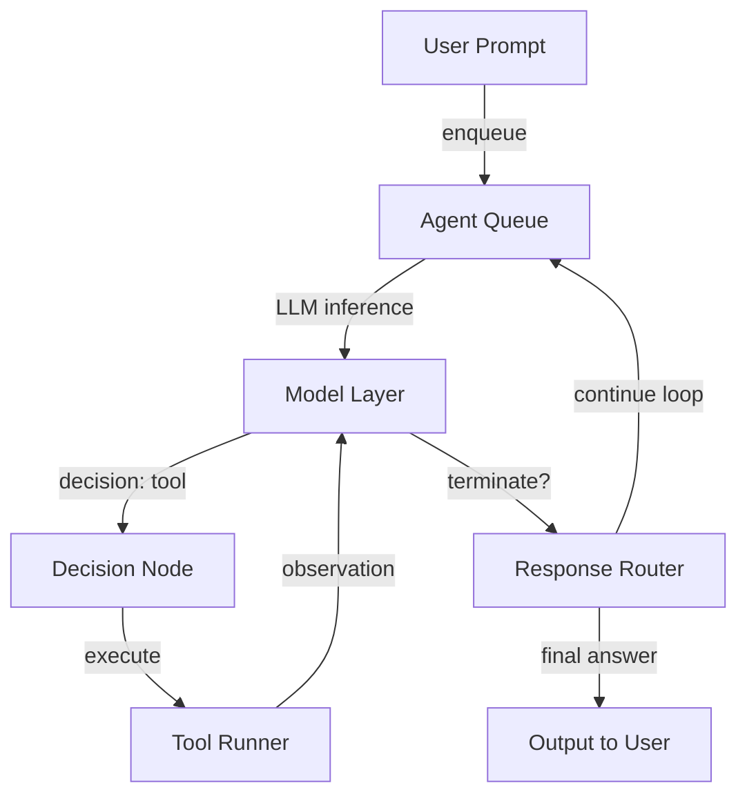

# Taking a look under your agent’s hood

## Introduction
Autonomous agents have moved from research notebooks into production workflows at a rapid clip. Many teams have adopted them for everything from internal tool integration to customer-facing assistants. Yet when an agent misbehaves—repeating the same tool call, leaking state, or hitting rate limits—the path to a fix often feels opaque. In this article I’ll walk through the concrete architecture of a tool-using agent loop, the data structures that keep it grounded, and the engineering patterns that make it reliable at scale. I’ll also include runnable code, a mermaid diagram of the core loop, and anti-patterns I’ve encountered across several production deployments.

## Why This Matters
Agents are only as useful as their ability to reason, act, and reflect without human intervention. In practice, the most common failure modes are not philosophical “what if the AI takes over” scenarios, but concrete operational issues: a tool that returns a 500 error and the agent loops indefinitely, a missing type guard that lets malformed JSON cascade into the model context, or a runaway iteration count that inflates compute costs. Understanding the internals lets you instrument effectively, set proper boundaries, and debug with confidence. If you ship agents to customers or internal stakeholders, knowing what’s under the hood is a baseline requirement, not a nice-to-have.

## How It Works
At the heart of most LLM agents lies a simple observation–action loop. The model reads the current state, decides on a step—either invoke a tool, emit a final answer, or ask for clarification—and the runtime executes that step. The result becomes the new state, and the cycle repeats until a termination condition is met.



The diagram above captures the essential flow: a prompt enters a queue, gets processed by a model, produces a decision (often in structured form), a runner executes the chosen tool, the observation feeds back into the next model call, and a router decides whether to stop or iterate. Real-world agents add layers—memory stores, cost guards, security filters—but the core loop remains this hand-off pattern.

Key technical details in this loop include:
- **Structured output parsing**: The model’s raw text is parsed (usually JSON) to extract `action` and `action_input`. Loose free-form text breaks the loop quickly.
- **Tool contract**: Every tool implements a consistent signature, typically `execute(**kwargs) -> Any`. This lets the agent invoke it without knowing implementation details.
- **State bag**: A minimal mutable object holds conversation history, iteration count, and last error state. It’s the single source of truth for the loop’s context.
- **Termination logic**: A `max_iterations` ceiling, a “final” action flag from the model, or a cost budget check all serve as exit gates.

## Core Concepts
Several primitives recur across production-grade agent frameworks. Understanding them in isolation makes the whole system easier to reason about.

**AgentState** is a dataclass or similar container that lives for the duration of a single user request. It typically holds:
- `conversation_history`: a list of role–content pairs, often trimmed to the last N turns to keep context windows manageable.
- `iteration_count`: incremented each loop, compared against `max_iterations` to prevent runaway execution.
- `last_error`: a string field that any step can populate; downstream code can display it or trigger alerting.

**Tool Registry** is a mapping from tool names to callable objects. A common pattern is to define an abstract base class with an `execute` method, then register concrete subclasses. This gives you a single point to inject logging, rate-limiting, or authentication.

**Decision Parsing** is the bridge between model output and runtime execution. In practice, I prefer having the system prompt instruct the model to return exactly:
```json
{"action": "tool_name", "action_input": {...}}
```
or
```json
{"action": "final", "answer": "…"}
```
Any deviation triggers a controlled error path rather than letting the model’s idiosyncrasies cascade.

**Observation Handling** means taking the tool’s return value and formatting it back into a prompt-friendly form. If a tool returns a large JSON blob, you may want to summarize or truncate it before feeding it back to the model, both for token budget and for noise reduction.

## Examples & Code Walkthrough
Below is a complete, functional implementation of a minimal agent loop. It includes type safety, defensive error handling, and inline comments that explain the purpose of each block. You can copy this into a Python file and run it with a stub model callable to see the loop in action.

```python
import json
from abc import ABC, abstractmethod
from dataclasses import dataclass, field
from typing import Any, Callable, Dict, List, Optional


# ---------------------------------------------------------------------------
# Foundational types
# ---------------------------------------------------------------------------

class AgentError(Exception):
    """Base exception class for all agent-related failures."""
