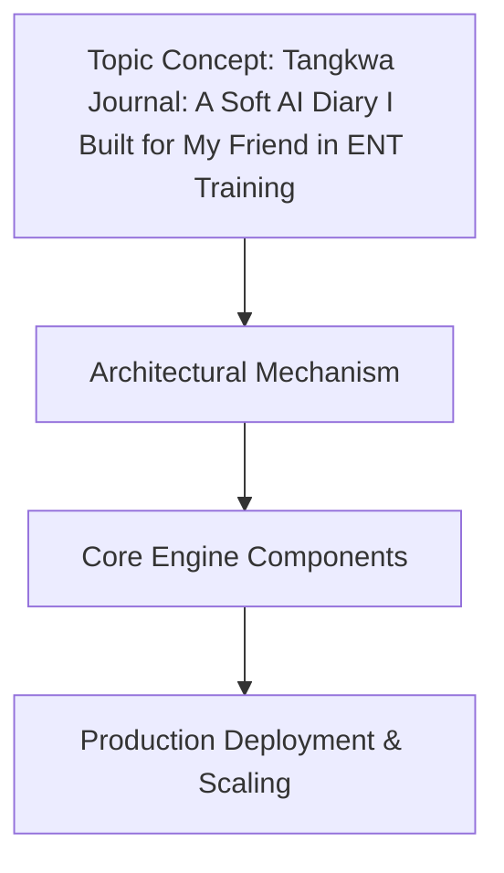

# Tangkwa Journal: A Soft AI Diary I Built for My Friend in ENT Training

## Introduction

My friend Maya is deep into her third year of ENT residency. Between airway management drills, sinus surgery observations, and the endless dictation practice, she mentioned how hard it is to capture reflective notes that actually stick. She wasn't looking for another generic note-taking app—she wanted a system that could gently surface patterns, prompt deeper thinking, and do it all without turning her clinical notes into a black-box AI output. 

That conversation stuck with me. I’ve spent years building production systems that balance automation with clinician trust, and the gap between "AI-powered diary" and "useful clinical companion" is usually where things break. I decided to build *Tangkwa Journal*—a lightweight, privacy-first journaling tool that uses a "soft AI" layer to generate reflective prompts, never

## How It Works

