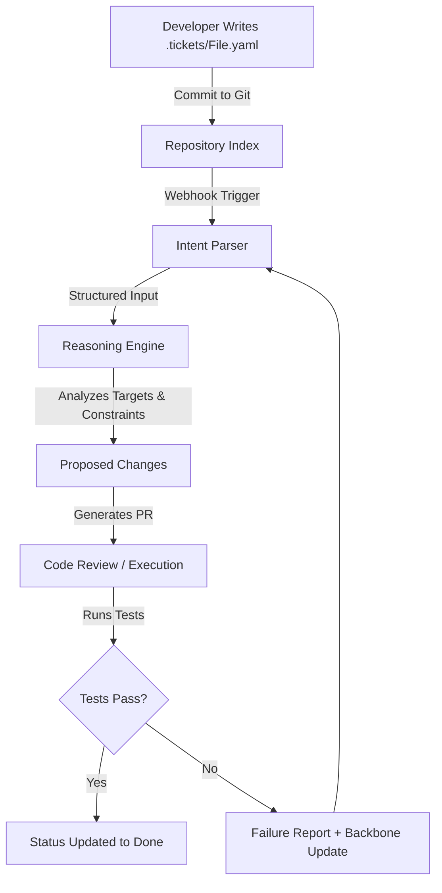

# Task Tickets as YAML in Git — Ask If It's Implemented

## Introduction

Modern AI coding assistants excel at generating syntactically correct code from natural language prompts. They read source files, understand function signatures, and produce working implementations with remarkable speed. Yet something remains missing—the ability to reason about the *why* behind changes and maintain a coherent narrative across a project's evolution.

Current workflows force teams to switch contexts constantly. A developer finishes a feature in their IDE, pushes the code to a Git repository, and then opens Jira or Linear to track progress, attach comments, and review status. That transition creates friction. The context lives in two separate places: one in the chat interface and another in the issue tracker. Neither captures the full semantic picture of what was built, why it matters, or what the next steps should be.

The emerging pattern addresses this by treating task definitions as first-class artifacts inside the repository itself. Specifically, we store task tickets as structured YAML files in a dedicated `.tickets/` directory. This approach aligns the development environment with the delivery pipeline. An AI agent can scan the entire git history, parse every ticket, and generate actions without ever leaving the source code ecosystem.

The goal is straightforward: transform the repository into a self-describing machine where the most important information is already available to any model running locally. Projects become inherently more autonomous because the system knows its own intentions and dependencies.

## Why This Matters

Engineers spend a disproportionate amount of time translating business goals into technical implementation. A well-designed ticket serves as a living contract between stakeholders and developers. It captures the scope of work, the intended outcomes, and the conditions under which success should be measured.

Traditional issue trackers often suffer from ambiguity. Status fields like "In Progress" or "Done" provide little insight into whether a task truly advanced. Lack of traceability makes it hard to reproduce bugs caused by outdated assumptions. Furthermore, the silo between management tools and programming environments means valuable historical knowledge gets lost when issues are moved between projects or archived.

By embedding tasks as YAML files, we get several concrete benefits. Every ticket carries explicit metadata about priority, type, and ownership. The definition of work is written once and can be diffed, reviewed, and reused across multiple branches or repositories. Validation criteria live alongside the description, ensuring that completion means exactly what it claims. When an AI agent reviews a ticket, it has immediate access to both the "what" and the "how-to-check," reducing the guesswork involved in decision-making.

Teams that adopt this pattern report faster onboarding of new contributors. A fresh hire can clone the repository, locate the `.tickets/` folder, and immediately understand the project's active workload without scheduling a lengthy walkthrough. The same benefit applies to external auditors who need to verify that certain architectural decisions were made and executed correctly.

## How It Works

The architecture follows a simple principle: keep everything in version control. When a developer creates a task, they write a YAML document and commit it to the main branch. Any AI agent connected to the repository picks up the change via a webhook or pull request trigger. The system parses the file, extracts the intent, and executes a series of operations based on the defined specifications.

Below is a visualization of the flow.



The process begins when a developer adds a new ticket to the `.tickets/` directory. The file contains a hierarchy of sections that guide the AI through the execution phase. Each section serves a specific purpose in enabling autonomous engineering.

First, the ticket identifies itself with a unique alphanumeric ID. This allows the AI to reference the task unambiguously across conversations or automated pipelines. Priority levels help rank work according to business value, while type classification (refactor, feature, bug, investigation) enables categorization in downstream systems.

Next comes the context scope. Rather than vague references to "the login module," a structured list pinpoints the exact directories and files affected. This precision prevents accidental side effects when modifying distant parts of the codebase. Dependencies are also declared here, pointing to other tickets that must be resolved before starting work.

The core of any operational ticket is the specification. Here lies the definition of what must be accomplished. A good specification includes a concise summary, a user story that articulates the stakeholder perspective, and detailed technical notes explaining the implementation approach. The validation block provides measurable criteria that confirm the work is complete. These criteria serve as a checklist that eliminates subjective judgment during acceptance.

## Core Concepts

Several concepts underpin this approach. The YAML format chosen offers excellent balance between readability and machine parsing. Unlike JSON, YAML supports comments and nested structures that map cleanly to human intention. It integrates seamlessly with tools like Copilot, vscode extensions, and CI pipelines that expect structured inputs.

The ticket schema breaks down into logical regions. At the root sits the ticket metadata—identifiers, priorities, and lifecycle state. The `context` region anchors the task to specific code locations, making it possible for the AI to focus its attention where changes matter. The `specification` region holds the actual description of work, including the user story and technical implementation guidance. Finally, the `validation` region defines the acceptance criteria that determine when a task is considered done.

Each component serves distinct purposes. Metadata aids navigation and filtering within the repository. Context limits scope creep and ensures changes stay localized. Specification gives the AI enough detail to plan correctly without requiring excessive clarification from humans. Validation transforms the abstract notion of "finished" into concrete, testable conditions.

Consider a refactoring ticket as an example. The target modules might include authentication middleware and session handling utilities. Forbidden zones could mark legacy migration scripts that must remain untouched. Dependencies link to the security audit task that preceded this effort. The specification describes migrating token storage from browser local storage to secure HTTP-only cookies, accompanied by user stories about preventing cross-site scripting attacks. The validation block requires passing the authentication test suite with full coverage. This level of specificity reduces the risk of partial implementation and speeds up verification.

## Examples & Code Walkthrough

Below is a fully realized ticket that demonstrates the structure in practice. Save this file as `.tickets/TASK-142-optimize-query-lookup.yaml`.

```yaml
ticket:
  id: TASK-142
  priority: high
  type: optimization
  status: in-progress
  
  context:
    target_modules:
      - src/repository/query-service
      - src/repository/cache-manager
    forbidden_zones:
      - src/infrastructure/deployments/
      - src/legacy-migration/
    dependencies:
      - TASK-140-add-new-index
      - TASK-139-fix-consistent-key-formats
  
  specification:
    summary: "Replace linear lookup table with indexed hash map for order queries"
    user_story: "As an application operator, I want orders retrieved in constant time so my dashboard stays responsive under load."
    technical_notes: |
      - Design a new index structure mapping order IDs to cached results
      - Update query handlers to consult the index before hitting the DB
      - Add benchmark tests comparing old and new lookup performance
      - Ensure backward compatibility during rollout
      - Document the new data shape for future maintainers
    
    acceptance_criteria:
      - All existing endpoints return correct results after deployment
      - Query latency drops below 5ms for 95th percentile requests
      - New index is built incrementally without blocking writes
      - Regression tests pass with no failures
      - Deployment logs show zero errors related to index creation
    
    constraints:
      - Do not alter the schema of persisted order records
      - Keep changes backward compatible with existing client SDKs
      - Limit max index size to 500MB to avoid memory pressure
```

This ticket communicates everything an AI needs to execute the work. The `context` section tells the engine exactly which files to modify and warns against touching unrelated infrastructure. The `specification` portion explains the motivation and provides a checklist. When the AI runs `npm run test:order-lookup`, it finds evidence that the new index is functioning and passes the benchmarks.

One subtlety worth noting is how the validation block interacts with the testing framework. The `acceptance_criteria` lists concrete expectations, and the subsequent execution step compares actual runtime behavior against those expectations. If a test fails, the system flags the ticket as incomplete rather than silently accepting partial work. This enforces a culture of quality even when operating autonomously.

## Best Practices

Implementing this pattern effectively requires discipline around file organization and maintenance. Treat the `.tickets/` directory as a first-class component of the codebase, not an optional add-on. Place it alongside configuration files and documentation to encourage consistent usage.

Version control remains central. Commit ticket changes frequently alongside code modifications, similar to regular source code. This relationship becomes clear when reviewing merges—if a ticket moves from `in-progress` to `done`, the corresponding commits should reflect the completed work. The git history thus serves as an audit trail of both code changes and planning activities.

Avoid creating tickets that duplicate existing work. Before filing a new task, search the repository for similar YAML entries and expand rather than replicate. Consolidation reduces noise and keeps the backlog manageable. Periodically prune stale tickets that have been resolved but remain visible, especially when switching between projects. Stale items clutter the search index and confuse the reasoning engine.

When defining specifications, favor clarity over brevity. Ambiguous requirements lead to incorrect interpretations and wasted cycles. Encourage team members to ask clarifying questions if a ticket lacks sufficient detail. A good rule of thumb is that anyone reading the ticket should be able to implement the work without additional consultation.

Finally, align ticket types with the nature of the work. Some tasks warrant detailed specification blocks; others may only need minimal metadata. Resist the urge to over-engineer every ticket with elaborate validation criteria. Match complexity to the cognitive load the task introduces.

## Common Mistakes & Anti-Patterns

**Stale ticket accumulation** occurs when teams stop updating tickets after initial resolution. To combat this, establish a routine review cadence. New tickets enter during sprint planning, but periodic pruning removes obsolete ones. Consider integrating a cleanup job that marks tickets older than six months as inactive unless explicitly reopened.

**Over-specification** is another danger. Requiring exhaustive details for every small task slows iteration and creates fatigue. Reserve granular validation blocks for complex changes that involve multiple subsystems. Simple bug fixes may benefit from a lightweight template containing only the essential fields.

**Secrets leakage** emerges when ticket text accidentally contains sensitive information. Since YAML files land in public repositories, ensure that no passwords, API keys, or personal identifiers appear in any ticket. Run pre-commit hooks that scan committed files for patterns matching secrets. Even a single leaked credential can compromise the entire organization.

**Scope drift** happens when a ticket evolves beyond its original intent. As work progresses, new branches may create branching expectations that diverge from the initial specification. Mitigate this by treating the `dependencies` list as a contractual anchor. When pulling in related changes, validate that the ticket still accurately reflects the current state of the codebase.

## Performance Considerations

From a computational standpoint, storing tasks as YAML incurs negligible overhead compared to alternative formats. Parsing a typical ticket takes microseconds, and diffing between versions costs a few milliseconds for most repositories. The primary cost lies in the reasoning layer, where the AI processes the extracted metadata and generates interventions.

Memory consumption grows linearly with the number of tickets. For large organizations with thousands of concurrent tasks, efficient serialization and streaming deserialization become relevant. Libraries like `pyyaml` offer lazy loading options that prevent loading irrelevant sections into memory prematurely. Cache the parsed ticket objects when running repeated analyses to amortize parsing costs.

Network latency matters less in a pure GitOps environment since all operations occur locally. However, if the system relies on remote APIs for validation or integration with external monitoring tools, minimize round trips. Local test suites and mock evaluations reduce dependence on cloud services and improve feedback loops.

Scalability concerns arise when thousands of tickets require parallel processing. Distribute the workload across multiple agents, each responsible for a subset of tickets identified by their `id` prefix or dependency graph. The workflow remains simple: assign, parse, evaluate, and update. The resulting pull requests can be merged independently, allowing continuous delivery of improvements.

## Real-World Usage

Several forward-thinking organizations have experimented with this approach. Open-source projects hosted on GitHub have adopted ticket-like YAML files to bridge the gap between community contributions and core maintenance. Developers push tasks to resolve pending issues, and automated bots periodically consolidate duplicates. The result is a living backlog that never leaves the codebase and stays synchronized with code reality.

Enterprise teams using this pattern often integrate with internal ticketing platforms for high-level tracking while keeping detailed implementation plans in Git. The two layers complement each other: the platform handles routing and prioritization, while the repository stores the authoritative intent. This hybrid model satisfies stakeholders who need visibility without disrupting the autonomy of day-to-day engineering.

Another practical application appears in observability tooling. Teams maintain infrastructure as code in YAML files, and each resource modification triggers a corresponding task ticket. When a new monitoring endpoint is added, the ticket documents the metric being tracked, the alert thresholds, and the deployment sequence. Later, the AI can analyze the event stream and suggest refinements to the ticket—providing a feedback loop that continuously improves system reliability.

## Frequently Asked Questions

**How do I handle a ticket whose implementation spans multiple files?**

Structure the ticket so that each file referenced in `target_modules` corresponds to a clearly delimited section. The specification block should describe the overall transformation rather than prescribing line-by-line edits. During execution, the AI iterates through listed targets, applying the same methodology consistently. This modular approach scales gracefully as the scope expands.

**Can non-technical stakeholders read these tickets?**

The YAML format is primarily designed for machine consumption, but developers can share summaries written in plain English. When communicating with product managers, highlight the `summary` and `user_story` fields. Those convey meaning without requiring technical background. Keep the internal detail in the structured sections for the engineering team to consume directly.

**What happens if a ticket cannot be executed automatically?**

That is precisely when the human-in-the-loop kicks in. The validation step reports a failure, and the ticket transitions back to `in-progress`. A different developer or the original author can examine the reasons and either adjust the specification or add manual intervention steps. This fallback preserves agility while maintaining accountability.

**Should I use version control branches for
