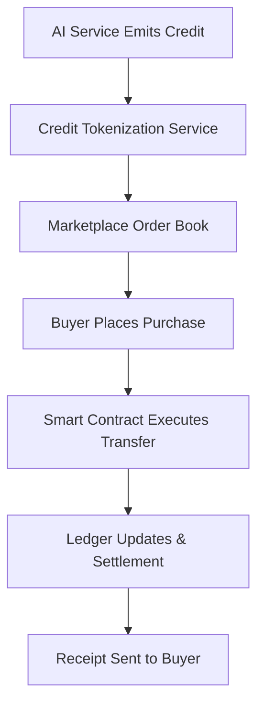

# The AI Credit Resale Economy

## Introduction
A new class of digital assets is emerging where machine‑generated credits can be tokenized, traded, and settled on decentralized ledgers. This shift creates a market for credit liquidity, but it also introduces fresh coordination challenges for distributed systems.

## Why This Matters
Engineers building AI‑driven services now face the question: how do we expose surplus compute or data credits to external consumers without compromising consistency or security? Traditional rate‑limiting falls short when credits have monetary value and can be arbitraged across services. A programmable resale layer solves this by turning abstract credits into tradable tokens, enabling dynamic pricing and inventory control.

## How It Works
The flow below shows the end‑to‑end path from credit generation to final settlement.



* **Credit Tokenization Service** – wraps raw credit counters into ERC‑1155‑style tokens, each representing a deterministic amount of compute or data usage.
* **Marketplace Order Book** – a decentralized exchange where buyers post bids and sellers (the AI service) list ask offers.
* **Smart Contract Execution** – validates payment, updates ownership, and burns the sold tokens.
* **Ledger Settlement** – records the transaction on a public chain, ensuring auditability and atomicity.

## Core Concepts
* **Credit Token** – an on‑chain object that encodes a non‑negative integer value and a reference to the originating AI model.
* **Order Book** – maintains bid/ask pairs; can be implemented as an off‑chain order matching service that pushes signed intents to the chain.
* **Smart Contract** – enforces escrow, price validation, and token transfer semantics.
* **Price Oracle** – provides real‑time market data to prevent stale pricing; often sourced from a decentralized data feed.

## Examples & Code Walkthrough
Below is a minimal Solidity contract that mints credit tokens and a Python client that purchases them. The code is intentionally simple to illustrate the core ideas; production deployments would add extensive access control and gas optimizations.

```solidity
// SPDX-License-Identifier: MIT
pragma solidity ^0.8.24;

contract CreditToken {
    uint256 public nextId;
    mapping(uint256 => uint256) public creditBalance;

    event CreditMinted(uint256 indexed tokenId, uint256 amount);
    event CreditSold(uint256 indexed tokenId, address indexed buyer, uint256 amount);

    function mint(uint256 amount) external returns (uint256 tokenId) {
        tokenId = nextId++;
        creditBalance[tokenId] = amount;
        emit CreditMinted(tokenId, amount);
    }

    function sell(uint256 tokenId, uint256 price, address buyer) external {
        require(creditBalance[tokenId] >= price, "Insufficient credit");
        creditBalance[tokenId] -= price;
        emit CreditSold(tokenId, buyer, price);
    }
}
```

```python
import requests
from eth_account import Account
from eth_utils import to_checksum_address

# Example: placing a purchase order on a public marketplace API
def purchase_credit(token_id: int, price: int, private_key: str):
    # Build transaction payload
    payload = {
        "to": "0xMarketplaceAddress",
        "data": f"0x{price:064x}{token_id:064x}",  # simplified ABI encode
        "gas": 200000,
        "gasPrice": 20 * 10**9,
    }
    # Sign with local wallet
    acct = Account.from_key(private_key)
    signed = acct.sign_transaction(payload)
    # Send raw transaction (omitting nonce handling for brevity)
    return signed.rawTransaction.hex()

# Usage
pk = "0xabc123...def456"
tx_hex = purchase_credit(token_id=42, price=150, private_key=pk)
print("Signed tx:", tx_hex)
```

*The snippet shows a raw transaction that calls `sell` on the marketplace contract, transferring ownership of a credit token to the caller.*

## Best Practices
* **Atomicity First** – bundle credit deduction and payment in a single on‑chain transaction to avoid partial states.
* **Oracle Freshness** – enforce a maximum age on price feeds; reject stale offers.
* **Rate Limits per Token** – prevent a single buyer from monopolizing a scarce credit type.
* **Audit Trails** – log every mint, sell, and transfer off‑chain for forensic analysis.

## Common Mistakes & Anti‑Patterns
1. **Over‑reliance on Off‑Chain Validation** – trusting an external API to decide if a token can be sold can lead to race conditions when multiple buyers act simultaneously.
2. **Hard‑Coded Pricing** – embedding static prices in the contract makes the market inflexible and invites arbitrage.
3. **Ignoring Gas Spikes** – selling during network congestion can cause transactions to revert, leaving credits locked.
4. **Missing Slippage Controls** – allowing buyers to accept any price without a max‑price cap can drain seller balances.

## Performance Considerations
* **Transaction Throughput** – each credit sale incurs at least one on‑chain call; batch processing (e.g., selling multiple tokens in a single transaction) reduces overhead.
* **State Growth** – token IDs increase monotonically; periodic pruning or compression schemes are needed for long‑running services.
* **Network Latency** – cross‑chain bridges add round‑trip latency; choose a layer‑2 solution if sub‑second finality is required.

## Real-World Usage
Several cloud‑AI providers now expose “compute credits” that can be bought on public marketplaces. For instance, a GPU‑accelerated inference platform uses a token model where each sold token grants a fixed amount of inference cycles. The tokens are minted per request, listed on a decentralized exchange, and settled via smart contracts that automatically credit the buyer’s account.

## Frequently Asked Questions (FAQ)
**Q1: How do I prevent a buyer from reselling the same credit token multiple times?**  
A: Burn or lock the token after the first successful transfer; the contract should emit an event that the marketplace enforces.

**Q2: Can I use a private blockchain instead of a public one?**  
A: Yes, but you lose the composability benefits of a public ledger. Private deployments typically rely on an internal order‑matching service with on‑chain‑like audit logs.

**Q3: What happens if the price oracle goes offline?**  
A: Implement a fallback mechanism that temporarily halts trading or switches to a median of recent on‑chain price observations.

## Conclusion
Turning AI‑generated credits into tradable assets adds a new dimension to resource management. By combining tokenization, decentralized marketplaces, and smart‑contract enforcement, engineers can build systems that allocate compute and data efficiently while preserving security. The pattern is still maturing, so expect iterative improvements in scalability, pricing models, and cross‑chain integration as the ecosystem stabilizes.
