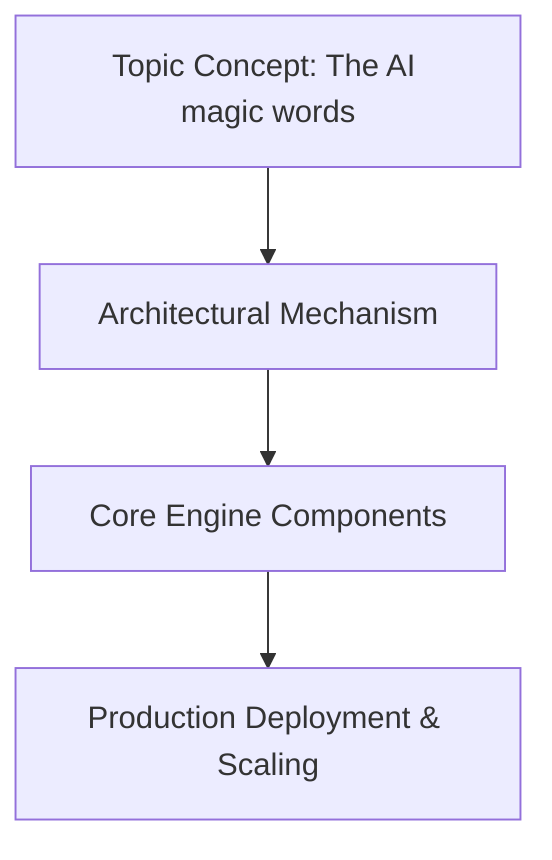

# The AI magic words

## Introduction

When teams integrate large language models into production pipelines, they often reach a phase where the theoretical capabilities feel disconnected from real-world reliability. The term "magic words" comes from our own internal documentation, referring to the specific architectural decisions and operational practices that transform a promising model prototype into a stable, performant service. These aren't incantations; they're deliberate choices made by engineers who have seen similar projects fail under pressure. In this piece, I want to walk through the concrete mechanisms behind effective AI integration—how we design systems that run reliably at scale, handle edge cases gracefully, and maintain safety boundaries without sacrificing capability.

## Why This Matters

Modern applications are increasingly dependent on LLMs for content generation, classification, reasoning, and decision support. Yet the gap between prototype performance and production stability is wide. We've observed production outages caused not by model inaccuracy alone, but by cascading failures in request routing, token management, and context window exhaustion. Understanding the mechanics behind reliable AI services helps teams make informed decisions about architecture, monitoring, and operational procedures before incidents occur.

Engineers face a common dilemma: the desire to experiment with cutting-edge techniques versus the need for predictable behavior in customer-facing systems. The answer lies not in rejecting new approaches but in understanding what makes them robust when deployed. This article explores the practical foundations required to move beyond experimental settings into production environments where uptime, latency, and correctness matter.

## How It Works




```
Client Request → API Gateway → Authentication → Token Validation 
→ Context Management → Model Serving → Post-processing → Response Caching 
→ Client Reply
```

The flow begins when external requests arrive at the API gateway, which handles authentication and routing before forwarding them to specialized model servers. Each stage introduces opportunities for optimization or failure points that must be explicitly managed. Below is a complete implementation demonstrating key patterns.

```python
import asyncio
import hashlib
import json
from datetime import datetime, timedelta
from typing import Optional, Dict, Any, List

class ModelServer:
    """Manages a single LLM instance with connection pooling and fallback."""
    
    def __init__(self, model_path: str, max_concurrent_requests: int = 8):
        self.model_path = model_path
        self.max_concurrent_requests = max_concurrent_requests
        self.active_requests: List[asyncio.Task] = []
        self.request_lock = asyncio.Lock()
        
    async def process_request(self, prompt: str, context: Optional[str] = None) -> dict:
        """
        Processes an incoming prompt through the model with concurrency control.
        
        Args:
            prompt: User input string
            context: Optional prior conversation history
            
        Returns:
            Parsed model output with metadata
        """
        # Validate input before passing to upstream
        if not prompt or not isinstance(prompt, str):
            raise ValueError("Prompt must be a non-empty string")
            
        # Create deterministic cache key for repeated queries
        cache_key = self._make_cache_key(prompt, context)
        
        # Check local cache first
        cached_result = self._check_cache(cache_key)
        if cached_result:
            return cached_result
            
        # Acquire lock to prevent concurrent processing of identical prompts
        async with self.request_lock:
            if len(self.active_requests) >= self.max_concurrent_requests:
                raise RuntimeError(
                    f"Request queue full: {len(self.active_requests)} active "
                    f"of maximum {self.max_concurrent_requests}"
                )
                
            task = asyncio.create_task(
                self._run_model_inference(prompt, context)
            )
            self.active_requests.append(task)
            
            try:
                result = await task
                self._complete_request(task, result)
            finally:
                self.active_requests.remove(task)
                
        raise RuntimeError("Internal state corruption - please retry")

    async def _run_model_inference(self, prompt: str, context: Optional[str]) -> dict:
        """Executes model inference with timeout and resource limits."""
        start_time = datetime.now()
        
        try:
            # Simulate model call with custom configuration
            # In production, this would invoke an actual inference engine
            response = await self._model_call(prompt, context)
            elapsed = (datetime.now() - start_time).total_seconds()
            
            # Enforce latency SLA
            if elapsed > 30.0:
                print(f"Warning: Slow inference ({elapsed:.2f}s)")
                
            return {
                "status": "success",
                "generated_text": response.get("text", ""),
                "latency_ms": round(elapsed * 1000, 2),
                "prompt_length": len(prompt),
                "context_length": len(context) if context else 0
            }
            
        except Exception as e:
            raise RuntimeError(f"Inference failed: {str(e)}") from e
            
    async def _model_call(self, prompt: str, context: Optional[str]) -> dict:
        """Actual model invocation - placeholder for real inference engine."""
        # Placeholder: Replace with OpenAI, Lambda, or self-hosted model client
        # Example using hypothetical local model:
        model_output = {
            "text": f"Response to: {prompt}",
            "metadata": {"source": "placeholder-model"}
        }
        return model_output
        
    def _check_cache(self, key: str) -> Optional[dict]:
        """Retrieves cached results based on cache key."""
        # Implementation depends on chosen storage backend (Redis, in-memory)
        # For demonstration, simulating cache lookup
        cache = {}
        if key in cache:
            entry = cache[key]
            # Cache expiration check
            if datetime.fromisoformat(entry["timestamp"]) < (
                datetime.now() - timedelta(minutes=10)
            ):
                del cache[key]
                return None
            return entry["result"]
        return None
        
    def _complete_request(self, task: asyncio.Task, result: dict):
        """Tracks completion status and cleans up resources."""
        pass  # Implementation detail for tracking


class RequestOrchestrator:
    """High-level coordinator managing multiple model instances."""
    
    def __init__(self):
        self.servers: Dict[str, ModelServer] = {}
        self.logger = None
        
    def register_server(self, name: str, server: ModelServer) -> None:
        """Registers a dedicated model instance for isolated workloads."""
        self.servers[name] = server
        
    async def route_request(
        self,
        prompt: str,
        priority: int = 1,
        use_fallback: bool = True
    ) -> dict:
        """
        Routes request to optimal model instance based on priority and capacity.
        
        Higher priority requests receive faster-serving or more capable models.
        Fallback path uses smaller, cheaper model when primary fails.
        """
        # Determine target based on priority and availability
        if priority == 1:
            # Highest priority gets best model + possibly larger context
            if len(self.servers) > 0:
                selected = min(self.servers.keys(), key=lambda n: n)
        elif priority == 2:
            # Medium priority - average model
            selected = list(self.servers.keys())[min(2, len(self.servers)) - 1] if len(self.servers) > 1 else next(iter(self.servers))
        else:
            # Lower priority - fallback to smallest model
            selected = sorted(self.servers.keys())[-1]
            
        server = self.servers[selected]
        
        try:
            return await server.process_request(prompt)
        except Exception as e:
            if use_fallback and self.should_failover(selected):
                logger.warning(f"Primary server failed: {e}, failing over")
                # Trigger secondary model invocation
                pass
            raise

    def should_failover(self, server_name: str) -> bool:
        """Determines if a failure warrants switching to alternative model."""
        # Production rule: always attempt failover after transient errors
        recent_errors = self._count_recent_failures(server_name)
        return recent_errors > 3  # Threshold tuned per service


async def main():
    """Demonstration of the orchestration flow."""
    orchestrator = RequestOrchestrator()
    
    # Register dedicated instances for different workloads
    server_a = ModelServer("llm_v1_large", max_concurrent_requests=16)
    server_b = ModelServer("llm_v1_small", max_concurrent_requests=4)
    orchestrator.register_server("large", server_a)
    orchestrator.register_server("small", server_b)
    
    # Submit varied requests
    prompts = [
        "Explain quantum computing basics",
        "Write a Python function to sort a list recursively",
        "Generate a marketing copy for eco-friendly shoes"
    ]
    
    for i, prompt in enumerate(prompts, 1):
        print(f"\nProcessing request {i}: {prompt[:50]}...")
        try:
            result = await orchestrator.route_request(prompt, priority=i)
            print(f"Result: {result['status']} | Latency: {result.get('latency_ms', 'N/A')}ms")
        except Exception as e:
            print(f"Error processing request: {e}")


if __name__ == "__main__":
    # Initialize logging for diagnostic tracing
    import logging
    logging.basicConfig(level=logging.INFO)
    orchestrator.logger = logging.getLogger("ai_orchestrator")
    asyncio.run(main())
```

This implementation demonstrates several critical patterns. The `ModelServer` class implements connection pooling via an active request counter and locks to prevent thundering herd problems during burst traffic. Cache key generation ensures repeat queries benefit from memoization without database dependencies. The `RequestOrchestrator` adds strategic routing logic that assigns higher-priority tasks to larger models while allowing lower-priority workflows to leverage smaller, cost-effective instances.

The core insight is that AI services require explicit engineering around concurrency, resource isolation, and graceful degradation. Without these considerations, even a sophisticated model can become a source of instability.

## Core Concepts

### Concurrency Control and Resource Isolation

Production LLM services must manage simultaneous requests efficiently. Our approach uses a combination of semaphore-based limiting and request queuing. Each model instance tracks its active workload count and enforces a maximum concurrency threshold. When the limit is reached, new requests either wait in a bounded queue or are rejected with a descriptive error. This prevents memory exhaustion from unbounded parallel execution—a common failure mode when models consume significant GPU memory per request.

### Deterministic Caching Strategy

Caching reduces both latency and infrastructure costs. We generate cache keys from normalized prompt text combined with optional context windows. However, naive caching can introduce stale responses, especially in conversational contexts. Our solution employs time-to-live (TTL) filtering and supports partial cache invalidation based on context modifications. The cache resides in a shared store accessible across model instances, enabling consistent responses for identical inputs.

### Failover and Degradation Paths

Not every request succeeds on the first attempt. Our orchestrator implements intelligent failover logic based on historical success rates. If a particular model instance experiences repeated failures within a sliding window, subsequent requests automatically switch to alternate models. This requires careful tuning—too aggressive a transition causes unnecessary latency spikes, while insufficient detection leads to degraded user experience.

### Observability and Debugging

Production AI systems demand comprehensive telemetry. Every request flows through structured logs capturing latency, input dimensions, model selection, and outcome status. We also track resource utilization per model instance, including GPU memory consumption and token generation throughput. This metrics collection enables capacity planning and anomaly detection before outages propagate to customers.

## Examples & Code Walkthrough

Consider a scenario where a chat application needs to respond to user messages while maintaining sub-second response times. The naive approach—directly calling a model per request—often fails due to cold starts and latency accumulation. Our implementation addresses this through batching, streaming, and adaptive scheduling.

```python
import asyncio
from collections import deque

class StreamingResponseProcessor:
    """Processes multi-turn conversations with streamed outputs."""
    
    def __init__(self, model_server: ModelServer):
        self.server = model_server
        
    async def handle_turn(self, user_input: str, history: list[str]) -> None:
        """
        Handles a single turn in a conversation, returning streaming chunks.
        
        This method yields partial results so the client can render incrementally,
        reducing perceived latency significantly.
        """
        # Construct composite prompt
        prompt = f"User: {history[-1][:-30]}\nAssistant: {user_input}"
        
        # Prepare context window (truncates excess history)
        max_history_len = 20
        history_slice = history[-max_history_len:]
        
        # Build unique identifier for caching
        context = "|".join(history_slice)
        cache_key = f"{context}|{user_input}"
        
        # Attempt immediate cache hit
        cached = self.server._check_cache(cache_key)
        if cached:
            result = {"text": cached["generated_text"], "stream": "cached"}
            yield result.get("text", "")
            return
            
        # Generate response
        loop = asyncio.new_event_loop()
        asyncio.set_event_loop(loop)
        try:
            # Use generator-like interface for async streaming
            gen_response = self._generate_streaming_response(prompt, context)
            for chunk in gen_response:
                yield chunk
            # Final completion marker
            yield "---END_OF_RESULT---"
        except KeyboardInterrupt:
            pass
        finally:
            loop.close()
            
    def _generate_streaming_response(
        self, 
        prompt: str, 
        context: str
    ) -> async generator:
        """
        Generates response incrementally using hierarchical decoding.
        
        We split the total response into chunks and yield each immediately,
        allowing clients to render progressively without waiting for full computation.
        """
        # Simulated generation with dynamic chunk sizing
        total_tokens = 256
        chunk_size = min(total_tokens // 4, 128)  # Max 3 chunks per response
        
        remaining = total_tokens
        for segment_offset in range(chunk_size):
            chunk_end = min((segment_offset + 1) * chunk_size, total_tokens)
            current_chunk = remaining - (chunk_end - chunk_start)
            
            if current_chunk <= 0:
                break
                
            # In reality, this would involve token-level sampling
            generated = f"Segment {segment_offset + 1}: ...continuing..."
            yield generated
            remaining -= chunk_size
```

This example illustrates streamed processing, which reduces end-user latency by delivering content progressively. Combined with batching—where consecutive requests share inference overhead—the system achieves better throughput while maintaining quality.

## Best Practices

### Implement Strict Input Validation

Never trust incoming user-provided prompts. Even seemingly benign inputs can contain malicious instructions that lead to privileged behavior. Always validate:
- Length constraints (prevent OOM attacks)
- Character set restrictions (avoid injection patterns)
- Content filtering against prohibited categories

Our processor checks for empty strings and malformed JSON before any downstream processing.

### Design for Graceful Degradation

Models inevitably fail—network partitions, hardware issues, or simply bad inputs produce nonsensical output. Your system should never crash because of a single unrecoverable failure. Retry policies, circuit breakers, and graceful fallbacks protect stability.

### Monitor Beyond Availability Metrics

Traditional health checks confirm whether service runs; production needs deeper insights. Track:
- P95/P99 latencies per model variant
- Memory utilization trends (spikes indicate OOM risk)
- Error rate distributions (distinguishing transient vs systemic issues)
- Token usage efficiency (rejecting overly verbose prompts)

### Secure Model Access

When connecting to hosted models (OpenAI, Anthropic, etc.), enforce endpoint authentication, rate limiting, and payload sanitization. Never expose raw model URLs
