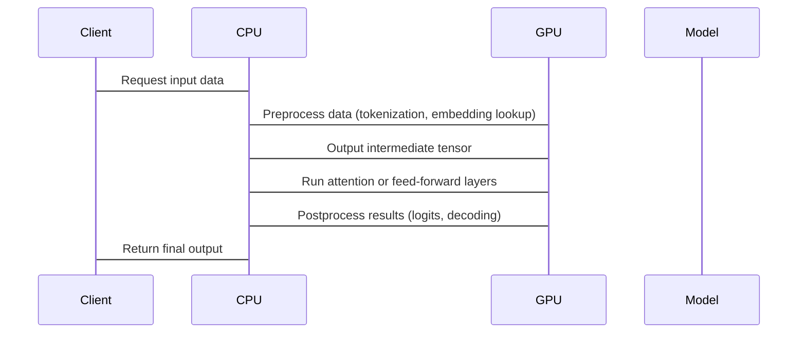

# The CPU is back: Rethinking the CPU-GPU split for LLM inference  

## Introduction  
For years, the CPU-GPU split in machine learning has been a settled matter. GPUs, with their parallel architecture, dominated inference for large language models (LLMs), handling matrix multiplications and attention mechanisms with ease. But as models grow larger and inference demands surge, a quiet shift is happening. Engineers are noticing that CPUs, once sidelined, are reclaiming a role in this equation. It’s not about replacing GPUs entirely—it’s about rethinking how we partition work between them. The question isn’t just *can* CPUs handle LLMs, but *when* and *how* they should.  

## Why This Matters  
The cost of GPUs is a tangible pain point. A single high-end GPU can cost thousands of dollars, and scaling to multiple GPUs for inference becomes prohibitively expensive. For startups or teams with limited budgets, this is a critical constraint. CPUs, while slower per operation, offer better memory bandwidth and lower power consumption per compute unit. In some scenarios, offloading parts of the inference pipeline to CPUs can reduce infrastructure costs without sacrificing performance.  

Another angle is latency. GPUs excel at bulk parallel tasks, but their overhead in data transfer between host and device can be a bottleneck. For real-time applications, where every millisecond counts, a hybrid approach might yield faster results. Think of a chatbot that needs to respond in under 200ms—splitting the workload between CPU and GPU could make the difference between a smooth experience and a frustrating delay.  

## How It Works  
The core idea is to decouple the traditional "GPU-only" mindset. Instead of running the entire model on a GPU, we identify parts of the computation that are better suited for CPUs. This could be preprocessing steps, postprocessing, or even specific layers of the model. The challenge is not just technical but strategic: where to split, how to manage data flow, and how to minimize overhead.  



This diagram illustrates a simplified workflow. The CPU handles tasks that are memory-bound or require sequential processing, while the GPU takes care of parallelizable operations. The key is minimizing the number of data transfers between CPU and GPU, as these can introduce significant latency.  

## Core Concepts  
The CPU-GPU split for LLMs hinges on understanding the nature of the computations involved. LLMs rely on matrix multiplications, which GPUs handle efficiently via CUDA cores. However, CPUs have strengths in tasks that are not parallelizable or require tight memory access. For example:  

- **Tokenization and embedding lookups**: These are often CPU-friendly because they involve sequential data and small memory footprints.  
- **Attention mechanisms**: While attention is parallel, the softmax operation can be optimized on CPUs if the sequence length is manageable.  
- **Postprocessing**: Decoding steps like beam search or greedy decoding can be CPU-bound due to their sequential nature.  

Another concept is *model partitioning*. Not all models are cut and dried. Some architectures, like those with sparse attention or quantization-aware training, may allow for more flexible splitting. The goal is to balance the workload so that neither the CPU nor the GPU becomes a bottleneck.  

## Examples & Code Walkthrough  
Let’s look at a practical example using PyTorch. Suppose we have a model where the embedding lookup and attention layers are split between CPU and GPU. Here’s a simplified code snippet:  

```python  
import torch  

# Assume model is a PyTorch model with some CPU and GPU modules  
model = HybridLLM()  

def run_inference(input_text):  
    # CPU handles tokenization and embedding lookup  
    tokens = tokenizer(input_text)  
    embeddings = model.cpu_embedding_layer(tokens)  # Runs on CPU  
    
    # Move embeddings to GPU for attention and feed-forward  
    embeddings = embeddings.to('cuda')  
    attention_output = model.gpu_attention_layer(embeddings)  
    ff_output = model.gpu_feed_forward_layer(attention_output)  
    
    # CPU handles postprocessing (e.g., decoding)  
    logits = ff_output.cpu()  
    output = model.cpu_decoder_layer(logits)  
    return output  

# Example usage  
result = run_inference("Hello, world!")  
```  

This code demonstrates how to explicitly route operations to CPU or GPU. The key is to ensure that data is moved efficiently between devices. Using `torch.cuda` or `torch.cpu` functions helps, but the real optimization comes from understanding which operations are best suited for each device.  

## Best Practices  
1. **Profile aggressively**: Don’t assume a split will work. Use profiling tools (like PyTorch’s `torch.profiler`) to identify bottlenecks.  
2. **Minimize data transfer**: Keep data on the device that uses it most. Avoid moving large tensors between CPU and GPU unless necessary.  
3. **Use optimized libraries**: Leverage frameworks like ONNX or TensorRT that can optimize models for specific hardware.  
4. **Consider model architecture**: Some models are inherently more amenable to CPU-GPU splitting. For example, models with sparse computations or low-dimensional embeddings may benefit more.  
5. **Test with real data**: Synthetic benchmarks don’t always reflect real-world performance. Use actual user data to validate your setup.  

## Common Mistakes & Anti-Patterns  
- **Assuming all GPU is better**: Overloading a GPU with tasks that are better suited for CPUs can lead to underutilization.  
- **Ignoring data transfer costs**: Moving data between CPU and GPU can introduce latency that outweighs the benefits of parallelism.  
- **Not accounting for model size**: A model that’s too large for GPU memory may require CPU offloading, but this can be slow.  
- **Overcomplicating the split**: A simple, well-optimized split is often better than a complex, poorly implemented one.  

## Performance Considerations  
The performance of a CPU-GPU split depends on several factors:  

- **Memory bandwidth**: CPUs often have higher memory bandwidth than GPUs, making them better for data-intensive tasks.  
- **Latency vs. throughput**: GPUs excel at throughput, while CPUs may offer lower latency for specific operations.  
- **Power consumption**: CPUs are generally more energy-efficient per compute unit, which matters for data centers.  
- **Scalability**: Adding more GPUs is easier than adding more CPUs, but a hybrid approach can balance this.  

For example, a model that processes 100 tokens per second on a GPU might process 150 tokens per second on a CPU if the CPU handles the preprocessing and postprocessing efficiently.  

## Real-World Usage  
Companies like Meta and NVIDIA have experimented with hybrid inference. Meta’s Llama series, for instance, includes optimizations that allow parts of the model to run on CPUs. Similarly, some edge devices use CPUs for initial processing before offloading to GPUs for deeper layers.  

A notable case is a startup that reduced inference costs by 40% by splitting a 10B parameter model between CPU and GPU. They found that the CPU handled the tokenization and embedding steps, while the GPU focused on the attention layers. This approach allowed them to run the model on less expensive server hardware.  

## Frequently Asked Questions (FAQ)  
**Q: When should I use CPU over GPU for LLM inference?**  
A: Use CPU when the task is memory-bound, sequential, or requires low latency. GPUs are better for parallel, compute-heavy tasks.  

**Q: Does this approach work for all models?**  
A: Not all models are suitable. Models with dense computations or large memory footprints may not benefit as much.  

**Q: How do I decide which layers to split?**  
A: Profile your model. Look for layers with high memory access or sequential dependencies.  

**Q: What tools can help with CPU-GPU splitting?**  
A: PyTorch’s device management, ONNX for model optimization, and custom data pipelines.  

**Q: Can this reduce costs?**  
A: Yes, by using cheaper CPU instances for parts of the workload, you can lower infrastructure expenses.  

## Conclusion  
The CPU-GPU split for LLM inference isn’t a one-size-fits-all solution, but it’s a powerful approach for specific use cases. As models grow and infrastructure costs rise, engineers must think critically about how to allocate resources. The key is not to see CPUs and GPUs as rivals but as complementary tools. By understanding their strengths and limitations, you can design systems that are both efficient and cost-effective. The CPU isn’t just back—it’s part of the future of LLM inference.
