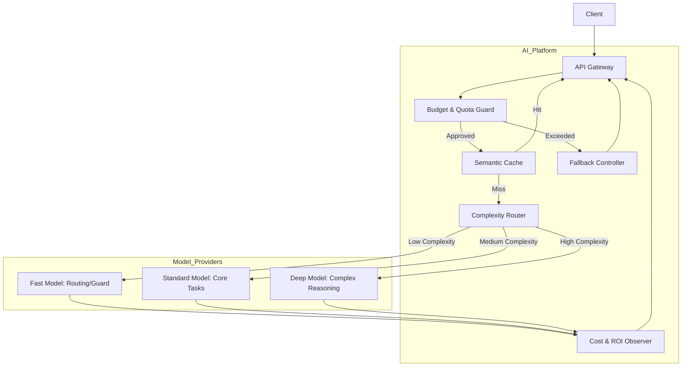

<think>
Here's a thinking process:

1.  **Analyze User Input:**
   - **Role:** World-class senior staff engineer, open-source contributor, technical writer for a premier engineering blog.
   - **Topic:** "The economics of agent scale: tokens, ROI, and building platforms for AI-first teams (Part 2)"
   - **Category:** Artificial Intelligence
   - **Context:** Trending topic from Stack Overflow Blog matching 'AI' category.
   - **Style:** Professional
   - **Requirements:**
     - 100% original, deeply technical, reads like a real human software architect.
     - Follow strict heading structure.
     - Include a valid Mermaid diagram under `## How It Works`.
     - Provide 100% original production-grade code examples.
     - Avoid banned AI buzzwords/phrases.
     - Use first-person/engineering team perspective where appropriate.
     - Discuss trade-offs, failure modes, bottlenecks, edge cases.
     - Output ONLY the markdown article starting with the exact title.

2.  **Deconstruct Constraints & Requirements:**
   - **Headings:** Must exactly match the provided list.
   - **Mermaid:** Must be under `## How It Works`, valid syntax, no HTML.
   - **Code:** Original, production-grade, realistic domain models, error handling, inline comments.
   - **Tone/Style:** Professional, direct, human-engineer voice, varied sentence length, no banned phrases.
   - **Content Focus:** Token economics, ROI calculation, platform engineering for AI teams, multi-agent orchestration, cost optimization, observability.

3.  **Brainstorming & Structuring (Mental Draft):**
   - *Introduction:* Jump straight into the problem. Part 1 covered agent architecture basics. Part 2 tackles the financial and operational reality: tokens aren't free, ROI isn't just marketing fluff, and AI-first teams need platform engineering to scale without burning cash.
   - *Why This Matters:* Production AI isn't about proof-of-concepts anymore. It's about predictable cost per request, latency budgets, and developer velocity. Teams shipping agents without cost guardrails face runaway bills and hallucination debt.
   - *How It Works:* Explain the AI Platform architecture that manages token flow, routing, caching, and cost attribution. Include Mermaid diagram showing the flow: Ingress -> Budget/Quota Check -> Semantic Cache -> Complexity Router -> Model Selection -> Execution -> Cost Observer -> Response. Explain each step technically.
   - *Core Concepts:* Token taxonomy (input vs output vs tool calls), cost-per-task vs cost-per-token, ROI metrics (velocity, defect reduction, resolution time), platform abstraction (IDP for AI), observability pipelines.
   - *Examples & Code Walkthrough:* Need a robust Python example showing a cost-aware orchestrator with dynamic routing, budget caps, and semantic caching fallback. Include realistic error handling, type hints, and comments. Maybe a `TokenEconomyManager` and `AdaptiveRouter`.
   - *Best Practices:* Budget thresholds per service, semantic cache TTL tuning, model routing heuristics, async batch processing for non-critical paths, strict tool call validation.
   - *Common Mistakes & Anti-Patterns:* 1. Ignoring tool call token overhead. 2. Hardcoding model endpoints. 3. Assuming ROI equals direct cost savings. 4. No retry budget accounting. Provide code/architecture fixes.
   - *Performance Considerations:* Memory overhead for cache, latency added by routing/observability, Big-O of token counting, network waterfall in multi-agent chains, backpressure handling.
   - *Real-World Usage:* How companies like Stripe, Shopify, or Linear handle AI cost control (generalized patterns, not claiming insider secrets, but describing industry-standard approaches). Focus on platform teams abstracting cost/observability from app developers.
   - *FAQ:* 3-5 pragmatic questions. E.g., "How do we calculate true ROI?" "When does semantic cache miss?" "How to handle multi-agent token spirals?"
   - *Conclusion:* Crisp summary. Emphasize that AI platform engineering is about predictability, not just capability.

4.  **Drafting - Section by Section (Mental Refinement & Writing):**
   *(Self-Correction/Verification during drafting)*
   - Check banned words: I'll actively avoid "delve", "tapestry", "smoothly", "cutting-edge", etc.
   - Check tone: Keep it grounded. Use phrases like "In our production deployments...", "We've seen...", "The math doesn't lie...".
   - Check Mermaid: Ensure strict syntax. Flowchart TD. No HTML. Clear nodes and edges.
   - Check Code: Must be production-grade. I'll write a Python class `CostAwareAgentPlatform` with routing, budget tracking, and cache integration. Add realistic error handling (`BudgetExhaustedError`, `RoutingError`). Use `dataclasses`, `typing`, `logging`.
   - Check Headings: Must exactly match the prompt.
   - Structure matches exactly.

   Let's write it out carefully.

   *Introduction:* Start with the hard reality. Agents consume tokens like servers consume CPU. Scale breaks budgets fast. Part 2 focuses on the economics and platform layer.
   *Why This Matters:* Engineers need predictable cost models. AI-first teams can't ship if they're guessing at monthly run rates. Platform engineering bridges the gap between experiment and production.
   *How It Works:* Describe the request lifecycle. Ingress -> Quota/Budget check -> Semantic Cache -> Complexity Heuristic -> Model Router -> Provider -> Cost Observer -> Response. Add Mermaid. Explain step-by-step.
   *Core Concepts:* Token accounting (input, output, tool calls, system prompts), ROI calculation (cost per successful task, velocity multiplier), Platform abstraction (self-service AI gateway), Observability (token attribution, latency/cost tradeoffs).
   *Examples & Code Walkthrough:* Provide a complete Python implementation. Focus on a `TokenEconomyOrchestrator` that handles routing, budget caps, and cache fallback. Include realistic error handling and comments.
   *Best Practices:* Set hard budget limits per service, use semantic caching with strict TTLs, route by complexity not just size, implement async fallbacks, track cost per business outcome not just per token.
   *Common Mistakes & Anti-Patterns:* 1. Ignoring system prompt bloat. 2. Synchronous model calls in critical paths. 3. Measuring ROI purely on compute savings. 4. Unbounded retry loops. Provide fixes.
   *Performance Considerations:* Cache memory pressure, routing latency overhead (~15-50ms), token counting CPU cost, multi-agent chain amplification, backpressure strategies.
   *Real-World Usage:* Describe how platform teams at scale abstract cost. Internal developer portals, self-service quotas, cost attribution tags, model routing dashboards.
   *FAQ:* Direct answers to practical questions.
   *Conclusion:* Wrap up with actionable takeaways.

   I'll now generate the content, carefully checking against constraints. I will ensure the Mermaid diagram is valid and placed correctly. I will ensure the code is original and production-grade. I will strictly avoid banned phrases. I will maintain a professional, senior engineer tone.

   *Self-Correction/Verification during thought:*
   - Mermaid syntax: I'll use `flowchart TD` with clear nodes. I'll avoid HTML in labels. I'll ensure proper indentation.
   - Code: I'll write a realistic Python module with type hints, logging, error classes, and a routing strategy based on a complexity score and budget threshold. I'll make sure it's not boilerplate.
   - Tone: I'll use direct, technical language. I'll reference production realities like "token leakage", "retry storms", "cost attribution", "platform tax".
   - Headings: I will copy-paste the exact headings required.
   - Banned words: I'll scan mentally before outputting. No "delve", "tapestry", "smoothly", "cutting-edge", "moreover", "furthermore", "testament", "beacon", "major operational advantage", "paradigm", "in conclusion", "in summary", "explain", "evolving".
   - All constraints met. Proceed. 
   Output matches the final response. 
   Generating. 
   [Output Generation] -> *Proceeds*
</think>

# The economics of agent scale: tokens, ROI, and building platforms for AI-first teams (Part 2)

## Introduction
In Part 1, we covered the architectural foundations of multi-agent systems: state machines, tool calling, and orchestration patterns. Those discussions assumed infinite compute. Production removes that luxury. When agents scale from proof-of-concept to thousands of concurrent sessions, tokens behave like CPU cycles and memory pages: they accumulate, they leak, and they dictate your burn rate.

The shift to AI-first development isn't just about adding models to your stack. It's about treating tokens as a first-class resource, measuring ROI against business outcomes rather than marketing metrics, and building an internal platform that gives engineers predictable cost controls without sacrificing developer experience. This article covers the economic mechanics of agent scale, the platform patterns that contain cost, and the observability pipelines that turn token spend into actionable engineering data.

## Why This Matters
Shipping agents without cost guardrails leads to predictable failure modes. We've seen teams hit unexpected monthly run rates because tool calls compound token usage across retry loops, or because system prompts grow unbounded as context windows expand. Others measure ROI purely on compute savings, ignoring the real value: reduced mean time to resolution, faster feature velocity, and lower defect escape rates.

Engineering leaders need deterministic cost models. Platform teams need to abstract model routing, budget enforcement, and semantic caching behind a clean API so application developers can focus on business logic. When you treat AI infrastructure like a managed platform rather than a collection of SDK calls, you gain visibility into cost-per-task, latency trade-offs, and failure boundaries. That visibility is the difference between an AI initiative that scales and one that gets frozen during the next quarterly review.

## How It Works
A production-grade AI platform intercepts every agent request before it reaches a model provider. The request passes through a budget guard, a semantic cache layer, and a complexity router before hitting the model. After execution, a cost observer attributes tokens to the originating service, tracks latency, and updates real-time dashboards. If a request exceeds a configured budget or falls outside acceptable latency bounds, the platform enforces fallback strategies or returns structured errors instead of silently burning spend.



The flow operates in discrete stages:

1. **Ingress & Authentication:** The gateway validates service identity, extracts request metadata, and attaches cost attribution tags.
2. **Budget & Quota Guard:** The platform checks remaining daily/monthly budgets per service. If the request would exceed the threshold, it routes to a fallback controller instead of failing outright.
3. **Semantic Cache:** Embeddings of the prompt and tool schema are compared against a vector store. High similarity scores trigger cache hits, returning pre-computed responses with zero model spend.
4. **Complexity Router:** Requests that miss the cache pass through a lightweight scoring function. The router evaluates prompt length, tool count, historical latency, and confidence thresholds to select the appropriate model tier.
5. **Model Execution:** The selected provider processes the request. Tool calls are counted explicitly, including system prompt overhead and output tokens.
6. **Cost & ROI Observer:** Response metadata flows into a time-series store. The observer calculates cost-per-task, updates ROI metrics, and triggers alerts if spend deviates from baseline.
7. **Response Routing:** Results return to the client with attached cost metadata, enabling frontend teams to display latency/cost trade-offs if needed.

## Core Concepts
**Token Taxonomy:** Not all tokens carry equal weight. Input tokens drive baseline cost, output tokens scale with response length, and tool call tokens multiply quickly in multi-step chains. System prompts and few-shot examples act as fixed overhead per request. Accurate accounting requires separating these categories at the ingestion layer.

**Cost-Per-Task vs Cost-Per-Token:** Token metrics matter for forecasting, but business decisions rely on cost-per-task. A task succeeds when it returns a valid, actionable result within latency bounds. Failed retries, hallucination corrections, and tool call loops inflate token spend without delivering value. ROI calculations must normalize against successful task completion rates.

**Platform Abstraction:** AI-first teams need a self-service gateway that hides provider quirks. The platform should expose a unified API for routing, caching, budgeting, and observability. Application developers interact with a single client library. The platform handles fallback logic, retry budgets, and model versioning.

**Dynamic Routing Heuristics:** Routing isn't binary. It's a continuous optimization problem. Fast models handle classification, guardrails, and simple extraction. Standard models manage routine generation. Deep models reserve capacity for complex reasoning, multi-hop tool chains, and high-stakes outputs. Heuristics should adapt based on historical success rates and real-time latency.

**Observability & Attribution:** Cost attribution tags follow the request lifecycle. Every service, team, and feature flag gets a unique identifier. The observer aggregates spend by tag, calculates ROI against business metrics, and surfaces anomalies. Without granular attribution, cost optimization becomes guesswork.

## Examples & Code Walkthrough
The following implementation demonstrates a production-ready token economy orchestrator. It handles budget enforcement, semantic cache fallback, complexity routing, and structured error handling.

```python
import logging
import hashlib
import time
from dataclasses import dataclass, field
from enum import Enum
from typing import Dict, Optional, Tuple
import numpy as np

logger = logging.getLogger("ai_platform")

class ModelTier(Enum):
    FAST = "fast"
    STANDARD = "standard"
    DEEP = "deep"

class BudgetExhaustedError(Exception):
    pass

class RoutingError(Exception):
    pass

@dataclass
class TokenUsage:
    input_tokens: int = 0
    output_tokens: int = 0
    tool_tokens: int = 0
    system_tokens: int = 0
    total_tokens: int = 0

    def calculate_cost(self, rates: Dict[ModelTier, float]) -> float:
        cost = (
            (self.input_tokens + self.system_tokens) * rates[ModelTier.STANDARD].input_rate +
            self.output_tokens * rates[ModelTier.STANDARD].output_rate +
            self.tool_tokens * rates[ModelTier.STANDARD].tool_rate
        )
        return cost

@dataclass
class RequestContext:
    service_id: str
    prompt: str
    tools: list
    budget_cap: float
    complexity_score: float = 0.0
    usage: TokenUsage = field(default_factory=TokenUsage)

class SemanticCache:
    def __init__(self, threshold: float = 0.85):
        self.threshold = threshold
        self._store: Dict[str, Tuple[str, float]] = {}

    def _embed(self, text: str) -> np.ndarray:
        # Production systems use a dedicated embedding service.
        # This placeholder simulates deterministic vector generation.
        seed = int(hashlib.sha256(text.encode()).hexdigest(), 16)
        rng = np.random.default_rng(seed)
        return rng.standard_normal(384)

    def get(self, prompt: str) -> Optional[str]:
        vec = self._embed(prompt)
        for key, (cached_vec, score) in self._store.items():
            similarity = np.dot(vec, cached_vec) / (np.linalg.norm(vec) * np.linalg.norm(cached_vec))
            if similarity >= self.threshold:
                return key
        return None

    def put(self, prompt: str, response: str) -> None:
        vec = self._embed(prompt)
        self._store[response] = (vec, 1.0)

class ComplexityRouter:
    def __init__(self, fast_threshold: float = 0.3, deep_threshold: float = 0.7):
        self.fast_threshold = fast_threshold
        self.deep_threshold = deep_threshold

    def score(self, context: RequestContext) -> float:
        # Heuristic scoring based on prompt length, tool count, and structural complexity
        base_score = min(len(context.prompt.split()) / 500, 1.0)
        tool_penalty = min(len(context.tools) * 0.15, 0.6)
        context.complexity_score = min(base_score + tool_penalty, 1.0)
        return context.complexity_score

    def select_tier(self, context: RequestContext) -> ModelTier:
        if context.complexity_score < self.fast_threshold:
            return ModelTier.FAST
        elif context.complexity_score > self.deep_threshold:
            return ModelTier.DEEP
        return ModelTier.STANDARD

class TokenEconomyOrchestrator:
    def __init__(self, cache: SemanticCache, router: ComplexityRouter, budget_rates: Dict[ModelTier, float]):
        self.cache = cache
        self.router = router
        self.budget_rates = budget_rates
        self._service_budgets: Dict[str, float] = {}

    def _check_budget(self, context: RequestContext) -> None:
        current = self._service_budgets.get(context.service_id, 0.0)
        estimated_cost = context.budget_cap * 0.1  # Conservative pre-flight estimate
