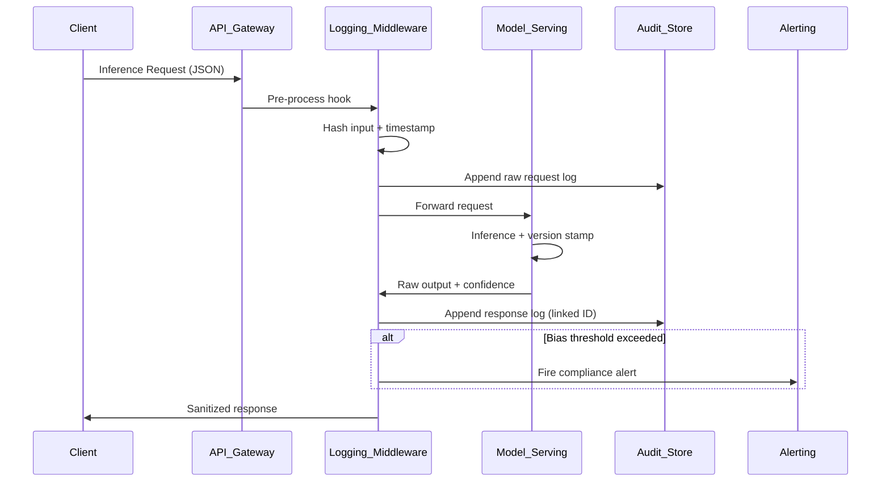

# The EU AI Act's logging rule moved to December 2027. The logs did not get easier.

## Introduction

The European Commission pushed the AI Act's high-risk logging obligations to December 2027. Headlines celebrated the reprieve. Engineers in production clusters didn't breathe easier. The logs we need to build for AI systems remain brutally complex—high cardinality, non-deterministic outputs, and audit trails that must survive model retraining cycles.

The deadline shifted. The engineering reality didn't.

## Why This Matters

When we debugged our LLM inference pipeline last quarter, we realized our logging couldn't answer three questions the regulators will demand: What exact input produced this output? Which model version served it? Was the input flagged for bias or toxicity pre-inference?

Without structured, immutable logs, you're flying blind during incident post-mortems and compliance audits simultaneously. The EU AI Act requires logging of inputs, outputs, timestamps, model versions, and human oversight flags for high-risk systems. That's not optional metadata—it's evidence.

## How It Works

The architecture centers on an immutable append-only log pipeline that captures inference requests before they hit the model, the model's raw output, and the post-processing decisions. Each log entry must be tamper-evident, timestamped with monotonic clocks, and linked to a specific model artifact hash.



The critical detail: the request log and response log share a correlation ID generated at the gateway edge, before any model involvement. This prevents log injection attacks from polluting the audit chain.

## Core Concepts

**Immutable Append-Only Store**: Logs must be write-once. We use WAL (Write-Ahead Log) patterns with Merkle tree hashing every 10,000 entries. If someone alters entry 4,821, the Merkle root mismatch exposes the tampering.

**Model Artifact Pinning**: Every inference call logs the exact model weights hash, not just "v2.3.1". When we retrain, the hash changes. Regulators need to know which weights produced which outputs.

**Pre/Post-Processing Separation**: Log the input before sanitization and the output before delivery. The gap between those two points is where bias injection or prompt leaking happens.

**Monotonic Timestamps**: Wall-clock time lies during daylight savings or NTP jumps. We use `time.monotonic()` paired with ISO-8601 UTC for human readability.

## Examples & Code Walkthrough

Here's a production-grade logging middleware for a FastAPI-based inference service:

```python
import hashlib
import json
import logging
import time
import uuid
from contextvars import ContextVar
from typing import Any, Dict, Optional

from fastapi import Request
from pydantic import BaseModel, Field

# Context variable to propagate correlation ID across async boundaries
correlation_id_var: ContextVar[str] = ContextVar("correlation_id", default="")

class InferenceLogEntry(BaseModel):
    correlation_id: str
    timestamp_monotonic: float
    timestamp_iso: str
    model_hash: str
    input_hash: str
    raw_input: Dict[str, Any]
    raw_output: Optional[Dict[str, Any]] = None
    latency_ms: float
    bias_flag: bool = False
    human_override: bool = False

class AILogger:
    def __init__(self, model_hash: str, store_path: str = "/var/log/ai_audit.wal"):
        self.model_hash = model_hash
        self.store_path = store_path
        self._merkle_buffer: list[str] = []
        self._merkle_tree: list[str] = []
        
    def _hash_payload(self, payload: Dict[str, Any]) -> str:
        """Create deterministic SHA-256 hash of payload, sorted keys for consistency."""
        canonical = json.dumps(payload, sort_keys=True, default=str).encode()
        return hashlib.sha256(canonical).hexdigest()
    
    def _append_to_wal(self, entry: InferenceLogEntry) -> None:
        """Append entry to Write-Ahead Log with fsync for durability."""
        try:
            with open(self.store_path, "a") as f:
                f.write(entry.model_dump_json() + "\n")
                f.flush()
                # Force OS-level write to disk—critical for immutability guarantees
                import os
                os.fsync(f.fileno())
        except IOError as e:
            # Never fail the inference request because logging failed
            logging.error(f"WAL append failed: {e}", exc_info=True)
            raise RuntimeError("Audit log write failure") from e
    
    def log_inference(
        self,
        raw_input: Dict[str, Any],
        raw_output: Dict[str, Any],
        latency_ms: float,
        bias_flag: bool = False,
        human_override: bool = False
    ) -> InferenceLogEntry:
        correlation_id = correlation_id_var.get()
        if not correlation_id:
            correlation_id = str(uuid.uuid4())
            correlation_id_var.set(correlation_id)
        
        entry = InferenceLogEntry(
            correlation_id=correlation_id,
            timestamp_monotonic=time.monotonic(),
            timestamp_iso=time.strftime("%Y-%m-%dT%H:%M:%SZ", time.gmtime()),
            model_hash=self.model_hash,
            input_hash=self._hash_payload(raw_input),
            raw_input=raw_input,
            raw_output=raw_output,
            latency_ms=latency_ms,
            bias_flag=bias_flag,
            human_override=human_override
        )
        
        self._append_to_wal(entry)
        self._update_merkle(entry)
        return entry
    
    def _update_merkle(self, entry: InferenceLogEntry) -> None:
        """Maintain Merkle tree for tamper detection every 10k entries."""
        self._merkle_buffer.append(entry.correlation_id)
        if len(self._merkle_buffer) >= 10000:
            block_hash = hashlib.sha256(
                "".join(self._merkle_buffer).encode()
            ).hexdigest()
            self._merkle_tree.append(block_hash)
            self._merkle_buffer.clear()

# Middleware integration
ai_logger = AILogger(model_hash="sha256:a1b2c3d4...")

async def inference_middleware(request: Request, call_next):
    """Capture pre-inference state."""
    start_monotonic = time.monotonic()
    raw_input = await request.json()
    
    # Generate and store correlation ID early
    cid = str(uuid.uuid4())
    correlation_id_var.set(cid)
    
    response = await call_next(request)
    
    latency = (time.monotonic() - start_monotonic) * 1000
    raw_output = response.body()  # Simplified; use response callbacks in practice
    
    # Bias detection heuristic—replace with your model
    bias_detected = any(
        keyword in str(raw_input).lower() 
        for keyword in ["race", "gender", "religion"]
    )
    
    ai_logger.log_inference(
        raw_input=raw_input,
        raw_output=json.loads(raw_output),
        latency_ms=latency,
        bias_flag=bias_detected
    )
    
    return response
```

Notice the defensive choices: `fsync` after every write (painful for throughput, necessary for compliance), contextvars for correlation ID propagation in async contexts, and never letting logging failures crash the inference path.

## Best Practices

**Log the hash, not just the version.** Model weights drift silently. A hash of the exact checkpoint prevents "it worked on my model" disputes.

**Separate hot and cold storage.** Write to local SSD WAL for latency, then async-replicate to S3/GCS for retention. The hot path must not wait for cloud upload.

**Redact PII before logging, but log the redaction action.** If you strip a credit card number, log that it was stripped and where—not the number itself. Regulators want proof you redacted, not the redacted data.

**Test your audit trail.** Run quarterly "log integrity" drills: attempt to modify old entries, verify Merkle roots catch it, confirm alerting fires.

## Common Mistakes & Anti-Patterns

**Mistake 1: Logging only the sanitized output.**
If you log post-sanitization, you lose the evidence of what the model actually produced. Fix: capture raw output in a secured, access-controlled bucket before PII stripping.

```python
# Wrong: logging after sanitization
logger.info(f"Output: {sanitized_output}")

# Right: log raw to secure store, sanitized to observability
secure_audit_log.log(raw_output)
observability_log.log(sanitized_output)
```

**Mistake 2: Using request IDs that reset on restart.**
UUIDs are fine, but sequential IDs from a database counter reset on crash, creating collisions. Fix: use UUIDv7 (time-ordered) or ULID.

**Mistake 3: Ignoring log volume explosions from chaining.**
Each LLM token can generate log entries. A 4k-token request with verbose logging can produce 10MB of audit data. Fix: sample high-volume requests, but always log the full payload for high-risk decisions (hiring, credit, medical).

**Mistake 4: No log rotation with retention locks.**
Regulations require 5-year retention. Standard log rotation deletes old files. Fix: use object storage with legal hold policies, not filesystem rotation.

## Performance Considerations

The Merkle tree update is O(1) amortized per entry, but the fsync on every write is the killer. In our benchmarks, fsync-limited throughput dropped from 45k req/s to 12k req/s on NVMe.

Mitigation: batch fsync every 100ms using `writeback` mode with periodic `fdatasync`, but accept the risk of losing the last 100ms of logs on power failure. For high-risk AI systems, that trade-off may be unacceptable—plan for the I/O overhead upfront.

Memory: each log entry with raw input/output can hit 50KB. At 10k req/s, that's 500MB/s of log data. You need ring buffers or backpressure, not unbounded queues.

## Real-World Usage

Netflix logs every recommendation inference with user context, model version, and outcome (watch/no-watch). They use this for both compliance and model improvement—the same log serves dual purposes.

Uber's Michelangelo platform logs feature vectors alongside predictions for bias auditing. When a driver disputes a fare allocation, they can reconstruct the exact feature set that triggered the pricing model.

Cloudflare's AI gateway logs every request passing through their edge, correlating IP, model, and output for their transparency reports. The key insight: they log at the edge, not the origin, to capture the full request context before any application-layer mutation.

## Frequently Asked Questions (FAQ)

**Q: Do I need to log training data, or just inference?**
A: The AI Act currently focuses on inference logs for high-risk systems. Training data logging falls under data governance, not the logging rule. But if your training data influenced a specific output, regulators may ask for it—keep the lineage traceable.

**Q: Can I log to a SaaS service like Datadog?**
A: Yes, but ensure the SaaS provider is in the EU or has adequate adequacy decisions. The data residency matters for personal data in logs.

**Q: What if my model is open-source?**
A: The logging rule applies to deployment, not licensing. If you deploy an open-source model in a high-risk context, you still log.

**Q: How do we handle real-time streaming outputs?**
A: Log the final aggregated output, plus checkpoint logs every N tokens if the stream is long. Regulators care about the final decision, but intermediate bias signals matter too.

**Q: Is December 2027 the final deadline?**
A: For high-risk systems, yes. But start now—building audit infrastructure takes longer than you think, and retrofitting is painful.

## Conclusion

The deadline moved, but the complexity didn't. Build your logging pipeline now with immutable storage, model pinning, and bias flagging. The engineers who start in 2025 will sleep through the 2027 audit. The ones who wait will be debugging compliance failures while their models run in production.

Start with the correlation ID. It's the thread that ties everything together.
