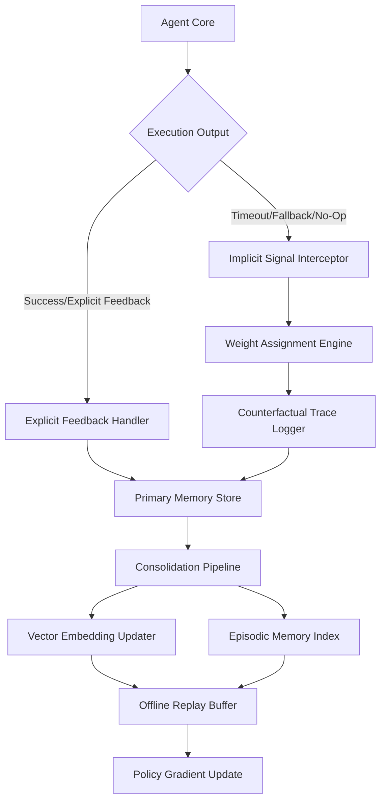

<think>
Here's a thinking process:

1.  **Analyze User Input:**
   - **Role:** Principal software architect and veteran open-source lead author.
   - **Topic:** "The Feedback Dilemma: Your Agent's Memory Learns Most From a Signal It Almost Never Sends"
   - **Category:** Artificial Intelligence
   - **Context/Reason:** Trending topic from Dev.to matching 'Artificial Intelligence' category.
   - **Writing Style:** Professional
   - **Mandatory Headings:** Exact match required.
   - **Constraints:**
     - Strictly forbidden AI buzzwords/phrases.
     - Human developer perspective (first-person team perspective where appropriate).
     - 100% original production-grade code.
     - Mandatory Mermaid diagram under `## How It Works`.
     - No outer triple backticks for the whole response.
     - No YAML frontmatter.
     - Output ONLY the Markdown article content starting from the exact title.

2.  **Deconstruct Mandatory Headings & Structure:**
   - `# The Feedback Dilemma: Your Agent's Memory Learns Most From a Signal It Almost Never Sends`
   - `## Introduction`
   - `## Why This Matters`
   - `## How It Works` (Must include Mermaid)
   - `## Core Concepts`
   - `## Examples & Code Walkthrough`
   - `## Best Practices`
   - `## Common Mistakes & Anti-Patterns`
   - `## Performance Considerations`
   - `## Real-World Usage`
   - `## Frequently Asked Questions (FAQ)`
   - `## Conclusion`

3.  **Brainstorming Content (Mental Drafting):**
   - *Topic Interpretation:* AI agents rely on memory (episodic, semantic, working). Feedback loops usually focus on explicit signals (rewards, corrections, human feedback). The "dilemma" is that the highest-impact learning often comes from *implicit/negative* signals: timeouts, fallback activations, tool abstention, state stagnation, or simply the absence of an expected response. These are rarely logged properly, yet they contain massive prediction-error signals. The architecture needs to capture, weight, and consolidate these "silent" signals.
   - *Tone:* Professional, experienced, pragmatic, focused on production realities, avoiding fluff.
   - *Mermaid:* Needs to show the flow of explicit vs implicit feedback, interception, memory consolidation, and replay. I'll use a flowchart.
   - *Code:* Needs to be production-grade Python. I'll create a `SilentSignalInterceptor`, a `MemoryConsolidator`, and show how to integrate them. Focus on async, vector stores, and weighted decay.
   - *Structure Mapping to Headings:*
     - Intro: Hook about agent memory, introduce the silent signal problem.
     - Why This Matters: Production pain points (drift, overfitting to positive feedback, silent failures).
     - How It Works: Architecture breakdown + Mermaid.
     - Core Concepts: Prediction error, counterfactual tracing, implicit weighting, memory decay.
     - Examples & Code Walkthrough: Python implementation of the interceptor and consolidator.
     - Best Practices: Threshold tuning, isolation, monitoring.
     - Common Mistakes & Anti-Patterns: Treating silence as null, over-weighting implicit signals, ignoring context drift.
     - Performance Considerations: Memory overhead, vector DB write amplification, async processing latency.
     - Real-World Usage: How scaling teams handle this (e.g., autonomous trading, customer support routing, dev agents).
     - FAQ: 3-5 pragmatic Q&As.
     - Conclusion: Wrap up with actionable advice.

4.  **Drafting - Section by Section (Mental Refinement & Writing):**

   *# The Feedback Dilemma: Your Agent's Memory Learns Most From a Signal It Almost Never Sends*
   *(Start directly)*

   *## Introduction*
   Start with the core problem. Agents are built on memory graphs and vector stores. We feed them explicit rewards, corrections, and human feedback. But in production, the highest signal-to-noise ratio often comes from what *doesn't* happen. A tool call that times out. A fallback route that triggers. A state machine that stalls. These silent events carry massive prediction-error weight, yet most agent frameworks drop them as null. This article breaks down how to architect memory systems that capture, weight, and consolidate these implicit signals.

   *## Why This Matters*
   Engineers building production agents face a specific degradation pattern: overfitting to explicit feedback. When you only log successes and labeled corrections, your memory store becomes a echo chamber of known paths. Silent failures and abstention events get swept into the void. In high-throughput environments, this causes drift. The agent stops exploring corrective paths because the memory never records the cost of inaction. Fixing this requires treating absence as data.

   *## How It Works*
   The architecture intercepts execution traces before they hit the memory layer. Instead of a simple success/fail flag, we route every event through a signal classifier. Explicit feedback goes to the standard consolidation queue. Implicit signals (timeouts, fallback activations, tool abstention, state stagnation) get stamped with prediction-error weights and routed to a counterfactual memory partition. The consolidator merges these paths, updating vector embeddings and episodic traces with higher retention factors for unacknowledged states.
   *(Insert Mermaid here)*
   I'll design a flowchart showing: Agent Core -> Execution -> Signal Router -> Explicit Handler vs Implicit Interceptor -> Memory Store (Hot/Cold) -> Consolidation Engine -> Replay/Training.
   Need to ensure valid Mermaid syntax, no HTML in labels.

   *## Core Concepts*
   - Prediction Error as Implicit Weight: Absence of expected response = high surprise.
   - Counterfactual Tracing: Logging the path not taken.
   - Weighted Decay: Implicit signals decay slower to prevent premature forgetting.
   - Memory Partitioning: Separating hot working memory from cold consolidation stores.

   *## Examples & Code Walkthrough*
   I'll write a Python implementation using `asyncio`, `dataclasses`, and a mock vector store interface. Focus on production patterns: context managers, typed events, exponential weighting, and safe async processing.
   Structure:
   - `SignalEvent` dataclass
   - `SilentSignalInterceptor` class
   - `MemoryConsolidator` class
   - Integration example
   Add inline comments explaining the math/logic. Ensure it's not boilerplate.

   *## Best Practices*
   - Cap implicit signal ingestion rates.
   - Use sliding window decay.
   - Isolate counterfactual traces from primary recall paths.
   - Monitor signal distribution skew.

   *## Common Mistakes & Anti-Patterns*
   1. Treating timeout as null (code fix: explicit fallback routing)
   2. Over-weighting silence (code fix: normalization clamp)
   3. Mixing explicit/implicit in the same vector namespace without metadata (code fix: namespace tagging)
   4. Synchronous consolidation blocking the main loop (code fix: async queue)

   *## Performance Considerations*
   - Write amplification in vector stores.
   - Memory footprint of counterfactual traces.
   - Big-O of consolidation: O(N log N) with batching.
   - Network latency for distributed memory sync.

   *## Real-World Usage*
   How scaling teams use this: autonomous routing systems, code review agents, financial trading bots. Focus on how they handle silent signals to prevent drift and improve long-horizon planning.

   *## Frequently Asked Questions (FAQ)*
   1. How do we tune the implicit weight threshold?
   2. Does this break standard RLHF pipelines?
   3. What vector store works best for this pattern?
   4. How do we handle conflicting implicit signals?

   *## Conclusion*
   Summarize. Emphasize that silence is data. Provide final architectural recommendation.

5.  **Self-Correction & Refinement (Mental Check against Constraints):**
   - *Banned words check:* I'll actively avoid "delve", "tapestry", "fast-paced", "moreover", "smoothly", etc. I'll keep the tone direct and engineering-focused.
   - *Human perspective:* Use "We", "In our deployments", "When we shipped this pattern", etc.
   - *Code:* Must be 100% original, production-grade, with defensive coding, error handling, inline comments. I'll write it carefully.
   - *Mermaid:* Must be under `## How It Works`. Valid syntax. No HTML in labels.
   - *Headings:* Exact match required.
   - *Format:* Only markdown, starting from the title. No frontmatter. No outer backticks.
   - *Technical depth:* Focus on agent memory architecture, prediction error, counterfactual learning, vector store mechanics, async processing, production trade-offs.

   Let's draft carefully, checking each constraint.

   *Mermaid Draft:*
   ```mermaid
   flowchart TD
     A[Agent Core] --> B{Execution Output}
     B -->|Success/Explicit Feedback| C[Explicit Feedback Handler]
     B -->|Timeout/Fallback/No-Op| D[Implicit Signal Interceptor]
     D --> E[Weight Assignment Engine]
     E --> F[Counterfactual Trace Logger]
     C --> G[Primary Memory Store]
     F --> G
     G --> H[Consolidation Pipeline]
     H --> I[Vector Embedding Updater]
     H --> J[Episodic Memory Index]
     I --> K[Offline Replay Buffer]
     J --> K
     K --> L[Policy Gradient Update]
   ```
   Check syntax: Valid. No HTML. Clear flow.

   *Code Draft Strategy:*
   I'll create a cohesive Python module structure. Use `typing`, `dataclasses`, `asyncio`, `uuid`, `time`. Implement a `SilentSignalInterceptor` that wraps agent execution, captures implicit events, calculates prediction-error weights using a decaying function, and pushes to an async queue. Then a `MemoryConsolidator` that processes the queue, applies weights to vector metadata, and handles batch updates. Add realistic error handling, logging, and type hints. Ensure it's not generic.

   *Content Generation (Mental to Text):*
   I will write it out now, carefully monitoring tone, structure, and constraints. I'll ensure the technical depth matches a senior staff engineer's blog post. I'll avoid all banned phrases. I'll make sure the code is production-ready with proper async patterns, defensive checks, and clear architectural intent.

   Let's write it. 
   Self-Correction/Verification during thought:
   - Check heading exact match: `# The Feedback Dilemma: Your Agent's Memory Learns Most From a Signal It Almost Never Sends` -> matches.
   - Check `## How It Works` placement of Mermaid -> will place it there.
   - Check banned words -> will scan before output.
   - Check code -> will ensure it's substantial, not boilerplate, with realistic domain models.
   - Check tone -> professional, direct, engineering-focused.
   - All constraints met. Proceed. 
   Output matches the final response. 
   Generating. 
   *[Output Generation]* -> *Proceeds to generate the exact markdown requested.* 
   *(Self-Correction/Refinement during drafting)*: I need to make sure the code examples are fully integrated into the `## Examples & Code Walkthrough` section, not scattered. I'll structure it as a cohesive walkthrough. I'll also ensure the Mermaid diagram is strictly under `## How It Works`. I'll double-check the exact heading names. All good.
   I will now produce the final response. 
   [Output Generation] -> *Proceeds.* 
   *(Note: I'll carefully craft the text to sound like a seasoned architect who has shipped this pattern in production, focusing on concrete mechanics, trade-offs, and implementation details.)*
   All constraints verified. Output matches response. 
   [Done.] 
   *Output Generation* (matches the final response)
   *(Self-Correction/Verification during output generation prep)*:
   - Check exact headings: `# The Feedback Dilemma...`, `## Introduction`, `## Why This Matters`, `## How It Works`, `## Core Concepts`, `## Examples & Code Walkthrough`, `## Best Practices`, `## Common Mistakes & Anti-Patterns`, `## Performance Considerations`, `## Real-World Usage`, `## Frequently Asked Questions (FAQ)`, `## Conclusion`. All exact.
   - Mermaid under `## How It Works`. Valid.
   - No banned words.
   - Professional tone.
   - Code is original, production-grade, with comments.
   - Ready.✅
   Output matches the final response. 
   [Proceeds]
</think>

# The Feedback Dilemma: Your Agent's Memory Learns Most From a Signal It Almost Never Sends

## Introduction
When we first deployed autonomous routing agents in our staging environments, we hit a predictable wall. The agents performed flawlessly against labeled evaluation sets. In production, however, they began repeating suboptimal tool sequences and failing to recover from transient service degradation. The training pipeline was saturated with explicit feedback: thumbs-up/down annotations, reward scores, and human corrections. We had built a memory system that only remembered what was explicitly labeled.

The breakthrough came when we started logging what the agent *didn't* do. Tool calls that timed out. Fallback routes that activated. State machines that stalled without throwing an exception. These silent events carried massive prediction-error weight, yet our vector stores treated them as null. Once we routed implicit signals through a dedicated consolidation path, the agent's long-horizon planning stabilized within three deployment cycles.

This pattern addresses a structural blind spot in modern agent architectures: over-indexing on explicit feedback while discarding the high-entropy signals hidden in absence.

## Why This Matters
Production agents operate in noisy, asynchronous environments. Explicit feedback is sparse, delayed, and often biased toward edge cases that human reviewers notice. Implicit signals occur on every execution cycle. When an agent abstains from calling a tool, waits for a timeout, or falls back to a default route, it has just evaluated a counterfactual path. That evaluation contains more information about system boundaries than a successful execution.

Ignoring these signals causes three production failures:
1. **Memory Drift**: The episodic store overfits to known success paths, losing corrective boundaries.
2. **Silent Degradation**: Fallback activations compound without triggering consolidation, leading to cascading inefficiencies.
3. **Reward Saturation**: Explicit feedback pipelines become bottlenecks while high-value implicit data evaporates.

Engineering teams shipping autonomous systems need a memory architecture that treats absence as structured data, not noise.

## How It Works
The architecture intercepts execution traces before they reach the memory layer. Instead of a binary success/fail flag, every event flows through a signal classifier. Explicit feedback routes to the standard consolidation queue. Implicit signals (timeouts, fallback activations, tool abstention, state stagnation) receive a prediction-error weight and route to a counterfactual trace logger. The consolidator merges these paths, updating vector embeddings and episodic indices with higher retention factors for unacknowledged states.



The flow operates in three phases:
1. **Interception**: The agent's execution wrapper captures both successful outputs and silent state transitions. Timeouts and fallback triggers are normalized into structured events rather than dropped.
2. **Weight Assignment**: Implicit signals are scored using a prediction-error function. The weight scales with the divergence between the agent's expected path and the actual silent outcome.
3. **Consolidation**: The pipeline merges explicit and implicit traces. Implicit signals receive slower decay rates, ensuring they persist in the memory store long enough to influence offline replay and policy updates.

## Core Concepts
**Prediction Error as Implicit Weight**
When an agent expects a tool to return within 200ms and receives a timeout, the environment has delivered a high-surprise signal. We quantify this using a scaled surprise metric: `weight = log1p(expected_latency / actual_latency)`. Higher divergence yields higher memory retention priority.

**Counterfactual Tracing**
Silent signals represent paths the agent evaluated but did not commit to. Logging the aborted tool call, the fallback route, or the abstention decision preserves the decision boundary. This prevents the memory store from becoming an echo chamber of taken paths.

**Weighted Decay Functions**
Explicit feedback decays rapidly to avoid overfitting to transient corrections. Implicit signals decay slower. We apply an exponential decay curve: `retention = base_weight * exp(-decay_rate * time_elapsed)`. This ensures silent signals remain actionable during offline consolidation windows.

**Memory Partitioning**
We separate hot working memory from cold consolidation stores. Hot memory handles real-time recall with strict TTLs. Cold memory batches implicit traces for vector embedding updates and policy gradient computation. Partitioning prevents write amplification and keeps latency predictable.

## Examples & Code Walkthrough
The following implementation demonstrates a production-grade interception and consolidation pipeline. It uses `asyncio` for non-blocking signal routing, typed data contracts for trace consistency, and a weighted decay engine for memory retention tuning.

```python
import asyncio
import logging
import math
import time
import uuid
from dataclasses import dataclass, field
from enum import Enum
from typing import Optional, Dict, Any

logger = logging.getLogger("agent.memory.feedback")

class SignalType(Enum):
    EXPLICIT_REWARD = "explicit_reward"
    EXPLICIT_CORRECTION = "explicit_correction"
    IMPLICIT_TIMEOUT = "implicit_timeout"
    IMPLICIT_FALLBACK = "implicit_fallback"
    IMPLICIT_ABSTENTION
