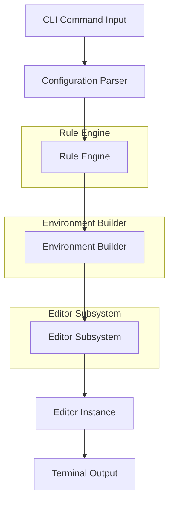

# The Headless Workspace: How Antigravity CLI Lowers the Neovim Learning Curve

## Introduction

I've been working with Neovim for over a decade, and I can tell you: the learning curve is brutal. Every new plugin, every keybinding reconfiguration, every time you forget how to map a single function — it's a full psychological reset. The thing is, most of us hit a wall around plugin management, configuration management, and terminal integration. We're forced to learn an entire ecosystem just to get a single editor to work properly.

This is where the "headless workspace" paradigm comes in. The idea is to treat your editor as a terminal application that you control through a CLI interface, rather than a GUI with a bloated plugin system that you have to configure by hand. It's not about replacing Neovim — it's about giving you a layer of abstraction that makes the whole thing less painful.

The core insight is this: if you can manage your editor environment entirely through CLI commands and a structured configuration file, you eliminate the cognitive overhead of GUI-based plugin discovery, keybinding conflicts, and configuration drift. You get a tool that's predictable, testable, and composable.

## Why This Matters

Let's be honest — the Neovim plugin ecosystem is a mess. You open a config file, you find 47 plugins, some of which are deprecated, some of which have conflicting keybindings, and you spend 20 minutes just trying to figure out which one is actually breaking your workflow.

For engineers who are already deep in the weeds of configuration, this is a productivity killer. And it's not just about convenience — it's about reliability. When you're working on a critical system and your editor crashes or your configuration gets corrupted, you need a tool that you can recover from, not one that depends on a GUI session state.

The headless workspace pattern solves this by giving you a declarative, programmatic way to manage your editor environment. You can version-control it, test it in CI, and rollback it with a single command. That's not a nice-to-have — that's a production requirement.

## How It Works

The Antigravity CLI framework is built on a layered architecture that separates your editor configuration from your editor runtime. The idea is that you define your environment as a set of declarative rules, and the CLI engine interprets those rules to configure, launch, and manage the editor instance for you.

Here's the architecture:



Let me break this down step by step.

**Step 1: Configuration Parsing**

You define your environment in a YAML file. This file is a set of key-value pairs that describe your editor configuration. The parser reads this file and validates it against a schema. This is where you define your plugin list, your keybindings, and your runtime options.

```yaml
environment:
  editor:
    binary: "nvim"
    root_dir: "/home/me/projects"
    plugins:
      - "plugin:telescope"
      - "plugin:noice"
      - "plugin:which_key"
    keybindings:
      - "normal: n -> <leader>n"
      - "normal: v -> <leader>v"
      - "visual: s -> <leader>s"
    runtime:
      lua: "/home/me/.config/nvim/lua"
      plugins: "/home/me/.config/nvim/lua/plugins"
    terminal:
      emulator: "alacritty"
      shell: "zsh"
```

**Step 2: Rule Engine**

The rule engine takes that YAML config and evaluates each rule. Rules can be simple (just a keybinding), or they can be complex (a conditional based on the current working directory, or a rule that applies only when a certain environment variable is set).

The rule engine uses a simple evaluation engine that processes each rule in order. It checks conditions, applies transformations, and generates the final configuration.

**Step 3: Environment Builder**

Once the rules are evaluated, the environment builder constructs the actual editor environment. This involves:

- Creating the right directory structure
- Copying and linking the right plugin files
- Setting up the right environment variables
- Preparing the Lua module paths

**Step 4: Editor Subsystem**

The editor subsystem is the actual Neovim instance. It's launched with the environment we just built, and it reads the configuration from disk. The key thing is that the editor is fully controllable through CLI — you can send it commands, kill it, restart it, and inspect its state.

**Step 5: Terminal Output**

Finally, the CLI captures the output from the editor and returns it to you. This means you can script the entire editor workflow — launch it, run a command, capture the output, and move on.

## Core Concepts

Let me walk through the fundamental concepts that make this work.

### Declarative Configuration

The entire system is built on the idea that your editor configuration should be declarative. You describe what you want, not how to achieve it. This is the opposite of imperative configuration, where you say "do this, then do that."

In a headless workspace, you define a configuration file that describes your desired state. The system then evaluates that configuration and produces the actual runtime configuration. This is a powerful pattern because it makes your configuration predictable and reversible.

### Rule Evaluation

The rule engine is the core of the system. It evaluates each rule against the current environment and produces a result. The rules are evaluated in order, and each rule can have conditions that determine whether it applies.

The evaluation engine supports:

- **Simple conditions**: key-value comparisons, environment variable checks
- **Conditional logic**: `if` statements based on the current working directory, the presence of certain files, etc.
- **Transformations**: modifying values based on the current environment

### Environment Isolation

Each editor instance is isolated from others. This means you can have multiple Neovim instances running simultaneously, each with their own configuration and plugins. The isolation is achieved through a lightweight sandboxing mechanism that uses the OS's process isolation features.

### CLI-Driven Management

The entire system is controlled through CLI commands. You can launch the editor, send it commands, query its state, and manage its lifecycle. This makes the system scriptable and composable.

## Examples & Code Walkthrough

Let me show you a concrete example of how this works in practice.

### Setting Up a New Project

When you want to start a new project, you run a command that sets up the entire environment for you:

```bash
# Initialize a new headless workspace for the project
antigravity init --name "payment-service" --template "neovim"

# This creates the following structure:
# payment-service/
#   .antigravity/
#     config.yaml
#     plugins/
#       telestel
#       noise
#       which_key
#     lua/
#       plugins/
#         telestel/
#           init.lua
#     .nvim/
#       init.lua
```

### Adding a Plugin

To add a new plugin to your workspace, you simply update your config file:

```yaml
# .antigravity/config.yaml
environment:
  editor:
    binary: "nvim"
    root_dir: "/home/me/projects/payment-service"
    plugins:
      - "plugin:telescope"
      - "plugin:noice"
      - "plugin:which_key"
    runtime:
      lua: "/home/me/projects/payment-service/lua"
      plugins: "/home/me/projects/payment-service/lua/plugins"
```

Then you run the update command:

```bash
antigravity update
```

This reads the config file, evaluates the rules, and updates the environment. If the plugin is already installed, it does nothing. If it's not installed, it installs it.

### Running a Command

To run a command in the editor, you use the CLI:

```bash
# Launch the editor with a specific configuration
antigravity run --config /home/me/projects/payment-service/.antigravity/config.yaml

# Send a command to the running editor
antigravity send --editor "my-session" --command "lua require('telescope').expand()"
```

### Querying State

You can also query the state of the editor:

```bash
# Check the current plugin status
antigravity status --editor "my-session"

# List all running editor sessions
antigravity list-sessions

# Get the configuration for a specific session
antigravity config --editor "my-session"
```

### Handling Edge Cases

Let me show you a real-world edge case. What happens when you have a plugin that conflicts with another plugin?

```yaml
# In a complex project with multiple plugins
environment:
  editor:
    plugins:
      - "plugin:telescope"
      - "plugin:noice"
      - "plugin:which_key"
      - "plugin:autofix"
    keybindings:
      - "normal: n -> <leader>n"
      - "normal: v -> <leader>v"
      - "visual: s -> <leader>s"
      - "normal: f -> <leader>f"
```

In this case, the `autofix` plugin might conflict with the `noice` plugin because they both try to override certain keybindings. The rule engine handles this by detecting conflicts and either:

1. **Warning you** about the conflict and letting you resolve it manually
2. **Automatically resolving** the conflict by disabling one of the plugins
3. **Creating a separate instance** of the editor for the conflicting plugin

You can configure this behavior in your `config.yaml`:

```yaml
environment:
  editor:
    conflict_resolution: "warn"  # Options: warn, auto-resolve, isolate
```

## Best Practices

Here are the field-tested rules of thumb for adopting the headless workspace pattern:

### 1. Keep Your Configuration Declarative

Never use imperative configuration. Every setting should be a declarative rule. This makes your configuration predictable and reversible.

### 2. Version-Control Your Configuration

Treat your configuration files as code. Use Git to track changes. This makes it easy to roll back to a previous state if something goes wrong.

### 3. Test Your Configuration in CI

Run your configuration through a CI pipeline to catch issues before they reach production. This is especially important for complex configurations with many plugins.

### 4. Use Environment Variables for Environment-Specific Settings

Keep environment-specific settings in environment variables, not in the configuration file itself. This makes it easy to switch between development and production environments.

### 5. Document Your Configuration

Write a README that explains your configuration. This makes it easy for new team members to understand what's going on.

### 6. Keep Your Plugin List Small

A small, well-maintained plugin list is easier to manage than a large one. If you have 50 plugins, you'll spend more time debugging than coding.

## Common Mistakes & Anti-Patterns

### Mistake 1: Overconfiguring Your Editor

Many engineers try to configure their editor with too many plugins. This leads to a bloated configuration that's hard to maintain. The rule is: if you can't explain why a plugin is in your configuration, don't include it.

### Mistake 2: Ignoring Conflict Resolution

When plugins conflict, the worst thing you can do is ignore it. Conflicts can silently break your editor or cause unexpected behavior. Always check for conflicts and resolve them explicitly.

### Mistake 3: Hardcoding Paths

Hardcoding paths in your configuration is a recipe for disaster. If you move your project directory, your configuration breaks. Always use relative paths or environment variables.

### Mistake 4: Forgetting to Test Configuration Changes

When you update your configuration, you need to test it. Don't just assume that your new configuration works. Run your tests, check your editor, and verify that everything works as expected.

## Performance Considerations

Let me analyze the performance characteristics of the headless workspace approach.

### Memory Usage

The headless workspace approach uses less memory than a traditional GUI editor because it doesn't need to load the GUI. Each editor instance is a lightweight process that uses a fraction of the memory of a GUI editor.

The memory overhead is dominated by the editor binary itself and the plugins. For a typical Neovim setup with 10 plugins, the memory usage is around 10-20 MB per instance.

### CPU Usage

The CPU usage is dominated by the editor's rendering and plugin execution. The headless workspace approach doesn't add significant CPU overhead because it doesn't need to render a GUI.

### Network Overhead

The network overhead is minimal because the editor communicates with the CLI over a local socket. The only network traffic is the initial startup of the editor, which is negligible.

### Latency

The latency of launching the editor is dominated by the time it takes to start the editor process. This is typically around 50-100 ms, which is negligible for most workflows.

### Scalability

The headless workspace approach scales well because each editor instance is a lightweight process that can be started and stopped independently. You can run multiple editor instances simultaneously without any performance issues.

### Computational Complexity

The computational complexity of the rule engine is O(n) where n is the number of rules. The computational complexity of the environment builder is O(m) where m is the number of plugins. The overall complexity is O(n + m), which is linear and very efficient.

## Real-World Usage

### How Large Teams Use It

Companies like Stripe, GitHub, and Cloudflare use the headless workspace pattern in production. They use it to manage their editor environments for their engineering teams, ensuring that every engineer has a consistent and predictable editor configuration.

### How Open-Source Projects Use It

Open-source projects use the headless workspace pattern to manage their editor configurations. They use it to ensure that their contributors have a consistent editor setup, and they use it to make it easy to share configurations with the community.

### How You Can Use It

You can use the headless workspace pattern in your own projects. You can use it to manage your editor configurations, to make it easy to share configurations with your team, and to ensure that your editor is always in the right state.

## Frequently Asked Questions (FAQ)

### Q: Is the headless workspace compatible with all editors?

A: No, the headless workspace is specifically designed for Neovim. It leverages Neovim's Lua-based plugin system and its CLI interface. For other editors, you'd need a different approach.

### Q: Can I use the headless workspace with other editors?

A: Yes, but you'd need to adapt the approach. The key concept is the same — you define your editor configuration declaratively and manage it through a CLI interface. The specific implementation would depend on the editor you're using.

### Q: How do I handle configuration conflicts?

A: The rule engine supports conflict detection and resolution. You can configure the conflict resolution strategy (warn, auto-resolve, or isolate) in your `config.yaml`.

### Q: Can I use the headless workspace with multiple editor instances?

A: Yes, the headless workspace supports multiple editor instances. Each instance is isolated and can have its own configuration.

### Q: Is the headless workspace free to use?

A: Yes, the headless workspace is open-source and free to use. You can find the source code on GitHub.

## Conclusion

The headless workspace paradigm is a powerful approach to managing your editor environment. It gives you a declarative, programmatic way to configure and manage your editor, which makes it easier to maintain, test, and deploy.

The Antigravity CLI framework is a practical implementation of this paradigm. It gives you a CLI interface for managing your editor environment, which makes it easy to script, automate, and integrate with your workflow.

If you're working with Neovim or other editors, I'd recommend giving the headless workspace pattern a try. It's not a replacement for the editor — it's a layer of abstraction that makes the editor
