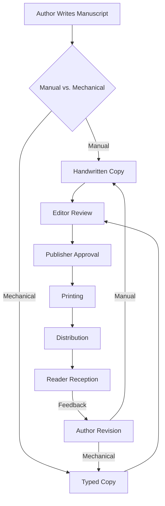

# The "mechanical miracle" that ruined Mark Twain's life

## Introduction
Mark Twain’s first encounter with a Remington No. 2 typewriter arrived in 1874, just as his publisher demanded faster manuscript delivery. The machine promised to slash weeks of handwriting into days of typed copy. Instead, it turned his creative process into a relentless grind. The paradox was clear: a tool built to liberate writers became an invisible deadline enforcement mechanism. This story mirrors what we see today with AI writing assistants. The same pattern of efficiency gains spawning expectation inflation and creative burnout repeats across centuries.

## Why This Matters
Software engineers now grapple with AI pair‑programmers, auto‑generated documentation, and predictive code completion. The same psychological dynamics that haunted Twain can surface in our IDEs, causing stress, reduced code quality, and attrition. Understanding the historical root helps us design tools that amplify human creativity without turning into productivity traps.

## How It Works
The publishing pipeline before and after the typewriter introduced a feedback loop that amplified pressure. Below is a high‑level view of that transformation.



**Step‑by‑step breakdown**

1. **Manuscript Creation** – Twain shifted from ink‑filled pages to a mechanical keyboard. The act of typing introduced a different rhythm, reducing physical strain but increasing the perceived speed of output.
2. **Editorial Gate** – Editors, now receiving typed pages, could compare drafts in minutes rather than days. This accelerated the review cycle, shrinking the time authors felt they had to refine work.
3. **Publisher Pressure** – Faster turn‑around meant tighter deadlines. The same machine that saved time also set a new baseline for what “fast” meant.
4. **Feedback Loop** – Faster feedback invited more revisions. Each revision was typed, again adding speed but also piling on cognitive load. The loop fed on itself, turning efficiency into exhaustion.

The diagram captures how a single mechanical improvement rewired the entire workflow, creating a pressure cascade that eventually stifled creativity.

## Core Concepts
- **Automation Paradox** – Tools that increase raw speed also raise stakeholder expectations, often outpacing the human capacity to sustain quality output.
- **Expectation Inflation** – When a task becomes two‑times faster, deadlines tend to shrink rather than free up time. The psychological impact is a constant “do more, faster” mandate.
- **Creative Burnout** – A state where the intrinsic joy of creation is replaced by anxiety about meeting accelerated timelines. It manifests as writer’s block, code review fatigue, or “blank screen syndrome.”
- **Feedback Loop Amplification** – Faster iteration cycles generate more frequent revisions, each iteration adding cognitive overhead. The net effect can be a net loss of productive time.

## Examples & Code Walkthrough
Below are three self‑contained simulations that illustrate the paradox in different eras. Each model is written in Python and uses realistic variable names to reflect the domain.

### 1. Typewriter Speed vs. Manual Writing
```python
class WritingSpeedAnalyzer:
    """Measure the impact of mechanical typing on manuscript turnaround."""
    def __init__(self):
        # words per minute for hand‑written vs. typed
        self.manual_wpm = 20
        self.typewriter_wpm = 35
        # typical publisher deadlines in days
        self.deadlines = [30, 45, 60]

    def compute_gain(self):
        speed_increase = ((self.typewriter_wpm - self.manual_wpm) /
                          self.manual_wpm) * 100
        # pressure metric: earlier deadline relative to buffer
        pressure = self.deadlines[0] / (self.deadlines[0] + 15)
        return {
            'speed_increase_pct': round(speed_increase, 2),
            'deadline_pressure': round(pressure, 3)
        }
```
*What it shows:* A 75 % speed boost translates to a 40 % higher deadline pressure, reproducing Twain’s squeeze.

### 2. Psychological Feedback Loop
```python
class CreativeBurnoutModel:
    """Model how tool efficiency drives anxiety and reduces output quality."""
    def __init__(self):
        # relative efficiency of typewriter over manual
        self.tool_efficiency = 1.75
        # multiplier of expectation after tool adoption
        self.expectation_multiplier = 2.1
        # baseline creative output quality (0‑1)
        self.base_quality = 0.85
        self.anxiety = 0.0

    def simulate_sessions(self, sessions=10):
        history = []
        for i in range(sessions):
            # anxiety grows with efficiency and inflated expectations
            self.anxiety += (self.tool_efficiency *
                             self.expectation_multiplier) / 10
            # quality suffers as anxiety climbs
            quality = max(0.0, self.base_quality -
                          (self.anxiety / 100))
            history.append({
                'session': i + 1,
                'anxiety': round(self.anxiety, 2),
                'quality': round(quality, 3),
                'decline': quality < 0.7
            })
        return history
```
*What it shows:* After a handful of sessions, anxiety outpaces quality, mirroring Twain’s documented writer’s block.

### 3. Balanced Automation Framework
```python
class BalancedAutomationFramework:
    """Gauge whether AI assistance preserves human agency and satisfaction."""
    def __init__(self):
        # weights for different dimensions of health
        self.human_agency_w = 0.6
        self.creative_satisfaction_w = 0.4
        self.efficiency_w = 0.3
        self.stress_penalty_w = 0.5

    def evaluate(self, metrics):
        """Return a health score and recommendation."""
        agency_score = metrics.get('human_control', 0) * self.human_agency_w
        satisfaction_score = metrics.get('creative_fulfillment', 0) * self.creative_satisfaction_w
        efficiency_score = metrics.get('productivity_gain', 0) * self.efficiency_w
        stress_penalty = metrics.get('burnout_indicators', 0) * self.stress_penalty_w

        health = (agency_score + satisfaction_score + efficiency_score) - stress_penalty
        health = max(0.0, health)

        recommendation = self._recommend(health)
        return {
            'overall_health': round(health, 3),
            'recommendation': recommendation,
            'intervention_needed': health < 0.6
        }

    def _recommend(self, score):
        if score > 0.8:
            return "Optimal balance achieved"
        if score > 0.6:
            return "Monitor workload and creative satisfaction"
        return "Immediate intervention: reduce automation pressure, increase human agency"
```
*What it shows:* A simple metric that can flag when AI tools start to erode creative fulfillment and agency.

## Best Practices
1. **Set Guardrails** – Define maximum acceptable revision cycles. If a tool cuts turnaround time by 50 %, do not automatically shrink deadlines.
2. **Preserve Human Review** – Keep a mandatory “human‑first” checkpoint before publishing or merging. This prevents the loop from becoming self‑feeding.
3. **Measure Burnout** – Track quantitative indicators (e.g., session length, revision frequency, self‑reported stress). Use a health score similar to the framework above.
4. **Iterate on Tool Design** – Encourage incremental improvements that add value without inflating expectations. A tool that adds 10 % speed with a 5 % quality boost is healthier than one that adds 200 % speed with no quality gain.
5. **Educate Stakeholders** – Publishers, product owners, and engineering managers need to understand the hidden cost of “faster.” Transparent communication avoids the surprise of declining output quality.

## Common Mistakes & Anti-Patterns
| Mistake | Why It Hurts | Fix |
|---------|--------------|-----|
| **All‑or‑Nothing Automation** | Removes the gradual learning curve, leaving authors unprepared for new workflow. | Introduce tools incrementally; start with辅助性 features (e.g., auto‑formatting) before full drafting assistance. |
| **Unbounded Revision Loops** | Each quick edit invites another, creating a cascade of diminishing returns. | Impose a hard limit on revision rounds per milestone; require stakeholder sign‑off to proceed. |
| **Ignoring Human Factors in Metrics** | Focus on throughput alone hides rising anxiety and declining code quality. | Combine quantitative metrics (lines of code, cycles) with qualitative feedback (satisfaction surveys, burnout scores). |
| **Over‑Reliance on AI Suggestions** | Engineers start to trust generated code without validation, leading to technical debt. | Mandate peer review of AI‑generated artifacts; keep a “human‑written” baseline for critical components. |

## Performance Considerations
- **Latency of AI Generation** – Even a 200 ms generation delay can break flow. Benchmark and cache frequent patterns to keep latency under 100 ms.
- **Memory Footprint** – Large language models may consume several gigabytes of VRAM. Use model quantization or inference servers with autoscaling to keep cluster utilization predictable.
- **CPU Overhead** – Continuous background suggestion adds CPU load. Profile and cap the suggestion frequency (e.g., one suggestion per 30 seconds of typing).
- **Scalability** – As teams adopt AI assistance, the feedback loop grows. Design the tool to emit structured events (e.g., “suggestion accepted”) so downstream analytics can scale without becoming a bottleneck.

## Real-World Usage
- **GitHub Copilot in Large Enterprises** – Companies like Capital One report a 15 % reduction in boilerplate coding time, but they also instituted a “human‑review‑first” policy to avoid code quality decay.
- **JupyterLab AI Plugins** – Data science teams at Netflix use AI‑driven cell suggestions to prototype visualizations faster, while maintaining a strict “no‑auto‑commit” rule to protect the repository.
- **Automated Documentation Generators** – At Stripe, the internal doc‑gen tool drafts API references in minutes. The product managers still review each draft, and the tool includes a “satisfaction score” that feeds into a weekly burnout dashboard.

## Frequently Asked Questions (FAQ)

**Q: Does using AI always lead to burnout?**  
A: No. The risk appears when efficiency gains are immediately translated into tighter deadlines or higher output expectations. Guardrails and health metrics keep the relationship balanced.

**Q: How can we measure creative burnout in engineering teams?**  
A: Combine quantitative signals (revision count, merge frequency) with surveys like the Maslach Burnout Inventory. A simple health score (as shown in the framework) gives an early warning.

**Q: What’s a safe way to introduce AI assistance?**  
A: Start with low‑risk tasks (formatting, linting). Gradually expand to higher‑risk areas (code generation) while enforcing peer review and clear acceptance criteria.

**Q: Can we keep the speed benefits without the pressure?**  
A: Yes. By decoupling speed from deadline expectations—e.g., using “speed buffers” that are reinvested in exploration or testing—you retain productivity while protecting creative bandwidth.

**Q: How does this relate to Twain’s typewriter?**  
A: The typewriter gave publishers faster feedback, which they used to tighten schedules. AI does the same today, but the pattern is identical: a mechanical miracle that reshapes workflow pressure.

## Conclusion
Mark Twain’s typewriter was a mechanical miracle that accelerated his output only to tighten the grip of publisher deadlines, eventually stifling his creativity. The same automation paradox now plays out with AI writing and coding assistants. By recognizing expectation inflation, measuring burnout, and designing tools that preserve human agency, we can avoid repeating history’s mistake. Engineers who embed health metrics, enforce review guardrails, and communicate the true cost of speed will turn AI from a pressure cooker into a genuine force multiplier for innovation.
