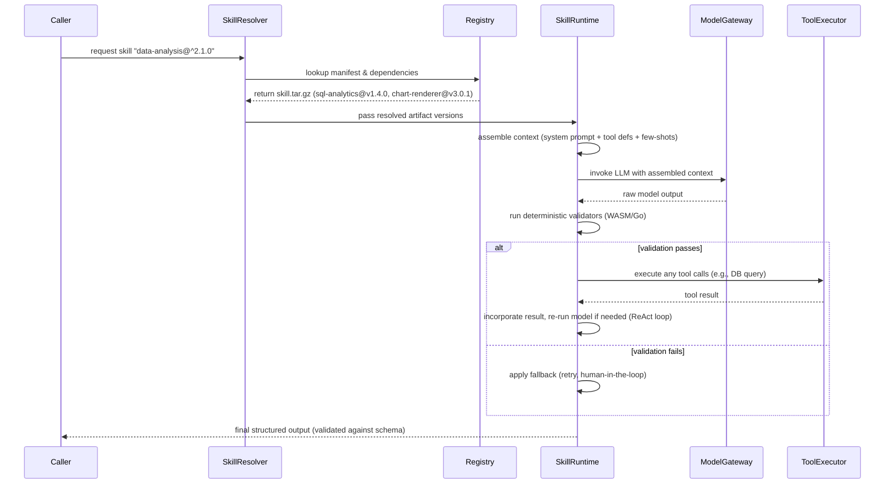

# The Missing Middle: Why Agent Skills Need Package Managers, Not Just Prompts

## Introduction
A few weeks ago I was on call at 2 AM debugging an LLM‑powered agent that suddenly started returning malformed JSON in production. The agent worked flawlessly in the playground, but in staging a downstream tool had silently changed its output schema. The “fix” was a brittle regex tacked onto the prompt, and the next day another tool changed again. We were treating natural‑language prompts as if they were stable APIs, and the system kept breaking because the contract lived only in the model’s context window.

That experience highlighted what I call the **Missing Middle**: the layer between raw model inference (the engine) and the business logic that consumes the model’s output. Today that layer is a tangled mess of prompt templates, ad‑hoc parsers, and copy‑pasted few‑shot examples. We need a proper packaging and dependency system for agent capabilities—think `cargo`, `npm`, or `pip` for skills—so we can version, test, and deploy them like any other software artifact.

## Why This Matters
If you are building LLM‑infrastructure at scale, you already feel the pain:

* **Fragile integrations** – a minor change in a tool’s output forces you to hunt through dozens of prompts.
* **Hidden technical debt** – prompts become monolithic, hard to review, and impossible to unit‑test.
* **Operational opacity** – you cannot attribute token cost or latency to a specific capability because everything lives in a single system prompt.
* **Slow iteration** – rolling out a fix requires a full redeploy of the agent service, not a simple library update.

Treating skills as versioned packages solves these problems. It gives you deterministic contracts, reproducible builds, and a clear path to rollback—exactly what we expect from any other dependency in a microservice architecture.

## How It Works
The core idea is to treat a **skill** as a compiled artifact that encapsulates:

1. A declarative manifest (`skill.yaml`) describing I/O schemas, dependencies, and metadata.
2. A runtime adapter that turns the manifest into the model‑specific context (system prompt, tool definitions, few‑shots).
3. Deterministic guardrails (pre‑ and post‑execution validators) that run outside the LLM loop.
4. An evaluation suite that acts as a compiler check before publishing.

When a planner asks for a capability, a **Skill Resolver** consults a registry, resolves the dependency graph, downloads the exact artifact version, and hands it to a **Skill Runtime**. The runtime assembles only the needed context, executes deterministic validators, invokes the model, and then validates the output before returning it to the caller.

Below is a sequence diagram that shows the flow from planner to final result.



**Step‑by‑step explanation**

1. **Resolution** – The planner asks for a skill with a version range. The resolver queries the registry (which stores immutable `skill.tar.gz` artifacts) and returns a concrete set of skill versions that satisfy the constraints.
2. **Context Assembly** – The Skill Runtime reads each skill’s manifest, extracts the required system prompt, tool definitions, and few‑shot examples, and packs them into a prompt that fits the model’s context window. Unused skills are omitted, saving tokens.
3. **Deterministic Guardrails** – Before the model sees the input, a pre‑execution validator (often compiled to WASM for speed) checks types, ranges, and required fields. After the model returns, a post‑execution validator coerces the output into the declared JSON Schema, raising a clear error if it cannot be reconciled.
4. **Execution Sandbox** – Any tool calls declared in the manifest (e.g., a read‑only DB connection) are executed in a sandbox outside the LLM loop, preventing the model from inadvertently invoking unsafe operations.
5. **Telemetry** – Each step tags tokens and latency to the exact skill version, enabling cost attribution and performance debugging.

## Core Concepts
| Concept | Description | Analogy |
|---------|-------------|---------|
| **Skill Manifest (`skill.yaml`)** | Declarative source of truth: name, version, description, I/O schemas (JSON Schema/Pydantic), dependencies, secrets, and metadata. | `package.json` / `Cargo.toml` |
| **Runtime Adapter** | Transforms manifest into model‑specific context (system prompt, tool definitions, few‑shots). Handles token budgeting and truncation. | Build system (compiler flags) |
| **Deterministic Guardrails** | Pre‑ and post‑execution validators that run in native/WASM, ensuring input sanitization and output coercion. | Linter + type checker |
| **Skill Artifact** | Immutable tarball containing manifest, prompt templates, validator binaries, WASM filters, and an evaluation suite. | Compiled binary or wheel |
| **Registry** | Storage service (local, remote, or OCI‑compatible) that holds signed skill artifacts, supports semantic versioning, and provides provenance via Sigstore/Cosign. | npm registry / Docker Hub |
| **Evaluation Suite (`skill test`)** | Golden dataset and assertions run against the target model; must pass before `skill publish`. | Unit test suite / CI gate |
| **Skill Resolver** | Implements version range solving (similar to SAT solver) and returns a concrete dependency graph. | `npm install` resolver |
| **Canary Deployment** | Routes a fraction of planner traffic to a `skill@next` alias via feature flags, enabling zero‑downtime rollouts. | Canary release of a microservice |

## Examples & Code Walkthrough
Below is a realistic skill for executing read‑only SQL against a data warehouse. The example shows the manifest, a simple Pydantic model for I/O, and the runtime adapter that builds the context.

### 1. Manifest (`skills/sql-executor/skill.yaml`)
```yaml
name: "sql-executor"
version: "1.4.0"
description: "Executes a read‑only SQL statement and returns rows as JSON."
author: "platform-team"
license: "MIT"
# Semantic versioning guidance:
#   MAJOR – I/O schema change (breaking)
#   MINOR – instruction/few‑shot update (backward compatible)
#   PATCH – token optimization / typo fix
dependencies:
  - name: "db-read-only-conn"
    version: "^2.0.0"
    type: "connection"
# I/O contracts – enforced by the runtime
inputs:
  type: object
  properties:
    sql:
      type: string
      pattern: "^\\s*SELECT"   # enforce read‑only at manifest level
  required: [sql]
outputs:
  type: array
  items:
    type: object
    additionalProperties: true
# Evaluation suite location
evals:
  - path: "evals/golden_queries.jsonl"
    min_pass_rate: 0.98
```

### 2. Pydantic I/O Models (`skills/sql-executor/models.py`)
```python
from pydantic import BaseModel, Field, validator
from typing import List, Dict, Any

class SqlInput(BaseModel):
    sql: str = Field(..., description="Read‑only SQL query to execute")

    @validator("sql")
    def must_be_select(cls, v: str) -> str:
        if not v.strip().upper().startswith("SELECT"):
            raise ValueError("Only SELECT statements are allowed")
        return v

class SqlOutput(BaseModel):
    rows: List[Dict[str, Any]] = Field(
        ..., description="List of rows, each row as a column‑name→value map"
    )
```

### 3. Runtime Adapter (`skill_runtime/sql_executor_adapter.py`)
```python
import json
import tiktoken  # token estimator
from pathlib import Path
from jinja2 import Environment, FileSystemLoader
from .models import SqlInput, SqlOutput
from ..validators import validate_input, validate_output  # WASM/Go binaries wrapped

class SqlExecutorAdapter:
    def __init__(self, skill_root: Path):
        self.root = skill_root
        self.manifest = self._load_manifest()
        self.env = Environment(loader=FileSystemLoader(self.root / "prompt_templates"))
        self.enc = tiktoken.encoding_for_model("gpt-4o")  # example model

    def _load_manifest(self) -> dict:
        import yaml
        with open(self.root / "skill.yaml") as f:
            return yaml.safe_load(f)

    def build_context(self, user_input: dict) -> str:
        """
        Assemble the final prompt: system + few‑shots + user query.
        Enforces token budget (e.g., 4096 tokens) by truncating history if needed.
        """
        # Load system prompt and few‑shot examples
        system_tmpl = self.env.get_template("system.j2")
        fewshot_tmpl = self.env.get_template("fewshot.j2")

        system_prompt = system_tmpl.render(
            description=self.manifest["description"],
            io_schema=json.dumps(self.manifest["inputs"], indent=2),
        )
        fewshot = fewshot_tmpl.render(examples=self._load_fewshots())

        # Compose user message
        user_msg = f"Execute this SQL: {json.dumps(user_input)}"

        # Simple token budgeting – drop oldest few‑shots if over limit
        context = f"{system_prompt}\n\n{fewshot}\n\n{user_msg}"
        while self._count_tokens(context) > 3500 and len(self._load_fewshots()) > 0:
            # Remove the earliest example and re‑render
            self._drop_oldest_fewshot()
            fewshot = fewshot_tmpl.render(examples=self._load_fewshots())
            context = f"{system_prompt}\n\n{fewshot}\n\n{user_msg}"
        return context

    def _count_tokens(self, text: str) -> int:
        return len(self.enc.encode(text))

    def _load_fewshots(self) -> list:
        # In practice, these are stored as JSONL under prompt_templates/
        path = self.root / "prompt_templates" / "fewshots.jsonl"
        if not path.exists():
            return []
        with open(path) as f:
            return [json.loads(line) for line in f]

    def _drop_oldest_fewshot(self):
        # naive implementation; a real adapter would keep an ordered list
        path = self.root / "prompt_templates" / "fewshots.jsonl"
        lines = path.read_text().splitlines()
        if len(lines) <= 1:
            path.write_text("")  # clear if only one left
        else:
            path.write_text("\n".join(lines[1:]))  # drop first

    def execute(self, raw_input: dict) -> dict:
        # 1️⃣ Pre‑validation (deterministic, outside LLM)
        validate_input(raw_input, self.manifest["inputs"])

        # 2️⃣ Build model context
        context = self.build_context(raw_input)

        # 3️⃣ Call model (abstracted via ModelGateway)
        raw_output = ModelGateway.generate(context)  # returns string

        # 4️⃣ Parse and validate output
        try:
            parsed = json.loads(raw_output)
        except json.JSONDecodeError as e:
            raise ValueError(f"Model output not valid JSON: {e}")

        validate_output(parsed, self.manifest["outputs"])
        return parsed
```

**What this gives us**

* **Versioned contract** – If we bump to `2.0.0` and change the `outputs` schema, any dependent skill will fail resolution unless it updates its version range.
* **Deterministic checks** – `validate_input` and `validate_output` are compiled WASM modules; they run in microseconds and cannot be subverted by prompt injection.
* **Token‑aware context** – The adapter trims few‑shot examples to stay within the model’s limit, something impossible with a monolithic system prompt.
* **Pluggable dependencies** – The `db-read-only-conn` dependency is resolved separately; the runtime injects the appropriate connection credentials at execution time.

## Best Practices
1. **Treat the manifest as the single source of truth** – Never embed version numbers or I/O details in prompt text; they belong in `skill.yaml`.
2. **Keep prompts small and focused** – A skill should contain only the information necessary for its specific task. Use the resolver to compose larger workflows from many small skills.
3. **Pin dependencies in production** – Deploy with exact versions (`skill@==1.4.0`) and use ranges only in development CI.
4. **Automate evaluation gates** – Require `skill test` to pass on every commit to a protected branch; treat failures as compile errors.
5. **Sign artifacts** – Use Sigstore/Cosign to verify provenance before allowing a skill to be pulled from a registry.
6. **Monitor token usage per skill** – Attach the skill name and version to your telemetry; this reveals which capabilities are driving cost and latency.
7. **Design for model‑agnostic adapters** – Store raw prompt templates (Jinja2, Handlebars) and let the runtime inject model‑specific syntax (e.g., `<|start|>` for Llama, `\[INST\]` for Mistral). The same artifact can then run on multiple LLMs.

## Common Mistakes & Anti‑Patterns
| Mistake | Why it’s harmful | Fix |
|---------|------------------|-----|
| **Monolithic system prompt** – putting every tool description and few‑shot example in one giant prompt. | Wastes tokens, makes updates risky, and obscures which skill caused a failure. | Split into discrete skills; let the resolver assemble only what’s needed. |
| **Version‑less prompts** – copying a prompt from a Slack thread or a Gist without a version identifier. | No way to know if you’re running the latest or an outdated copy; leads to drift. | Always publish to a registry and consume via `skill install <name>@<version>`. |
| **Validating only in the LLM loop** – relying on the model to self‑correct output format. | Non‑deterministic; the model may hallucinate a fix that silently corrupts data. | Move validation to deterministic pre/post‑steps (WASM/Go). |
| **Hard‑coding secrets in prompts** – embedding API keys or DB credentials directly in the prompt text. | Secrets become visible in logs, model training data, and are impossible to rotate. | Declare secrets in the manifest and inject them at runtime via a secure vault. |
| **Skipping the evaluation suite** – publishing a skill after a quick manual check. | Guarantees regressions will slip into production, especially when the underlying model changes. | Make `skill test` a required CI gate; treat it as the compiler’s type‑check. |

## Performance Considerations
| Aspect | Impact | Mitigation |
|--------|--------|------------|
| **Context assembly latency** | Reading templates, rendering Jinja2, and counting tokens adds a few milliseconds per request. | Cache rendered templates per skill version; use a fast token estimator (e.g., `tiktoken` is ~µs scale). |
| **Validator overhead** | WASM/Go validators typically run in <1 ms for simple schemas; complex nested schemas may reach 5‑10 ms. | Keep schemas flat where possible; move heavy validation to asynchronous post‑processing if latency budget allows. |
| **Telemetry tagging** | Adding skill‑version tags to traces and metrics is negligible if done at the resolver/runtime boundary. | Use structured logging with fixed fields; avoid string concatenation in hot paths. |
| **Network fetch from registry** | First‑time pull of a `skill.tar.gz` incurs latency comparable to pulling a Docker layer (~10‑50 ms on LAN). | Leverage a local OCI‑compatible cache (e.g., `oras` or `crane`) and prefetch commonly used skills during container startup. |
| **Model inference** | Dominant cost; skill packaging does not change the model’s compute requirements. | By reducing unnecessary tokens via dynamic context assembly, you can lower the effective inference time and cost. |

A
