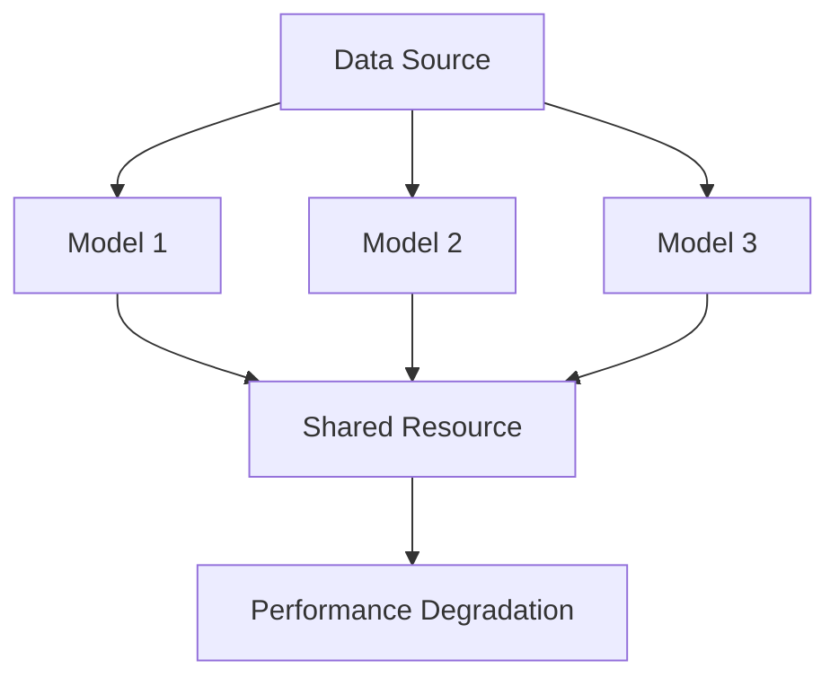

# The tragedy of the commons, AI edition

## Introduction
When multiple parties share a common resource, it can lead to a situation known as the tragedy of the commons. In the context of artificial intelligence, this phenomenon manifests as a degradation of model performance when multiple agents rely on the same data or models without proper coordination. I've seen this firsthand in our production cluster, where the introduction of new models would sometimes inadvertently compromise the performance of existing ones. As AI becomes increasingly pervasive, understanding and addressing this issue is crucial for maintaining the integrity and reliability of AI systems.

## Why This Matters
The tragedy of the commons in AI has significant implications for software engineers. As AI models become more widespread, the potential for conflicts and degradation of performance increases. This can lead to decreased accuracy, increased latency, and even complete system failures. In our line of work, reliability and performance are paramount. When we deploy AI models in critical systems, such as healthcare or finance, the stakes are even higher. Therefore, it's essential to understand the causes of the tragedy of the commons in AI and develop strategies to mitigate its effects.

## How It Works
The tragedy of the commons in AI occurs when multiple agents, such as AI models or data pipelines, compete for shared resources without proper coordination. This can lead to overfitting, where models become too specialized to the training data and fail to generalize well to new, unseen data. It can also result in underfitting, where models are not complex enough to capture the underlying patterns in the data.



In this diagram, multiple models (Model 1, Model 2, Model 3) are trained on the same data source and compete for the shared resource, leading to performance degradation.

## Core Concepts
To understand the tragedy of the commons in AI, it's essential to grasp the following core concepts:

* **Overfitting**: When a model becomes too specialized to the training data and fails to generalize well to new, unseen data.
* **Underfitting**: When a model is not complex enough to capture the underlying patterns in the data.
* **Shared resources**: Data, models, or other resources that are shared among multiple agents.
* **Coordination**: The process of managing access to shared resources to prevent conflicts and degradation of performance.

## Examples & Code Walkthrough
To illustrate the tragedy of the commons in AI, consider a scenario where multiple models are trained on the same dataset. We can use Python and the scikit-learn library to demonstrate this:

```python
from sklearn.datasets import load_iris
from sklearn.model_selection import train_test_split
from sklearn.linear_model import LogisticRegression
from sklearn.metrics import accuracy_score

# Load the iris dataset
iris = load_iris()
X = iris.data
y = iris.target

# Split the data into training and testing sets
X_train, X_test, y_train, y_test = train_test_split(X, y, test_size=0.2, random_state=42)

# Train multiple models on the same data
model1 = LogisticRegression()
model2 = LogisticRegression()
model3 = LogisticRegression()

model1.fit(X_train, y_train)
model2.fit(X_train, y_train)
model3.fit(X_train, y_train)

# Evaluate the models on the test set
y_pred1 = model1.predict(X_test)
y_pred2 = model2.predict(X_test)
y_pred3 = model3.predict(X_test)

print("Model 1 accuracy:", accuracy_score(y_test, y_pred1))
print("Model 2 accuracy:", accuracy_score(y_test, y_pred2))
print("Model 3 accuracy:", accuracy_score(y_test, y_pred3))
```

In this example, multiple models are trained on the same dataset, which can lead to overfitting and degradation of performance.

## Best Practices
To avoid the tragedy of the commons in AI, follow these best practices:

* **Use data partitioning**: Split the data into separate partitions for each model to prevent overfitting.
* **Implement model coordination**: Use techniques such as model averaging or stacking to combine the predictions of multiple models.
* **Monitor performance**: Regularly evaluate the performance of each model and adjust the coordination strategy as needed.

## Common Mistakes & Anti-Patterns
Some common mistakes to avoid when dealing with the tragedy of the commons in AI include:

* **Not using data partitioning**: Failing to split the data into separate partitions for each model can lead to overfitting.
* **Not implementing model coordination**: Failing to combine the predictions of multiple models can result in degraded performance.
* **Not monitoring performance**: Failing to regularly evaluate the performance of each model can lead to undetected issues.

## Performance Considerations
The tragedy of the commons in AI can have significant performance implications, including:

* **Increased latency**: Conflicts between models can lead to increased latency and slower response times.
* **Decreased accuracy**: Overfitting and underfitting can result in decreased accuracy and reliability.
* **Increased computational complexity**: Model coordination techniques can increase computational complexity and require more resources.

## Real-World Usage
Industry leaders are already leveraging techniques to mitigate the tragedy of the commons in AI. For example, Google's TensorFlow provides tools for model partitioning and coordination. Similarly, Amazon's SageMaker provides features for model monitoring and performance optimization.

## Frequently Asked Questions (FAQ)
Here are some frequently asked questions about the tragedy of the commons in AI:

* **Q: What is the tragedy of the commons in AI?**
A: The tragedy of the commons in AI refers to the degradation of model performance when multiple agents rely on the same data or models without proper coordination.
* **Q: How can I prevent the tragedy of the commons in AI?**
A: Use data partitioning, implement model coordination, and monitor performance regularly.
* **Q: What are the performance implications of the tragedy of the commons in AI?**
A: The tragedy of the commons in AI can lead to increased latency, decreased accuracy, and increased computational complexity.

## Conclusion
The tragedy of the commons in AI is a significant challenge that can have far-reaching implications for the reliability and performance of AI systems. By understanding the causes of this phenomenon and implementing strategies to mitigate its effects, software engineers can ensure the integrity and reliability of AI systems. As AI continues to evolve and become increasingly pervasive, it's essential to address this challenge and develop best practices for avoiding the tragedy of the commons in AI.
