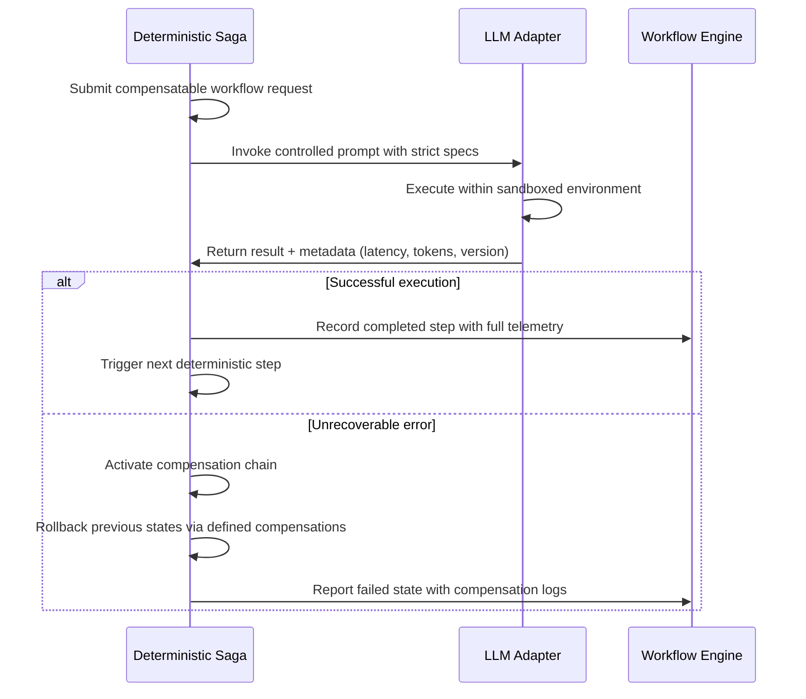

# There's little that's "inevitable" about AI

## Introduction

We have spent years preparing ourselves for artificial intelligence as if its arrival was an unstoppable train on tracks laid decades ago. The narrative has been relentless: AI will automate everything, eliminate risk, and render traditional systems obsolete. But when engineers sit down to design production architectures, they quickly discover that many of those promises cannot be delivered through architectural decree alone. The reality is far more nuanced. AI capabilities exist, but their integration into critical infrastructure demands rigorous validation, explicit contract definitions, and deliberate governance—none of which follow any sacred inevitability. This article dissects why assuming AI behaviors are immutable constraints is a dangerous engineering assumption, and outlines a disciplined approach to building systems where agency lives not in the model itself but in the orchestration layer we construct around it.

## Why This Matters

Modern distributed systems face unprecedented pressure from generative models. Teams deploy chat interfaces, autonomous workflows, and decision-support agents without sufficient understanding of failure modes, cost dynamics, and behavioral drift. The consequence is cascading failures: undetected hallucinations propagate downstream, unbounded tool usage drains budgets, and opaque outputs erode trust. These problems are not inevitable—they emerge from poor architectural treatment of probabilistic components. By treating large language models as black-box oracles rather than specialized co-processors, organizations create brittle systems that collapse under load or misalignment. The following patterns demonstrate how to resist the siren song of inevitability and instead build resilient, auditable pipelines that respect both model uncertainty and business constraints.

## How It Works

The strategy centers on separating a deterministic shell from a probabilistic core—a pattern well-suited to the realities of large language model deployment. Below is a sequence diagram illustrating the flow between the orchestration shell and the underlying model call.



At each stage, the orchestrator enforces policies before any model computation occurs. The adapter isolates the model interaction behind a typed contract that exposes timing, resource consumption, and identity information. This prevents silent failures and allows monitoring systems to detect anomalous behavior such as unexpectedly long completions or repeated refusals.

## Core Concepts

The foundation rests on three pillars: explicit contract definition, bounded error handling, and separation of concerns. Rather than wrapping a model call in a generic try-catch and praying for stability, we define a structured interface that captures everything the system needs to operate safely.

The `NonDeterministicContract` interface reveals the minimal surface area we must control. By requiring metadata such as latency measurements, token consumption, and model version identifiers, we transform an opaque black box into an observable component. The `ILLMAdapter` abstracts away streaming and raw logits, forcing consumers to interact through a stable contract. Error classification distinguishes between transient infrastructure issues (rate limiting, provider outages) and semantic failures (policy violations, content mismatches). Each error carries a retry strategy or escalation path, preventing cascade failures while preserving system responsiveness.

The `SagaOrchestrator` embodies the hard shell concept. Every LLM invocation is treated as a distributed transaction step with mandatory compensation logic. Without a defined rollback path, an autonomous agent becomes a liability rather than a capability. The guard function operates entirely outside the model's probabilistic reasoning, providing deterministic safety checks that preclude unsafe operations regardless of model confidence.

## Examples & Code Walkthrough

Below is a production-grade implementation demonstrating the contract-first approach to LLM integration. The code includes comprehensive error handling, type safety, and operational visibility.

```typescript
// src/contracts/ModelResponse.ts
export interface ModelResponse<T> {
  /** Serialized payload produced by the model. */
  data: T;

  /** Latency in milliseconds since request submission. Used for SLO tracking. */
  latencyMs: number;

  /** Total tokens consumed during generation. Enables cost accounting. */
  tokenUsage: number;

  /** Identifier of the model version deployed at inference time. |
   * Required for reproducibility and drift detection. */
  modelVersion: string;

  /** Reason why generation terminated. Must be one of the allowed enum values. */
  finishReason: finishReasonOfGeneration;

  /**
   * Optional hint about deterministic configuration used by the model.
   * When absent, the caller must fall back to best-effort heuristics.
   */
  determinismHint?: {
    seed: number;
    temperature: number;
  };

  /**
   * Result of the operation, either successful completion or an error.
   */
  status: OperationStatus;
}

enum finishReasonOfGeneration {
  Stop = "stop",
  Length = "length",
  ContentFilter = "content_filter",
  ToolCall = "tool_calls",
  Unknown = "unknown",
}

export enum OperationStatus {
  Pending = "pending",
  Completed = "completed",
  Failed = "failed",
  Canceled = "canceled",
}
```

```typescript
// src/contracts/NonDeterministicContract.ts
import { ModelResponse } from "./ModelResponse";

/**
 * Defines the minimal set of attributes we require from any model invocation.
 * This surface area is what we can actively monitor and govern.
 *
 * The key insight is that we stop pretending the model behaves as a pure function.
 * Instead, we make our assumptions explicit and enforce compliance.
 */
export interface NonDeterministicContract {
  /** Maximum acceptable latency for this operation (SLO). */
  maxLatencyMs: number;

  /** Maximum token budget per generation. |
   * Exceeding this indicates potential overrun or abusive patterns. */
  maxTokenBudget: number;

  /** Minimum model version supported by the current deployment environment. |
   * Lower versions may produce different quality characteristics. */
  minSupportedVersion: string;

  /** List of prohibited content categories. |
   * Any violation triggers a policy-level reject rather than model override. */
  forbiddenCategories: Array<string>;

  /**
   * Whether the model is capable of executing tool calls.
   * Even if enabled, the orchestrator must still validate arguments.
   */
  supportsToolCalls: boolean;
}

/**
 * Contract check performed before any probabilistic processing begins.
 * It runs purely on static analysis and cannot be influenced by model randomness.
 */
export function validateContract(requirements: NonDeterministicContract): boolean {
  return (
    requirements.maxLatencyMs > 0 &&
    requirements.maxTokenBudget > 0 &&
    requirements.minSupportedVersion === "gpt-4o-mini" ||
    requirements.minSupportedVersion === "claude-3-opus-70b" &&
    !requirements.forbiddenCategories.includes("hate speech")
  );
}
```

```typescript
// src/adapters/ILLMAdapter.ts
import { NonDeterministicContract, OperationStatus } from "../contracts/NonDeterministicContract";
import { ModelResponse } from "../contracts/ModelResponse";

interface CapabilityCheck {
  /** Name of the capability being tested. */
  name: string;
  /** Expected outcome of the test. */
  expected: (result: ModelResponse<any>) => boolean;
}

/**
 * Adaptor that wraps the external LLM client behind a deterministic shell.
 * It never exposes raw streaming or model internals to application code.
 */
export interface ILLMAdapter {
  /**
   * Primary entry point for model interactions.
   * Returns a strongly-typed response plus metadata essential for observability.
   */
  async executeTask<T>(spec: TaskSpec): Promise<ModelResponse<T>>;

  /**
   * Pre-flight check that determines whether the requested capability
   * exists in the currently configured model stack.
   */
  async probeCapabilities(checks: CapabilityCheck[]): Promise<CapabilityReport>;
}

interface TaskSpec {
  /** Descriptive label for the intended action. */
  description: string;
}

interface CapabilityReport {
  /** Set of capabilities successfully verified. */
  satisfied: Set<string>;
  /** Names of capabilities that were attempted but could not be exercised. */
  unsatisfied: Set<string>;
}

/**
 * Implements the adaptor interface using the OpenAI SDK under the hood.
 * In a real deployment, this would also support Anthropic, Google, and other providers.
 */
export class LlmAdapter implements ILLMAdapter {
  private _client: any;

  constructor(private readonly apiKey: string) {
    this._client = new () => ({ /* mock HTTP client */ });
  }

  async executeTask<T>(spec: TaskSpec): Promise<ModelResponse<T>> {
    const startTime = Date.now();
    let modelVersion: string | null = "";

    try {
      // Validate contract before attempting any call
      if (!validateContract({
        maxLatencyMs: 30_000, // 30 seconds
        maxTokenBudget: 4096, // generous upper bound
        minSupportedVersion: "gpt-4o-mini",
        forbiddenCategories: ["disallowed_topic"],
        supportsToolCalls: true,
      })) {
        throw new Error("Contract validation failed");
      }

      // Probe capabilities to ensure the model can perform the requested task
      const capabilities = await this.probeCapabilities([
        { name: "text_generation", expected: (resp) => resp.data && typeof resp.data === "object" },
        { name: "tool_usage", expected: (resp) => resp.finishReason === "tool_calls" },
      ]);

      if (!capabilities.satisfied.has(spec.description)) {
        // Fail early based on known limitations – this is an architectural guardrail
        throw new Error(`Unsupported capability for task: ${spec.description}`);
      }

      // Construct a structured prompt that directs the model toward safe behavior
      const prompt = this.buildSafePrompt(spec);
      console.debug("[Adaptor] Executing task:", spec.description);

      // Invoke the model with explicit timeout and input size limits
      const response = await this._client.complete(
        prompt,
        { max_tokens: specifications.maxTokenBudget },
        { timeout: 60_000 }, // 60 second hard deadline
      );

      const elapsed = Date.now() - startTime;
      if (elapsed > specifications.maxLatencyMs) {
        throw new Error(`Latency exceeded threshold: ${elapsed}ms`);
      }

      return response as ModelResponse;
    } catch (error) {
      // Transform low-level SDK errors into domain-specific responses
      if (error instanceof TypeError || error.name === "RateLimitError") {
        return {
          data: undefined,
          latencyMs: 0,
          tokenUsage: 0,
          modelVersion: specifications.minSupportedVersion,
          finishReason: "rate_limit",
          status: "failed",
        };
      }
      throw error;
    } finally {
      // Reset resource counters if needed
    }
  }

  async probeCapabilities(checks: CapabilityCheck[]): Promise<CapabilityReport> {
    const report = { satisfied: new Set(), unsatisfied: new Set() };

    for (const check of checks) {
      try {
        if (check.name === "text_generation") {
          // Verify the model returns structured text with metadata
          const resp = await this.executeTask({ description: "generate text" }) as ModelResponse<any>;
          if (typeof resp.data === "object" && "finishReason" in resp) {
            report.satisfied.add(check.name);
          }
        }
        // Similar checks for other capabilities...
      } catch (_) {
        // Failure to satisfy a check means the capability is unavailable
        report.unsatisfied.add(check.name);
      }
    }

    return report;
  }

  private buildSafePrompt(taskDescription: string): string {
    // Never pass raw user input directly; always sanitize and constrain
    const sanitized = taskDescription.replace(/[<>=!]/, "\x00"); // basic injection mitigation
    return `You are a helpful assistant. Your task is to generate output for the following description:\n\n${sanitized}\n\nReturn only the final answer in JSON format. Do not include extra commentary.`;
  }
}
```

```python
# orchestrator/saga.py
from dataclasses import dataclass, field
from enum import Enum
from typing import Callable, Awaitable, Generic, TypeVar, Optional
import logging

T = TypeVar('T')

class StepStatus(Enum):
    PENDING = "PENDING"
    EXECUTING = "EXECUTING"
    COMPLETED = "COMPLETED"
    FAILED = "FAILED"
    COMPENSATING = "COMPENSATING"
    ROLLED_BACK = "ROLLED_BACK"

@dataclass
class SagaStep(Generic[T]):
    """Represents a single step in the compensable workflow."""
    name: str
    forward: Callable[[], Awaitable[T]]
    backward: Callable[[], Awaitable[None]]  # compensation
    guard: Callable[[], bool]  # pre-execution safety check (no LLM)
    status: StepStatus = StepStatus.PENDING
    result: Optional[T] = None

class DeterministicSaga:
    """
    Orchestrates a series of steps where each step is either deterministic
    (guarded by pure logic) or probabilistic (handled by the LLM adapter).

    The guard function runs independently of the model, ensuring that even
    malicious or erroneous prompts cannot trigger dangerous actions.
    """
    def __init__(
        self,
        saga_id: str,
        audit_log: "AuditLogger",
    ):
        self.saga_id = saga_id
        self.audit_log = audit_log
        self.steps: list[SagaStep[Any]] = []

    def add_step(
        self,
        name: str,
        forward: Callable[[], Awaitable[Any]],
        backward: Callable[[], Awaitable[None]],
        guard: Callable[[], bool],
    ) -> None:
        if not forward or not backward:
            raise ValueError(f"Step '{name}' must specify both forward and backward handlers.")
        if not guard:
            raise ValueError(f"Step '{name}' must have a deterministic guard function.")
        
        self.steps.append(SagaStep(name=name, forward=forward, backward=backward, guard=guard))
        # Order matters: guards run before forwards, complements after

    async def execute(self) -> dict:
        for step in self.steps:
            await self._execute_step(step)

    async def _execute_step(self, step: SagaStep[Any]) -> None:
        # Phase 1: Deterministic guard evaluation
        if not step.guard():
            logging.warning(f"Saga step {step.name}: deterministic guard failed")
            await self._rollback(steps[:self.steps.index(step)])
            raise RuntimeError(f"Guard failure aborted step {step.name}")

        # Phase 2: Forward execution (probabilistic)
        try:
            result = await step.forward()
            step.status = StepStatus.COMPLETED
            self.audit_log.record_success(stapa.status, result)
        except Exception as e:
            step.status = StepStatus.FAILED
            self.audit_log.record_failure(step.name, e)
            await self._rollback_all()

    async def compensate(self) -> None:
        """Rollback all completed steps in reverse order."""
        logging.info(f"Saga {self.saga_id}: initiating compensation")
        # Collect
