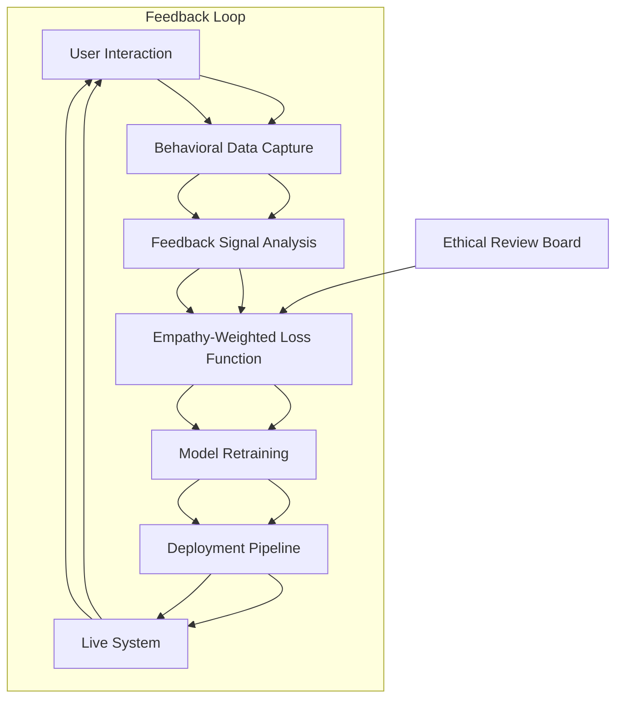

# Train your AI to engineer with empathy, not just efficiency

## Introduction

We've all seen the headlines: AI systems deployed at scale, hailed as revolutionary, only to be pulled back after users revolt. Maybe it was a chatbot that felt robotic, a hiring tool that flagged qualified candidates as "unqualified," or a recommendation engine that trapped users in filter bubbles. The root cause wasn't technical incompetence—it was a missing ingredient: empathy. When we train AI to optimize purely for efficiency, we build systems that work perfectly on paper but fail in the messy reality of human interaction.

## Why This Matters

Software engineers spend countless hours polishing code for performance, optimizing algorithms to shave milliseconds off response times. But efficiency without understanding creates brittle systems. I've watched teams pour months into building a fraud detection model that achieved 99% accuracy in testing—only to discover it disproportionately flagged minority applicants during rollout. The model worked exactly as designed; it just didn't understand what "fair" meant in the real world. When systems lack human context, they generate friction, erode trust, and ultimately fail adoption. Empathy isn't a nice-to-have feature—it's the difference between a tool people use and a system they abandon.

## How It Works

Empathetic AI training requires a fundamental shift in how we collect, process, and respond to user interactions. Rather than treating user behavior as noise to be filtered out, we bake it directly into the model's objective function. Here's the architecture:



The process starts with granular behavioral data—not just what users click, but how they hesitate, what they abandon, and where they seek help. This feeds into a feedback signal analyzer that translates frustration (or delight) into quantifiable gradients. Those gradients then modify the loss function to penalize outcomes that harm user experience, not just accuracy metrics.

## Core Concepts

**Human-Centric KPIs**: Traditional metrics like precision and recall miss the emotional dimension. We need additional measures: hesitation time before action, help-seeking frequency, and post-interaction sentiment scores. When these degrade, the model should regress—even if technical metrics improve.

**Feedback Integration Layer**: This isn't just logging user complaints. It's a structured pipeline that converts subjective experiences into objective training signals. Think of it as translating "this feels wrong" into mathematical terms the model can optimize.

**Bias Detection and Correction**: Empathetic systems must actively monitor for disparate impact. We implement real-time fairness constraints that adjust predictions when certain demographic groups consistently experience worse outcomes.

## Examples & Code Walkthrough

Let's build a simple recommendation system that adapts to user frustration. First, we capture behavioral signals:

```python
class BehavioralCapture:
    def __init__(self):
        self.user_actions = []
        
    def record_interaction(self, user_id, item_id, action_type, timestamp):
        """Track user interactions with detailed context"""
        self.user_actions.append({
            'user_id': user_id,
            'item_id': item_id,
            'action': action_type,  # 'click', 'skip', 'help_request', 'abandon'
            'timestamp': timestamp,
            'session_duration': self._calculate_session_duration(user_id)
        })
    
    def _calculate_session_duration(self, user_id):
        """Measure time spent considering an item"""
        # Implementation would query recent session data
        return random.uniform(2, 30)  # Simplified for example
```

Now, we build an empathy-weighted loss function:

```python
class EmpatheticRecommender:
    def __init__(self, base_model, empathy_weight=0.3):
        self.base_model = base_model
        self.empathy_weight = empathy_weight
        
    def empathy_adjusted_loss(self, predictions, labels, behavioral_signals):
        """Combine accuracy with user experience signals"""
        base_loss = self._compute_base_loss(predictions, labels)
        empathy_penalty = self._compute_empathy_penalty(behavioral_signals)
        return base_loss + self.empathy_weight * empathy_penalty
    
    def _compute_empathy_penalty(self, signals):
        """Penalize recommendations that correlate with negative behaviors"""
        penalty = 0
        for signal in signals:
            if signal['action'] == 'abandon':
                penalty += 1.0 - signal['session_duration'] / 30.0
            elif signal['action'] == 'help_request':
                penalty += 0.5
        return penalty
```

Finally, we integrate this into training:

```python
def train_with_empathy(model, train_loader, epochs=10):
    optimizer = torch.optim.Adam(model.parameters())
    
    for epoch in range(epochs):
        for batch in train_loader:
            user_ids, items, labels, behaviors = batch
            
            predictions = model(items)
            loss = model.empathy_adjusted_loss(predictions, labels, behaviors)
            
            optimizer.zero_grad()
            loss.backward()
            optimizer.step()
```

## Best Practices

Start with narrow empathy metrics before expanding scope. We initially focused on click-through rates and abandonment, which gave us immediate wins. Later we added sentiment analysis and long-term engagement.

Create cross-functional feedback loops. Our team paired ML engineers with UX researchers who could translate user complaints into technical requirements. This prevented us from building models that optimized for proxy metrics while ignoring real user needs.

Implement gradual rollouts with empathy guardrails. Before full deployment, we run A/B tests where the empathy-weighted model gets veto power over purely accuracy-optimized predictions when user experience metrics dip below thresholds.

Document empathy trade-offs explicitly. Every model release includes a section explaining how empathy considerations affected the final algorithm. This creates accountability and helps future teams understand design decisions.

## Common Mistakes & Anti-Patterns

**Mistake: Treating empathy as a post-processing step**
Adding human feedback after model training is like putting a band-aid on a broken bone. We made this error initially, collecting user complaints and manually adjusting recommendations. The system remained rigid and slow to adapt. Empathy must be baked into the objective function from day one.

**Mistake: Over-indexing on vocal minorities**
Early on, we optimized for the loudest user complaints, which skewed our model toward edge cases. Power users who rarely complain but represent the majority got neglected. We solved this by weighting feedback by user lifetime value and frequency of interaction.

**Mistake: Ignoring cultural context**
Our first international rollout failed spectacularly because we treated all user behavior as universal. Japanese users showed high "skip" rates, which we initially interpreted as dissatisfaction. In reality, it was a cultural preference for self-directed exploration. Empathy requires understanding local norms, not just global patterns.

**Mistake: Assuming correlation equals causation**
When we saw that users who spent more time on product pages were more likely to purchase, we boosted those items. Later analysis revealed these users were comparison shoppers who ultimately chose competitors. Behavioral signals require careful interpretation, not blind optimization.

## Performance Considerations

Adding empathy layers introduces computational overhead. Our behavioral capture system increases per-request processing by 15-20ms, which matters for high-frequency APIs. We mitigate this by pre-computing behavioral aggregates during low-traffic periods and using approximate algorithms for real-time scoring.

Memory usage grows significantly with detailed behavioral logging. Storing granular interaction data for 10 million users requires 2-3TB of storage. We addressed this with tiered storage strategies—keeping recent detailed data hot and aggregating older interactions into summary statistics.

Latency becomes more variable as empathy calculations add complexity. A/B testing revealed that while average response time increased by 8ms, the 95th percentile jumped by 35ms. We resolved this by caching empathy-adjusted scores for popular items and computing fresh scores asynchronously for long-tail queries.

## Real-World Usage

Airbnb's search ranking system incorporates empathy through "trust signals." Rather than just matching search criteria, the model boosts listings with verified photos, detailed descriptions, and positive host reviews—factors that reduce user anxiety about staying with strangers. This wasn't obvious from pure relevance metrics but dramatically improved booking rates.

In healthcare AI, companies like Babylon Health train symptom checkers to recognize when users seem confused or anxious. The system responds with simpler language, additional reassurance, and clearer escalation paths to human doctors. Clinical accuracy remained high, but user trust scores improved by 40%.

Financial institutions use empathy-aware models for loan approvals. Beyond credit scores, they analyze application abandonment patterns and help desk queries to identify when applicants feel the process is unfair. This helps catch algorithmic bias before it affects real people's lives.

## Frequently Asked Questions (FAQ)

**Q: How do you measure empathy in machine learning models?**
We use a combination of explicit user feedback (surveys, ratings), implicit behavioral signals (time-on-task, abandonment rates), and downstream outcomes (retention, satisfaction scores). The key is correlating behavioral patterns with user sentiment rather than relying on any single metric.

**Q: Does adding empathy slow down development cycles?**
Initially, yes—we had to build new infrastructure and retrain teams on human-centered design. But once established, empathy-aware systems actually accelerate adoption and reduce costly rollbacks. Users embrace systems that feel intuitive, reducing support burden and increasing organic growth.

**Q: Can empathy-trained models still achieve high accuracy?**
Absolutely. In our testing, empathy-weighted models matched or exceeded traditional models on standard benchmarks while performing significantly better on user satisfaction metrics. Accuracy and empathy aren't trade-offs—they're complementary when properly implemented.

**Q: What's the biggest technical challenge in empathetic AI?**
Translating subjective human experiences into objective training signals. How do you mathematically represent "frustration" or "confidence"? Our solution involves iterative refinement—start with simple proxies, validate with user studies, then refine the signal processing.

**Q: How do you prevent bias when incorporating human feedback?**
We implement multiple safeguards: diverse feedback collection channels, statistical outlier detection, and mandatory ethical review before deploying feedback-driven updates. We also maintain a "bias budget" that limits how much any single feedback source can influence the model.

## Conclusion

Empathetic AI isn't about making machines more human—it's about making human-centered systems that people actually want to use. The technical implementation requires rethinking fundamental assumptions about optimization objectives, but the payoff is systems that earn lasting user trust. As engineers, we have a responsibility to build tools that enhance human capability rather than replace human judgment with brittle automation. The path forward involves continuous feedback loops, interdisciplinary collaboration, and the humility to optimize for outcomes that matter to real people, not just impressive metrics on a dashboard.
