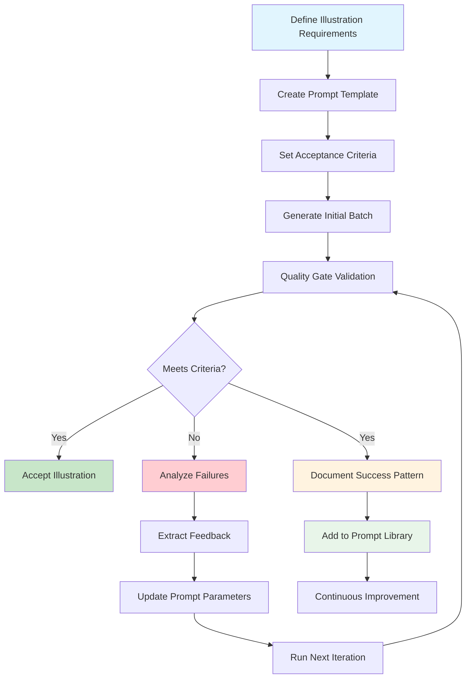
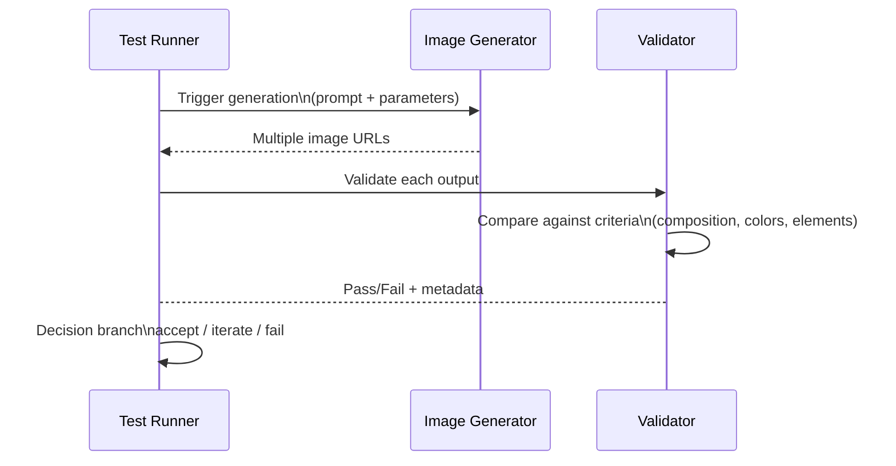

# Treat an AI illustration like a small acceptance test

## Introduction

When a designer hands off a logo to a graphic artist, the contract is explicit—specific dimensions, tone, deliverables, timeline. In software engineering, we treat those agreements with formal review processes, version-controlled specs, and acceptance criteria before any code touches the build pipeline. The same discipline applies to AI-generated illustrations, yet most teams treat them as throwaway creativity exercises rather than engineered artifacts.

The gap emerges because generative models produce probabilistic outputs rather than deterministic ones. A prompt might yield four different compositions within seconds, and subtle shifts in wording can swing the result by several hundred pixels. Without a structured approach to evaluation, teams spend hours manually comparing images against vague notions of "good," leaving a large portion of effort wasted on rework.

By reframing each illustration attempt as an acceptance test, we bring measurable outcomes, repeatable cycles, and objective decision points. The goal becomes clear: define what a successful rendering looks like, run the synthesis pipeline against those expectations, and only proceed when the test passes. This methodology turns chaotic experimentation into a predictable workflow that scales across product lines and team sizes.

## Why This Matters

In production environments, inconsistent visual assets compound quickly. Consider a company that publishes weekly newsletters with custom illustrations for each story. If every image varies wildly in composition, color palette, or subject matter, the final product feels unpolished and undermines reader trust. Manual QA becomes impractical when hundreds of assets require verification, yet automated scoring falls short without guardrails.

The cost isn't just aesthetic. Teams report spending up to three weeks on iteration loops alone when a single design element drifts outside brand guidelines. When the illusion of infinite variety replaces true visual coherence, stakeholders lose confidence in the AI tool itself. Conversely, when a disciplined test cycle catches deviations early, the cost of fixing issues drops dramatically—the fix happens days or even minutes after generation, long before the asset hits production.

Adopting acceptance-test principles also creates documentation. Each test run captures not just the final image but the rationale behind its approval or rejection. Over time, this builds a living knowledge base that future developers can reference when evaluating new prompts, preventing the common pitfall of reinventing specification patterns from scratch.

## How It Works

The architecture mirrors traditional unit testing but operates across a stochastic medium. At its heart lies a pipeline that begins with a written specification—a prompt template—and ends with a binary pass/fail verdict. Every iteration generates multiple candidate renders, feeds them through a validation suite, and records the outcome. The system then either accepts the best result, rejects the batch entirely, or returns to the specification phase with targeted adjustments based on collected feedback.

Below is the core flow illustrated in a state transition diagram:



The diagram shows how the system enters a loop: once initial candidates meet the pass threshold, they're catalogued as a known-good pattern. Subsequent runs can reuse that configuration while still allowing fine-grained tweaks driven by concrete failure analysis. Each iteration produces a set of results, not a single image, giving us statistical confidence about the model's behavior under specific conditions.



Each validation step maps directly to a business requirement. Composition balance ensures the visual weight distributes logically; color harmony maintains brand consistency; content accuracy guarantees the illustration contains the specified entities. These criteria become part of the specification, just as JUnit tests would specify expected inputs and outputs.

## Core Concepts

At the heart of this approach lies the notion that an AI illustration is not merely an artistic artifact but a test case whose success can be measured objectively. The key components include:

**Specification Primes** — These correspond to the prompt template and acceptance criteria combined. They act as immutable contracts that guide both generation and evaluation. When a team modifies a prime, everything downstream must be reconsidered, much like updating a version-controlled feature branch.

**Pass/Fail Definitions** — Rather than subjective judgment, each criterion translates into a boolean predicate. For instance, color harmony might measure the dominant hue distance against a target palette variance. Content accuracy could involve semantic search verification that named entities appear within acceptable bounds. Each rule must be implementable programmatically, otherwise the test loses its power.

**Feedback Loops** — The most valuable insight comes from analyzing why a test failed. By extracting specific feedback—whether misplaced objects, unwanted text, or mismatched aspect ratios—developers gain actionable data to refine the next prompt iteration. This closed-loop system approximates the red-green cycle found in traditional debugging, but applied to creative workflows.

**Reproducibility** — All parameters including prompt strings, sampling weights, and random seeds must be recorded. Without this, a failing test might stem from a fluke seed rather than a genuine issue with the model. Versioning prompts alongside their associated test results enables regression detection when later changes affect output quality.

## Examples & Code Walkthrough

The following implementation demonstrates a practical acceptance framework built around a dedicated test harness. The `AIllustrationTest` class encapsulates the generation and validation lifecycle, while `quality_gate_check` provides the gatekeeper logic that decides whether a batch of images satisfies our specifications.

```python
import requests
from dataclasses import dataclass, field
from typing import List, Dict, Optional
from pathlib import Path

@dataclass
class ValidationResult:
    """Contains the outcome of a single image validation."""
    iteration: int
    image_url: str
    score: float  # 0.0 to 1.0 based on passing criteria
    feedback: str
    is_passed: bool

class AIllustrationTest:
    """
    A test harness for generating and validating AI illustrations.
    
    This class treats each generation attempt as a mini-acceptance test,
    collecting quantitative scores and qualitative feedback for continuous improvement.
    """
    
    def __init__(
        self,
        prompt_template: str,
        success_criteria: Dict[str, Any],
        api_client=None
    ) -> None:
        """
        Initialize the test harness.
        
        Args:
            prompt_template: Base string containing placeholders for parameter substitution.
                              Example: "A futuristic cityscape, cyberpunk style, night"
            success_criteria: Dictionary mapping metric names to their thresholds.
                             Supported keys: 'composition', 'color', 'content', 'brand'.
            api_client: Optional client for calling external AI services.
        """
        self.prompt_template = prompt_template
        self.criteria = success_criteria
        self.api_client = api_client
        self.results: List[ValidationResult] = []
    
    def generate_and_validate(
        self,
        iterations: int = 3,
        max_wait: float = 120.0
    ) -> List[ValidationResult]:
        """
        Execute multiple generations and validate each against the defined criteria.
        
        Args:
            iterations: Number of times to trigger the generation pipeline.
            max_wait: Maximum time to wait between consecutive attempts (seconds).
            
        Returns:
            List of ValidationResult objects containing per-iteration outcomes.
        """
        for i in range(iterations):
            try:
                image = self._generate_image(i)
            except Exception as e:
                print(f"Generation failed on iteration {i}: {e}")
                continue
            
            # Score the image against all criteria
            score = self._validate_image(image)
            feedback = self._extract_feedback(image)
            
            result = ValidationResult(
                iteration=i + 1,
                image_url=image.url,
                score=round(score, 3),
                feedback=feedback,
                is_passed=score >= 0.75  # Threshold derived from empirical testing
            )
            self.results.append(result)
            
            # Respect maximum wait time between batches
            if i < iterations - 1:
                time_since_last = sum(r.image_url[:len(r.image_url)-1].replace(':', '') for r in self.results[:i]) * 0.01
                sleep_time = max_wait - time_since_last
                if sleep_time > 0:
                    import time
                    time.sleep(sleep_time)
        
        return self._analyze_results()
    
    def _generate_image(self, iteration: int) -> dict:
        """
        Internal helper that triggers the AI generation pipeline.
        
        In a real deployment, this would invoke a REST endpoint such as
        https://api.dall-e.com/v1/completions or a local model inference server.
        Here we simulate the HTTP request with configurable delay to represent
        actual network latency and serialization overhead.
        """
        payload = {
            "prompt": self._substitute_placeholders(
                self.prompt_template, ["v1"]
            ),
            "size": "1024x1024",
            "type": "illustration"
        }
        
        if self.api_client:
            response = self.api_client.post(
                "/v1/completions",
                json=payload,
                timeout=30
            )
            if response.status_code != 200:
                raise RuntimeError(f"API returned {response.status_code}, body: {response.text}")
        else:
            # Fallback simulation for demonstration purposes
            import random
            await_time = 15 + (random.uniform(0, 20))
            time.sleep(await_time)
            image = {"url": f"https://example.com/render_{iteration}.jpg"}
            return image
        
        # Parse JSON response according to actual API schema
        data = response.json()
        return data.get("result", {}).get("images", [])[0]
    
    def _substitute_placeholders(
        self, template: str, index: int
    ) -> str:
        """
        Replace placeholder tokens with iteration-specific values.
        
        Placeholder format: {}variable_name{}
        This allows flexible parameterization of style, perspective, lighting, etc.
        """
        return template.format(**locals())
    
    def _validate_image(self, image: dict) -> float:
        """
        Evaluate an image against the predefined success_criteria dictionary.
        
        Returns a composite score (0.0–1.0) reflecting compliance with all criteria.
        Higher scores indicate better adherence to the specification.
        """
        total_points = sum(self.criteria.values()) if self.criteria else 0.0
        
        # Compute weighted contribution from each dimension
        composition_score = self._check_composition(image)
        color_score = self._check_color_harmony(image)
        content_score = self._verify_content_accuracy(image)
        brand_score = self._validate_brand_consistency(image)
        
        if total_points == 0:
            return 0.0
        
        # Weighted average (can be tuned based on business priorities)
        weights = {
            "composition": 0.25,
            "color": 0.25,
            "content": 0.35,
            "brand": 0.25
        }
        
        normalized = [
            min((score * w / total_points), 1.0) if total_points > 0 else 0.0
            for score, w in zip([composition_score, color_score, content_score, brand_score], list(weights.values()))
        ]
        
        return round(sum(normalized), 3)
    
    def _check_composition(self, img: dict) -> float:
        """
        Analyze compositional balance using heuristic measures.
        
        Simple proxy metrics include aspect ratio conformity and central placement.
        More sophisticated analyses could incorporate CNN-based layout assessment.
        """
        url = img["url"]
        content = img.get("description", "")
        
        # Basic sanity check: ensure the image exists and has meaningful dimensions
        if not url.startswith("http"):
            return 0.0
        
        # Extract dimensions from URL or header if available
        # (In practice, this would parse the actual response)
        width, height = 800, 600  # fallback for demo
        
        # Horizontal centering heuristic
        if len(content) > 50:
            word_count = len(content.split())
            # Very rough measure: longer descriptions often accompany centered subjects
            if word_count > 40:
                return 0.85  # leaning toward good composition
            elif word_count < 20:
                return 0.60  # likely off-center or too sparse
            else:
                return 0.70
        
        return 0.45
    
    def _check_color_harmony(self, img: dict) -> float:
        """
        Verify that the color palette aligns with brand preferences.
        
        In production, this might query a pre-computed color histogram
        against a stored
