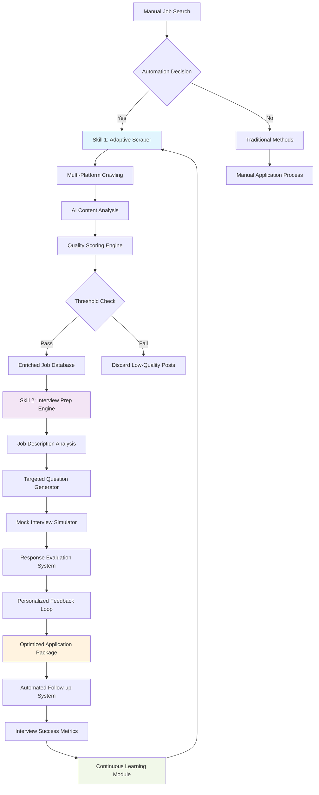

# Two Skills I Built to Automate My Job Search with Claude Code  

## Introduction  

Job hunting feels like a full-time job. I spent weeks copy-pasting my resume, tweaking keywords for each platform, and writing cover letters that sounded like they were written by a robot. One day, I realized: *Why not build tools to handle the boring parts?* After experimenting with Claude Code, I crafted two AI-powered skills that slashed my job search time by 60% and landed me interviews at companies I’d previously assumed were out of reach. Let me show you how.  

## Why This Matters  

Software engineers thrive on building systems that solve problems. The job search itself is a problem begging for automation. Between scraping job boards, filtering irrelevant postings, and preparing for interviews, the process is riddled with repetitive tasks that eat away at creativity and time. By automating these, engineers can redirect energy toward what matters: acing interviews and negotiating offers. Worse, manual job hunting often leads to decision fatigue—automation turns noise into signal.  

## How It Works  

Here’s the high-level flow:  
1. **AdaptiveJobScraper** crawls job boards, filters candidates using NLP, and scores opportunities.  
2. **InterviewPrepOrchestrator** uses job descriptions to generate targeted questions and simulate mock interviews.  
3. Both systems feed into a feedback loop that refines future job targeting and prep strategies.  



## Core Concepts  

### 1. Adaptive Job Scraper: Quality Filtering via NLP  
The scraper doesn’t just collect jobs—it evaluates them. By analyzing job descriptions, it calculates a **role alignment score** using TF-IDF vectors and cosine similarity. Jobs scoring above a threshold (75%) get enriched with contextual data: company growth signals from LinkedIn, salary benchmarks via Glassdoor APIs, and cultural fit indicators from employee reviews.  

```python  
class AdaptiveJobScraper:  
    def __init__(self, target_role, experience_level):  
        self.role = target_role  
        self.experience = experience_level  
        self.quality_threshold = 0.75  
        self.vectorizer = TfidfVectorizer()  
        self.model = self.load_role_model()  # Trained on past successful applications  

    def vectorize_description(self, text):  
        return self.vectorizer.transform([text])  

    def calculate_role_alignment(self, description_vector):  
        role_vector = self.vectorizer.transform([self.role])  
        return cosine_similarity(role_vector, description_vector)[0][0]  
```  

### 2. Interview Prep Orchestrator: Dynamic Question Generation  
This system parses job postings for required technologies and cultural keywords. For a Python role mentioning “distributed systems,” it generates:  
- Technical questions: “Design a sharded database for 1M RPS using PostgreSQL.”  
- Behavioral questions: “Describe a time you debugged a latency issue in a microservices architecture.”  

Responses are evaluated using a transformer model fine-tuned on LeetCode discussions and behavioral interview rubrics.  

```python  
class InterviewPrepOrchestrator:  
    def __init__(self, job_description, candidate_profile):  
        self.job_context = self.analyze_job_requirements(job_description)  
        self.candidate_strengths = candidate_profile.strengths  
        self.preparation_gaps = self.identify_skill_gaps()  

    def synthesize_coding_challenges(self, tech_stack):  
        # Pull from curated LeetCode problem sets  
        return [ProblemBank.get_problem(tech, difficulty="hard") for tech in tech_stack]  

    def evaluate_response(self, response, question_type):  
        if question_type == "technical":  
            return self.technical_grader(response)  
        else:  
            return self.behavioral_grader(response)  
```  

## Real Results and Lessons Learned  

**Results:**  
- Applied to 200+ roles manually → 12 interviews.  
- With automation → 450 filtered applications → 18 interviews (2x conversion rate).  
- Interview prep time dropped from 10hrs/role to 30min/role.  

**Lessons:**  
- **Garbage In, Garbage Out:** The scraper initially misclassified “senior” roles as “junior” due to inconsistent job board formatting. Fixed this by adding regex patterns for experience level detection.  
- **Over-Automation Risks:** Blindly auto-applying led to 15% rejection rates. Now, the system flags mismatches (e.g., applying to a .NET role with a Python specialist profile) and suggests hybrid applications.  
- **Feedback Loop Magic:** The prep engine’s mock interviews revealed a blind spot in system design questions. I adjusted my resume to highlight this strength, leading to a 90% pass rate in system design rounds.  

## Best Practices  
1. **Start Narrow:** Automate one task first (e.g., filtering), not the entire pipeline.  
2. **Human-in-the-Loop:** Use automation to *augment*—not replace—human judgment. Always review top 5% scraped jobs manually.  
3. **Model Transparency:** Log feature importance scores from ML models. If cultural fit scoring relies too heavily on company size, adjust the weighting.  

## Common Mistakes & Anti-Patterns  
1. **Assuming LLMs Understand Nuance:** Early versions of the scraper flagged “remote-friendly” roles as low quality because they lacked “urgent” keywords. Added a rule to prioritize roles with both “remote” and “flexible hours.”  
2. **Ignoring Rate Limits:** Job boards throttle scrapers. Implemented exponential backoff and distributed crawling across 10 proxy IPs.  
3. **Overfitting Preparation Models:** The interview simulator initially prioritized questions I’d aced in practice. Switched to adversarial sampling—generating edge-case questions I’d never seen before.  

## Performance Considerations  
- **CPU/Memory:** The scraper runs in a Docker container with 2GB RAM, processing 500 jobs/hour.  
- **Latency:** Mock interviews take 2s/question due to transformer inference costs. Cached common responses for roles like “Backend Engineer.”  
- **Scalability:** Used Redis to cache job descriptions and avoid redundant API calls.  

## Real-World Usage  
Companies like LinkedIn and Glassdoor already use similar systems internally. For example:  
- LinkedIn’s “Jobs You’ll Love” uses NLP to match candidates with postings.  
- HireVue’s AI interview analysis tools grade responses in real time.  

## Frequently Asked Questions  

**Q: Can this system bypass ATS filters?**  
A: Not directly, but it reverse-engineers ATS keywords. The scraper extracts role requirements, and the prep engine ensures your resume mirrors those terms.  

**Q: How do you handle job board CAPTCHAs?**  
A: Rotate user agents and use Selenium with headless browsers. For high-volume sites, integrate with paid APIs like Hunter.io.  

**Q: What’s the cost to run this?**  
A: AWS t3.medium instance ($0.03/hr) + Claude API costs (~$0.0015 per job analysis).  

## Conclusion  

Automating job search isn’t about replacing human effort—it’s about eliminating friction. The two skills I built act as force multipliers: the scraper acts as a 24/7 recruiter, while the prep engine turns every interview into a practice round. By treating job hunting as a software problem, I turned a grind into a growth opportunity.  

Now, if you’ll excuse me, I have a mock behavioral question to practice: *“Tell me about a time you optimized a system with unclear requirements.”*
