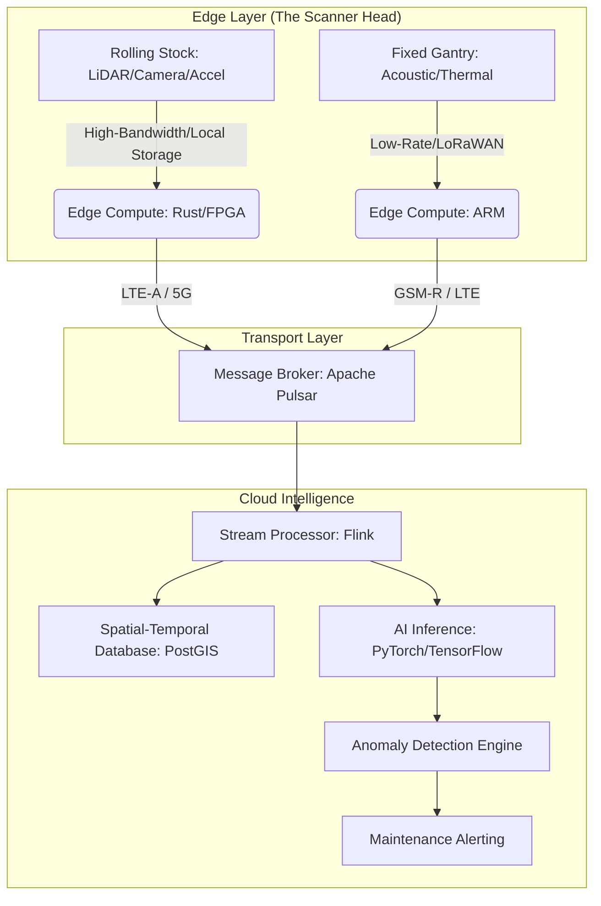

# Using the railway network as a flatbed scanner

## Introduction

Traditional infrastructure inspection is a reactive, episodic nightmare. To check a bridge's structural integrity or a rail's alignment, you typically deploy a specialized vehicle, schedule a maintenance window, and hope the sensor data collected during that 4-hour window is sufficient to catch a millimeter-scale shift. This "point-in-time" approach is inherently flawed. By the time the data is processed, the environment has changed.

We are proposing a shift from episodic inspection to continuous, ubiquitous sensing. By treating the global railway corridor as a moving "flatbed scanner," we can transform every passing train and every fixed gantry into a data-acquisition node. Instead of sending a specialized vehicle to the problem, we make the problem pass through a high-resolution, multi-modal sensing lattice.

## Why This Matters

For software and AI engineers, this represents a massive, untapped frontier in multimodal data ingestion. We aren't just talking about "collecting data"; we are talking about high-fidelity, time-series, georeferenced spatial data at a scale that breaks traditional ingestion pipelines.

If we can successfully turn a railway into a scanner, we solve three critical problems:
1.  **Predictive Maintenance at Scale:** We move from "it broke" to "the vibration signature of this switch changed by 4% over the last 30 days."
2.  **Environmental Intelligence:** Continuous monitoring of soil moisture, vegetation encroachment, and weather patterns along the right-of-way.
3.  **Data Density:** We move from sparse, manual samples to a dense, continuous stream of environmental "snapshots."

## How It Works

The architecture relies on a tiered sensing model. At the edge, we have "Active Nodes" (mounted on rolling stock) and "Passive Nodes" (fixed along the track). As a train moves, it acts as the scanning head, passing by fixed sensors or using its own onboard suite to capture the environment.



The workflow is a continuous loop: sensors capture raw signals $\rightarrow$ edge devices perform sensor fusion and compression $\rightarrow$ high-throughput streaming handles the ingestion $\rightarrow$ AI models perform spatio-temporal anomaly detection against a historical baseline.

## Core Concepts

*   **Spatio-Temporal Anchoring:** Every data packet must be tagged with a precise GPS coordinate and a microsecond-accurate timestamp. Without this, the "scan" is useless because you can't reconstruct the physical state of the track.
*   **Sensor Fusion (Edge-Side):** We don't send raw video or raw LiDAR point clouds to the cloud; that would saturate the network. We use FPGAs to perform initial registration and feature extraction (e.g., detecting a crack or a misalignment) at the edge.
*   **The Moving Reference Frame:** Unlike a traditional scanner where the object is stationary, here both the sensor and the object (the track/environment) are moving. This requires sophisticated Kalman filtering to reconcile the relative motion.

## Examples & Code Walkthrough

Handling the ingestion of these high-frequency telemetry packets requires a language that provides memory safety without sacrificing the performance needed for real-time stream processing. We use **Rust** for the edge firmware to ensure we don't hit a segmentation fault while processing a 4K video stream at 60fps.

Here is a conceptual implementation of an edge-side data packet structure and a basic ingestion routine using Rust.

```rust
// edge_scanner/src/models.rs

use serde::{Serialize, Deserialize};

#[derive(Debug, Serialize, Deserialize)]
pub struct GeoLocation {
    pub latitude: f64,
    pub longitude: f64,
    pub altitude: f32,
}

#[derive(Debug, Serialize, Deserialize)]
pub enum SensorPayload {
    LidarPoint(Vec<f32>), // Compressed point cloud data
    AcousticSpectrum(Vec<f32>), // FFT results
    VisualFeature(Vec<u8>), // Compressed feature vector (not raw image)
}

#[derive(Debug, Serialize, Deserialize)]
pub struct ScanPacket {
    pub timestamp_us: u64,
    pub location: GeoLocation,
    pub sensor_id: String,
    pub payload: SensorPayload,
}

// edge_scanner/src/processor.rs

use crate::models::{ScanPacket, SensorPayload};

pub struct EdgeProcessor {
    pub buffer_limit: usize,
}

impl EdgeProcessor {
    pub fn new(limit: usize) -> Self {
        Self { buffer_limit: limit }
    }

    /// Processes raw sensor data and converts it into a compressed ScanPacket
    pub fn process_and_compress(&self, raw_data: Vec<u8>, loc: GeoLocation) -> Result<ScanPacket, String> {
        // In a real scenario, this would involve heavy DSP or FPGA interaction
        // Here we simulate a successful feature extraction
        if raw_data.is_empty() {
            return Err("Empty payload".to_string());
        }

        Ok(ScanPacket {
            timestamp_us: 1715432000000, // Simulated timestamp
            location: loc,
            sensor_id: "train_unit_402_loco".to_string(),
            payload: SensorPayload::AcousticSpectrum(vec![0.1, 0.5, 0.2]),
        })
    }
}
```

On the cloud side, we need to ingest this at massive scale. **Apache Pulsar** is our choice because it allows us to partition data by "Track Segment ID," ensuring that all data for a specific section of rail is processed in order by the same consumer group.

## Best Practices

1.  **Prioritize Feature Extraction at the Edge:** Never stream raw high-resolution video unless a specific trigger (like a detected anomaly) occurs. Stream the *features* (vectors), not the pixels.
2.  **Design for Disconnected Operation:** Trains move through tunnels and remote areas. Your edge node must have a local NVMe buffer to store data during outages and "backfill" the cloud once connectivity is restored.
3.  **Use Deterministic Timing:** Use PTP (Precision Time Protocol) to synchronize clocks across all nodes in the network. If your timestamps drift by even a few milliseconds, your spatial reconstruction will fail.

## Common Mistakes & Anti-Patterns

*   **The "Dump Everything" Anti-Pattern:** Trying to stream raw LiDAR point clouds over LTE. You will hit bandwidth ceilings immediately, and the latency will spike, making real-time monitoring impossible.
*   **Ignoring the Reference Frame:** Treating sensor data as a simple time-series without accounting for the velocity and vibration of the sensor itself. This results in "ghost" anomalies that are actually just motion artifacts.
*   **Over-reliance on Cloud Inference:** Waiting for the cloud to tell you if a train is about to derail. Critical safety-of-life decisions must happen on the edge with deterministic latency.

## Performance Considerations

*   **Computational Complexity:** The point-cloud registration at the edge is $O(N \log N)$ where $N$ is the number of points. This is why we offload this to FPGAs or dedicated DSPs.
*   **Network Throughput:** By using feature vectors (e.g., 512-float embeddings) instead of raw images (e.g., 2MB JPEGs), we achieve a reduction in bandwidth requirements of roughly $1000\times$.
*   **Storage I/O:** The edge device must handle high-frequency writes to flash. We use a circular buffer on the NVMe to prevent write-exhaustion and ensure we always have the most recent "untransmitted" data.

## Real-World Usage

Major freight operators in North America and heavy-rail networks in Europe are already experimenting with "intelligent rolling stock." They mount high-speed cameras and accelerometers on locomotives to detect track geometry issues. The evolution we are discussing—turning the entire network into a continuous, distributed scanner—is the logical next step for automated, autonomous rail infrastructure management.

## Frequently Asked Questions (FAQ)

**Q: How do we handle different sensor types from different manufacturers?**
A: We enforce a strict schema via a Schema Registry (like Pulsar's). All hardware must implement a standard "Driver Interface" that converts proprietary signals into our internal `ScanPacket` format.

**Q: Won't the vibration of the train destroy the sensors?**
A: Yes, vibration is a major failure mode. We use industrial-grade, MIL-STD-810G rated hardware and implement software-level vibration compensation in the signal processing pipeline.

**Q: Is this only for high-speed rail?**
A: No. In fact, the "scanner" concept is arguably more valuable for freight rail, where the goal is detecting slow-moving structural degradation over thousands of miles of remote track.

## Conclusion

The transition from periodic inspection to a continuous "railway scanner" is a massive engineering challenge, but it is the only way to manage the complexity of modern infrastructure. By combining edge computing, robust streaming architectures, and precise spatio-temporal modeling, we can turn a passive piece of steel into a high-fidelity sensor network. For the software engineer, this is a call to build systems that are as resilient and relentless as the trains themselves.
