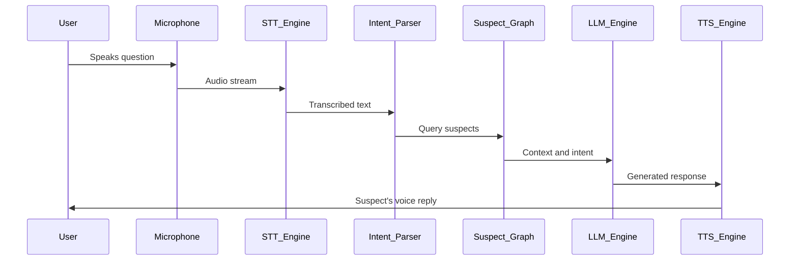

# Voice driven murder mystery, Interview AI suspects with your voice  

## Introduction  
Imagine solving a murder mystery not through text or touchscreens, but by speaking into a microphone. Your voice becomes the tool to interrogate AI suspects, analyze their responses, and piece together clues in real time. This concept merges immersive storytelling with cutting-edge AI, creating an experience where human voice drives both the narrative and the investigation. It’s not just a game—it’s a prototype for interactive systems where voice acts as a primary interface, blending natural human interaction with machine intelligence.  

## Why This Matters  
Voice-driven interfaces are no longer futuristic—they’re here. From smart assistants to immersive games, voice is becoming the default way humans interact with technology. This project leverages that trend to solve a specific challenge: how to make AI-driven narratives feel personal and dynamic. Traditional text-based mystery games lack the nuance of spoken language, where tone, emphasis, and pauses matter. By using voice, we add a layer of realism. Engineers should care because this approach pushes the boundaries of real-time speech processing, intent recognition, and adaptive storytelling. It’s a blueprint for applications beyond games—think customer service bots that “listen” for sentiment or educational tools that adapt to a user’s spoken questions.  

## How It Works  
The system revolves around a feedback loop: you speak, the AI listens, it responds, and you dig deeper. Here’s the flow:  
1. **Voice Input**: Your microphone captures audio.  
2. **Speech-to-Text (STT)**: The system transcribes your words.  
3. **Intent Parsing**: It identifies keywords or questions related to suspects.  
4. **Suspect Query**: The AI cross-references your question with a knowledge base of characters.  
5. **Response Generation**: A language model crafts a suspect’s reply.  
6. **Text-to-Speech (TTS)**: The suspect’s answer is spoken back to you.  

This cycle repeats, with the system adapting to your next question. Below is a Mermaid.js diagram of the architecture:  



The system’s power lies in its ability to treat voice as both input and output, creating a loop where human speech shapes the AI’s behavior and vice versa.  

## Core Concepts  
### Voice as Input  
Voice input requires robust audio processing. Noise cancellation, real-time streaming, and compatibility with diverse accents are critical. Our prototype uses WebRTC for low-latency audio capture and Whisper for transcription, which handles varied speech patterns better than generic models.  

### Intent Extraction  
Not all questions are equal. The system must distinguish between “Who killed the victim?” and “Why did they do it?” This is done via keyword matching and context analysis. For example, if you ask, “Did suspect X have a motive?” the parser flags “motive” and “suspect X” to query the knowledge base.  

### Suspect Knowledge Base  
Each suspect has a graph of relationships: motives, alibis, contradictions. The database (inspired by Neo4j) stores this as nodes and edges. Queries might look for “suspects who were near the crime scene at 10 PM” or “characters with a history of violence.”  

### Adaptive Dialogue  
The dialogue isn’t scripted. A state machine tracks the conversation’s state (e.g., “alibi phase” or “motive phase”), while an LLM generates follow-up questions. If you ask about a suspect’s alibi, the LLM might respond with, “Interesting. What evidence do you have to contradict that?”  

## Examples & Code Walkthrough  
Here’s a simplified Python snippet showing the core logic. This code runs on a single device, prioritizing low latency:  

```python
# voice_mystery/core.py
import asyncio
from edge_tts import Communicate  # For TTS
from whisper import load_model  # For STT

# Load models once at startup
whisper_model = load_model("whisper-base.en")
suspect_graph = load_suspect_data()  # Hypothetical function

async def process_voice():
    while True:
        # 1. Capture audio (WebRTC in production)
        audio_chunk = await capture_audio()
        
        # 2. Transcribe to text
        text = whisper_model.transcribe(audio_chunk)
        
        # 3. Parse intent (e.g., "Who did it?")
        intent = extract_intent(text)  # Custom logic
        
        # 4. Query suspects
        response = suspect_graph.query(intent)
        
        # 5. Generate spoken reply
        async for chunk in Communicate(response).stream():
            play_audio(chunk)  # Output to speakers
```  

### Key Design Choices  
- **Whisper for STT**: Prioritized accuracy over speed for critical interrogations.  
- **Edge-based TTS**: Uses local models (Edge TTS) to reduce latency vs. cloud APIs.  
- **Stateful LLM**: Maintains conversation history via a simple cache to avoid repetitive questions.  

## Best Practices  
- **Optimize STT for real-time**: Use models tuned for low latency, even if accuracy dips slightly.  
- **Normalize voice input**: Standardize accents and background noise to improve transcription.  
- **Cache suspect data**: Precompute relationships to avoid slow database queries during interactions.  

## Common Mistakes & Anti-Patterns  
1. **Ignoring audio quality**: Poor transcription ruins the experience. Always include noise suppression.  
2. **Overcomplicating intent parsing**: Simple keyword matching often suffices; avoid heavy NLP unless necessary.  
3. **Static responses**: Suspects should adapt to new information. A fixed answer breaks immersion.  

## Performance Considerations  
- **Latency**: STT and TTS should complete within 1 second for real-time feel.  
- **Memory**: Caching suspect graphs and conversation history is essential for scalability.  
- **Scalability**: For multi-user systems, distribute the suspect graph across nodes.  

## Real-World Usage  
While this prototype is experimental, similar tech exists in voice-activated games and AI-driven customer service. For example, a bank might use voice to “interrogate” a fraud detection system, asking, “Show me transactions over $10k last month.”  

## Frequently Asked Questions (FAQ)  
**Q: How does the system handle multiple users?**  
A: Each session isolates the audio stream and suspect graph query.  

**Q: Can suspects lie or change their story?**  
A: Yes! The LLM can be programmed to alter responses based on “evidence” provided by the user.  

**Q: What if the transcription is wrong?**  
A: The system flags low-confidence transcripts and asks for rephrasing.  

## Conclusion  
A voice-driven murder mystery isn’t just a creative exercise—it’s a proof of concept for AI systems that prioritize human-like interaction. By treating voice as both a query and a response medium, we unlock new possibilities for immersive AI. Engineers building such systems must balance technical rigor (low-latency STT, efficient graph queries) with narrative design (adaptive dialogue, immersive feedback). The next step? Expanding this to multiplayer mysteries or integrating video clues. The future of AI isn’t text-based—it’s conversational.
