# Wallfacer – A terminal session manager for Claude Code, and more

## Introduction

You've got three Claude Code sessions open. One is halfway through refactoring a payment service's idempotency layer. Another is debugging a flaky integration test in a Rust crate. The third is drafting a schema migration that you started two days ago and can't quite remember the prompt that got you past the tricky part. Your context windows are burning tokens. Your terminal scrollback is a graveyard of half-remembered decisions. And you have no idea which session holds the breakthrough you need right now.

This is the problem Wallfacer solves. It's a terminal session manager purpose-built for AI-assisted coding workflows -- starting with Claude Code, but designed to work with any LLM CLI wrapper. Think of it as `git` for your AI conversations: versioned, branchable, archivable, and completely terminal-native.

The name comes from Liu Cixin's *Three-Body Problem*. A Wallfacer operates in isolation, shielded from observation, free to explore strategies others cannot. That's exactly what a well-managed AI coding session should feel like.

## Why This Matters

Here's what nobody talks about when they demo AI coding assistants: the session management problem. IDE integrations and web UIs give you tabs and history, but they don't give you the structural tooling that software engineers actually rely on -- branching, checkpointing, tagging, diffing, and archiving.

In our production environment at a fintech company, we ran into this hard. A senior engineer had been working with Claude Code on a distributed lock manager for three days. The session had accumulated 40,000 tokens of conversation. When we needed to hand off the work to another engineer, there was no clean way to export the context, no way to branch off a sub-task, and no way to archive the completed work for future reference. We were essentially losing institutional knowledge every time a session timed out or a context window reset.

Traditional terminal workflows have tools for this. `tmux` and `screen` manage terminal panes. `script` logs sessions. But none of them understand the *semantics* of an AI-assisted coding session -- the prompts, the responses, the code diffs, the checkpoints where a strategy changed. Wallfacer fills that gap.

## How It Works

Wallfacer sits between you and your LLM CLI, intercepting input and output to build a structured, queryable record of every session. It manages the lifecycle from spawn to archive, handles context composition across multiple layers, and provides a plugin system for integrating with your existing toolchain.

```mermaid
flowchart TD
    A[Developer CLI] -->|wallfacer new| B[Session Orchestrator]
    B --> C[Create Session Directory\nUUID + Timestamp + Config]
    C --> D[Launch LLM CLI Wrapper]
    D -->|stdin/stdout pipe| E[Context Engine]
    E --> F[Layer 0: System Prompt]
    E --> G[Layer 1: Active File Context]
    E --> H[Layer 2: Conversation History\nSliding Window]
    E --> I[Layer 3: Project Knowledge Graph]
    E --> J[Layer 4: Archived Session Insights]
    F --> K[Token Budgeting Algorithm]
    G --> K
    H --> K
    I --> K
    J --> K
    K --> L[Assembled Prompt to LLM]
    L --> M[LLM Response]
    M --> N[Log Exchange + Tag]
    N --> O{Developer Action?}
    O -->|wallfacer checkpoint| P[Snapshot: Conversation\nCode Diffs + Env State]
    O -->|wallfacer branch| Q[Spawn Divergent Session\nfrom Checkpoint]
    O -->|wallfacer archive| R[Compress + Tag + Store]
    O -->|Continue| D
    P --> D
    Q --> B
```



The architecture has five core components:

**Session Orchestrator** manages the full lifecycle -- spawning new sessions, creating checkpoints, branching from checkpoints, and archiving completed work. Each session gets its own directory under `~/.wallfacer/sessions/` with a UUID, timestamp, and configuration snapshot.

**Context Engine** is where the real complexity lives. It composes prompts across five stacked layers (detailed in Core Concepts), runs a token budgeting algorithm to stay within your configured limits, and logs every exchange for later retrieval.

**Storage Layer** is intentionally file-based: SQLite for metadata and structured queries, plus plain text and diff files on the filesystem. This makes every session diffable with `git diff`, searchable with standard tools, and portable across machines without a database server.

**Plugin Hooks** fire pre- and post-execution, letting you inject custom tooling -- linting, test runs, security scans -- at specific points in the session lifecycle.

**CLI Interface** is a single binary with subcommands (`new`, `checkpoint`, `branch`, `archive`, `list`, `resume`, `search`). It's built for speed and scriptability, not for a pretty TUI.

## Core Concepts

### Session Immutability with Mutable Checkpoints

Every session is immutable once created. You never rewrite history. But you can create checkpoints -- named snapshots that capture the conversation state, code changes, and environment context at a specific moment. Checkpoints are mutable in the sense that you can create new ones on top of old ones, building a chain of decision points.

This mirrors how git works: commits are immutable, but branches fork from them freely.

### Layered Context Stacking

The context engine composes prompts from five layers, each with its own priority and token budget allocation:

- **Layer 0 -- System Prompt:** Project-level instructions, coding standards, architecture decisions. This is high-signal, low-volume content. It rarely changes within a session but defines the AI's behavior.
- **Layer 1 -- Active File Context:** The file currently being edited, including surrounding context (a few hundred lines around the cursor). This is the highest-priority dynamic content.
- **Layer 2 -- Recent Conversation:** A sliding window of the most recent exchanges. Wallfacer uses a token-aware window that prioritizes exchanges where code was actually modified or where the user explicitly tagged a turn as "important."
- **Layer 3 -- Project Knowledge Graph:** An index of imports, dependencies, key symbols, and architectural patterns derived from static analysis. This gives the AI awareness of the broader codebase without stuffing every file into the context window.
- **Layer 4 -- Archived Session Insights:** Relevant snippets from past sessions -- resolved bugs, architectural decisions, patterns that were tried and abandoned. This layer is searched and filtered by keyword and tag before being injected.

The token budgeting algorithm allocates tokens proportionally: Layer 0 gets a fixed minimum, Layer 1 gets priority for the active file, Layer 2 gets a configurable sliding window, and Layers 3 and 4 share the remainder. If the total exceeds the budget, Layer 4 is truncated first, then Layer 3, then Layer 2 from the oldest exchanges. Layer 0 and Layer 1 are preserved as long as possible.

### Pluggable Context Pipelines

Not every project needs all five layers. Wallfacer lets you define custom context pipelines in the configuration file. You can add layers for database schemas, API contracts, test fixtures, or anything else that's relevant to your workflow. The pipeline is expressed as an ordered list of context sources, each with a token weight.

### Terminal-Native, Git-Friendly

Wallfacer stores everything in plain files. Session metadata goes into SQLite. Conversation logs are plain text with structured headers. Code diffs are stored as unified diffs. Configuration is TOML. This means you can:

- `git init` in a project and commit your `wallfacer.toml` alongside your code.
- Use `grep`, `awk`, `sed`, or any standard Unix tool to search session logs.
- Back up sessions with your regular backup strategy.
- Move sessions between machines by copying a directory.

There is no database server, no daemon, no network dependency. It works on an air-gapped machine.

## Examples & Code Walkthrough

### Wallfacer Configuration File

Here's a realistic project-level configuration for a Rust services workspace:

```toml
# wallfacer.toml -- Project-level configuration
[session]
default_model = "claude-sonnet-4-20250514"
max_tokens = 8000
checkpoint_interval = 10  # auto-checkpoint every 10 exchanges
archive_on_complete = true

[context]
stack_layers = ["system", "active_file", "conversation", "knowledge_graph", "archived"]

[context.token_budget]
system = 500
active_file = 3000
conversation = 2500
knowledge_graph = 1000
archived = 1500

[context.knowledge_graph]
enabled = true
index_command = "cargo doc --document-private-items"
symbols_file = "target/wallfacer/symbols.json"

[context.archived]
max_sessions = 50
search_tags = ["bugfix", "architecture", "migration"]

[storage]
backend = "filesystem"
session_dir = "~/.wallfacer/sessions"
db_path = "~/.wallfacer/wallfacer.db"

[hooks]
pre_execution = ["./scripts/pre-wallfacer.sh"]
post_execution = ["./scripts/post-wallfacer.sh"]

[plugins]
enabled = ["diff-tracker", "test-runner", "lint-on-checkpoint"]

[plugins.diff-tracker]
command = "git diff --stat HEAD"
trigger = "checkpoint"

[plugins.test-runner]
command = "cargo test --workspace"
trigger = "post_checkpoint"
fail_session_on_failure = false
```

### Spawning a Session

```bash
# Create a new session for the payment-service refactor
$ wallfacer new --name "idempotency-refactor" \
    --project ./services/payment-service \
    --model claude-sonnet-4-20250514 \
    --max-tokens 8000

Session created: sess_7f3a9b2c
Directory: ~/.wallfacer/sessions/sess_7f3a9b2c/
Model: claude-sonnet-4-20250514
Context layers: system → active_file → conversation → knowledge_graph → archived

Starting Claude Code session...
```

This creates a directory structure like:

```
~/.wallfacer/sessions/sess_7f3a9b2c/
├── config.toml          # Snapshot of the config at creation time
├── conversation.log     # Append-only log of all exchanges
├── checkpoints/
│   ├── 001_init.json    # First checkpoint metadata
│   └── 002_refactor.json
├── diffs/
│   ├── 001_init.diff    # Code diff at each checkpoint
│   └── 002_refactor.diff
├── knowledge_graph.json # Project symbol index
└── state.json           # Current session state (active file, turn count, etc.)
```

### Creating a Checkpoint

```bash
$ wallfacer checkpoint --message "Resolved deadlock in lock acquisition path" \
    --tag "bugfix" --tag "concurrency"

Checkpoint created: cp_003
  - Conversation snapshot saved (2,847 tokens)
  - Code diff captured: 3 files changed, 47 insertions(+), 12 deletions(-)
  - Environment snapshot: Rust 1.79.0, target x86_64-unknown-linux-gnu
  - Post-hook: cargo test --workspace -- 2 passed, 0 failed
```

### Branching from a Checkpoint

Sometimes you want to explore an alternative approach without losing the original thread. Wallfacer lets you branch from any checkpoint:

```bash
# Spawn a new session exploring an async approach to the same problem
$ wallfacer branch cp_003 --name "async-lock-alternative" \
    --model claude-opus-4-20250514

Session created: sess_a1b2c3d4 (branched from cp_003)
  - Inherits conversation history up to checkpoint
  - New context: active file + conversation + knowledge graph
  - Independent checkpoint chain from this point forward
```

The branched session starts with the full conversation history from the parent up to the checkpoint, then diverges. Both sessions remain independent -- you can archive one, continue the other, or merge insights later.

### Searching Archived Sessions

```bash
# Find all archived sessions that mention "deadlock" and are tagged "bugfix"
$ wallfacer search --query "deadlock" --tags bugfix --type archive

Results:
  sess_7f3a9b2c (idempotency-refactor)
    Checkpoint cp_003: "Resolved deadlock in lock acquisition path"
    Excerpt: "We switched from a single global lock to per-shard mutexes..."

  sess_4e8d1f55 (distributed-queue)
    Checkpoint cp_007: "Fix deadlock in consumer group rebalance"
    Excerpt: "The rebalance handler was holding the partition lock while..."
```

### The Context Engine in Action

Here's a simplified view of how Wallfacer assembles a prompt before sending it to Claude Code:

```rust
// Simplified context assembly logic (conceptual)
pub fn assemble_prompt(session: &Session, config: &ContextConfig) -> AssembledPrompt {
    let mut layers = Vec::new();
    let mut total_tokens = 0;

    // Layer 0: System prompt (always included, fixed budget)
    let system = load_system_prompt(&session.project);
    total_tokens += system.token_count();
    layers.push(Layer {
        name: "system",
        content: system,
        tokens: system.token_count(),
        priority: Priority::Fixed,
    });

    // Layer 1: Active file (highest dynamic priority)
    if let Some(active) = session.active_file() {
        let context = active.context_around_cursor(config.active_file_context_lines);
        total_tokens += context.token_count();
        layers.push(Layer {
            name: "active_file",
            content: context,
            tokens: context.token_count(),
            priority: Priority::High,
        });
    }

    // Layer 2: Conversation history (sliding window, oldest-first truncation)
    let conversation = session.recent_exchanges(config.conversation_window);
    total_tokens += conversation.token_count();
    layers.push(Layer {
        name: "conversation",
        content: conversation,
        tokens: conversation.token_count(),
        priority: Priority::Medium,
    });

    // Layer 3 & 4: Knowledge graph and archived insights (share remainder budget)
    let remaining = config.max_tokens.saturating_sub(total_tokens);
    let (kg, archived) = split_remaining(remaining);

    if let Some(kg_content) = session.knowledge_graph(kg) {
        layers.push(Layer {
            name: "knowledge_graph",
            content: kg_content,
            tokens: kg_content.token_count(),
            priority: Priority::Low,
        });
    }

    if let Some(archived_content) = session.archived_insights(archived) {
        layers.push(Layer {
            name: "archived",
            content: archived_content,
            tokens: archived_content.token_count(),
            priority: Priority::Lowest,
        });
    }

    AssembledPrompt { layers, total_tokens }
}
```

The token budgeting is the critical piece. Without it, you'd either blow past your context window or starve the AI of relevant information. Wallfacer's algorithm is straightforward: allocate fixed budgets to high-priority layers first, then distribute the remainder to lower layers, truncating from the bottom up.

## Best Practices

**Name your sessions and checkpoints with intent, not just timestamps.** A checkpoint called "cp
