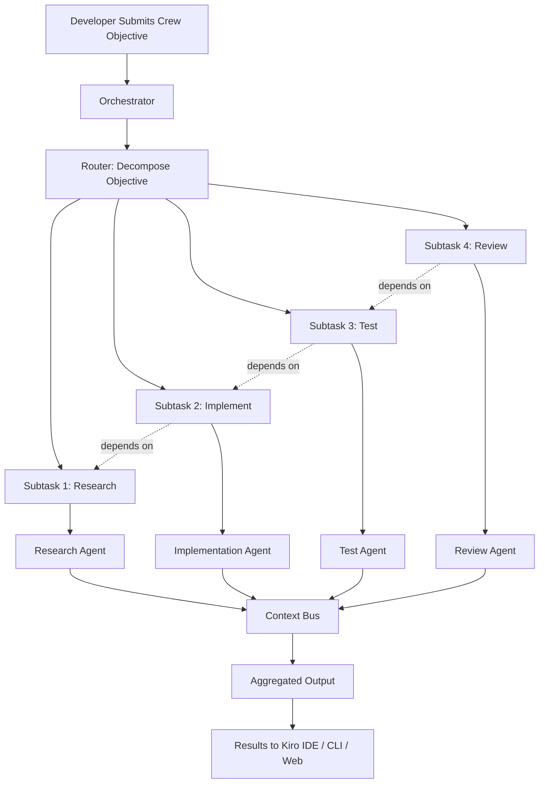

# We already have Kiro IDE, Kiro CLI, Kiro Web - What exactly Kiro Crew is?

## Introduction

You are three hours into a sprint. Kiro IDE has your backend service half-written. Kiro CLI just ran a pre-commit hook that generated migration scripts. Kiro Web gave you a quick prototype of the new auth flow in under two minutes. You have three surfaces, three agents, and one gnarly full-stack feature to ship.

Then the question hits you: why can't these agents talk to each other? Why does the IDE agent not know what the CLI agent just generated? Why can't the Web agent feed its prototype results back into the spec the IDE agent is working from?

That gap — that missing coordination layer — is exactly what Kiro Crew addresses. Kiro Crew is the agent orchestration framework built into the Kiro platform. It lets you define a team of specialized AI agents, assign them roles, give them a shared goal, and let them collaborate on complex, multi-step tasks the way a real engineering team would.

This article is a deep technical walkthrough. We will cover the architecture, the core abstractions, a working code example, and the real-world trade-offs you should know about before adopting Crew in production.

## Why This Matters

Here is the honest truth most blog posts skip: single-agent systems hit a wall fast. When your agent is responsible for research, coding, testing, and documentation simultaneously, it context-switches constantly. The quality of each individual step drops. You get code that compiles but has no tests. You get documentation that describes a feature that does not match the implementation. You get a brittle feedback loop where one mistake cascades through the entire pipeline.

Kiro Crew solves this by separating concerns. You get an agent specialized for research. Another for implementation. Another for code review. Another for test generation. Each agent operates within its strengths. They communicate through a shared context bus. The result is higher-quality output, better traceability, and a system that scales with the complexity of the task.

For teams already using Kiro IDE for day-to-day development, Kiro CLI for automation, and Kiro Web for rapid prototyping, Crew is the glue that makes all three surfaces work together on a single coordinated objective.

## How It Works

Kiro Crew operates on a layered architecture with four primary components: the Orchestrator, the Router, the Agent Pool, and the Context Bus.

When you submit a crew-level objective — say, "Implement the payment refund flow end-to-end" — the Orchestrator receives it and passes it to the Router. The Router decomposes the objective into discrete subtasks based on the agents registered in the crew. Each subtask gets a type (research, implement, test, review), a priority, and a set of input artifacts.

The Router then dispatches subtasks to available agents in the Agent Pool. Agents pull work, execute it using their specialized capabilities, and write results to the Context Bus. Other agents can read from the Context Bus to gather context before starting their own work. The Orchestrator monitors progress, handles retries on failure, and enforces ordering constraints where subtasks have dependencies.

Here is the architecture visualized:



The dependency arrows are critical. Subtasks are not just dispatched in parallel — they are sequenced based on what each agent needs to know before it can do its job. The Research Agent must finish before the Implementation Agent starts. The Implementation Agent must finish before the Test Agent can write meaningful tests. And the Review Agent needs all three outputs before it can provide a coherent assessment.

The Context Bus is the shared memory layer. Think of it as an append-only log of artifacts — research notes, code diffs, test results, review comments. Every agent reads from it and writes to it. It is structured, typed, and versioned so that agents can reference specific states of the work as it progresses.

## Core Concepts

### Crew

A Crew is a named collection of agents with a shared objective. It defines the agents involved, the ordering constraints between their tasks, and the output format. A Crew is not a single agent running faster — it is multiple agents working together, each doing what it is best at.

### Agent

An Agent is a role with a specific capability profile. In Kiro Crew, you define agents by:

- **Role**: A human-readable identifier (e.g., `payment-researcher`, `backend-implementer`).
- **Specialization**: The domain or capability the agent excels at (e.g., API design, security review, test generation).
- **Tool access**: Which tools the agent can use (file system, terminal, HTTP calls, Kiro IDE hooks).
- **Input/output schema**: What artifacts the agent expects to receive and what it produces.

Agents are not LLM wrappers. They are structured execution environments with defined boundaries, input validation, and output contracts.

### Task

A Task is a unit of work within a Crew. It has:

- A `description` field explaining what needs to be done.
- An `agent` field specifying which agent should execute it.
- A `depends_on` field listing prerequisite tasks.
- An `input_artifacts` field declaring what context the task needs from the Context Bus.
- An `output_artifact` field declaring what the task will produce.

### Context Bus

The Context Bus is the shared memory backbone of Crew. It is a structured, versioned store where agents publish their results and pull context from previous agents. It uses a simple key-value model with schema validation. Each entry has a `source` (which agent produced it), a `timestamp`, a `schema_version`, and the `payload` itself.

The Context Bus is not a database. It is an in-memory, append-only log that persists for the lifetime of a Crew execution. Once the Crew completes, the bus is archived. This design keeps agents fast and avoids the complexity of long-lived state management.

## Examples & Code Walkthrough

Let us walk through a concrete example. We are building a distributed lock manager for a high-throughput payment queue. We define a Crew with four agents and execute it end-to-end.

```python
from kiro_crew import Crew, Agent, Task, ContextBus

# Initialize the shared context bus
bus = ContextBus()

# Define our agents with explicit specializations
researcher = Agent(
    role="payment-systems-researcher",
    specialization="distributed-systems",
    tools=["web_search", "spec_parser", "api_inspector"],
    input_schema={"topic": "string", "constraints": "list[str]"},
    output_schema={"findings": "dict", "risks": "list[str]"}
)

architect = Agent(
    role="system-architect",
    specialization="api-design",
    tools=["diagram_generator", "schema_validator"],
    input_schema={"requirements": "dict", "research_findings": "dict"},
    output_schema={"design": "dict", "interfaces": "list[dict]"}
)

implementer = Agent(
    role="backend-developer",
    specialization="python-concurrency",
    tools=["file_editor", "test_runner", "linter"],
    input_schema={"design": "dict", "interfaces": "list[dict]"},
    output_schema={"code_diff": "str", "files_changed": "list[str]"}
)

reviewer = Agent(
    role="security-reviewer",
    specialization="concurrency-safety",
    tools=["static_analyzer", "diff_inspector"],
    input_schema={"code_diff": "str", "design": "dict"},
    output_schema={"issues": "list[dict]", "approved": "bool"}
)

# Register the crew
crew = Crew(
    name="payment-lock-manager",
    objective="Implement a distributed lock manager for the high-throughput payment queue with deadlock detection.",
    agents=[researcher, architect, implementer, reviewer],
    context_bus=bus
)

# Define tasks with dependencies
research_task = Task(
    description="Research best practices for distributed lock managers in payment systems. Focus on Redis-based and ZooKeeper-based approaches.",
    agent=researcher,
    input_artifacts=[],
    output_artifact="research_findings",
    depends_on=[]
)

design_task = Task(
    description="Design the lock manager API and internal state machine based on research findings.",
    agent=architect,
    input_artifacts=["research_findings"],
    output_artifact="system_design",
    depends_on=[research_task]
)

implementation_task = Task(
    description="Implement the distributed lock manager in Python using asyncio and Redis.",
    agent=implementer,
    input_artifacts=["system_design"],
    output_artifact="code_implementation",
    depends_on=[design_task]
)

review_task = Task(
    description="Review the implementation for race conditions, deadlock scenarios, and security issues.",
    agent=reviewer,
    input_artifacts=["code_implementation", "system_design"],
    output_artifact="review_results",
    depends_on=[implementation_task]
)

# Execute the crew
result = crew.run(tasks=[research_task, design_task, implementation_task, review_task])

# Inspect the results
for artifact in result.artifacts:
    print(f"[{artifact.source_agent}] {artifact.output_key}: {artifact.summary()}")
```

Notice how each task declares its inputs and outputs explicitly. The `depends_on` field creates a directed acyclic graph (DAG) of execution. The Orchestrator uses this DAG to determine the order of execution and to parallelize tasks that have no dependencies on each other.

Here is what the Context Bus looks like after execution:

```json
{
  "entries": [
    {
      "source": "payment-systems-researcher",
      "key": "research_findings",
      "schema_version": "1.0",
      "payload": {
        "redis_based": "Recommended for low-latency payment queues",
        "zookeeper_based": "Better for strong consistency guarantees",
        "risks": ["split-brain in Redis cluster", "znode limit under high throughput"]
      }
    },
    {
      "source": "system-architect",
      "key": "system_design",
      "schema_version": "1.0",
      "payload": {
        "lock_type": "lease-based",
        "ttl_ms": 5000,
        "deadlock_detection": "wait-for graph with periodic cycle detection",
        "interfaces": ["acquire_lock", "release_lock", "renew_lease", "detect_deadlock"]
      }
    }
  ]
}
```

The Context Bus gives every agent a single source of truth. The reviewer agent can trace back exactly what design decision led to a particular implementation choice. This is where Crew becomes powerful — it is not just about parallel execution, it is about traceability and accountability across the entire agent pipeline.

## Best Practices

**Keep agents narrowly scoped.** The temptation is to give each agent broad capabilities. Resist this. An agent that both writes code and reviews code will optimize for its own output instead of critically evaluating it. Narrow scope leads to honest review.

**Define explicit input/output schemas.** Do not let agents pass raw strings between each other. Typed schemas catch mismatches early and make the Context Bus queryable. When the reviewer agent expects a `code_diff` string but gets a `dict` instead, that is a bug you want to catch at dispatch time, not at review time.

**Use the Context Bus for traceability, not as a database.** The Context Bus is ephemeral by design. Do not store long-lived configuration or persistent state in it. If you need to persist results across Crew executions, write an explicit export step at the end of the pipeline.

**Start with two agents, not five.** A two-agent crew (implementer + reviewer) is enough to validate the pattern. Add complexity only when you see real coordination needs. Most teams overestimate how many agents they need on day one.

**Monitor the DAG execution time.** If your crew has ten tasks and the critical path is long, you will feel the latency in your development loop. Profile which agents are slow, and consider whether some subtasks can be reorganized or parallelized.

## Common Mistakes & Anti-Patterns

**Mistake 1: Circular dependencies in the task DAG.** This is the most common error when defining a Crew. Agent A depends on B, B depends on C, and C depends on A. The Orchestrator will detect this and throw an error, but it happens more often than you would expect because developers define tasks incrementally without checking the full dependency graph. Always visualize your DAG before running. The Mermaid diagram above is a good mental model for what a healthy dependency graph looks like.

**Mistake 2: Overloading the Context Bus with intermediate noise.** When agents write verbose debug logs or partial results to the Context Bus, subsequent agents have to parse through noise to find what they actually need. Use the `output_artifact` field to declare exactly what each task produces, and enforce that agents only write to the keys they are responsible for.

**Mistake 3: Ignoring agent failure modes.** Agents fail. The LLM times out. The tool returns an unexpected schema. The file the implementer agent was supposed to edit does not exist. If you do not handle failures explicitly — with retries, fallback agents, or graceful degradation — your Crew will hang or produce incomplete results. Build failure handling into your Crew definition from the start, not as an afterthought.

**Mistake 4: Treating Crew as a replacement for code review.** Crew's reviewer agent is a powerful tool, but it is not a substitute for human code review. The reviewer agent catches obvious bugs, race conditions, and schema mismatches. It does not catch business logic errors, UX issues, or
