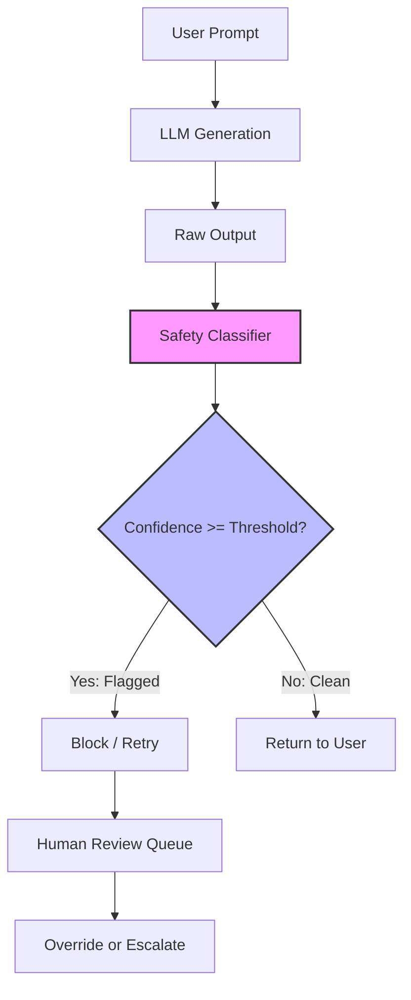

# We Thought the LLM Was Wrong. Our Safety Detector Was Wrong.

## Introduction

Last quarter, our customer support bot started rejecting perfectly benign requests. A user asked, "How do I calm my anxious dog?" and the safety layer returned a 403. Another user typed, "I want to hurt myself" — and the system let it through. Both failures came from the same safety classifier, and both cost us real trust.

This article walks through why safety detectors for LLMs produce false positives and false negatives, what's actually happening under the hood, and how to build a production-grade guardrail pipeline that doesn't break your application.

## Why This Matters

Safety filters sit between your LLM and the end user. They're supposed to catch toxic, dangerous, or policy-violating outputs before they reach the client. When they misfire:

- **False positives** block legitimate queries. Users see error messages instead of answers. Support tickets pile up. Your NPS drops.
- **False negatives** let harmful content through. That's a PR incident, a regulatory problem, or worse.

Most teams bolt on a third-party classifier, set a confidence threshold, and call it done. But classifiers are statistical models — they lie. Understanding *when* and *why* they lie is the difference between a robust system and a ticking time bomb.

## How It Works

A typical safety pipeline has three stages: the LLM generates text, a classifier scores it, and a decision gate either passes or blocks the output based on a threshold. The problem is that every stage introduces error.



Here's the breakdown:

1. **LLM Generation** — The model produces text based on prompt context. Temperature, sampling strategy, and system prompts all influence output toxicity probability.
2. **Safety Classifier** — A separate model (often a fine-tuned BERT or RoBERTa variant) tokenizes the output and produces a harm probability score per category: hate speech, violence, self-harm, sexual content, etc.
3. **Decision Gate** — A hard threshold (e.g., `score > 0.85`) triggers a block. Anything below passes through.

The failure modes are asymmetric. Classifiers trained on curated datasets overfit to obvious profanity and miss subtle harm. They also struggle with domain-specific language — medical discussions, legal analysis, or creative writing that uses charged words in benign contexts.

## Core Concepts

**Confidence calibration.** Most classifiers output raw logits or softmax probabilities that aren't well-calibrated. A score of 0.8 doesn't mean "80% chance this is harmful." It means the model is 80% confident in its top class. If your training data is imbalanced (95% benign, 5% harmful), the model learns to predict "benign" most of the time, and its confidence scores skew low even for harmful content.

**Threshold selection.** Setting a single global threshold is a blunt instrument. A threshold of 0.5 might give you 90% recall on harmful content but 40% false positive rate. Push it to 0.95 and false positives drop, but you miss real threats. The right threshold depends on your cost function — is a false negative (letting harm through) worse than a false positive (blocking a legitimate query)?

**Ensemble disagreement.** Running multiple classifiers and taking a vote reduces variance. If two out of three models flag content, you escalate. If only one does, you might pass it with a warning. This is more expensive but dramatically more robust.

## Examples & Code Walkthrough

Here's a production-grade safety pipeline in Python. It uses an ensemble of two classifiers, calibrates scores with isotonic regression, and includes a human review fallback.

```python
import logging
from typing import NamedTuple, List
from sklearn.calibration import CalibratedClassifierCV
from sklearn.ensemble import RandomForestClassifier
from sklearn.linear_model import LogisticRegression

logger = logging.getLogger(__name__)

class SafetyVerdict(NamedTuple):
    blocked: bool
    confidence: float
    categories: List[str]
    review_id: str | None

class SafetyPipeline:
    """
    Ensemble safety classifier with calibrated probabilities
    and a human-review fallback for edge cases.
    """

    def __init__(
        self,
        base_clf_a,
        base_clf_b,
        threshold_block: float = 0.80,
        threshold_review: float = 0.55,
    ):
        # Wrap base classifiers in calibration wrappers
        # This fixes the raw softmax scores that aren't true probabilities
        self.clf_a = CalibratedClassifierCV(base_clf_a, cv="prefit", method="isotonic")
        self.clf_b = CalibratedClassifierCV(base_clf_b, cv="prefit", method="isotonic")
        self.threshold_block = threshold_block
        self.threshold_review = threshold_review
        self.harm_categories = ["violence", "hate", "self_harm", "sexual", "illegal"]

    def predict(self, text: str, metadata: dict | None = None) -> SafetyVerdict:
        if not text or not text.strip():
            # Empty input — nothing to classify, pass through
            return SafetyVerdict(blocked=False, confidence=0.0, categories=[], review_id=None)

        # Run both classifiers independently
        proba_a = self.clf_a.predict_proba([text])[0]
        proba_b = self.clf_b.predict_proba([text])[0]

        # Average calibrated probabilities across the ensemble
        avg_proba = (proba_a + proba_b) / 2.0

        # Find the highest harm score and its category
        max_score = max(avg_proba)
        worst_idx = int(proba_a.argmax())  # both have same label ordering
        worst_category = self.harm_categories[worst_idx]

        # Decision logic with three tiers: block, review, pass
        if max_score >= self.threshold_block:
            logger.warning(
                "BLOCKED text=%r category=%s score=%.3f metadata=%s",
                text[:200], worst_category, max_score, metadata,
            )
            return SafetyVerdict(blocked=True, confidence=float(max_score),
                                 categories=[worst_category], review_id=None)

        if max_score >= self.threshold_review:
            review_id = self._submit_for_human_review(text, worst_category, max_score)
            logger.info(
                "REVIEW queued text=%r category=%s score=%.3f review_id=%s",
                text[:200], worst_category, max_score, review_id,
            )
            return SafetyVerdict(blocked=False, confidence=float(max_score),
                                 categories=[worst_category], review_id=review_id)

        return SafetyVerdict(blocked=False, confidence=float(max_score),
                             categories=[], review_id=None)

    def _submit_for_human_review(self, text: str, category: str, score: float) -> str:
        """
        Placeholder: push to a review queue (Redis, SQS, database).
        Returns a review ID for tracking.
        """
        import uuid
        review_id = str(uuid.uuid4())
        # In production: publish to queue, write to DB, trigger alert
        return review_id
```

Key design choices in this code:

- **Isotonic calibration** fixes the well-known miscalibration of tree-based and linear models. Without it, a "0.8 confidence" might actually represent 0.6 or 0.95 real probability.
- **Three-tier decision** (block / review / pass) avoids the binary trap. Edge cases get human eyes instead of an automatic reject.
- **Metadata logging** on every decision lets you audit false positives later and retrain.

## Best Practices

1. **Measure your actual false positive rate in production.** Don't trust the validation set. Log every blocked request, have humans label a sample weekly, and track FP/RP drift over time.
2. **Tune thresholds per category.** Violence and self-harm deserve lower thresholds (more sensitive) than, say, "sexual content" in a medical context.
3. **Use a shadow mode first.** Deploy the new classifier alongside the old one, log both decisions, and compare for two weeks before switching traffic.
4. **Keep a human override path.** Every blocked request should be appealable. Users get frustrated when they can't talk to a person.
5. **Retrain on your own data.** Public safety datasets (like the RealToxicityPrompts corpus) don't reflect your domain. Fine-tune on your own flagged-and-reviewed samples.

## Common Mistakes & Anti-Patterns

**Mistake 1: Single classifier, single threshold.** One model with one number is fragile. If that model has a bug or drift, you have no fallback. Fix: use an ensemble and tiered thresholds as shown above.

**Mistake 2: No calibration.** Raw softmax scores from a BERT model are not probabilities. Using them directly as confidence leads to terrible threshold decisions. Fix: always calibrate with `CalibratedClassifierCV` or Platt scaling.

**Mistake 3: Ignoring context.** A sentence like "I killed it at the meeting" is benign. A classifier that looks at unigrams will flag "killed." Fix: use a model that considers full-sentence context (transformer-based) or add a whitelist for known-safe phrases in your domain.

**Mistake 4: No feedback loop.** If a user appeals a block, that's gold — but most teams never log the appeal outcome. Fix: pipe appeals back into your training set as negative examples for that text.

## Performance Considerations

- **Latency:** Running two classifiers adds ~50-150ms per request depending on model size. For synchronous APIs, this is painful. Consider async pre-filtering or caching frequent queries.
- **Memory:** A calibrated RoBERTa-base model is ~450MB. If you run it in a serverless function, cold starts will hurt. Use a warmed container pool or a smaller distilled model for the first pass.
- **Throughput:** With isotonic calibration, prediction is O(n) in sequence length for the transformer, plus O(1) for the calibrator. Bottleneck is almost always the transformer inference, not the calibration step.
- **Big-O:** Classification itself is linear in token count for transformer-based models. Calibration adds constant overhead per prediction.

## Real-World Usage

Companies like OpenAI, Anthropic, and Google build multi-layered safety systems. OpenAI uses a combination of rule-based filters, learned classifiers, and reinforcement learning from human feedback (RLHF) to reduce harmful outputs at the generation stage — not just after.

At scale, the pattern is: **pre-generation guardrails** (prompt-level filtering), **post-generation classifiers** (the pipeline we built above), and **human-in-the-loop review** for edge cases. Cloudflare's AI Gateway applies similar logic, routing requests through safety checks before they hit the model provider.

Netflix uses ensemble classifiers for content recommendation safety — flagging recommendations that could be harmful or inappropriate — and tunes thresholds differently per region based on local regulations and cultural norms.

## Frequently Asked Questions (FAQ)

**Q: Can I just use OpenAI's moderation API instead of building my own?**
A: For many apps, yes — it's fast and well-maintained. But it's a black box. You can't calibrate thresholds, inspect internals, or handle domain-specific false positives. Use it as a first pass, not your only layer.

**Q: How do I measure false positive rate in production?**
A: Log every blocked request with the raw text and score. Sample 5-10% weekly and have a human label each as "true harm" or "false positive." Track the ratio. Aim for <2% FP rate on benign traffic.

**Q: What threshold should I start with?**
A: Start at 0.80 for blocking and 0.55 for review. Then tune using your labeled data — plot precision-recall curves and pick the point that matches your cost tolerance.

**Q: How often should I retrain?**
A: Retrain when your false positive rate drifts >10% week-over-week, or every 2-4 weeks with fresh labeled data. Language drift is real — new slang, new contexts, new ways to say harmful things benignly.

**Q: Is this enough for compliance (GDPR, AI Act)?**
A: Not alone. You need audit logs, human review workflows, and documented policies. The technical pipeline is one piece of a broader governance framework.

## Conclusion

Safety detectors are necessary but insufficient on their own. They're statistical models with known failure modes — false positives frustrate users, false negatives create liability. The right approach is an ensemble with calibrated probabilities, tiered decision thresholds, and a human review path for the messy middle.

Build the pipeline, measure it relentlessly, and treat every false positive as a bug worth fixing. Your users will notice the difference.
