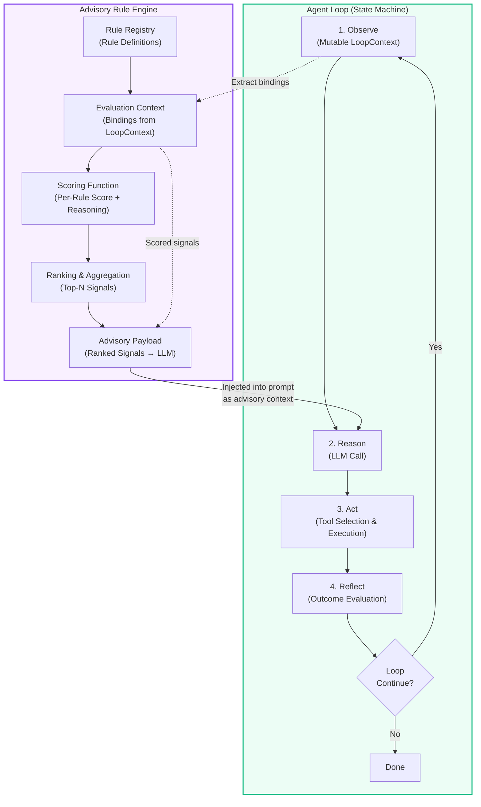

# What Advisory Rules Actually Do in an Agent Loop

## Introduction

Picture this: your agent is running in a production loop. It observes state, calls an LLM, picks a tool, executes, and reflects on the result. The LLM call gets all the attention — token counts, temperature tuning, prompt engineering war stories. The tool execution gets its share — retries, timeouts, idempotency keys. But there is a third layer sitting quietly between the reasoner and the action executor that almost nobody diagrams, and almost nobody tests properly. Advisory rules.

We have all been there. You ship an agent system. It works in staging. In production, it starts suggesting feature upgrades to users who explicitly churned last month. Or it retries a failed payment three times before anyone notices. Or it escalates a support ticket for a user on a free tier. The LLM made a reasonable call given the prompt. The tool executed correctly. The loop ran exactly as designed. But something in the reasoning layer was missing a nudge — a soft signal that should have redirected the agent before it acted.

That something is an advisory rule.

If you are building agent systems for anything beyond a toy demo, advisory rules are the difference between an agent that is clever and an agent that is trustworthy. This article covers what they actually do inside the loop, how they differ from guardrails and system prompts, and how to wire them into your architecture without turning your agent into an over-constrained puppet.

## Why This Matters

Agent loops are state machines with side effects. Every iteration modifies shared context — user profiles, conversation history, tool results, accumulated cost, retry counters. The LLM sees a snapshot of that context and decides what to do next. Advisory rules sit between the context and the decision, injecting scored signals that shift the agent's reasoning toward outcomes you care about.

The problem is that most engineering teams treat advisory rules as an afterthought. They get bolted on as system prompt paragraphs, which makes them static and brittle. Or they get implemented as hard guardrails, which makes the agent refuse to act in edge cases that are actually fine. Neither approach captures the nuance of what advisory rules are supposed to do: inform without commanding.

When we have built production agent pipelines, the teams that treated advisory rules as first-class citizens — with their own registration, evaluation pipeline, and scoring — consistently shipped more predictable agent behavior. The teams that ignored them spent weeks debugging why the agent kept making "stupid" decisions that no prompt tweak could fix.

## How It Works

The advisory rule engine lives inside the agent loop as a distinct component. It does not replace the LLM's reasoning. It does not block tool calls. It evaluates the current loop context, produces a ranked list of signals, and passes them to the reasoner so the LLM can incorporate them into its next decision.

Here is the architecture at a high level:



The loop runs as a state machine. On each iteration, the agent observes the current state, which populates the mutable `LoopContext`. Before the reasoner makes its LLM call, the advisory engine evaluates all registered rules against the current context. Each rule produces an `AdvisorySignal` — a scored, labeled snippet with a confidence score and a human-readable reasoning string. These signals get injected into the LLM's context window as structured advisory context. The LLM sees them as soft suggestions, not hard constraints.

The critical design decision here is that advisory rules do not return a boolean. They do not say "allow" or "deny." They return a ranked list of signals that shift the agent's probability distribution over actions. A high-confidence signal might push the agent toward a specific tool. A low-confidence signal might simply add a caveat to the LLM's reasoning chain.

## Core Concepts

### Loop Context

The loop context is the mutable state object that carries forward between iterations. It contains everything the agent has accumulated so far: conversation history, tool results, user metadata, retry counters, cost tracking, and any domain-specific state. Advisory rules read from this context but do not write to it. The reasoner or the action executor is responsible for mutating the context based on rule signals.

### Rule Registration

Rules are registered at startup or loaded from a configuration store. Each rule has a unique ID, a severity level, a priority (lower number means evaluated first), a condition function that determines whether the rule is active for the current context, and an evaluation function that produces a scored signal.

### Scoring Function

Each rule's evaluation function takes the current loop context and returns a numeric score between 0.0 and 1.0, along with a reasoning string. The score represents how strongly the rule applies to the current situation. A score of 0.0 means the rule is irrelevant. A score of 1.0 means the rule is firing at full strength.

### Advisory Payload

The advisory payload is the aggregated, ranked list of signals that gets passed to the LLM. It is ordered by a composite score that factors in severity, priority, and raw confidence. The payload is structured so the LLM can parse it deterministically — typically as a list of labeled items with scores and explanations.

## Examples & Code Walkthrough

Here is a complete, runnable implementation of an advisory rule engine integrated into an agent loop. The code is intentionally verbose to show the full lifecycle — registration, evaluation, scoring, and payload assembly.

```python
from __future__ import annotations

from dataclasses import dataclass, field
from enum import Enum
from typing import Callable, Optional


class AdvisorySeverity(Enum):
    LOW = "low"
    MEDIUM = "medium"
    HIGH = "high"


@dataclass(frozen=True)
class AdvisorySignal:
    rule_id: str
    label: str
    severity: AdvisorySeverity
    score: float  # 0.0 to 1.0
    reasoning: str


@dataclass
class AdvisoryRule:
    rule_id: str
    description: str
    severity: AdvisorySeverity
    priority: int  # lower number = evaluated first
    condition: Callable[["LoopContext"], bool]
    evaluate: Callable[["LoopContext"], AdvisorySignal]


@dataclass
class LoopContext:
    user_tier: str = "free"
    conversation_turn: int = 0
    retry_count: int = 0
    recent_topics: list[str] = field(default_factory=list)
    active_tools: list[str] = field(default_factory=list)
    user_flags: set[str] = field(default_factory=set)
    cost_accumulated_cents: int = 0


class AdvisoryEngine:
    def __init__(self) -> None:
        self._rules: dict[str, AdvisoryRule] = {}

    def register(self, rule: AdvisoryRule) -> None:
        if rule.rule_id in self._rules:
            raise ValueError(f"Duplicate rule_id: {rule.rule_id}")
        self._rules[rule.rule_id] = rule

    def evaluate(self, context: LoopContext) -> list[AdvisorySignal]:
        signals: list[AdvisorySignal] = []
        for rule in sorted(self._rules.values(), key=lambda r: r.priority):
            if not rule.condition(context):
                continue
            signal = rule.evaluate(context)
            signals.append(signal)
        signals.sort(key=lambda s: (-s.score, s.severity.value))
        return signals

    def build_payload(self, signals: list[AdvisorySignal], max_signals: int = 5) -> str:
        top = signals[:max_signals]
        if not top:
            return ""
        lines = ["--- ADVISORY SIGNALS ---"]
        for sig in top:
            lines.append(
                f"[{sig.severity.value.upper()}] {sig.label} "
                f"(score={sig.score:.2f}): {sig.reasoning}"
            )
        lines.append("--- END ADVISORY ---")
        return "\n".join(lines)


# --- Example Rules ---

def prefer_cheapest_tool_condition(context: LoopContext) -> bool:
    return "billing_check" in context.active_tools


def prefer_cheapest_tool_evaluate(context: LoopContext) -> AdvisorySignal:
    return AdvisorySignal(
        rule_id="prefer_cheapest_tool",
        label="Prefer lowest-cost tool variant",
        severity=AdvisorySeverity.MEDIUM,
        score=0.85,
        reasoning="User is on a free tier; suggest the free-tier tool variant first.",
    )


def no_premium_features_condition(context: LoopContext) -> bool:
    return context.user_tier != "enterprise" and "premium_feature" in context.recent_topics


def no_premium_features_evaluate(context: LoopContext) -> AdvisorySignal:
    return AdvisorySignal(
        rule_id="no_premium_features",
        label="Suppress premium feature suggestions",
        severity=AdvisorySeverity.HIGH,
        score=0.92,
        reasoning="User is not on an enterprise tier. Do not surface premium-only features.",
    )


def escalate_on_retry_condition(context: LoopContext) -> bool:
    return context.retry_count >= 3


def escalate_on_retry_evaluate(context: LoopContext) -> AdvisorySignal:
    return AdvisorySignal(
        rule_id="escalate_on_retry",
        label="Escalate to human operator",
        severity=AdvisorySeverity.HIGH,
        score=0.78,
        reasoning="Third consecutive retry detected. Consider human escalation.",
    )


def cross_reference_billing_condition(context: LoopContext) -> bool:
    return "billing" in context.recent_topics and "invoice_lookup" not in context.active_tools


def cross_reference_billing_evaluate(context: LoopContext) -> AdvisorySignal:
    return AdvisorySignal(
        rule_id="cross_reference_billing",
        label="Cross-reference invoice tool",
        severity=AdvisorySeverity.MEDIUM,
        score=0.65,
        reasoning="User mentioned billing but invoice tool has not been called. Consider enriching context.",
    )


# --- Wiring it up ---

engine = AdvisoryEngine()
engine.register(AdvisoryRule(
    rule_id="prefer_cheapest_tool",
    description="Suggest the cheapest available tool variant for free-tier users",
    severity=AdvisorySeverity.MEDIUM,
    priority=10,
    condition=prefer_cheapest_tool_condition,
    evaluate=prefer_cheapest_tool_evaluate,
))
engine.register(AdvisoryRule(
    rule_id="no_premium_features",
    description="Do not suggest premium features to non-enterprise users",
    severity=AdvisorySeverity.HIGH,
    priority=5,
    condition=no_premium_features_condition,
    evaluate=no_premium_features_evaluate,
))
engine.register(AdvisoryRule(
    rule_id="escalate_on_retry",
    description="Escalate to human after repeated retries",
    severity=AdvisorySeverity.HIGH,
    priority=1,
    condition=escalate_on_retry_condition,
    evaluate=escalate_on_retry_evaluate,
))
engine.register(AdvisoryRule(
    rule_id="cross_reference_billing",
    description="Cross-reference invoice tool when billing is discussed",
    severity=AdvisorySeverity.MEDIUM,
    priority=15,
    condition=cross_reference_billing_condition,
    evaluate=cross_reference_billing_evaluate,
))

# --- Simulating a loop iteration ---

context = LoopContext(
    user_tier="free",
    conversation_turn=4,
    retry_count=0,
    recent_topics=["billing", "invoice_status"],
    active_tools=["chat_response", "billing_check"],
    user_flags={"opted_out_promotions"},
)

signals = engine.evaluate(context)
payload = engine.build_payload(signals)
print(payload)
```

When you run this, the engine evaluates all four rules against the context. The `no_premium_features` rule fires because the user is on a free tier and billing topics are active. The `prefer_cheapest_tool` rule fires because the billing check tool is in the active tool list. The payload gets sorted by score and severity, then formatted into a string block that the LLM can parse as advisory context in its next reasoning step.

Notice the `escalate_on_retry` rule does not fire here because `retry_count` is 0. That is the point — rules evaluate lazily based on actual context, not hypotheticals.

## Best Practices

**Keep rules stateless.** Each rule's condition and evaluate functions should read from the loop context and produce a signal. They should not mutate the context or maintain internal mutable state. Stateless rules are deterministic, testable in isolation, and trivial to reason about when debugging a production incident.

**Score aggressively, filter conservatively.** When in doubt, let the scoring function return a moderate value rather than a binary on/off. A score of 0.6 is more useful than a hard block because it lets the LLM weigh the signal against other factors. Reserve hard blocking for actual guardrails, not advisory rules.

**Version your rule registry.** Rules change as your product evolves. A rule that was correct six months ago might be actively harmful now if your pricing model changed. Tag every rule with a version or effective date, and audit the registry quarterly.

**Test rules against edge cases, not happy paths.** The most valuable rule tests cover the boundary conditions: what happens when the user tier is missing from the context? What happens when the retry count is exactly at the threshold? What happens when two rules fire with conflicting signals of the same severity?

**Keep the advisory payload small.** The LLM's context window is finite. Limiting the payload to the top 3–5 signals by score prevents advisory noise from drowning out the actual task instructions. If you have 50 registered rules and 15 fire, the LLM gets confused.

## Common Mistakes & Anti-Patterns

**Mistake 1: Treating advisory rules as guardrails.** This is the most common failure mode. Engineers write rules that block or terminate the loop when a condition is met, effectively turning advisory rules into hard constraints. The problem is
