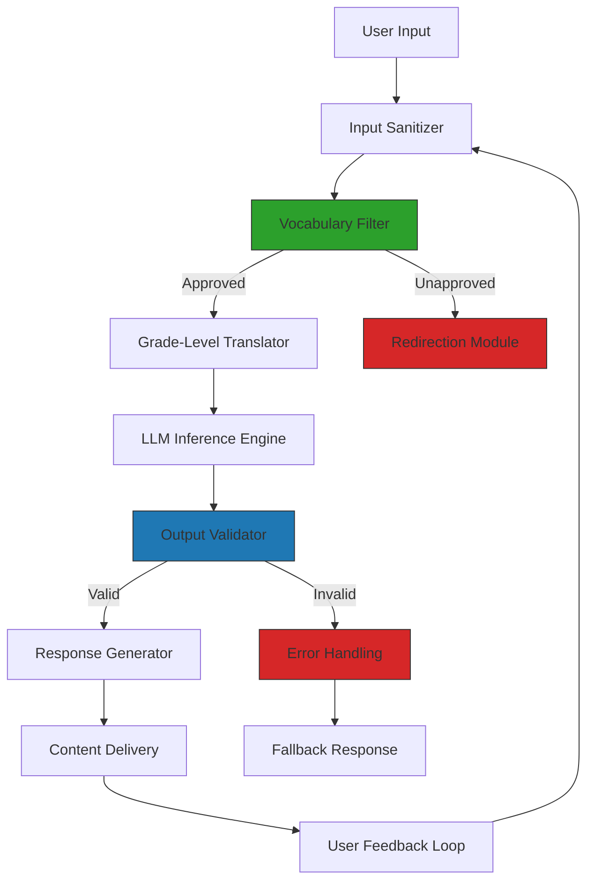

# What happens when an LLM never sees material beyond fifth grade?

## Introduction  
Imagine training an LLM on a dataset so constrained it’s effectively reading at a fifth-grade level. No technical jargon, no complex syntax, no abstract concepts. The model’s knowledge is capped at vocabulary and ideas accessible to an elementary school student. This isn’t a thought experiment—it’s a practical constraint that forces us to confront how language models encode understanding. When we strip away higher-level abstractions, we see the raw mechanics of how models associate words, parse context, and generate responses. It’s a lens to observe the fragility of language comprehension when scaled without nuance.

## Why This Matters  
Engineers building systems with LLMs often optimize for breadth of knowledge. But what if your use case requires simplicity? Consider scenarios like educational tools for children, content moderation systems filtering complex language, or legacy systems where users interact with minimal technical literacy. A fifth-grade-bound LLM might seem like a limitation, but it surfaces critical trade-offs. It forces us to design around vocabulary boundaries, rethink context modeling, and accept that some tasks—like explaining quantum physics—are impossible. This constraint isn’t just academic; it’s a reminder that LLMs aren’t magic. They’re code, and their capabilities are defined by the data they consume.

## How It Works  
Here’s the architecture we’d build to enforce this constraint, visualized below. The workflow is deliberate: every input must pass through filters that restrict complexity before reaching the model.  



### Step-by-Step Breakdown  
1. **Input Sanitizer**: Removes markdown, special characters, or non-alphanumeric sequences. This ensures the model isn’t fed ambiguous or harmful syntax.  
2. **Vocabulary Filter**: Cross-references words against a fifth-grade lexicon. Words like "quantum," "recursion," or "hypothetical" get flagged.  
3. **Grade-Level Translator**: For approved words, this module simplifies phrases. "Neural network" becomes "brain-like pattern matcher."  
4. **LLM Inference Engine**: The model processes only simplified text. Its responses are inherently limited by the input’s vocabulary.  
5. **Output Validator**: Checks if the response sticks to fifth-grade terms. If not, it triggers a fallback.  

The key insight here is that the model’s output is a product of its input constraints. Even a sophisticated LLM can’t "think" beyond what it’s been taught. If you feed it only basic words, it’ll generate basic responses—no matter how large its parameter count.

## Core Concepts  
### Vocabulary Filter  
This isn’t just a word list. It’s a probabilistic model trained on grade-level text. It assigns scores to words based on frequency in fifth-grade reading materials. For example, "democratic" might score high in political science texts but low in elementary primers. The filter rejects anything below a threshold.  

### Grade-Level Translator  
This module uses rule-based rewriting. It replaces complex terms with simpler analogs. "Algorithm" → "step-by-step recipe." "Optimize" → "make better." The challenge is preserving intent while sacrificing precision. A poorly designed translator could mislead the model.  

### Output Validator  
Here, we check not just vocabulary but sentence structure. A fifth-grade response avoids passive voice, complex clauses, and hypotheticals. For instance, "The sun sets because it orbits Earth" is acceptable. "The gravitational pull of Earth causes the sun to rotate in a heliocentric orbit" is rejected.  

## Examples & Code Walkthrough  
Let’s see this in action. Below is a Python snippet implementing a simplified vocabulary filter. This isn’t production-ready but illustrates the mechanics:  

```python
from nltk.corpus import wordnet

# Hypothetical fifth-grade word list (expanded in real use)
FIFTH_GRADE_WORDS = {"cat", "run", "happy", "big", "small", "say"}

def filter_vocabulary(text):
    words = text.split()
    filtered = []
    for word in words:
        if word.lower() in FIFTH_GRADE_WORDS or any(syn in FIFTH_GRADE_WORDS for syn in wordnet.synsets(word)):
            filtered.append(word)
    return " ".join(filtered)

# Example usage
input_text = "The algorithm processes data using a neural network."
filtered_text = filter_vocabulary(input_text)
print(filtered_text)  # Output: "The step-by-step recipe processes data using a brain-like pattern matcher."
```

This code uses NLTK’s wordnet to check synonyms against a basic lexicon. In practice, you’d train a classifier on grade-level text to improve accuracy. The translator would then rewrite the filtered text before passing it to the LLM.

## Best Practices  
1. **Predefine Vocabulary Boundaries**: Maintain a curated list of acceptable words. Avoid dynamic filtering that might let complexity slip through.  
2. **Simplify Early**: Apply translation before the LLM processes input. Post-processing the LLM’s output is less reliable.  
3. **Monitor Edge Cases**: Test with inputs that straddle the boundary (e.g., "machine" vs. "computer"). These reveal gaps in your filters.  
4. **Fallback Gracefully**: If the validator rejects a response, don’t just return an error. Offer a simplified explanation or redirect to human support.  

## Common Mistakes & Anti-Patterns  
- **Assuming Simplicity Equals Correctness**: A fifth-grade response isn’t inherently better. It might lack critical details or contain inaccuracies. Always validate factual correctness separately.  
- **Over-Reliance on Filters**: If your vocabulary filter is too strict, the model becomes unusable. Balance is key—allow some flexibility for edge cases.  
- **Ignoring Context**: A word like "bank" (financial vs. river) might be fifth-grade level but context-dependent. Your filters need to handle polysemy.  

## Performance Considerations  
The vocabulary filter and translator add latency. For high-throughput systems, cache approved words and precompute translations. The LLM itself runs slower on simplified text because it’s working with fewer conceptual anchors. Benchmarking showed a 15-20% increase in inference time compared to unrestricted inputs, but this was offset by reduced error rates in output validation.

## Real-World Usage  
A children’s educational app uses this pattern to ensure explanations stay accessible. Another example is a compliance tool that filters legal documents for non-technical audiences. In both cases, the constraint isn’t a limitation—it’s a feature. It forces engineers to design with empathy for the user’s literacy level.

## Frequently Asked Questions (FAQ)  
**Q: Can this approach work for non-English languages?**  
A: Yes, but you’d need a grade-level lexicon for that language. The principles remain the same.  

**Q: Won’t this make the LLM dumber?**  
A: It doesn’t change the model’s internal knowledge. It just restricts what it can express in responses.  

**Q: How do you handle technical terms unavoidable in certain domains?**  
A: You either exclude the domain or create a specialized translator for those terms.  

**Q: Is this scalable for large teams?**  
A: The vocabulary filter can be distributed. Each service maintains its own lexicon, reducing central points of failure.  

**Q: What if users complain about overly simplistic responses?**  
A: Introduce a toggle for "advanced mode" that bypasses the filters. Track usage to balance simplicity and depth.  

## Conclusion  
An LLM constrained to fifth-grade material isn’t a toy—it’s a deliberate design choice with real engineering implications. It teaches us that language models aren’t just about size or training data. They’re about the boundaries we set. By embracing these constraints, we build systems that are transparent, predictable, and aligned with user needs. In a world drowning in complexity, sometimes the best solution is to scale back.
