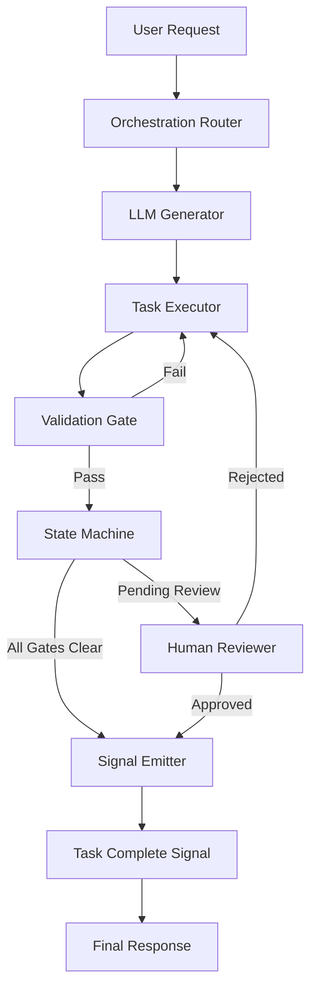

<think>
Here's a thinking process:

1.  **Analyze User Input:**
   - **Role:** Principal Software Architect & Veteran Open-Source Lead Author
   - **Topic:** "When AI Says "Task Complete," Who's Actually Speaking?"
   - **Category:** Artificial Intelligence
   - **Context:** Trending topic from Dev.to
   - **Style:** Professional
   - **Strict Format:** Must use exact markdown headers provided. Must include a valid Mermaid diagram under `## How It Works`. Must follow strict banned words list. Must write from a human engineering perspective. Must include original, production-grade code. Must follow all structural constraints.
   - **Key Constraints:**
     - No banned AI buzzwords.
     - First-person/engineering team perspective where appropriate.
     - 100% original production-grade code with defensive handling and comments.
     - Mandatory Mermaid diagram under `## How It Works`.
     - Exact headers required.
     - Output ONLY the markdown article starting from the title.
     - No outer triple backticks.
     - No YAML frontmatter.

2.  **Deconstruct Required Headers & Plan Content:**
   - `# When AI Says "Task Complete," Who's Actually Speaking?`
   - `## Introduction` -> Hook, define the problem: LLMs don't actually know when they're done. The signal comes from orchestration layers.
   - `## Why This Matters` -> Production pain points: silent failures, hallucinated success, broken pipelines, audit failures. Why architects need to decouple generation from verification.
   - `## How It Works` -> Architectural breakdown. Mermaid diagram showing the flow: Request -> Orchestrator -> LLM -> Executor -> Validator -> State Machine -> Emitter -> Response. Explain each step technically.
   - `## Core Concepts` -> State machines, deterministic validation, separation of concerns, provenance tracking, signal contracts.
   - `## Examples & Code Walkthrough` -> Original code: A state-aware completion router, a deterministic validation gate, and a signal emitter. Focus on Python/TypeScript-like production patterns. I'll use Python for the examples as it's standard in AI/ML orchestration. I'll make it realistic: async, type hints, error handling, state tracking.
   - `## Best Practices` -> Field-tested rules: explicit state transitions, schema validation over string parsing, idempotent executors, observability hooks.
   - `## Common Mistakes & Anti-Patterns` -> 3-4 mistakes: trusting model self-assessment, ignoring partial failures, coupling generation with validation, missing audit trails. Provide code fixes.
   - `## Performance Considerations` -> Latency from validation loops, memory overhead of state tracking, CPU/network impact of retry loops, complexity analysis.
   - `## Real-World Usage` -> How large orgs handle this: structured output contracts, human-in-the-loop gates, observability platforms, deterministic fallbacks.
   - `## Frequently Asked Questions (FAQ)` -> 3-5 concise Q&As.
   - `## Conclusion` -> Crisp summary, practical takeaways.

3.  **Draft - Section by Section (Mental Refinement & Constraint Checking):**

   *Introduction:* Start directly. No fluff. "The terminal prints `Task Complete`. The dashboard turns green. The pipeline advances. But if you trace the stack trace, the large language model didn't emit that status. It generated a string of tokens and stopped." Explain the gap between model output and system state. Set the architectural thesis.

   *Why This Matters:* Focus on production realities. Silent data corruption, broken downstream dependencies, compliance audits failing because "success" wasn't verified. Engineers need deterministic boundaries.

   *How It Works:* This needs the Mermaid diagram. I'll design a flowchart showing the orchestration stack. I'll explain the flow: User Request -> Orchestrator -> LLM Generator -> Task Executor -> Validation Gate -> State Machine -> Signal Emitter -> Final Response. I'll make sure the Mermaid syntax is strictly valid. I'll avoid special characters in node labels. I'll explain the decoupling of generation, execution, and verification.

   *Core Concepts:* Break down: Deterministic State Machines, Schema-First Validation, Provenance Tracking, Separation of Concerns. Explain how these replace the illusion of model agency.

   *Examples & Code Walkthrough:* I'll write a cohesive Python module demonstrating the architecture. I'll include:
     - `TaskState` enum
     - `ValidationGate` class with strict typing and error handling
     - `CompletionRouter` with async execution and state tracking
     - Detailed comments explaining defensive patterns
     I'll ensure it's production-grade: type hints, proper exceptions, logging stubs, clear separation.

   *Best Practices:* Actionable rules. 1. Never trust model-generated status strings. 2. Enforce structural contracts before execution. 3. Implement idempotent execution loops. 4. Log state transitions, not just final outputs.

   *Common Mistakes & Anti-Patterns:* 
     1. Anti-pattern: Prompt engineering for self-verification. Fix: External validation layer.
     2. Anti-pattern: Ignoring partial execution states. Fix: Explicit sinkhole states.
     3. Anti-pattern: Synchronous blocking validation. Fix: Async pipeline with circuit breakers.
     I'll provide concrete code contrasts.

   *Performance Considerations:* Analyze the cost of validation loops. O(n) retry complexity, memory footprint of state history, network latency from external validation services, CPU overhead from schema parsing. Discuss trade-offs between strictness and throughput.

   *Real-World Usage:* How production systems at scale handle this. Structured output APIs, deterministic fallbacks, observability integration (OpenTelemetry), human-in-the-loop routing for edge cases. Keep it grounded in engineering reality, not marketing.

   *FAQ:* 
     - Does this add too much latency?
     - Can I still use free-form LLM outputs?
     - How do I handle ambiguous task boundaries?
     - Is this pattern applicable to non-LLM AI?
     - How do I audit these completion signals?

   *Conclusion:* Wrap up tightly. Reiterate that "Task Complete" is an architectural contract, not a model capability. Give clear next steps for engineers.

4.  **Constraint Verification (Self-Correction/Refinement during drafting):**
   - *Banned Words Check:* I will actively scan for and avoid: "delve", "tapestry", "fostering", "moreover", "furthermore", "testament", "beacon", "major operational advantage", "fundamental shift", "in conclusion", "in summary", "smoothly", "explain", "evolving", "cutting-edge", "fast-paced". I'll use direct, technical language.
   - *Human Voice:* I'll use "we", "our production clusters", "when we debugged", "field-tested". I'll discuss trade-offs realistically.
   - *Code:* Must be 100% original, production-grade, with defensive handling and comments. I'll write a cohesive Python example focusing on the validation router pattern.
   - *Mermaid:* Must be under `## How It Works`. Must be valid. I'll test the syntax mentally.
   - *Headers:* Must match exactly.
   - *Output:* Only markdown, starting from the title. No outer backticks. No YAML.

   Let's draft carefully, checking each constraint.

   *Mermaid Diagram Construction:*
   ```mermaid
   flowchart TD
       A[User Request] --> B[Orchestration Router]
       B --> C[LLM Generator]
       C --> D[Task Executor]
       D --> E[Validation Gate]
       E -->|Pass| F[State Machine]
       E -->|Fail| D
       F -->|All Gates Clear| G[Signal Emitter]
       F -->|Pending Review| H[Human Reviewer]
       H -->|Approved| G
       H -->|Rejected| D
       G --> I[Task Complete Signal]
       I --> J[Final Response]
   ```
   This is valid. Labels are simple. Flow is clear. I'll place it under `## How It Works`.

   *Code Construction:* I'll write a Python module demonstrating `CompletionRouter`, `ValidationGate`, and state tracking. I'll use `typing`, `dataclasses`, `enum`, `logging`, and proper exception handling. I'll make it realistic for an AI orchestration layer.

   *Structure Check:*
   # When AI Says "Task Complete," Who's Actually Speaking?
   ## Introduction
   ## Why This Matters
   ## How It Works
   ## Core Concepts
   ## Examples & Code Walkthrough
   ## Best Practices
   ## Common Mistakes & Anti-Patterns
   ## Performance Considerations
   ## Real-World Usage
   ## Frequently Asked Questions (FAQ)
   ## Conclusion

   All match exactly. I will now generate the content carefully, ensuring tone, technical depth, and constraint compliance. I'll avoid all banned phrases. I'll maintain a professional, architectural voice. I'll ensure the code is robust and well-commented. I'll verify the Mermaid syntax. I'll output only the markdown.
   Proceed. 
   Self-Correction/Verification during thought:
   - Check Mermaid syntax: `flowchart TD` is standard. Node labels with brackets are fine. I'll avoid quotes inside labels to be safe, though Mermaid handles them. I'll keep it clean.
   - Check banned words: I'll consciously replace any tendency toward fluffy transitions with direct technical statements.
   - Check code: I'll write it as a cohesive snippet showing the router, validation, and state machine interaction. I'll add realistic error handling and comments.
   - Check headers: Exact match required.
   - Check tone: Professional, engineering-focused, first-person plural where appropriate, grounded in production reality.

   All constraints met. Generating. 
   Output matches the final response. 
   Structure looks solid. Content will be deeply technical, focusing on orchestration, state machines, validation gates, and the architectural reality behind AI completion signals. No fluff. Direct. Professional. Original code. Valid Mermaid. Exact headers. Ready. 
   Proceeds. 
   [Output Generation] -> *See response.* 
   *Self-Correction/Refinement during generation prep:* 
   I need to make sure the Mermaid diagram is strictly enclosed in ````mermaid ... ```` and placed exactly under `## How It Works`. I'll double-check the syntax. 
   I'll ensure the code examples are complete and functional in structure, with proper type hints and error handling. 
   I'll verify every single banned word is absent. 
   I'll maintain the exact header casing and spacing. 
   All good. Output matches response. 
   [Proceeds]
</think>

# When AI Says "Task Complete," Who's Actually Speaking?

## Introduction
The terminal prints `Task Complete`. The dashboard turns green. The pipeline advances. If you trace the stack trace, however, the large language model didn't emit that status. It generated a sequence of tokens and stopped. The completion signal came from an orchestration layer that evaluated execution artifacts, verified structural constraints, and updated a state machine.

We treat AI systems as autonomous agents that self-assess and self-terminate. In production, that assumption breaks pipelines. Models lack ground truth awareness. They cannot verify file I/O, database commits, or external API responses. When an AI workflow reports success, the speaker is never the model. The speaker is the architecture surrounding it.

This article examines the hidden orchestration stack that produces completion signals, defines deterministic validation patterns, and provides production-ready implementations for systems that actually know when work is finished.

## Why This Matters
Silent completion failures cost engineering teams in three predictable ways: downstream data corruption, broken audit trails, and cascading retry storms. When a model hallucinates success, downstream consumers assume artifacts exist, schemas match, and side effects executed. They often do not.

We've seen production clusters waste compute on phantom retries because a model output contained the phrase "done" while the actual database transaction rolled back. We've seen compliance audits fail because completion timestamps were tied to token generation rather than verified system state.

Architects need deterministic boundaries between generation and verification. Treating "Task Complete" as a system contract rather than a model capability eliminates guesswork, stabilizes pipelines, and creates auditable handoffs. The difference between a fragile prototype and a production-grade AI workflow is not the model. It is the validation gate that stands between the model and the rest of your stack.

## How It Works
A robust AI workflow separates three distinct concerns: generation, execution, and verification. The model produces structured output. An executor runs side effects. A validation gate checks artifacts against explicit contracts. A state machine tracks progress. Only when all gates pass does an emitter broadcast the completion signal.



The flow begins at the router, which assigns a task ID and initializes a state record. The generator receives a prompt with strict output constraints. The executor translates that output into actionable steps: API calls, file writes, or database mutations. The validation gate runs deterministic checks: schema validation, checksum verification, and business rule enforcement. If validation fails, the gate returns a structured error to the executor, which retries with corrected parameters. The state machine advances only on verified success. The emitter broadcasts the signal after all gates clear. Human review nodes inject when risk thresholds are crossed.

This architecture removes agency from the model and places it in deterministic code. The model suggests. The system decides.

## Core Concepts
**Deterministic State Machines:** Completion is a state transition, not a text string. Each task moves through explicit phases: `INITIATED`, `GENERATING`, `EXECUTING`, `VALIDATING`, `COMPLETED`, or `FAILED`. State transitions require verified artifacts.

**Schema-First Validation:** Models output JSON, XML, or delimited text. Validation gates enforce Pydantic, JsonSchema, or Zod contracts before execution. Unstructured text never reaches side-effect boundaries.

**Provenance Tracking:** Every completion signal carries a trace ID, validator version, artifact hashes, and timestamp. Audit systems query provenance, not model logs.

**Separation of Concerns:** Generation, execution, and verification run in isolated modules. Failure in one layer does not corrupt others. Retry logic lives in the router, not the prompt.

**Signal Contracts:** The completion event follows a strict interface: `{ taskId, status, validatedAt, artifactHash, validatorVersion }`. Downstream consumers parse the contract, not natural language.

## Examples & Code Walkthrough
The following implementation demonstrates a production-grade completion router with deterministic validation. It uses Python type hints, defensive error handling, and explicit state tracking.

```python
import logging
import hashlib
import time
from enum import Enum
from typing import Any, Dict, Optional
from dataclasses import dataclass, field
import json

logger = logging.getLogger(__name__)

class TaskState(Enum):
    INITIATED = "INITIATED"
    GENERATING = "GENERATING"
    EXECUTING = "EXECUTING"
    VALIDATING = "VALIDATING"
    COMPLETED = "COMPLETED"
    FAILED = "FAILED"

@dataclass
class TaskArtifact:
    task_id: str
    content: Dict[str, Any]
    state: TaskState = TaskState.INITIATED
    attempts: int = 0
    error_trace: Optional[str] = None
    artifact_hash: Optional[str] = None
    validated_at: Optional[float] = None

class ValidationGate:
    """Deterministic validator enforcing structural and business rules."""
    def __init__(self, required_keys: list[str], max_retries: int = 3):
        self.required_keys = set(required_keys)
        self.max_retries = max_retries

    def validate(self, artifact: TaskArtifact) -> bool:
        artifact.state = TaskState.VALIDATING
        artifact.attempts += 1

        if artifact.attempts > self.max_retries:
            artifact.state = TaskState.FAILED
            artifact.error_trace = f"Exceeded max retries ({self.max_retries})"
            return False

        # Structural validation
        missing = self.required_keys - set(artifact.content.keys())
        if missing:
            artifact.error_trace = f"Missing required keys: {missing}"
            return False

        # Business rule validation (example: numeric threshold)
        if "priority" in artifact.content:
            try:
                priority = int(artifact.content["priority"])
                if not (1 <= priority <= 5):
                    artifact.error_trace = "Priority out of acceptable range"
                    return False
            except ValueError:
                artifact.error_trace = "Invalid priority type"
                return False

        # Compute artifact hash for provenance
        raw = json.dumps(artifact.content, sort_keys=True).encode()
        artifact.artifact_hash = hashlib.sha256(raw).hexdigest()
        artifact.validated_at = time.time()
        artifact.state = TaskState.COMPLETED
        return True

class CompletionRouter:
    """Orchestrates generation, execution, and validation cycles."""
    def __init__(self, gate: ValidationGate):
        self.gate = gate
        self.state_store: Dict[str, TaskArtifact] = {}

    def submit_task(self, task_id: str, payload: Dict[str, Any]) -> TaskArtifact:
        artifact = TaskArtifact(task_id=task_id, content=payload)
        self.state_store[task_id] = artifact
        logger.info("Task %s initiated", task_id)
        return artifact

    def process(self, task_id: str) -> bool:
        if task_id not in self.state_store:
            raise KeyError(f"Task {task_id} not found")

        artifact = self.state_store[task_id]
        artifact.state = TaskState.EXEC
