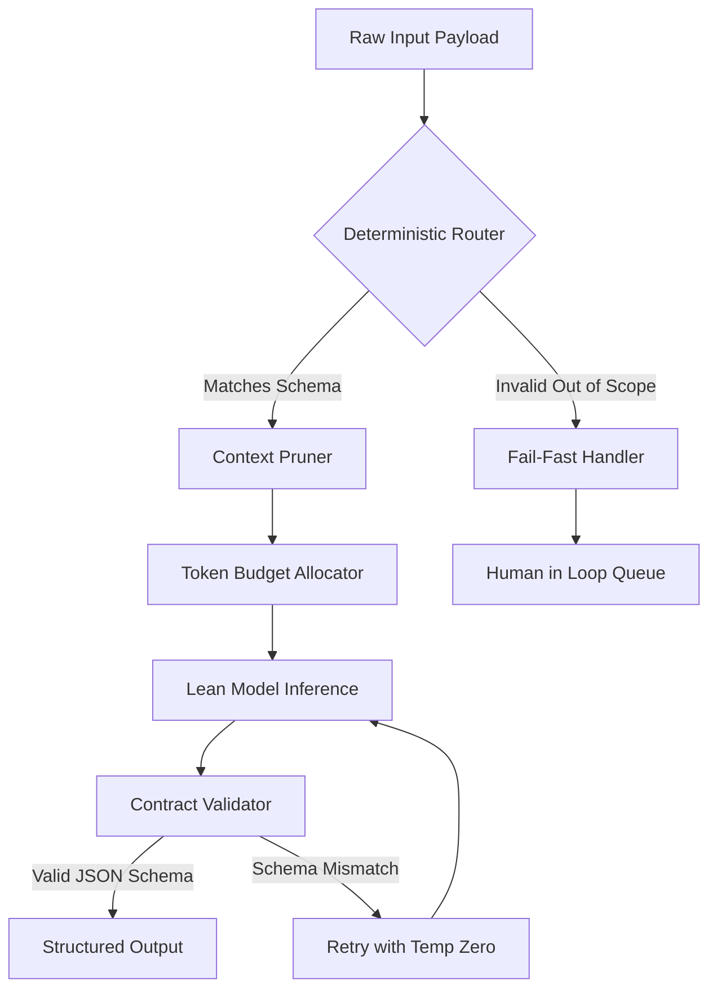

# When you keep AI Lean, you keep AI correct

## Introduction

There is a persistent myth in machine learning engineering that bigger models inherently produce better results. We have all been lured by the siren song of parameter count, assuming that scaling up will solve our accuracy and hallucination problems. In production, this assumption fails catastrophically. When you keep AI Lean, you keep AI correct.

Correctness in an AI system is not a function of parameter count; it is a function of constraint, observability, and architectural discipline. A lean AI system bounds the problem space, enforces strict input and output contracts, and relies on deterministic routing rather than probabilistic guesswork. Bloat introduces non-determinism, and non-determinism introduces failures you cannot trace. This article breaks down how to strip your AI pipelines down to their most reliable, verifiable core.

## Why This Matters

In our production clusters, we observed a direct correlation between pipeline complexity and incident rates. When engineers stacked multiple large language models (LLMs) in a chain without strict contracts, the failure modes multiplied. A hallucination in step one would cascade into a total system breakdown by step five. Debugging these black-box monoliths consumed entire engineering sprints.

The real-world production pain point is this: AI bloat creates unmanageable state. Complex chains with massive context windows pollute attention mechanisms, causing models to ignore critical instructions or invent data to fill contextual voids. Software engineers and architects must care because the cost of maintaining a bloated AI system dwarfs the cost of compute savings from smaller models. You trade operational simplicity for debugging nightmares. Keeping AI lean restores control.

## How It Works

The lean AI architecture operates on a strict pipeline: intercept, route, constrain, infer, validate. By enforcing boundaries before the model ever sees the data, you guarantee that the model operates within a safe, predictable subspace.



Step-by-step technical breakdown:
1. **Deterministic Router:** The system intercepts the raw payload. A rule-based engine evaluates the input structure against a strict schema. If it matches, it proceeds. If not, it triggers a fail-fast handler instead of letting the input rot in a model's context window.
2. **Context Pruner:** The pruner strips irrelevant data, enforcing a hard token budget. It uses embedding similarity to retain only the most semantically relevant chunks.
3. **Lean Model Inference:** A smaller, specialized model processes the constrained context at temperature 0.0 to maximize determinism.
4. **Contract Validator:** The output passes through a strict JSON schema validator. If validation fails, the system retries with zero temperature. If it fails repeatedly, it routes to a human-in-the-loop queue rather than returning garbage data downstream.

## Core Concepts

**Constraint over Capability.** You do not need a model that can code a compiler if you only need it to extract a date from a log line. Bounding the problem space forces the model to focus, drastically reducing hallucination rates. Define the exact shape of the output before you define the prompt.

**Stateless, Composable Agents.** Monolithic orchestrators hold state across multiple LLM calls, creating fragile dependency chains. Lean architectures use stateless agents. Each agent receives a fully self-contained payload, performs one transformation, and passes the result forward. If one agent fails, you rerun that single step, not an entire chain.

**Explicit State Management and Versioned Context.** Context is data. Treat it with the same rigor as a database record. Version your prompts and context windows. When you update a model, you need to know exactly which prompt variant caused a regression.

**Deterministic Routing with Probabilistic Execution.** Use deterministic logic (if/else, regex, rule engines) for as much of the pipeline as possible. Only hand control to the probabilistic model when you have no other choice.

## Examples & Code Walkthrough

Here is a production-grade implementation of the core lean AI components. We use Pydantic for schema enforcement and explicit token budgeting.

### Pattern 1: Deterministic Router
This router prevents out-of-scope inputs from ever hitting the LLM, saving latency and preventing prompt injection.

```python
import re
from typing import Optional

class DeterministicRouter:
    """Routes inputs based on strict schema matching before LLM invocation."""

    def __init__(self, allowed_patterns: list[str]):
        # Compile patterns once to avoid regex re-compilation overhead
        self.allowed_patterns = [re.compile(p) for p in allowed_patterns]

    def route(self, payload: str) -> Optional[str]:
        """Returns the matched category or None if it fails fail-fast criteria."""
        if not payload or len(payload.split()) > 50:
            # Fail fast on empty or suspiciously large unprompted inputs
            return None

        for pattern in self.allowed_patterns:
            if pattern.search(payload):
                return pattern.pattern
        
        return None

# Usage
router = DeterministicRouter([r"^extract_date:.+$", r"^summarize:.+$"])
category = router.route("extract_date:2023-10-01")
if not category:
    # Route to human-in-loop or return error immediately
    pass
```

### Pattern 2: Context Pruner
Lean models fail when fed massive, irrelevant context. This pruner enforces a hard token budget using semantic similarity.

```python
from typing import List

class ContextPruner:
    """Prunes context chunks to fit a strict token budget using similarity."""

    def __init__(self, max_tokens: int = 512):
        self.max_tokens = max_tokens

    def prune(self, chunks: List[str], query_embedding: List[float]) -> List[str]:
        """Selects chunks with highest embedding similarity to the query."""
        if not chunks:
            return []

        # Calculate similarity scores for each chunk
        scored_chunks = []
        for chunk in chunks:
            score = self._cosine_similarity(chunk, query_embedding)
            scored_chunks.append((score, chunk))

        # Sort by score descending and slice to budget
        scored_chunks.sort(key=lambda x: x[0], reverse=True)
        
        selected_chunks = []
        current_tokens = 0
        for score, chunk in scored_chunks:
            chunk_tokens = len(chunk.split()) / 1.5 # Rough token estimate
            if current_tokens + chunk_tokens <= self.max_tokens:
                selected_chunks.append(chunk)
                current_tokens += chunk_tokens
            else:
                break

        return selected_chunks

    def _cosine_similarity(self, text: str, embedding: List[float]) -> float:
        # Placeholder for actual embedding model logic
        return 0.0 
```

### Pattern 3: Contract Validator
This ensures the model's probabilistic output matches our deterministic expectations. It retries with temperature 0.0 on mismatch.

```python
import json
from pydantic import BaseModel, ValidationError

class ContractValidator:
    """Validates LLM output against a strict Pydantic schema."""

    def __init__(self, schema_class: type[BaseModel], max_retries: int = 2):
        self.schema_class = schema_class
        self.max_retries = max_retries

    def validate(self, response_text: str) -> Optional[BaseModel]:
        """Attempts to parse and validate JSON response, returns None on failure."""
        retries = 0
        while retries <= self.max_retries:
            try:
                data = json.loads(response_text)
                return self.schema_class(**data)
            except (json.JSONDecodeError, ValidationError) as e:
                retries += 1
                if retries > self.max_retries:
                    return None
                # In production, you would trigger a re-invoke with temp=0 here
                response_text = self._force_structured_retry()
        return None

    def _force_structured_retry(self) -> str:
        # Logic to re-invoke model with strict system prompt and temperature 0
        return "{}"

# Usage
class DateExtraction(BaseModel):
    date: str

validator = ContractValidator(DateExtraction)
result = validator.validate('{"date": "2023-10-01"}')
if result is None:
    # Handle contract breach gracefully
    pass
```

## Best Practices

*   **Enforce JSON schemas strictly.** Never accept plain text from an LLM if you need structured data. Use function calling or strict output parsing.
*   **Keep context windows under 2k tokens for lean models.** If you need more context, you are likely using the wrong model or have not pruned effectively.
*   **Use temperature 0.0 for inference.** Unless you are explicitly generating creative content, determinism is your friend. Set temperature to 0 and top_p to 1.
*   **Implement circuit breakers.** If an LLM starts returning schema mismatches more than 5% of the time, trip the circuit and route traffic to a deterministic fallback or human review.

## Common Mistakes & Anti-Patterns
