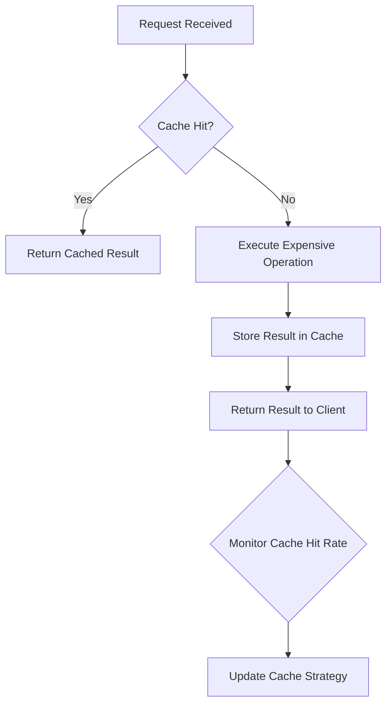

# Why agentic systems should care about cache-hit pricing

## Introduction

Cache-hit pricing isn't just about saving milliseconds—it's about aligning autonomous decision-making with economic reality. When agentic systems operate at scale, every cache miss represents a quantifiable cost. These systems don't just optimize for speed or accuracy; they must optimize for resource efficiency. Ignoring cache-hit pricing means leaving money on the table and scalability on the table.

## Why This Matters

Modern agentic systems often operate in cloud environments where compute and memory are billed units. A single poorly cached operation might seem trivial, but when multiplied across millions of daily executions, the financial impact becomes material. Consider a recommendation agent that fetches user profiles from a database on every request. If 80% of those requests could be satisfied by a cache, the cost savings become immediate and measurable. More importantly, understanding cache-hit pricing allows agents to make economically rational decisions about when to invest in caching versus when to accept the cost of recomputation.

## How It Works

The core mechanism involves agents evaluating both the computational cost of an operation and its cacheability. When an agent receives a request, it first checks its local cache. If found (a cache hit), it returns the result immediately. If not (a cache miss), it executes the expensive operation and stores the result for future use. The agent must also consider the cost of cache storage and invalidation.



The agent continuously monitors cache performance metrics, adjusting its behavior based on observed hit rates and associated costs. This creates a feedback loop where the agent learns to optimize its caching strategy over time.

## Core Concepts

**Cache Hit Ratio**: The percentage of requests served from cache versus recomputed. A ratio above 70% typically indicates effective caching.

**Cost Model**: A mathematical representation of resource consumption, including CPU cycles, memory usage, network latency, and monetary cost per operation.

**Eviction Policy**: Rules determining which cached items to remove when memory limits are reached. Common policies include LRU (Least Recently Used) and LFU (Least Frequently Used).

**Time-to-Live (TTL)**: The duration a cached item remains valid before requiring refresh. TTL balances data freshness against cache efficiency.

## Examples & Code Walkthrough

Let's examine a simplified agent that optimizes its caching based on cost analysis. We'll use a Python example that models a weather prediction agent:

```python
import time
from typing import Dict, Any, Optional
from dataclasses import dataclass
from datetime import datetime, timedelta

@dataclass
class CacheEntry:
    value: Any
    expires_at: datetime
    hit_cost: float
    
class CachingAgent:
    def __init__(self, cache_ttl_seconds: int = 300):
        self.cache: Dict[str, CacheEntry] = {}
        self.cache_ttl = timedelta(seconds=cache_ttl_seconds)
        self.total_requests = 0
        self.cache_hits = 0
        
    def _get_current_weather_data(self, location: str) -> Dict[str, Any]:
        # Simulates expensive external API call
        time.sleep(0.5)  # 500ms latency
        return {
            "temperature": 22.5,
            "humidity": 65,
            "timestamp": datetime.now().isoformat()
        }
    
    def _calculate_request_cost(self, is_cache_hit: bool) -> float:
        # Cloud provider pricing model (simplified)
        if is_cache_hit:
            return 0.000001  # Micro-cents for memory access
        else:
            return 0.0001  # Tens of micro-cents for API call
    
    def get_weather(self, location: str) -> Dict[str, Any]:
        self.total_requests += 1
        
        # Check cache
        if location in self.cache:
            entry = self.cache[location]
            if datetime.now() < entry.expires_at:
                self.cache_hits += 1
                return entry.value
        
        # Cache miss - execute expensive operation
        result = self._get_current_weather_data(location)
        cost = self._calculate_request_cost(False)
        
        # Store in cache
        self.cache[location] = CacheEntry(
            value=result,
            expires_at=datetime.now() + self.cache_ttl,
            hit_cost=cost
        )
        
        return result
    
    def get_cache_metrics(self) -> Dict[str, float]:
        hit_rate = self.cache_hits / self.total_requests if self.total_requests > 0 else 0
        avg_cost_per_request = sum(
            self._calculate_request_cost(loc in self.cache)
            for loc in [f"location_{i}" for i in range(self.total_requests)]
        ) / self.total_requests
        
        return {
            "hit_rate": hit_rate,
            "total_requests": self.total_requests,
            "cache_hits": self.cache_hits,
            "avg_cost_per_request": avg_cost_per_request
        }

# Usage example
agent = CachingAgent(cache_ttl_seconds=600)
for _ in range(1000):
    agent.get_weather("San Francisco")

print(agent.get_cache_metrics())
```

This agent tracks costs explicitly and uses them to inform caching decisions. In production, you'd extend this with dynamic TTL adjustment based on observed hit rates and cost savings.

## Best Practices

1. **Instrument Everything**: Track cache hit rates, costs, and performance metrics from day one. Without data, you're flying blind.

2. **Set Economic Thresholds**: Define minimum hit rates required to justify caching overhead. For expensive operations, 60% hit rate might be acceptable; for cheap operations, you might need 95%.

3. **Implement Adaptive TTL**: Adjust cache expiration times based on access patterns. Frequently accessed items deserve longer TTLs.

4. **Separate Hot and Cold Data**: Use different caching strategies for frequently accessed data versus archival data.

5. **Monitor Cost Anomalies**: Set alerts for sudden drops in cache hit rates, which often indicate systemic issues.

## Common Mistakes & Anti-Patterns

**Mistake 1: Ignoring Cache Invalidation Costs**
Teams often focus on hit rates but forget that cache invalidation (clearing stale data) consumes resources too. A cache with 95% hit rate might be worse than one with 85% if invalidation costs are high.

**Mistake 2: Static TTL Values**
Using fixed TTLs regardless of data volatility leads to either stale data or excessive recomputation. Weather data needs different caching than stock prices.

**Mistake 3: Over-Caching Everything**
Not all operations benefit from caching. Simple calculations executed in microseconds shouldn't occupy expensive cache space.

**Mistake 4: No Cost Accounting**
Making caching decisions without understanding the actual monetary impact leads to suboptimal resource allocation.

## Performance Considerations

**Memory Overhead**: Each cached item consumes memory. In distributed systems, this impacts garbage collection and network serialization costs.

**CPU Complexity**: Cache management algorithms (LRU tracking, TTL checks) add CPU overhead. Ensure this doesn't exceed the cost of recomputation.

**Network Latency**: Distributed caches introduce network hops. Measure whether local caching beats remote cache access.

**Scalability**: Cache stampedes occur when many clients simultaneously miss a cache and overload the backend. Implement request coalescing or probabilistic early expiration.

**Computational Complexity**: Cache lookup is typically O(1), but eviction policies can be O(n). Choose algorithms appropriate for your scale.

## Real-World Usage

Netflix's recommendation engine uses intelligent caching to reduce database load during peak viewing hours. Their agents evaluate not just response time but also the cost of different caching strategies across their global CDN.

Uber's dispatch system employs agentic decision-making with cache-aware routing. Their agents consider cache hit probabilities when deciding whether to recompute driver locations or use cached data, balancing accuracy against computational cost.

AWS Lambda functions with provisioned concurrency often implement cache-hit pricing models to optimize warm start costs versus cold start penalties.

## Frequently Asked Questions (FAQ)

**Q: How do I measure the monetary cost of a cache miss?**
A: Instrument your system to track resource consumption (CPU, memory, network) for both cache hits and misses. Multiply by your cloud provider's pricing per unit resource.

**Q: Should I cache data that changes frequently?**
A: Only if the cost of recomputation exceeds the cost of serving slightly stale data. Financial trading data might need second-level TTLs, while blog posts can cache for hours.

**Q: How often should I recalculate cache hit rates?**
A: Continuous monitoring is ideal, but at minimum recalculate daily. Sudden changes in access patterns require immediate attention.

**Q: Can I use machine learning to predict cache hit rates?**
A: Yes. Models like XGBoost or simple moving averages can predict future hit rates based on historical access patterns, enabling proactive cache management.

## Conclusion

Cache-hit pricing transforms caching from a performance optimization into an economic one. Agentic systems that ignore this principle waste resources and money. By instrumenting cost awareness into their decision-making processes, these systems can achieve both better performance and lower operational expenses. The future belongs to agents that understand not just what to compute, but what to cache—and at what cost.
