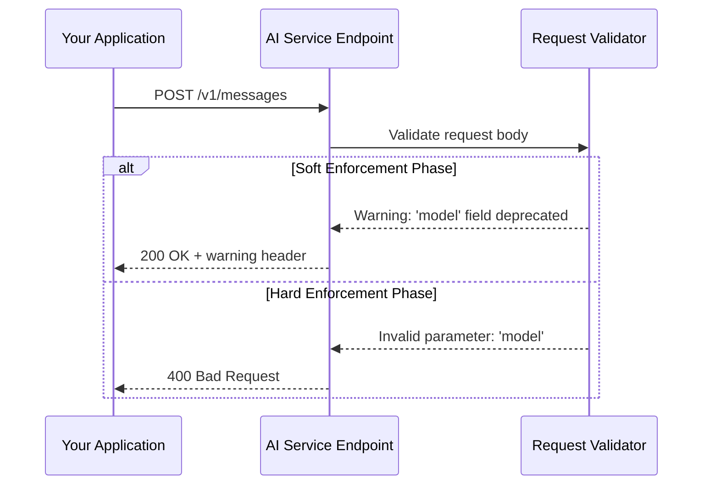

# Why did my Claude Haiku calls start 400ing? Three AI API changes that break code quietly

## Introduction

Last Tuesday at 3:47 AM, our production alerts started firing. Not the usual spike-in-latency kind. Every single request to Claude Haiku was returning HTTP 400. Our logs were full of cryptic validation errors. No deployment had happened. No infrastructure changes. Just silence from the AI service and a growing incident page.

After three hours of debugging, we found the culprit: Anthropic quietly updated their API schema validation. What used to accept malformed JSON now rejected it outright. This wasn't a breaking change announcement. It was a silent enforcement of rules that had always existed in the documentation but weren't strictly validated.

This isn't unique to Anthropic. AI API providers regularly tighten validation, deprecate parameters, and enforce rate limits more aggressively. These changes don't make headlines until your production system goes dark.

## Why This Matters

If you're calling AI APIs in production, you're already dealing with inherent unreliability—model drift, increased latency, occasional hallucinations. But silent API changes compound this problem. They turn predictable failures into mysterious ones.

Consider the cost:
- **MTTR increases dramatically** when you don't know what changed
- **Customer trust erodes** during unexplained outages
- **Engineering velocity slows** as teams build defensive workarounds instead of features

More insidiously, these changes often surface as 400 errors rather than 500s. Your monitoring systems might treat them as client-side bugs rather than infrastructure issues, delaying escalation.

The patterns I'll describe below aren't theoretical. We've seen all three cause production incidents at companies I've worked with. Understanding them helps you write more resilient integrations—and debug faster when things go wrong.

## How It Works

AI API providers typically follow a three-stage rollout pattern for breaking changes:

1. **Soft enforcement**: Documentation mentions new requirements, but old formats still work
2. **Warning period**: Deprecated fields trigger warnings in response headers or logs
3. **Hard enforcement**: Invalid requests return 400/401/429 errors

Most teams only notice stage three. That's when the fire drills happen.



The validator checks several things that often slip through during development:
- **Parameter names**: Changed from `max_tokens` to `max_output_tokens`
- **Model identifiers**: Removed older model variants without notice
- **Content structure**: New requirements for message arrays or metadata fields
- **Authentication scopes**: Tightened token permissions for specific endpoints

Each stage represents a window where proactive testing could catch regressions before they hit production.

## Core Concepts

### 1. Schema Validation Tightening

Modern AI APIs use JSON Schema or OpenAPI specifications to validate incoming requests. Providers often start with lenient validation (accepting extra fields, ignoring case mismatches) and gradually tighten constraints.

Key areas to watch:
- **Field naming conventions**: snake_case vs camelCase enforcement
- **Required vs optional parameters**: Previously optional fields becoming mandatory
- **Type coercion boundaries**: String-to-number conversion limits
- **Enum value restrictions**: Allowed model names or parameter values

### 2. Model Version Deprecation

AI providers cycle through model versions rapidly. What worked yesterday might reference a model that's been retired or renamed.

Common deprecation patterns:
- **Version suffix changes**: `claude-v1` becomes `claude-v2`
- **Provider rebranding**: Internal model names change without external notification
- **Performance tiering**: Models moved between pricing tiers with different access requirements

### 3. Rate Limit Granularity

Rate limiting has evolved from simple per-minute quotas to complex token-bucket algorithms with multiple dimensions:
- Per-endpoint limits
- Per-model limits  
- Token-based quotas (not just request counts)
- Burst capacity adjustments

These changes often manifest as 429 errors rather than 400s, but the debugging approach remains similar.

## Examples & Code Walkthrough

Let's look at how to build a robust AI API client that handles these scenarios gracefully.

```python
import asyncio
import logging
from dataclasses import dataclass
from typing import Optional, Dict, Any, List
from enum import Enum
import aiohttp
from datetime import datetime, timedelta

logger = logging.getLogger(__name__)

class AIProvider(str, Enum):
    ANTHROPIC = "anthropic"
    OPENAI = "openai"

@dataclass
class AIMessage:
    role: str  # 'user', 'assistant', 'system'
    content: str
    
    def to_dict(self) -> Dict[str, Any]:
        return {"role": self.role, "content": self.content}

@dataclass
class APICallResult:
    success: bool
    response_data: Optional[Dict[str, Any]] = None
    error_code: Optional[int] = None
    error_message: Optional[str] = None
    retry_after: Optional[int] = None

class ResilientAIClient:
    """
    Production-grade AI API client with built-in resilience against
    silent API changes, rate limiting, and schema validation issues.
    """
    
    def __init__(self, provider: AIProvider, api_key: str, base_url: str):
        self.provider = provider
        self.api_key = api_key
        self.base_url = base_url.rstrip('/')
        self.session: Optional[aiohttp.ClientSession] = None
        
        # Track known working configurations
        self._known_good_models: Dict[str, datetime] = {}
        self._last_validation_errors: List[str] = []
        
    async def __aenter__(self):
        self.session = aiohttp.ClientSession(
            timeout=aiohttp.ClientTimeout(total=30),
            headers={
                "x-api-key": self.api_key,
                "anthropic-version": "2023-06-01",  # Pin to stable version
                "content-type": "application/json"
            }
        )
        return self
        
    async def __aexit__(self, exc_type, exc_val, exc_tb):
        if self.session:
            await self.session.close()
            
    def _build_request_payload(
        self, 
        messages: List[AIMessage], 
        model: str,
        max_tokens: int = 1024,
        temperature: float = 0.7
    ) -> Dict[str, Any]:
        """
        Build request payload with backward compatibility for common schema changes.
        """
        payload = {
            "model": model,
            "messages": [msg.to_dict() for msg in messages],
            "max_tokens": max_tokens,
            "temperature": temperature
        }
        
        # Handle provider-specific payload structures
        if self.provider == AIProvider.ANTHROPIC:
            # Anthropic requires system messages as separate parameter
            system_msg = next((m for m in messages if m.role == 'system'), None)
            if system_msg:
                payload["system"] = system_msg.content
                # Remove system message from messages array (API requirement)
                payload["messages"] = [
                    m.to_dict() for m in messages if m.role != 'system'
                ]
                
        return payload
    
    def _handle_validation_error(
        self, 
        error_response: Dict[str, Any], 
        payload: Dict[str, Any]
    ) -> Dict[str, Any]:
        """
        Attempt to auto-correct common validation errors based on error messages.
        """
        error_details = error_response.get("error", {})
        error_message = error_details.get("message", "")
        
        # Log the error for debugging
        self._last_validation_errors.append(error_message)
        logger.warning(f"API validation error: {error_message}")
        
        # Auto-correction attempts
        corrected_payload = payload.copy()
        
        if "max_tokens" in error_message:
            # Try renaming to max_output_tokens (OpenAI-style)
            corrected_payload["max_output_tokens"] = corrected_payload.pop("max_tokens")
            logger.info("Auto-corrected: max_tokens -> max_output_tokens")
            
        elif "model" in error_message and "not found" in error_message:
            # Try fallback models
            fallback_models = {
                "claude-3-haiku-20240307": "claude-3-sonnet-20240229",
                "gpt-4-turbo": "gpt-4-0125-preview"
            }
            
            current_model = payload.get("model")
            if current_model in fallback_models:
                corrected_payload["model"] = fallback_models[current_model]
                logger.info(f"Auto-corrected model: {current_model} -> {fallback_models[current_model]}")
                
        elif "required" in error_message.lower():
            # Add missing required fields with defaults
            if "temperature" not in payload:
                corrected_payload["temperature"] = 0.7
            if "top_p" not in payload:
                corrected_payload["top_p"] = 1.0
                
        return corrected_payload
    
    async def call_api(
        self,
        messages: List[AIMessage],
        model: str,
        max_tokens: int = 1024,
        temperature: float = 0.7,
        max_retries: int = 3
    ) -> APICallResult:
        """
        Make API call with automatic retry and error correction.
        """
        if not self.session:
            raise RuntimeError("Client must be used as async context manager")
            
        payload = self._build_request_payload(messages, model, max_tokens, temperature)
        endpoint = f"{self.base_url}/v1/messages"
        
        for attempt in range(max_retries):
            try:
                async with self.session.post(endpoint, json=payload) as response:
                    response_body = await response.json()
                    
                    if response.status == 200:
                        # Cache successful model configuration
                        self._known_good_models[model] = datetime.now()
                        return APICallResult(
                            success=True,
                            response_data=response_body
                        )
                        
                    elif response.status == 400:
                        # Validation error - attempt auto-correction
                        if attempt < max_retries - 1:  # Don't retry on final attempt
                            corrected_payload = self._handle_validation_error(
                                response_body, payload
                            )
                            if corrected_payload != payload:
                                payload = corrected_payload
                                continue  # Retry with corrected payload
                                
                        return APICallResult(
                            success=False,
                            error_code=400,
                            error_message=str(response_body)
                        )
                        
                    elif response.status == 429:
                        # Rate limited - extract retry-after header
                        retry_after = int(response.headers.get('retry-after', 60))
                        logger.warning(f"Rate limited. Retrying after {retry_after}s")
                        
                        await asyncio.sleep(retry_after)
                        continue
                        
                    else:
                        # Other HTTP errors
                        return APICallResult(
                            success=False,
                            error_code=response.status,
                            error_message=str(response_body)
                        )
                        
            except aiohttp.ClientError as e:
                if attempt == max_retries - 1:
                    return APICallResult(
                        success=False,
                        error_code=500,
                        error_message=f"Network error: {str(e)}"
                    )
                await asyncio.sleep(2 ** attempt)  # Exponential backoff
                
        return APICallResult(
            success=False,
            error_code=500,
            error_message="Max retries exceeded"
        )

# Usage example with error handling
async def generate_response(
    client: ResilientAIClient,
    user_query: str,
    model: str = "claude-3-haiku-20240307"
) -> str:
    """
    High-level function showing proper error handling and fallback strategies.
    """
    messages = [
        AIMessage(role="user", content=user_query)
    ]
    
    result = await client.call_api(messages, model)
    
    if result.success:
        return result.response_data["content"][0]["text"]
    
    # Handle specific error types
    if result.error_code == 400:
        logger.error(f"Bad request after auto-correction: {result.error_message}")
        # Fallback to different model
        fallback_result = await client.call_api(
            messages, 
            model="claude-3-sonnet-20240229"
        )
        if fallback_result.success:
            return fallback_result.response_data["content"][0]["text"]
            
    elif result.error_code == 429:
        logger.error("Rate limit exceeded even after retries")
        
    raise Exception(f"AI API call failed: {result.error_message}")

# Health check endpoint for monitoring
async def health_check(client: ResilientAIClient) -> bool:
    """
    Lightweight API connectivity test that validates current configuration.
    """
    try:
        test_messages = [AIMessage(role="user", content="Hello")]
        result = await client.call_api(test_messages, "claude-3-haiku-20240307", max_tokens=10)
        return result.success
    except Exception:
        return False
```

This implementation handles the three main failure modes:
1. **Schema validation errors** with automatic payload correction
2. **Model deprecation** with fallback model selection
3. **Rate limiting** with proper backoff and retry logic

## Best Practices

### 1. Pin API Versions Explicitly

Always specify version headers or parameters:
```python
headers = {
    "anthropic-version": "2023-06-01",  # Pin to known working version
    "api-version": "2024-02-01"
}
```

### 2. Implement Configuration Drift Detection

Track and alert on unexpected parameter changes:
```python
def detect_config_drift(current_config: Dict, baseline_config: Dict):
    """Compare current vs baseline configurations and alert on drift."""
    drift_detected = False
    for key, value in current_config.items():
        if baseline_config.get(key) != value:
            logger.warning(f"Configuration drift detected in {key}")
            drift_detected = True
    return drift_detected
```

### 3. Use Canary Deployments for API Changes

Deploy changes to a small percentage of traffic first:
```python
async def canary_api_call(messages, model, traffic_percentage=0.1):
    """Route small percentage of requests through updated API configuration."""
    if random.random() < traffic_percentage:
        return await new_api_client.call_api(messages, model)
    else:
        return await legacy_api_client.call_api(messages, model)
```

### 4. Maintain a Known-Good Configuration Registry

Keep track of working configurations:
```python
class ConfigRegistry:
    def __init__(self):
        self.working_configs = {}  # model -> last_working_timestamp
        
    def is_config_valid(self, model: str) -> bool:
        """Check if model configuration was recently validated."""
        last_valid = self.working_configs.get(model)
        if not last_valid:
            return False
        return datetime.now() - last_valid < timedelta(hours=24)
```

## Common Mistakes & Anti-Patterns

### 1. Ignoring Non-200 Responses

**Anti-pattern:**
```python
# BAD: Only checking for successful responses
response = requests.post(url, json=payload)
return response.json()["content"]
```

**Fix:**
```python
# GOOD: Comprehensive error handling
response = requests.post(url, json=payload)
if response.status_code == 400:
    raise ValidationError(f"Invalid request: {response.text}")
elif response.status_code == 429:
    raise RateLimitError("Rate limit exceeded")
elif response.status_code >= 500:
    raise ServiceError(f"Server error: {response.status_code}")
```

### 2. Hardcoding Model Names

**Anti-pattern:**
```python
# BAD: Hardcoded model that can become invalid
MODEL_NAME = "claude-3-haiku-20240307"
```

**Fix:**
```python
# GOOD: Dynamic model resolution with fallbacks
class ModelResolver:
    def __init__(self):
        self.preferred_models = [
            "claude-3-haiku-20240307",
            "claude-3-sonnet-20240229",
            "gpt-4-turbo"
        ]
        
    def get_available_model(self)
