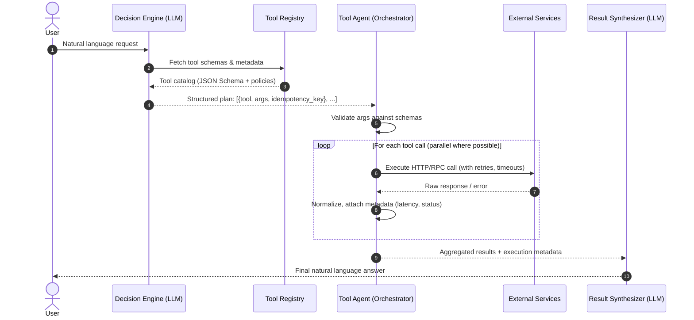

# Why Make an LLM Do the Grunt Work? After Jev, Who Should Handle an Agent’s Tool Work?

## Introduction

Last quarter, our team integrated a "Jev-style" agent into a customer-facing support bot. The idea was seductive: give the LLM a registry of functions—`query_orders`, `initiate_refund`, `check_inventory`—and let it decide which to call, when, and with what arguments. The demo worked beautifully. Then we pushed to staging.

Within hours, the token bill spiked 40%. Latency doubled because every tool call forced a full LLM round-trip just to serialize arguments. Worse, the model started hallucinating parameter names that didn't exist in our OpenAPI specs, causing cascading retries that hammered downstream services. We had built a system where the most expensive, non-deterministic component was also responsible for the plumbing.

That experience forced a architectural reckoning. LLMs are reasoning engines, not orchestration frameworks. Treating them as both conflates two distinct concerns: *what to do* (intent) and *how to do it* (execution). This article lays out why that separation matters, how to structure a dedicated tool-agent layer, and what we learned running it in production.

## Why This Matters

If you're building anything beyond a toy demo, three realities hit hard:

1. **Token economics are brutal.** Every tool invocation burns prompt tokens (schema descriptions, few-shot examples) and completion tokens (the function call itself). At scale, that's real money—often 3-5x the cost of the actual API calls.
2. **Reliability requires determinism.** LLMs are probabilistic. They'll forget required fields, invent enum values, or ignore rate-limit headers. Retry logic, idempotency keys, and circuit breakers don't belong in prompt engineering.
3. **Observability disappears.** When the LLM drives execution, you lose structured logs: which tool was called, with what inputs, how long it took, whether it succeeded. Debugging becomes "read the conversation history and guess."

A dedicated tool-agent layer solves all three. It keeps the LLM focused on synthesis and planning, while a lightweight, testable orchestrator handles validation, retries, batching, and telemetry. The result: lower cost, predictable latency, and a system you can actually operate.

## How It Works

The architecture splits a single agent turn into four discrete stages:

1. **Decision Engine (LLM)** – Receives user intent + tool catalog → returns a *structured plan* (list of tool calls with arguments).
2. **Tool Registry** – Static metadata: JSON schemas, rate limits, auth requirements, idempotency keys.
3. **Tool Agent (Orchestrator)** – Validates the plan, executes calls (with retries/backpressure), aggregates results.
4. **Result Synthesizer (LLM)** – Takes raw tool outputs → produces final natural-language response.



Note the critical detail: the Decision Engine *never* sees raw tool responses. It only plans. The Tool Agent handles every failure mode—timeouts, 429s, schema mismatches—without ever bothering the LLM.

## Core Concepts

### Decision Engine vs. Tool Agent

| Concern | Decision Engine (LLM) | Tool Agent (Orchestrator) |
|---------|----------------------|---------------------------|
| **Input** | User prompt + tool schemas | Structured plan (list of `ToolCall`) |
| **Output** | `List[ToolCall]` | `List[ExecutionResult]` |
| **Failure mode** | Hallucinated args, missing calls | Network errors, rate limits, schema violations |
| **Retry logic** | None (expensive, non-deterministic) | Exponential backoff, circuit breaker, idempotency |
| **Observability** | Prompt/completion logs | Structured JSON per call: latency, status, retry count |

### Tool Registry as Source of Truth

The registry is a *static* artifact—versioned, reviewed, deployed independently. It contains:

- **JSON Schema** for each tool's parameters (Draft 2020-12).
- **Execution policies**: `max_retries`, `timeout_ms`, `rate_limit_qps`, `idempotency_key_param`.
- **Auth context**: which credentials/tokens the orchestrator should inject.

The LLM only sees a *subset*: name, description, and parameter schema. Policies stay in the orchestrator where they can be enforced programmatically.

### Idempotency by Design

Every mutating tool *must* accept an `idempotency_key` (UUID v4 generated by the orchestrator per plan step). The orchestrator stores `(key, result)` in Redis with a 24h TTL. On retry, it reuses the same key—downstream services see a duplicate request and return the cached result. No LLM involvement required.

### Backpressure & Rate Limiting

The orchestrator maintains a token bucket per tool (configurable via registry). Before dispatching a call, it `await bucket.take(1)`. If the bucket is empty, the call queues. This prevents the "thundering herd" when the LLM enthusiastically plans 50 parallel `send_email` calls.

## Examples & Code Walkthrough

Below is a production-hardened orchestrator we run in a high-throughput internal service. It's deliberately self-contained—no framework dependencies—so you can see every moving part.

```python
# tool_orchestrator.py
# --------------------------------------------------------------
# Production-grade tool orchestration layer.
# --------------------------------------------------------------
import asyncio
import json
import logging
import time
import uuid
from dataclasses import dataclass, field
from typing import Any, Awaitable, Callable, Dict, List, Optional, Set
from functools import wraps

import jsonschema  # pip install jsonschema
import httpx       # pip install httpx

# -----------------------------------------------------------------
# 1. Domain Models
# -----------------------------------------------------------------
@dataclass(frozen=True)
class ToolPolicy:
    """Execution policies that NEVER go to the LLM."""
    max_retries: int = 3
    base_backoff_ms: int = 250
    max_backoff_ms: int = 5_000
    timeout_ms: int = 10_000
    rate_limit_qps: float = 10.0
    idempotency_key_param: str = "idempotency_key"
    requires_auth: bool = True

@dataclass(frozen=True)
class ToolSpec:
    """Static tool metadata – versioned and deployed with the orchestrator."""
    name: str
    description: str
    parameters: Dict[str, Any]           # JSON Schema (Draft 2020-12)
    policy: ToolPolicy = field(default_factory=ToolPolicy)
    # The actual callable is registered separately (see @tool decorator)
    callable: Optional[Callable[..., Awaitable[Any]]] = None

@dataclass
class ToolCall:
    """A single step in the LLM's plan."""
    tool_name: str
    arguments: Dict[str, Any]
    # Generated by orchestrator, not the LLM
    idempotency_key: str = field(default_factory=lambda: str(uuid.uuid4()))

@dataclass
class ExecutionResult:
    tool_name: str
    success: bool
    output: Any = None
    error: Optional[str] = None
    latency_ms: int = 0
    retry_count: int = 0
    idempotency_key: str = ""

# -----------------------------------------------------------------
# 2. Global Registry (populated at import time via @tool)
# -----------------------------------------------------------------
_TOOL_REGISTRY: Dict[str, ToolSpec] = {}

def tool(spec: ToolSpec) -> Callable:
    """Decorator: registers a ToolSpec and returns the raw callable unchanged."""
    if spec.name in _TOOL_REGISTRY:
        raise ValueError(f"Duplicate tool name: {spec.name}")
    _TOOL_REGISTRY[spec.name] = spec
    return spec.callable  # type: ignore[return-value]

def get_registry() -> Dict[str, ToolSpec]:
    return _TOOL_REGISTRY.copy()

# -----------------------------------------------------------------
# 3. Rate Limiter (token bucket per tool)
# -----------------------------------------------------------------
class TokenBucket:
    def __init__(self, rate: float, burst: int = 1):
        self.rate = rate          # tokens per second
        self.burst = burst        # max tokens
        self._tokens = float(burst)
        self._last = time.monotonic()
        self._lock = asyncio.Lock()

    async def take(self, tokens: int = 1) -> None:
        async with self._lock:
            while True:
                now = time.monotonic()
                since_last = now - self._last
                self._tokens = min(self.burst, self._tokens + since_last * self.rate)
                if self._tokens >= tokens:
                    self._tokens -= tokens
                    self._last = now
                    return
                # Wait until we have enough tokens
                wait = (tokens - self._tokens) / self.rate
                await asyncio.sleep(wait)

# -----------------------------------------------------------------
# 4. Orchestrator Core
# -----------------------------------------------------------------
class ToolOrchestrator:
    def __init__(
        self,
        llm_decision_fn: Callable[[str, List[Dict]], Awaitable[List[ToolCall]]],
        redis_url: Optional[str] = None,
    ):
        """
        :param llm_decision_fn: Async function(prompt, tool_schemas) -> List[ToolCall]
        :param redis_url: Optional Redis for idempotency caching (uses in-memory fallback)
        """
        self.llm_decision_fn = llm_decision_fn
        self.logger = logging.getLogger(self.__class__.__name__)
        self._buckets: Dict[str, TokenBucket] = {}
        self._idempotency_cache: Dict[str, ExecutionResult] = {}
        self._redis = None
        if redis_url:
            import redis.asyncio as redis
            self._redis = redis.from_url(redis_url, decode_responses=True)

        # Initialize token buckets from registry policies
        for name, spec in _TOOL_REGISTRY.items():
            self._buckets[name] = TokenBucket(spec.policy.rate_limit_qps, burst=max(1, int(spec.policy.rate_limit_qps)))

    # -------------------------------------------------------------
    # Public API – single agent turn
    # -------------------------------------------------------------
    async def run(self, user_prompt: str) -> List[ExecutionResult]:
        # 1. Ask LLM for a plan (structured, no raw tool output)
        tool_schemas = [
            {"name": s.name, "description": s.description, "parameters": s.parameters}
            for s in _TOOL_REGISTRY.values()
        ]
        plan = await self.llm_decision_fn(user_prompt, tool_schemas)
        self.logger.info("LLM produced plan with %d steps", len(plan))

        # 2. Execute plan with controlled concurrency
        results = await self._execute_plan(plan)
        return results

    # -------------------------------------------------------------
    # Internal: plan execution with retries, rate limiting, idempotency
    # -------------------------------------------------------------
    async def _execute_plan(self, plan: List[ToolCall]) -> List[ExecutionResult]:
        # Group by tool to respect per-tool rate limits
        semaphores: Dict[str, asyncio.Semaphore] = {}
        for spec in _TOOL_REGISTRY.values():
            # Allow up to 2x QPS in-flight as a soft concurrency cap
            semaphores[spec.name] = asyncio.Semaphore(max(2, int(spec.policy.rate_limit_qps * 2)))

        async def run_one(call: ToolCall) -> ExecutionResult:
            spec = _TOOL_REGISTRY.get(call.tool_name)
            if not spec:
                return ExecutionResult(
                    tool_name=call.tool_name,
                    success=False,
                    error=f"Unknown tool: {call.tool_name}",
                    idempotency_key=call.idempotency_key,
                )

            # Idempotency check (Redis or in-memory)
            cached = await self._get_cached_result(call.idempotency_key)
            if cached:
                self.logger.debug("Idempotency hit for %s", call.idempotency_key)
                return cached

            # Rate limit
            await self._buckets[call.tool_name].take(1)

            # Concurrency limit
            async with semaphores[call.tool_name]:
                return await self._execute_with_retry(spec, call)

        # Execute all steps concurrently (plan is assumed independent; add DAG support if needed)
        tasks = [run_one(call) for call in plan]
        results = await asyncio.gather(*tasks, return_exceptions=False)
        return list(results)  # type: ignore[return-value]

    async def _execute_with_retry(self, spec: ToolSpec, call: ToolCall) -> ExecutionResult:
        policy = spec.policy
        attempt = 0
        backoff = policy.base_backoff_ms / 1000.0
        last_error: Optional[Exception] = None

        while attempt <= policy.max_retries:
            start = time.monotonic()
            try:
                # Inject idempotency key if the tool declares it
                args = dict(call.arguments)
                if policy.idempotency_key_param and policy.idempotency_key_param not in args:
                    args[policy.idempotency_key_param] = call.idempotency_key

                # Validate against JSON Schema *before* calling
                jsonschema.validate(instance=args, schema=spec.parameters)

                # Execute the actual tool (async function)
                if spec.callable is None:
                    raise RuntimeError(f"Tool {spec.name} has no callable registered")
                output = await asyncio.wait_for(
                    spec.callable(**args),
                    timeout=policy.timeout_ms / 1000.0,
                )

                latency_ms = int((time.monotonic() - start) * 1000)
                result = ExecutionResult(
                    tool_name=spec.name,
                    success=True,
                    output=output,
                    latency_ms=latency_ms,
                    retry_count=attempt,
                    idempotency_key=call.idempotency_key,
                )
                await self._cache_result(call.idempotency_key, result)
                return result

            except jsonschema.ValidationError as e:
                # Schema violation – don't retry, it's a planning bug
                latency_ms = int((time.monotonic() - start) * 1000)
                return ExecutionResult(
                    tool_name=spec.name,
                    success=False,
                    error=f"Schema validation failed: {e.message}",
                    latency_ms=latency_ms,
                    retry_count=attempt,
                    idempotency_key=call.idempotency_key,
                )
            except (httpx.HTTPStatusError, httpx.RequestError, asyncio.TimeoutError) as e:
                last_error = e
                attempt += 1
                if attempt <= policy.max_retries:
                    self.logger.warning(
                        "Tool %s attempt %d failed: %s. Retrying in %.2fs",
                        spec.name, attempt, e, backoff
                    )
                    await asyncio.sleep(backoff)
                    backoff = min(backoff * 2, policy.max_backoff_ms / 1000.0)
                else:
                    break
            except Exception as e:
                # Unexpected error – log and don't retry
