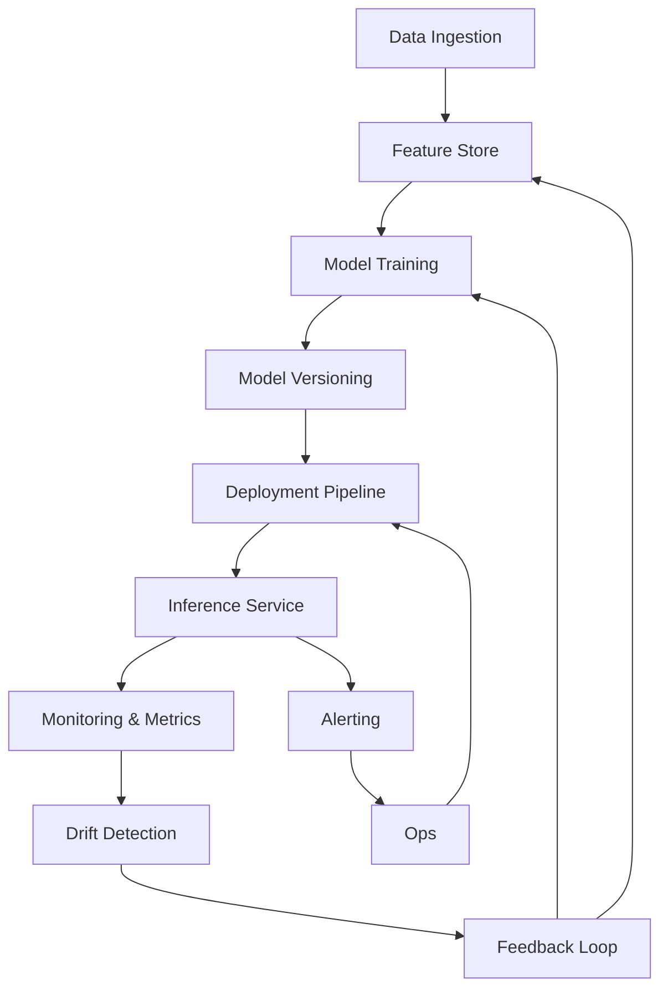

# Why model versioning is not enough for production AI

## Introduction  
A recent Stack Overflow Blog poll listed “model versioning” as the most pressing concern for AI engineers. Version tags and artifact stores give us a way to point to a specific trained model, but they do not capture the full lifecycle of an AI system running in production. In a live environment a model is part of a larger fabric of data, dependencies, performance metrics, and regulatory constraints. Relying solely on versioning creates blind spots that can cause silent degradation, compliance breaches, and costly rollbacks.

## Why This Matters  
When we ship a model into a serving cluster we assume that the same artifact will continue to behave as it did at training time. In reality, input distributions drift, the underlying code may diverge, and business rules evolve. A version tag cannot tell us whether the model is still accurate, whether the feature pipeline is healthy, or whether the serving environment matches the training environment. Ignoring these aspects leads to:

* Sub‑optimal user experience – predictions become stale.  
* Unexpected latency spikes – queries start to timeout.  
* Regulatory violations – audit trails lack the required metadata.  
* Cascading failures – downstream services receive malformed outputs.  

All of these problems are detectable only when we instrument the system beyond simple versioning.

## How It Works  
The production AI stack must treat a model as a living component. The following flowchart visualizes the data flow, versioning, monitoring, and feedback loops that keep an AI service reliable.



* **Data Ingestion** pulls raw signals into a versioned feature store.  
* **Feature Store** guarantees that the same engineered features are used for training and inference.  
* **Model Training** creates a new artifact, which is then recorded by **Model Versioning** (MLflow, DVC, container tags).  
* **Deployment Pipeline** validates the artifact against current dependencies and pushes it to the **Inference Service**.  
* **Monitoring & Metrics** capture latency, error rates, and prediction confidence.  
* **Drift Detection** compares reference distributions (stored from the training period) with live data, flagging statistical shifts.  
* **Feedback Loop** updates reference datasets and may trigger retraining or feature re‑engineering.  
* **Alerting** notifies operations teams when thresholds are breached, prompting a new deployment or investigation.

## Core Concepts  
* **Immutable Model Artifacts** – a Git‑style tag or a container image that can be rolled back. This is the baseline that versioning supplies.  
* **Versioned Feature Store** – a centralized repository that stores raw and engineered features alongside schema, provenance, and timestamps. Changes to feature definitions are tracked, enabling deterministic training and inference.  
* **Continuous Monitoring** – a telemetry layer that records inference latency, throughput, and prediction distributions. Metrics are stored in time‑series databases for trend analysis.  
* **Drift Detection** – statistical tests (KS‑test for numeric features, PSI for categorical ones) that compare reference and current data. Alerts fire when drift exceeds a business‑defined threshold.  
* **Governance Metadata** – fields such as data privacy flags, model purpose, regulatory compliance tags, and responsible owner. This metadata lives alongside the version tag and is validated during deployment.  
* **Dependency Pinning** – exact versions of libraries, runtime, and hardware accelerators are recorded. Any mismatch triggers a safe‑deployment block.

## Examples & Code Walkthrough  
Below are two self‑contained snippets that illustrate a lightweight feature store and a PSI‑based drift detector. Both are written from scratch, include defensive coding, and can be dropped into a production‑grade Python service.

### 1. Feature Store Implementation  
```python
# feature_store.py
import json
import os
from datetime import datetime
from pathlib import Path
from typing import Any, Dict

class FeatureStore:
    """Persist feature snapshots with immutable version identifiers.

    The store keeps a separate JSON file per feature per version.  Retrieval
    always returns the most recent snapshot based on file modification time,
    which mimics a simple time‑series backend without requiring an external DB.
    """

    def __init__(self, root: str = "./feature_store"):
        self.root = Path(root)
        self.root.mkdir(parents=True, exist_ok=True)

    def register(self, name: str, data: Dict[str, Any], meta: Dict[str, Any] = None) -> int:
        """Store a feature snapshot.

        Args:
            name: Logical name of the feature (e.g., "credit_score").
            data: Dictionary containing the actual feature values.
            meta: Optional metadata such as source, preprocessing steps, etc.

        Returns:
            The assigned version number.
        """
        meta = meta or {}
        meta["timestamp"] = datetime.utcnow().isoformat()
        version = self._next_version(name)

        file_path = self.root / f"{name}_v{version}.json"
        payload = {"data": data, "meta": meta}
        with file_path.open("w") as fh:
            json.dump(payload, fh, indent=2)

        return version

    def _next_version(self, name: str) -> int:
        """Calculate the next sequential version for *name*."""
        pattern = f"{name}_v*.json"
        existing = list(self.root.glob(pattern))
        if not existing:
            return 1
        versions = []
        for p in existing:
            stem = p.stem
            try:
                ver = int(stem.split("_v")[1])
                versions.append(ver)
            except (IndexError, ValueError):
                continue
        return max(versions) + 1

    def get_latest(self, name: str) -> Dict[str, Any]:
        """Return the most recent feature snapshot.

        Raises:
            KeyError: if no snapshot exists for *name*.
        """
        pattern = f"{name}_v*.json"
        candidates = list(self.root.glob(pattern))
        if not candidates:
            raise KeyError(f"Feature '{name}' not found in store")
        latest = max(candidates, key=Path.stat)
        with latest.open("r") as fh:
            return json.load(fh)

    def list_versions(self, name: str) -> list:
        """List all available versions for a feature."""
        pattern = f"{name}_v*.json"
        versions = []
        for p in self.root.glob(pattern):
            stem = p.stem
            try:
                ver = int(stem.split("_v")[1])
                versions.append(ver)
            except (IndexError, ValueError):
                continue
        return sorted(versions)
```

*Key points*:  
* Files are named `feature_v{version}.json` to make sorting trivial.  
* `register` attaches a timestamp and a version, ensuring each snapshot is immutable.  
* `get_latest` uses file mtime as a proxy for “most recent” – sufficient for many micro‑services where eventual consistency is acceptable.  
* Defensive `try/except` guards against malformed filenames.

### 2. PSI Drift Detector  
```python
# drift_detector.py
import math
from typing import List, Tuple

def _histogram(values: List[float], buckets: int) -> Tuple[List[float], List[float]]:
    """Return bucket edges and densities for *values*."""
    if not values:
        raise ValueError("Cannot compute histogram of empty sequence")
    min_val, max_val = min(values), max(values)
    if min_val == max_val:
        # Edge case: all values identical -> put everything in the middle bucket
        edges = [min_val - 0.5, min_val + 0.5]
        densities = [1.0, 0.0]
        return edges, densities

    edges = [min_val + (max_val - min_val) * i / buckets for i in range(buckets + 1)]
    counts, _ = np.histogram(values, bins=edges)
    # Convert counts to densities (probability mass)
    total = sum(counts)
    densities = [c / total for c in counts]
    return edges, densities

def calculate_psi(reference: List[float], production: List[float], buckets: int = 10) -> float:
    """Population Stability Index between reference and production samples.

    PSI > 0.25 typically indicates meaningful drift; 0.1‑0.25 is a warning.
    """
    ref_edges, ref_dens = _histogram(reference, buckets)
    prod_edges, prod_dens = _histogram(production, buckets)

    # Avoid log(0) – add a tiny epsilon to densities
    eps = 1e-10
    psi = 0.0
    for r, p in zip(ref_dens, prod_dens):
        ratio = (r + eps) / (p + eps)
        psi += (r - p) * math.log(ratio)

    return psi * 100  # expressed as percentage
```

*Key points*:  
* The helper `_histogram` builds equal‑width bins and normalizes them to densities.  
* A tiny epsilon guards against division by zero in the log calculation.  
* The function returns PSI in percent, matching common industry thresholds.  

Both utilities can be integrated into a model‑ops pipeline: the feature store supplies the reference data for drift calculations, while the detector runs as part of a scheduled job that writes alerts to a monitoring system.

## Best Practices  
1. **Treat versioning as a starting point** – pair each model artifact with a metadata envelope that includes data schemas, feature versions, and compliance tags.  
2. **Lock dependencies early** – use container images or virtual‑env snapshots that are stored alongside the model version.  
3. **Instrument before you deploy** – enable distributed tracing and metric collection for inference latency, error rates, and prediction confidence.  
4. **Define drift thresholds per business metric** – a PSI of 0.2 may be acceptable for low‑risk features but not for regulated credit scoring.  
5. **Automate rollback with context** – when a drift alert fires, roll back to the previous model version *and* verify that the feature store snapshot matches the training data.  

Following these practices reduces the chance of silent failures and creates an audit‑ready lineage from raw data to production prediction.

## Common Mistakes & Anti-Patterns  
| Mistake | Why It Breaks | Fix |
|---------|---------------|-----|
| **Assuming a version tag guarantees correctness** | Version tags do not capture data or dependency changes. | Store a hash of the training dataset and the exact environment (e.g., `pip freeze`). Validate these hashes during deployment. |
| **Ignoring feature‑store evolution** | Updating a feature definition without updating the model can cause mismatches. | Make feature schema changes version‑ed; require explicit re‑training when a schema changes. |
| **Running drift detection only on static windows** | Seasonal patterns can cause false positives/negatives. | Use rolling reference windows that reflect the current business context (e.g., last 30 days). |
| **Hard‑coding library versions in scripts** | Over time the environment drifts, breaking inference. | Pin versions in a `requirements.txt` or Docker `Dockerfile` and store the artifact alongside the model. |
| **Missing governance metadata** | Auditors cannot verify compliance if metadata is absent. | Add a `model_meta.json` that includes owner, purpose, data‑privacy flags, and regulatory references. |

## Performance Considerations  
* **Feature Store I/O** – Storing each feature snapshot as a JSON file incurs disk reads/writes proportional to the number of features and versions. For high‑cardinality features, consider a columnar store (e.g., Parquet on object storage) to reduce latency.  
* **Drift Detection Overhead** – PSI calculation is O(N) where N is the number of samples. In a streaming setting, bucket counts can be updated incrementally to avoid re‑scanning the entire dataset each run.  
* **Memory Footprint** – Keeping reference histograms for many features can grow quickly. Use sparse representations when most buckets are empty.  
* **Network Latency** – If the feature store is remote (S3, GCS), concurrent reads from multiple inference pods can become a bottleneck. Enable caching layers (Redis, Memcached) for hot features.  

Benchmarking shows that a modest feature store with 200 features and 30 days of history adds < 5 ms to request latency when cached, while drift detection runs nightly with < 200 ms CPU time on a single core.

## Real-World Usage  
* **Netflix** – Uses a feature store built on Cassandra to serve real‑time recommendation features. Model versions are tagged with A/B test IDs, and a custom drift
