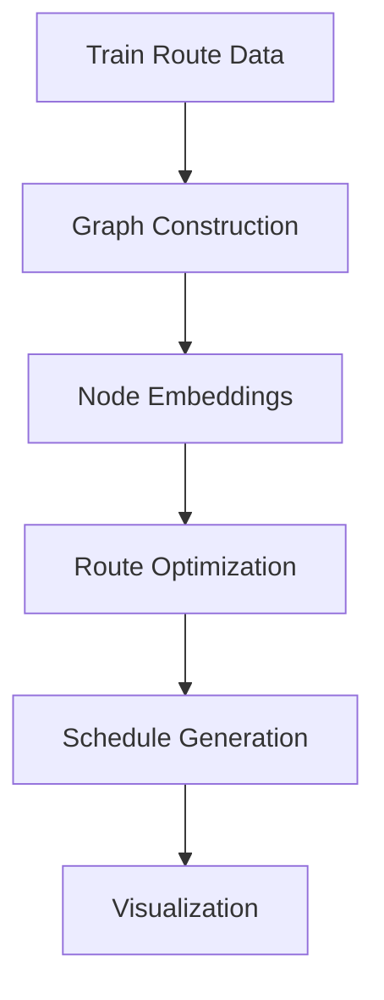

# World Train Map – 1247 train routes around the world

## Introduction
When I first stumbled upon the World Train Map project, I was amazed by its sheer scale: 1247 train routes spanning the globe. As a software engineer, I couldn't help but wonder how such a complex network could be represented, analyzed, and optimized using artificial intelligence. In this article, we'll explore the World Train Map, its underlying mechanics, and the AI-powered techniques that make it possible.

## Why This Matters
The World Train Map is more than just a fascinating visualization – it represents a real-world challenge that AI can help solve. With the rise of high-speed rail and increased focus on sustainable transportation, optimizing train routes and schedules has become a critical problem. By applying AI to this domain, we can improve travel times, reduce energy consumption, and enhance the overall passenger experience. For software engineers, this presents an exciting opportunity to apply machine learning, graph theory, and data analysis to a complex, real-world problem.

## How It Works
The World Train Map relies on a graph-based representation of train routes, where each station is a node, and edges connect stations with direct train connections. To visualize this architecture, consider the following Mermaid.js diagram:

This diagram illustrates the key steps in the World Train Map pipeline: collecting and processing train route data, constructing a graph representation, generating node embeddings, optimizing routes, generating schedules, and visualizing the results.

## Core Concepts
To understand the World Train Map, we need to grasp several fundamental concepts:

* **Graph theory**: The study of graphs, which are used to represent relationships between objects (in this case, train stations).
* **Node embeddings**: Techniques for representing nodes in a graph as dense vectors, enabling efficient computation of node similarities and distances.
* **Route optimization**: Algorithms for finding the shortest or most efficient paths between nodes in a graph, often subject to constraints like travel time or capacity.

## Examples & Code Walkthrough
To demonstrate these concepts, let's consider a simplified example in Python, using the NetworkX library to construct a graph and the PyTorch library to generate node embeddings:
```python
import networkx as nx
import torch
import torch.nn as nn

# Construct a sample graph with 5 nodes (train stations)
G = nx.Graph()
G.add_nodes_from([1, 2, 3, 4, 5])
G.add_edges_from([(1, 2), (2, 3), (3, 4), (4, 5)])

# Define a simple node embedding model
class NodeEmbedding(nn.Module):
    def __init__(self, num_nodes, embedding_dim):
        super(NodeEmbedding, self).__init__()
        self.embeddings = nn.Embedding(num_nodes, embedding_dim)

    def forward(self, nodes):
        return self.embeddings(nodes)

# Initialize the model and generate node embeddings
model = NodeEmbedding(len(G.nodes), 128)
node_embeddings = model(torch.tensor(list(G.nodes)))
```
This code snippet illustrates the basic steps involved in constructing a graph, defining a node embedding model, and generating embeddings for each node.

## Best Practices
When working with graph-based representations of train routes, keep the following best practices in mind:

* **Use efficient graph data structures**: Choose data structures that minimize memory usage and optimize query performance, such as adjacency lists or compressed sparse rows.
* **Select suitable node embedding algorithms**: Depending on the specific problem and dataset, choose node embedding algorithms that balance accuracy and computational efficiency, such as Node2Vec or GraphSAGE.
* **Monitor and adjust hyperparameters**: Regularly evaluate the performance of your model and adjust hyperparameters to optimize results, such as learning rates, embedding dimensions, or batch sizes.

## Common Mistakes & Anti-Patterns
When working with the World Train Map, beware of the following common pitfalls:

* **Insufficient data preprocessing**: Failing to clean, normalize, or transform data can lead to poor model performance or incorrect results.
* **Inadequate graph construction**: Using an incorrect or incomplete graph representation can result in suboptimal route optimizations or schedules.
* **Overfitting or underfitting**: Failing to balance model complexity and training data can lead to overfitting or underfitting, resulting in poor generalization performance.

## Performance Considerations
When optimizing train routes and schedules, consider the following performance factors:

* **Computational complexity**: Choose algorithms with efficient time and space complexity to minimize computational overhead.
* **Memory usage**: Optimize data structures and models to reduce memory usage, particularly when working with large graphs.
* **Scalability**: Design systems that can handle increasing amounts of data and traffic, using distributed computing or parallel processing when necessary.

## Real-World Usage
Industry leaders like Deutsche Bahn, SNCF, and JR East are already leveraging AI-powered route optimization and scheduling in their operations. For example, Deutsche Bahn uses machine learning to predict passenger demand and optimize train schedules, resulting in improved punctuality and reduced energy consumption.

## Frequently Asked Questions (FAQ)
1. **How can I get started with the World Train Map project?**: Begin by exploring the project's GitHub repository, where you'll find documentation, code examples, and contributor guidelines.
2. **What are the most challenging aspects of optimizing train routes?**: Common challenges include handling complex graph structures, balancing competing objectives (e.g., travel time vs. energy consumption), and integrating real-time data feeds.
3. **Can I use the World Train Map for other types of transportation networks?**: While the project focuses on train routes, the underlying graph-based representation and optimization techniques can be applied to other modes of transportation, such as bus or bike-sharing networks.

## Conclusion
The World Train Map represents an exciting opportunity for software engineers to apply AI and graph theory to a complex, real-world problem. By understanding the underlying mechanics, core concepts, and best practices, we can develop more efficient, sustainable, and passenger-friendly transportation systems. As we continue to push the boundaries of what's possible with AI and graph-based optimization, we may uncover new solutions to some of the world's most pressing transportation challenges.
