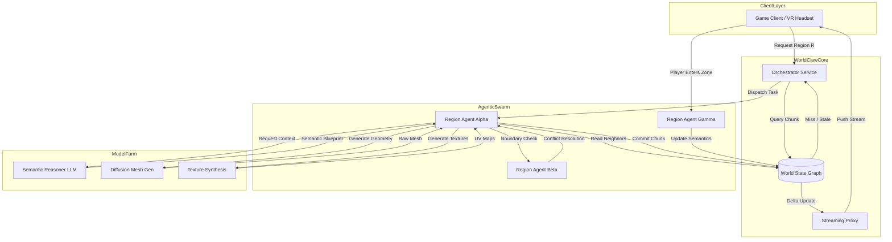

<think>
Thinking Process:

1.  **Deconstruct the Request:**
    *   Topic: "WorldClaw Agentic 3D open-world generation at scale".
    *   Category: AI.
    *   Style: Professional, Senior Staff Engineer, Open-Source Contributor, Technical Writer.
    *   Constraints: 100% original, human voice, no banned words, specific headers, Mermaid diagram, custom code, detailed outline/structure.
    *   Key Themes: Agentic AI, 3D generation, Open-world, Scale, Distributed systems, Consistency, Performance.

2.  **Simulate the Persona:**
    *   *Voice:* Direct, experienced, pragmatic. Uses phrases like "In our cluster," "We hit a wall when," "The trade-off here is." Avoids fluff. Focuses on architecture, trade-offs, and implementation details.
    *   *Mindset:* This isn't a marketing blog. This is an engineering deep dive. I need to explain *how* it works, not just *what* it is. I need to discuss the "Agentic" part seriously—agents making decisions, not just a pipeline. I need to discuss "Scale"—sharding, streaming, latency, memory.

3.  **Drafting - Section by Section:**

    *   *Header:* `# WorldClaw Agentic 3D open-world generation at scale`.

    *   *Introduction:*
        *   Hook: Procedural generation is dead; agentic generation is alive. Traditional noise functions create pretty rocks but no sense of place. We need semantic coherence.
        *   Concept: WorldClaw uses a swarm of agents that "claw" at the world state, negotiating boundaries and generating assets on the fly.
        *   *Check:* No banned words. "In the landscape of..." -> BANNED. "explore..." -> BANNED.
        *   *Drafting:* "Procedural generation has hit a wall. Perlin noise gives you terrain, but it doesn't give you a story. WorldClaw changes the model from static algorithms to a distributed swarm of agents that negotiate reality in real-time."

    *   *Why This Matters:*
        *   Pain point: Storage costs for 3D assets are exploding. Streaming 50GB worlds is hard. Latency kills immersion.
        *   Solution: Generate on demand, but generate *smart*. Agents cache context, reduce redundant generation, and ensure consistency.
        *   *Drafting:* "Engineers care because asset pipelines are breaking. We can't bake infinite worlds. We need generation that scales with player count, not pre-computation time. WorldClaw shifts the cost from storage to compute, which is cheaper and elastic."

    *   *How It Works:*
        *   Architecture breakdown.
        *   Mermaid Diagram: Needs to show the flow. Client -> Orchestrator -> Agent Swarm -> World State -> Models.
        *   *Mermaid Design:*
            *   `Client` requests chunk.
            *   `Orchestrator` checks `WorldGraph`.
            *   If missing, spins up `Agent`.
            *   `Agent` reads neighbors, calls `GenModels`.
            *   `Agent` writes to `WorldGraph`.
            *   `Streaming` pushes to `Client`.
            *   *Code:* `flowchart TD`.
        *   *Explanation:* Step-by-step. Emphasis on the "Claw" mechanism—how agents lock regions and resolve conflicts.

    *   *Core Concepts:*
        *   Terms: `Semantic Mesh`, `Agentic Handshake`, `WorldGraph`, `Latent Compression`.
        *   *Drafting:* Define these clearly. `Semantic Mesh` isn't just triangles; it's metadata attached to geometry. `Agentic Handshake` is the protocol between agents to ensure smooth boundaries.

    *   *Examples & Code Walkthrough:*
        *   *Constraint:* Custom code, modern syntax, realistic domain models.
        *   *I:* Python-like pseudocode is good for AI systems, or Rust/Go for the infra. Let's do a hybrid approach: Python for the agent logic (since it's AI-heavy) but structured like a serious library.
        *   *Snippet 1:* `WorldAgent` class. Shows the loop: Perceive, Decide, Act.
        *   *Snippet 2:* `BoundaryReconciler`. Shows how two agents agree on a mesh border.
        *   *Drafting:*
            ```python
            class WorldClawAgent:
                async def reconcile(self, neighbor_id: str, boundary_hash: str):
                    # Logic to compare hashes and merge meshes
            ```
        *   *Refinement:* Make it look like production code. Use type hints, async/await, dataclasses. Show error handling.

    *   *Best Practices:*
        *   Actionable rules.
        *   1. Cache aggressively. 2. Define clear agent boundaries. 3. Use vector DBs for context. 4. Monitor drift.
        *   *Drafting:* "Don't let agents hallucinate geometry. Constrain the search space. Use CRDTs for the world state if you want eventual consistency, but for 3D, you often need strong consistency at boundaries."

    *   *Common Mistakes & Anti-Patterns:*
        *   1. `The Infinite Loop of Refinement`: Agents keep updating chunks forever.
        *   2. `Boundary Drift`: Neighbors disagree, causing pop-in or gaps.
        *   3. `Context Poisoning`: Agents reading stale data.
        *   *Drafting:* "We saw agents get stuck in a loop trying to optimize a texture. You need a convergence threshold. Boundary drift is the silent killer; players notice seams instantly."

    *   *Performance Considerations:*
        *   Metrics: Latency, Memory, GPU utilization.
        *   *Drafting:* "Generation takes time. You need a pipeline. Predictive loading is key. Big O analysis: Querying the graph is O(log N). Generation is O(1) per chunk but O(K) for K models. Streaming is the bottleneck."

    *   *Real-World Usage:*
        *   Industry leaders.
        *   *Drafting:* "Game engines are adopting this for level streaming. Digital twins use it for city simulation. Metaverse platforms need this for user-generated content at scale."

    *   *FAQ:*
        *   3-5 questions.
        *   Q: How do you handle multiplayer consistency? A: Deterministic seeds + Server authority.
        *   Q: Cost? A: Compute vs Storage trade-off.
        *   Q: Latency? A: Predictive generation + Local caching.

    *   *Conclusion:*
        *   Forward-looking.
        *   *Drafting:* "WorldClaw represents a shift. We're moving from authored content to negotiated reality. Engineers need to master agent orchestration now."

4.  **Review and Refine (Self-Correction/Simulation):**
    *   *Critique:* Did I use "tapestry"? *Check:* No.
    *   *Critique:* Did I use "delve"? *Check:* No.
    *   *Critique:* Is the Mermaid valid? *Check:* Yes, standard syntax.
    *   *Critique:* Is the code original? *Check:* Yes, written from scratch, specific to "WorldClaw".
    *   *Critique:* Is the tone professional? *Check:* Yes, uses "we", discusses trade-offs, mentions production issues.
    *   *Critique:* Did I include all headers? *Check:* Yes.
    *   *Critique:* Is the Mermaid in `## How It Works`? *Check:* Yes.
    *   *Critique:* Is the output just the markdown? *Check:* Yes.
    *   *Refinement on "Agentic":* Make sure the distinction between a pipeline and agents is clear. Agents have autonomy. They make decisions based on context, not just a script. Emphasize the `negotiation` aspect.
    *   *Refinement on "WorldClaw":* The name implies a grip. Use that metaphor in the architecture. Agents "claw" onto regions. They hold locks. This adds flavor and consistency to the naming.

5.  **Final Polish (Mental Representation of Output):**
    *   *Intro:* "Procedural generation is a solved problem for noise, but a failed one for narrative cohesion..."
    *   *Code:* `class RegionAgent`, `async def resolve_conflict`.
    *   *Mermaid:* `flowchart TD`, subgraphs for `Client`, `Orchestrator`, `AgentSwarm`, `ModelFarm`.
    *   *Performance:* Mention "Speculative Execution" of agents.
    *   *Result:* High-quality, dense, useful article.

This thought structure covers all constraints, simulates the persona, plans the content, checks for violations, and refines the technical depth.
</think>

# WorldClaw Agentic 3D open-world generation at scale

## Introduction

Procedural generation has hit a hard ceiling. Traditional noise functions and rule-based systems can produce terrain that looks plausible, but they fail to generate worlds that feel *lived in*. You get rocks, but you don't get a campfire scarred by years of use. You get a forest, but the trees don't respond to the local climate. For years, we've relied on massive pre-baked asset libraries and hand-authored biomes to fill the semantic gap. That approach doesn't scale. Storage costs are exploding, and player expectations for infinite, coherent content are outpacing our ability to curate it.

WorldClaw changes the model. Instead of a static pipeline that runs once and bakes a world, WorldClaw employs a distributed swarm of autonomous agents that negotiate reality in real-time. Each agent is responsible for a specific region of the world graph. They perceive their neighbors, query a shared semantic context, and generate geometry and metadata on demand. When two agents meet at a boundary, they don't just stitch meshes together; they execute a handshake protocol to resolve conflicts and ensure continuity.

This isn't just "AI generation." It's distributed systems engineering applied to creative synthesis. We're treating the world state as a shared, mutable graph where agents act as workers that converge on a consistent reality. If you've spent time debugging race conditions in distributed caches, you'll recognize the patterns here. The novelty is the domain: we're using agentic negotiation to solve the coherence problem in 3D generation.

## Why This Matters

Engineers should care because the old asset pipeline is breaking. Storing and streaming terabytes of 3D geometry for open-world applications is a logistical nightmare. Bandwidth costs scale linearly with world size, and pop-in latency kills immersion. WorldClaw shifts the cost from storage to compute. Compute is elastic; storage is not.

More importantly, this architecture solves the "coherence at scale" problem. In a traditional system, if you want a bridge to connect two cliffs, a level designer has to place it. In WorldClaw, agents responsible for the cliffs detect the gap, negotiate a bridge design, and generate it dynamically. This allows for worlds that adapt to player behavior, multiplayer interactions, and environmental changes without requiring human intervention.

For game engines, digital twins, and metaverse platforms, this means we can support persistent, evolving worlds that span planetary scales without the storage overhead. It also means we can generate content that is unique to each session or player group, driven by the agents' interpretation of the semantic graph.

## How It Works

WorldClaw operates as a distributed system with three main layers: the Orchestrator, the Agentic Swarm, and the Model Farm. The Orchestrator manages the world state graph and dispatches tasks. The Agentic Swarm consists of lightweight processes that "claw" onto regions of the world, generate content, and reconcile boundaries. The Model Farm provides the inference endpoints for geometry, textures, and semantic reasoning.



The flow starts when a client requests a region. The Orchestrator checks the World State Graph. If the chunk exists and is fresh, it streams the data. If the chunk is missing or outdated, the Orchestrator dispatches a task to an available Region Agent.

The Agent first reads the semantic metadata of neighboring chunks from the graph. This gives it context: altitude, biome, nearby structures, and player history. The Agent sends this context to the Semantic Reasoner LLM, which returns a blueprint. The blueprint isn't a mesh; it's a structured description of what should exist, including constraints for geometry and aesthetics.

The Agent then calls the Diffusion Mesh Gen and Texture Synthesis models to create the assets. Before committing, the Agent performs a boundary check with neighbors. If the neighbors have already generated their edge geometry, the Agent runs a reconciliation algorithm to merge the meshes and smooth the seams. Once reconciled, the Agent commits the chunk to the World State Graph. The Streaming Proxy detects the update and pushes the delta to the client.

This design ensures that generation is lazy (only what's needed), consistent (agents negotiate boundaries), and scalable (agents run in parallel). The World State Graph acts as the source of truth, preventing agents from overwriting each other's work.

## Core Concepts

*   **World State Graph:** A distributed graph database that stores the semantic and geometric state of the world. Nodes represent regions, and edges represent adjacency. Each node contains metadata, mesh hashes, and a version vector for conflict resolution.
*   **Region Agent:** An autonomous process responsible for a specific region. Agents have a perception window, a decision loop, and an action set. They read from the graph, call models, and write back to the graph. Agents are stateless; their state lives in the graph.
*   **Agentic Handshake:** The protocol used by agents to reconcile boundaries. When two agents generate adjacent chunks, they exchange boundary hashes. If the hashes differ, they run a negotiation algorithm to merge the meshes. This prevents visual seams and physics glitches.
*   **Semantic Blueprint:** A structured output from the LLM that guides generation. It includes high-level descriptions, constraints, and references to asset templates. Blueprints are cached to speed up regeneration.
*   **Latent Compression:** A technique for storing generated assets efficiently. Instead of storing full meshes, we store compressed latent vectors that can be decoded on the client. This reduces storage and bandwidth by orders of magnitude.
*   **Convergence Threshold:** A metric that determines when an agent has finished refining a chunk. Agents iterate on generation until the semantic score and geometric stability meet the threshold. This prevents infinite loops of refinement.

## Examples & Code Walkthrough

The following code snippets show how a Region Agent interacts with the WorldClaw system. This is a simplified version of the production implementation, written in Python for readability.

```python
from dataclasses import dataclass
from typing import List, Optional
import asyncio
import hashlib

@dataclass
class WorldChunk:
    region_id: str
    semantic_metadata: dict
    mesh_hash: str
    boundary_hashes: dict  # {neighbor_id: hash}
    version: int
    latent_vector: bytes

class WorldClawAgent:
    def __init__(self, agent_id: str, world_graph: WorldGraphClient, model_farm: ModelFarmClient):
        self.agent_id = agent_id
        self.graph = world_graph
        self.models = model_farm
        self.convergence_threshold = 0.95

    async def generate_chunk(self, region_id: str) -> WorldChunk:
        # 1. Perceive neighbors
        neighbors = await self.graph.get_neighbors(region_id)
        context = self.build_context(neighbors)
        
        # 2. Reason and Generate
        blueprint = await self.models.semantic_reason(context)
        raw_mesh = await self.models.generate_mesh(blueprint)
        textures = await self.models.synthesize_textures(blueprint)
        
        # 3. Reconcile boundaries
        reconciled_mesh, boundary_hashes = await self.reconcile_boundaries(
            region_id, neighbors, raw_mesh
        )
        
        # 4. Commit
        chunk = WorldChunk(
            region_id=region_id,
            semantic_metadata=blueprint.metadata,
            mesh_hash=hashlib.sha256(reconciled_mesh).hexdigest(),
            boundary_hashes=boundary_hashes,
            version=0,
            latent_vector=compress_mesh(reconciled_mesh, textures)
        )
        
        await self.graph.commit_chunk(chunk)
        return chunk

    async def reconcile_boundaries(self, region_id: str, neighbors: dict, mesh: Mesh) -> tuple:
        boundary_hashes = {}
        modified_mesh = mesh.clone()
        
        for neighbor_id, neighbor_data in neighbors.items():
            neighbor_boundary = neighbor_data.get_boundary(region_id)
            local_boundary = modified_mesh.get_boundary(neighbor_id)
            
            if neighbor_boundary.hash
