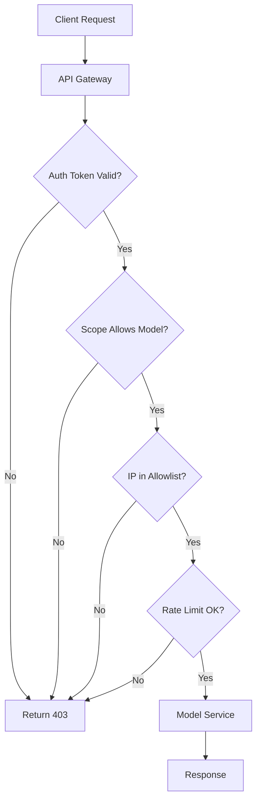

# You got a 403. It probably isn't about the page.

## Introduction
We hit a 403 when calling a language model API. The endpoint exists, but the server refuses the request. Often the cause is not a missing page but an auth or policy issue. In our experience debugging these errors, the real problem lies in token scopes, IP allowlists, or usage quotas.

## Why This Matters
Engineers waste time checking routes and server logs when the real blocker is permission logic. Misinterpreting a 403 as a routing error leads to wasted effort and delayed releases. Understanding the common sources of 403 in AI services helps teams put correct guardrails, avoid accidental data leaks, and meet compliance requirements.

## How It Works
When a client calls an AI endpoint, the request passes through several layers before reaching the model service. Each layer can emit a 403 if its check fails.



Step-by-step: The gateway first validates the JWT or API key. If invalid, 403. Next, the auth service checks whether the token includes the required scope for the requested model. Missing scope yields 403. Then, network policy verifies the caller IP against an allowlist; a mismatch triggers 403. Finally, the rate limiter enforces quota; exceeding it also results in 403. Only when all checks pass does the request reach the model core.

## Core Concepts
- **Token validation**: Verifies signature, expiration, and issuer. Uses asymmetric keys or shared secret.
- **Scope checking**: Maps token claims to permitted actions (e.g., `model:read`, `model:write`). Often stored in a Redis hash or DB.
- **IP allowlist**: Simple CIDR match; can be enforced via gateway plugin or cloud firewall.
- **Rate limiting**: Token bucket or leaky bucket algorithm; tracks per‑client or per‑token usage.
- **Policy engine**: Sometimes a separate service (OPA) that evaluates arbitrary rules before forwarding to model.

These components are independent; failure at any stage yields the same HTTP 403, making root‑cause analysis tricky without proper logging.

## Examples & Code Walkthrough
We'll show a minimal Node.js Express middleware that replicates the checks and logs the specific reason.

```javascript
const jwt = require('jsonwebtoken');
const netmask = require('netmask').Netmask;
const crypto = require('crypto');

// Config – in production load from vault or env
const PUBLIC_KEY = `-----BEGIN PUBLIC KEY-----\n...`;
const ALLOWED_IPS = ['10.0.0.0/8', '192.168.1.0/24'];
const MODEL_SCOPE = 'model:generate';
const RATE_LIMIT_WINDOW_MS = 60000; // 1 minute
const MAX_REQUESTS = 100;

// In‑memory store for demo; replace with Redis in prod
const requestCounts = new Map();

function validateToken(req, res, next) {
  const auth = req.headers.authorization;
  if (!auth || !auth.startsWith('Bearer ')) {
    return res.status(403).json({ error: 'Missing or malformed token' });
  }
  const token = auth.slice(7);
  try {
    const payload = jwt.verify(token, PUBLIC_KEY, { algorithms: ['RS256'] });
    req.user = payload; // attach for later middleware
    next();
  } catch (err) {
    // token invalid, expired, or wrong signature
    return res.status(403).json({ error: 'Invalid token' });
  }
}

function checkScope(req, res, next) {
  const scopes = (req.user.scope
