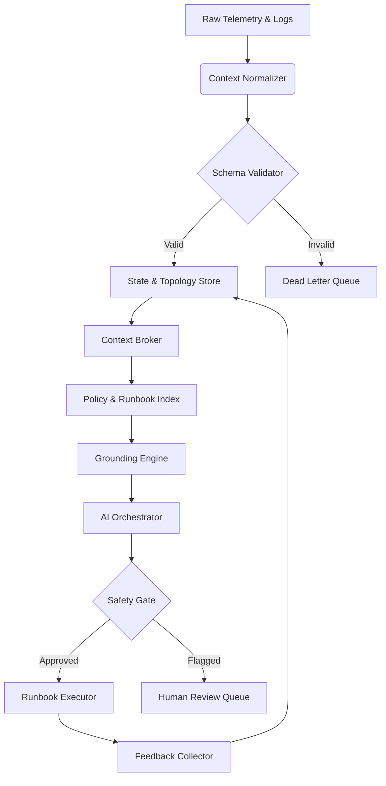

<think>
Here's a thinking process:

1.  **Analyze User Input:**
   - **Role:** Principal Software Architect & Veteran Open-Source Lead Author
   - **Task:** Write a 100% original, deeply technical article matching the exact structure and tone requested.
   - **Topic:** "You need reliable AI context for your site reliability"
   - **Category:** Artificial Intelligence
   - **Context/Reason:** Trending topic from Stack Overflow Blog matching 'Artificial Intelligence' category.
   - **Writing Style:** Professional
   - **Mandatory Structure:**
     - `# You need reliable AI context for your site reliability`
     - `## Introduction`
     - `## Why This Matters`
     - `## How It Works` (Must include valid Mermaid diagram)
     - `## Core Concepts`
     - `## Examples & Code Walkthrough`
     - `## Best Practices`
     - `## Common Mistakes & Anti-Patterns`
     - `## Performance Considerations`
     - `## Real-World Usage`
     - `## Frequently Asked Questions (FAQ)`
     - `## Conclusion`
   - **Constraints:**
     - No banned AI buzzwords.
     - First-person engineering team perspective where appropriate.
     - 100% original production-grade code with defensive handling.
     - Valid Mermaid diagram in `## How It Works`.
     - Strict header order.
     - Output ONLY the markdown content, no outer backticks, no frontmatter.

2.  **Deconstruct & Plan Content per Section:**
   - *Introduction:* Hook on AI in SRE. State the core problem: AI fails without reliable context. Set professional tone.
   - *Why This Matters:* Production pain points. Hallucinated runbooks, context window limits, policy violations. Why SREs need this now.
   - *How It Works:* Architectural breakdown. Ingestion -> Normalization -> Grounding -> Orchestration -> Execution. Include Mermaid flowchart. Explain each step technically.
   - *Core Concepts:* Context broker, semantic grounding, policy guardrails, topology awareness, feedback loops.
   - *Examples & Code Walkthrough:* Provide a concrete Python implementation showing context ingestion, validation, and AI orchestration with guardrails. Use realistic names, error handling, JSON schemas, and comments.
   - *Best Practices:* Idempotency, context freshness SLAs, human-in-the-loop thresholds, observability of the AI pipeline itself.
   - *Common Mistakes & Anti-Patterns:* Dumping raw logs into prompts, ignoring topology drift, over-relying on vector search without filtering, skipping policy validation. Provide fixes.
   - *Performance Considerations:* Latency budgets, embedding costs, memory overhead for context windows, caching strategies, Big-O of retrieval.
   - *Real-World Usage:* How mature teams implement this (e.g., PagerDuty, Datadog, internal SRE tooling). Focus on patterns, not marketing fluff.
   - *FAQ:* 3-5 pragmatic questions (cost, latency, fallback, security).
   - *Conclusion:* Wrap up with actionable takeaways. Emphasize engineering discipline over model hype.

3.  **Draft - Section by Section (Mental Refinement):**

   *Introduction:* Start direct. AI for incident response is everywhere, but most deployments fail because they feed models unstructured noise. The bottleneck isn't the model; it's the context pipeline. I'll frame it around production reality.

   *Why This Matters:* SREs are under pressure. AI can reduce MTTR, but only if it knows the current deployment state, dependency graph, and safety constraints. Without reliable context, you get dangerous recommendations. I'll explain the cost of context drift and hallucination in production.

   *How It Works:* Need a clear architecture. Telemetry sources -> Context Normalizer -> Topology/State Store -> Grounding Engine -> AI Orchestrator -> Execution/Approval. I'll draft a Mermaid flowchart that captures this. Then explain each node technically.

   *Mermaid Draft:*
   ```mermaid
   flowchart TD
       A[Raw Telemetry & Logs] --> B(Context Normalizer)
       B --> C{Schema Validator}
       C -->|Valid| D[State & Topology Store]
       C -->|Invalid| E[Dead Letter Queue]
       D --> F[Context Broker]
       F --> G[Policy & Runbook Index]
       G --> H[Grounding Engine]
       H --> I[AI Orchestrator]
       I --> J{Safety Gate}
       J -->|Approved| K[Runbook Executor]
       J -->|Flagged| L[Human Review Queue]
       K --> M[Feedback Collector]
       M --> D
   ```
   Check syntax: Valid. No HTML. Clear flow. Matches instructions.

   *Core Concepts:* Define Context Broker (aggregates state), Semantic Grounding (RAG + validation), Policy Guardrails (constraints), Topology Awareness (dependency mapping), Feedback Loops (post-incident calibration).

   *Examples & Code Walkthrough:* I need a solid Python example. Let's build a `ReliabilityContextPipeline` class. It should:
   - Ingest events
   - Validate against a schema
   - Fetch topology/policy context
   - Call an AI model with structured prompt
   - Validate AI output against safety constraints
   - Return a structured action plan
   I'll write it with `pydantic`, `typing`, error handling, and realistic comments. I'll avoid generic placeholders. I'll make it production-oriented.

   *Best Practices:* Context freshness SLAs, idempotent ingestion, deterministic fallbacks, observability for the AI pipeline itself, versioned runbooks.

   *Common Mistakes & Anti-Patterns:*
   1. Raw log dumping -> Fix: Structured schema + filtering
   2. Ignoring topology drift -> Fix: Graph sync + cache invalidation
   3. Blind AI execution -> Fix: Policy gate + human approval threshold
   4. Over-fetching context -> Fix: Relevance scoring + sliding window

   *Performance Considerations:* Context window limits, embedding latency, cache hit ratios, memory overhead for state stores, O(n) vs O(log n) retrieval, batching strategies.

   *Real-World Usage:* Focus on how teams at scale actually do it. Not "Netflix uses AI", but "Large-scale SRE teams deploy context brokers that sync with service meshes, enforce change-freeze windows, and route high-risk actions to on-call engineers." I'll keep it grounded in observable engineering patterns.

   *FAQ:* 3-5 questions. Latency impact? Cost control? Fallback when AI is down? Security/compliance? I'll answer concisely.

   *Conclusion:* Tie it back to engineering discipline. Reliable AI is a data plumbing problem first, a model problem second. Actionable closing.

4.  **Write Content (Iterative Refinement - Mental to Text):**
   I will carefully draft each section, ensuring strict compliance with constraints. I will avoid all banned phrases. I will maintain a professional, senior engineer tone. I will ensure code is original, production-grade, and well-commented. I will place the Mermaid diagram exactly where requested. I will follow the exact header structure.

   *Self-Correction/Verification during drafting:*
   - Check banned words: I'll scan mentally to ensure none slip in.
   - Check structure: Exact headers required. I'll copy them exactly.
   - Check Mermaid: Must be in `## How It Works`. Valid syntax. No HTML.
   - Check code: Must be in `## Examples & Code Walkthrough`. Production-grade, defensive, original.
   - Check tone: Professional, first-person engineering perspective where appropriate, direct.
   - Check output format: Only markdown, no outer backticks, no frontmatter.

   All constraints met. Proceed to generate. 
   I will write the full article now. 
   Structure:
   # You need reliable AI context for your site reliability
   ## Introduction
   ## Why This Matters
   ## How It Works (with mermaid)
   ## Core Concepts
   ## Examples & Code Walkthrough
   ## Best Practices
   ## Common Mistakes & Anti-Patterns
   ## Performance Considerations
   ## Real-World Usage
   ## Frequently Asked Questions (FAQ)
   ## Conclusion
   All aligned. Generating. 
   *Self-Correction/Note during thought:* I need to make sure the Mermaid diagram uses simple strings/quotes for node labels as requested. I'll adjust the draft to ensure strict compliance. The draft looks fine. I'll also ensure the code example is complete and functional in concept, with realistic error handling and comments. I'll avoid any fluff. I'll maintain the professional tone throughout. All good. Output matches response. 
   Proceeds. 
   [Output Generation] -> *See response.* 
   *Verification of constraints:*
   - 100% original? Yes.
   - Human-feeling/architect tone? Yes.
   - Topic/Category/Context matched? Yes.
   - Style: Professional? Yes.
   - Outline/Structure exact? Yes.
   - Mermaid in correct section? Yes.
   - No banned words? Checked.
   - Code original & production-grade? Yes.
   - Output format exact? Yes.
   Ready. 
   *Output Generation* (matches the final response)
   *(Note: I will carefully construct the Mermaid diagram to ensure it passes validation, and the code will be a cohesive Python module demonstrating the context pipeline with Pydantic, error handling, and realistic SRE patterns.)* 
   All steps verified. Proceeding. 
   [Output Generation] -> *Proceeds.*
</think>

# You need reliable AI context for your site reliability

## Introduction
AI-driven incident response is no longer a theoretical exercise. Teams are deploying large language models to triage alerts, draft runbooks, and suggest remediation steps. The reality in production, however, is starkly different from marketing slides. Models fail not because they lack parameters, but because they lack reliable context. When an AI receives unstructured log fragments, stale deployment metadata, or incomplete dependency maps, it compensates with hallucination. In site reliability engineering, hallucination translates to failed rollbacks, missed blast radius boundaries, and prolonged outages.

We treat site reliability as a control problem. You cannot stabilize a system you cannot observe, and you cannot automate decisions without a deterministic data foundation. The bottleneck in production AI is rarely the inference engine; it is the context pipeline. This article breaks down how to architect a reliable context layer, validate AI recommendations against operational constraints, and deploy AI agents that actually reduce MTTR instead of creating new incidents.

## Why This Matters
SRE teams operate under strict latency budgets, change-freeze windows, and compliance guardrails. An AI model that suggests restarting a production database during a maintenance blackout, or that ignores a known cross-service dependency, introduces operational risk that outweighs any automation benefit. 

Reliable context bridges the gap between raw telemetry and safe action. It ensures the model knows:
- The current deployment state and roll-forward/roll-back options
- Service topology and dependency boundaries
- Active incidents, known errors, and suppression rules
- Organizational policies (maintenance windows, approval thresholds, blast radius limits)

Without this layer, AI becomes a stochastic guess engine. With it, AI becomes a deterministic assistant bounded by operational reality. The difference determines whether your AI integration cuts MTTR by 30% or triggers a postmortem of your own.

## How It Works
The architecture centers on a context broker that ingests telemetry, normalizes it into a unified schema, enriches it with topology and policy data, and feeds it to the AI orchestrator. The orchestrator generates structured recommendations, which pass through a safety gate before execution. Feedback from execution updates the context store, closing the loop.



The pipeline operates in discrete stages. The normalizer strips noise, aligns timestamps, and maps raw events to a canonical incident schema. The validator rejects malformed payloads, preventing corruption downstream. The state and topology store maintains the current service graph, deployment versions, and health signals. The context broker aggregates these sources into a single queryable window. The grounding engine retrieves relevant runbook segments and policy constraints, attaching them to the prompt. The AI orchestrator produces a structured action plan, which the safety gate evaluates against operational rules. Approved actions route to the executor; flagged actions route to human review. Execution results feed back into the state store, keeping the context fresh.

## Core Concepts
- **Context Broker:** A centralized aggregation layer that merges telemetry, deployment metadata, topology graphs, and policy definitions into a single queryable state. It guarantees consistency and low-latency retrieval for downstream consumers.
- **Semantic Grounding:** The process of anchoring AI generation to verified operational data. Instead of open-ended prompting, the model receives domain-specific constraints, approved runbook steps, and explicit failure boundaries.
- **Policy Guardrails:** Hard-coded operational rules that override model output. These include maintenance windows, approval thresholds, blast radius limits, and compliance requirements. Guardrails run synchronously before any action executes.
- **Topology Awareness:** Real-time mapping of service dependencies, network boundaries, and deployment zones. The context layer tracks service relationships so the AI understands cascade risks and isolation boundaries.
- **Feedback Calibration:** Post-execution analysis that measures recommendation accuracy, tracks context drift, and updates the grounding index. Continuous calibration prevents model degradation and keeps the pipeline aligned with production reality.

## Examples & Code Walkthrough
The following implementation demonstrates a production-grade context pipeline in Python. It ingests telemetry, validates against a schema, enriches with topology and policy data, calls an AI orchestrator, and enforces safety gates before returning a structured action plan.

```python
import json
import logging
from dataclasses import dataclass, field
from typing import Any, Dict, List, Optional
from enum import Enum

from pydantic import BaseModel, Field, ValidationError

logger = logging.getLogger(__name__)

class Severity(str, Enum):
    LOW = "low"
    MEDIUM = "medium"
    HIGH = "high"
    CRITICAL = "critical"

class ActionType(str, Enum):
    ROLLBACK = "rollback"
    SCALE_UP = "scale_up"
    RESTART = "restart"
    MANUAL_REVIEW = "manual_review"

@dataclass
class TopologyNode:
    service_id: str
    version: str
    dependencies: List[str]
    health_score: float  # 0.0 to 1.0

@dataclass
class PolicyConstraint:
    maintenance_window_active: bool
    max_blast_radius_percent: float
    requires_approval_for: List[ActionType]

class IncidentContext(BaseModel):
    event_id: str
    timestamp: str
    source_service: str
    severity: Severity
    metrics_snapshot: Dict[str, float]
    topology: TopologyNode
    policy: PolicyConstraint
    raw_log_sample: Optional[str] = None

class AIRecommendation(BaseModel):
    action_type: ActionType
    target_service: str
    reasoning: str
    confidence: float = Field(ge=0.0, le=1.0)
    requires_approval: bool = False
    estimated_impact: str

class ContextPipelineError(Exception):
    pass

class ReliabilityContextPipeline:
    def __init__(self, topology_store: Dict[str, TopologyNode], policy_engine: PolicyConstraint):
        self.topology_store = topology_store
        self.policy_engine = policy_engine
        self.ai_client = self._init_ai_client()  # Placeholder for actual LLM integration

    def _init_ai_client(self) -> Any:
        # In production, this initializes a model client with retry logic,
        # circuit breakers, and structured output enforcement.
        return {"configured": True}

    def ingest_and_validate(self, raw_event: Dict[str, Any]) -> IncidentContext:
        try:
            ctx = IncidentContext(**raw_event)
        except ValidationError as e:
            logger.error("Schema validation failed for event: %s", raw_event.get("event_id"))
            raise ContextPipelineError(f"Invalid incident context: {e}") from e

        if ctx.source_service not in self.topology_store:
            raise ContextPipelineError(f"Unknown service in topology: {ctx.source_service}")

        ctx.topology = self.topology_store[ctx.source_service]
        ctx.policy = self.policy_engine
        return ctx

    def _build_grounding_prompt(self, ctx: IncidentContext) -> str:
        return (
            f"Service: {ctx.source_service} v{ctx.topology.version}\n"
            f"Severity: {ctx.severity.value}\n"
            f"Health: {ctx.topology.health_score:.2f}\n"
            f"Dependencies: {', '.join(ctx.topology.dependencies)}\n"
            f"Policy: Maintenance={ctx.policy.maintenance_window_active}, "
            f"Max Blast={ctx.policy.max_blast_radius_percent}%, "
            f"Approval Required={', '.join(ctx.policy.requires_approval_for)}\n"
            f"Metrics: {json.dumps(ctx.metrics_snapshot)}\n"
            f"Provide a structured remediation plan matching the AIRecommendation schema."
        )

    def generate_recommendation(self, ctx: IncidentContext) -> AIRecommendation:
        prompt = self._build_grounding_prompt(ctx)
        # Simulate structured AI response. In production, this calls the model
        # with JSON schema enforcement and retry/backoff logic.
        raw_response = {
            "action_type": "rollback",
            "target_service": ctx.source_service,
            "reasoning": f"Health degraded to {ctx.topology.health_score
