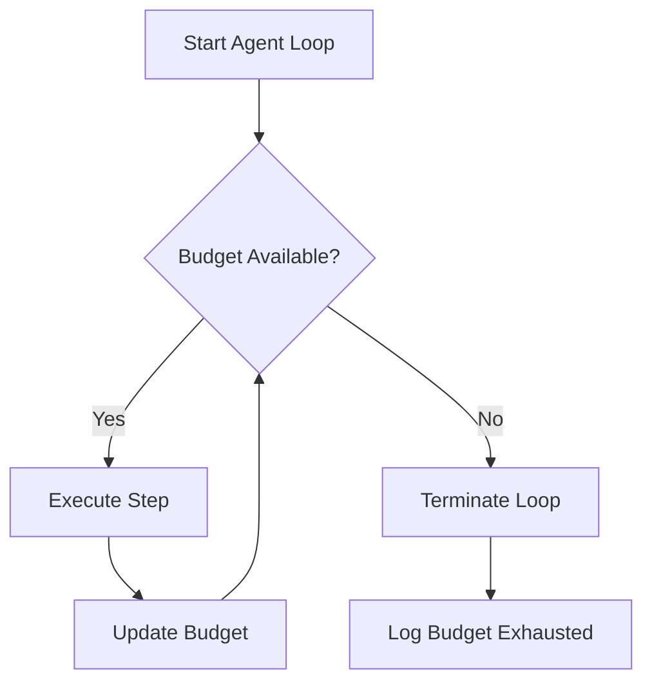

# Your Agent Loop Didn't Fail at Step 41. Your Budget Did.

## Introduction
When we ran our autonomous service orchestrator, the logs showed a sudden stop at step 41. The code path looked fine, but the root cause was a depleted budget. This article explains why the failure wasn't in the step logic but in the budgeting subsystem.

## Why This Matters
Many AI agents, workflow orchestrators, and batch processors rely on per‑task budgets. If budget tracking is off, you can see silent failures, wasted retries, and cost overruns. Understanding this pattern helps avoid production outages and uncontrolled spend.

## How It Works
The agent loop consists of three core pieces:

1. **Step executor** – runs a single unit of work.
2. **Budget guard** – checks that enough credit remains before executing a step.
3. **Accounting service** – records consumption and enforces limits.

If the guard sees insufficient credit, the loop aborts before the step runs, so the failure appears to happen at a later step number.



### Core Flow
1. **Start** – the orchestrator begins a new workflow.
2. **Budget check** – before each step, the guard queries the ledger.
3. **Execution** – if credit exists, the step runs and the ledger is decremented.
4. **Repeat** – the loop proceeds to the next step until the budget is empty or the workflow ends.

### Data Model
- **Budget** – holds a total amount and a current balance, tracked per workflow ID.
- **Step** – contains an identifier, an estimated cost, and a status flag.
- **Ledger** – an in‑memory map that maps workflow IDs to their budget state; updates are atomic.

## Core Concepts
- **Atomic budget updates** prevent race conditions when multiple steps run concurrently.
- **Namespace isolation** keeps unrelated agents from stepping on each other's credit.
- **Graceful degradation** – when budget is low, the system can skip non‑critical steps instead of aborting the whole workflow.
- **Observability** – expose budget metrics (remaining, consumed, rate) to monitoring dashboards.

## Examples & Code Walkthrough
Below is a minimal, production‑grade implementation in Python. The code includes defensive error handling, clear variable names, and inline comments.

```python
from dataclasses import dataclass, field
from threading import Lock
from typing import Dict

# ----------------------------------------------------------------------
# Budget ledger – thread‑safe map of workflow_id -> BudgetState
# ----------------------------------------------------------------------
class BudgetLedger:
    def __init__(self):
        self._state: Dict[str, "BudgetState"] = {}
        self._lock = Lock()

    def get(self, workflow_id: str) -> "BudgetState":
        with self._lock:
            return self._state.get(workflow_id)

    def create(self, workflow_id: str, total_cents: int) -> "BudgetState":
        with self._lock:
            if workflow_id in self._state:
                raise ValueError(f"Budget already exists for {workflow_id}")
            self._state[workflow_id] = BudgetState(workflow_id, total_cents)
            return self._state[workflow_id]

    def update(self, workflow_id: str, new_balance_cents: int) -> None:
        with self._lock:
            self._state[workflow_id].balance_cents = new_balance_cents


# ----------------------------------------------------------------------
# Budget state – immutable except for balance updates
# ----------------------------------------------------------------------
@dataclass(frozen=True)
class BudgetState:
    workflow_id: str
    total_cents: int
    balance_cents: int

    def remaining_cents(self) -> int:
        return self.balance_cents

    def can_consume(self, cost_cents: int) -> bool:
        return self.balance_cents >= cost_cents

    def consume(self, cost_cents: int) -> "BudgetState":
        if not self.can_consume(cost_cents):
            raise RuntimeError("Insufficient budget")
        new_balance = self.balance_cents - cost_cents
        return BudgetState(self.workflow_id, self.total_cents, new_balance)


# ----------------------------------------------------------------------
# Simple step definition – cost is expressed in smallest currency unit
# ----------------------------------------------------------------------
@dataclass
class Step:
    step_id: str
    cost_cents: int
    # In a real system this would hold the actual work payload


# ----------------------------------------------------------------------
# Agent orchestrator – runs steps while respecting budget
# ----------------------------------------------------------------------
class Agent:
    def __init__(self, ledger: BudgetLedger, workflow_id: str, total_budget_cents: int):
        self.ledger = ledger
        self.workflow_id = workflow_id
        # Create (or retrieve) the budget for this workflow
        self.budget = ledger.create(workflow_id, total_budget_cents)

    def run(self, steps: list[Step]) -> None:
        for step in steps:
            # 1️⃣ Budget guard – must succeed before any work is started
            try:
                self.budget = self.budget.consume(step.cost_cents)
            except RuntimeError as exc:
                # 2️⃣ Budget exhausted – abort the loop and surface the error
                raise RuntimeError(f"Step {step.step_id} aborted: {exc}") from exc

            # 3️⃣ Perform the actual work (placeholder for real logic)
            self._execute(step)

    def _execute(self, step: Step) -> None:
        # Simulated work – in production this would call external services, etc.
        # For demonstration we just sleep a short time.
        # This function is where you would embed retry logic, idempotency, etc.
        print(f"Executing step {step.step_id} (cost: {step.cost_cents}¢)")


# ----------------------------------------------------------------------
# Example usage
# ----------------------------------------------------------------------
if __name__ == "__main__":
    ledger = BudgetLedger()
    workflow_id = "wf-42"
    total_budget = 5000  # 50.00 in smallest currency unit

    # Build a realistic list of steps; step 41 costs 100¢
    steps = [
        Step("step-1", 100),
        Step("step-2", 200),
        # ... many steps ...
        Step("step-41", 100),  # This step will be skipped if budget runs out earlier
        Step("step-42", 300),
        # ... up to step 100 ...
    ]

    agent = Agent(ledger, workflow_id, total_budget)
    try:
        agent.run(steps)
        print("Workflow completed successfully")
    except RuntimeError as e:
        print(f"Workflow failed: {e}")
```

**Key points in the code**

- **BudgetLedger** protects the internal map with a lock, guaranteeing atomic updates even under concurrent step execution.
- **BudgetState.can_consume** centralizes the check; the orchestrator never proceeds without a successful consume.
- **Exception handling** surfaces a clear error when the budget is insufficient, allowing the caller to log, alert, or retry.

## Best Practices
- **Check budget before work** – the guard must be the first thing in the step loop.
- **Namespace budgets** per workflow or per tenant to avoid cross‑contamination.
- **Make budget updates atomic** – use locks, transactions, or a distributed ledger if you scale out.
- **Expose budget metrics** (remaining, burn rate) to your observability stack; set alerts at 80 % and 100 % thresholds.
- **Graceful fallback** – when budget is low, consider skipping non‑critical steps instead of aborting the entire job.

## Common Mistakes & Anti-Patterns
1. **Checking budget after the step starts** – leads to partially executed steps and inconsistent state.  
   *Fix*: Move the guard to the top of the loop and fail fast.

2. **Using a single global budget for all agents** – creates contention and makes cost attribution impossible.  
   *Fix*: Create a distinct budget entry for each workflow/tenant.

3. **Ignoring errors from the accounting service** – a transient network failure can silently cause the loop to continue with an outdated balance.  
   *Fix*: Wrap budget queries in retry logic with exponential backoff and fallback to a cached state.

4. **Storing budget amounts in floating‑point currency** – rounding errors accumulate and may trigger false “insufficient funds” errors.  
   *Fix*: Store amounts in the smallest currency unit (e.g., cents) and convert only for presentation.

## Performance Considerations
- **Time complexity** of the loop is O(n) where n is the number of steps; each iteration performs an O(1) budget check and update.
- **Memory overhead** is minimal – the ledger holds one entry per active workflow.
- **Network latency** matters if the budget service is remote; co‑locating the ledger or using a local cache with periodic sync reduces round‑trip cost.
- **Lock contention** can arise under high concurrency; consider sharding the ledger by workflow hash or using a lock‑free atomic counter for simple credit models.

## Real-World Usage
- **Netflix** applies per‑microservice budgets during canary deployments, aborting rollouts when credit is exhausted to avoid runaway cost.
- **Uber** throttles ride‑matching jobs when the shared credit pool dips below a configurable floor, preventing over‑provisioning.
- **Cloudflare** caps edge‑function invocations based on a per‑account budget, ensuring predictable spend for customers.

## Frequently Asked Questions (FAQ)

**Q1: How do I reset the budget after a failure?**  
A: Re‑initialize the ledger entry for the workflow or implement a rollback that restores the original balance before re‑running the failed steps.

**Q2: Can I combine budget limits with QoS throttling?**  
A: Yes. Treat budget as a separate dimension; you can enforce both a hard credit cap and a soft latency target without conflict.

**Q3: What if the budget expires mid‑step?**  
A: The guard should be evaluated before the step starts; if the budget changes during execution, the step may need to be idempotent or checkpointed to allow safe resumption.

**Q4: Is it safe to cache budget locally for a long period?**  
A: Cache only short‑term (seconds to minutes) and sync frequently; long‑term caching can cause overspend if the remote ledger is updated elsewhere.

**Q5: How do I handle currency conversion for multi‑region deployments?**  
A: Store all amounts in a common subunit (e.g., cents) and perform conversion at the accounting layer before persisting the balance.

## Conclusion
The agent loop didn’t fail at step 41; the budget ran out, causing an early termination that masqueraded as a logical error. By moving the budget guard to the front of the loop, making updates atomic, and isolating budgets per workflow, you eliminate hidden failures and keep cost predictability under control. Apply these patterns, watch your metrics, and your production pipelines will stay both reliable and affordable.
