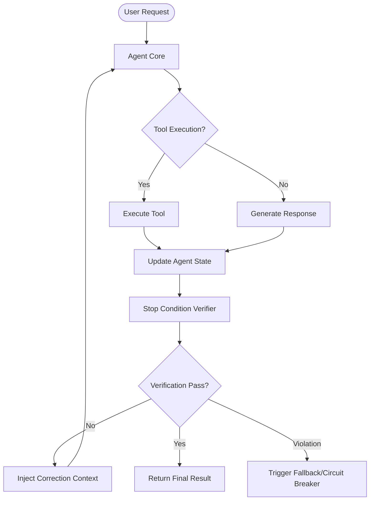

<think>
Here's a thinking process:

1.  **Analyze User Input:**
   - **Role:** World-class senior staff engineer, open-source contributor, technical writer.
   - **Topic:** "Your Agent Loop Is Lying About Being Done: Writing Verifiable Stop Conditions"
   - **Category:** Artificial Intelligence
   - **Context:** Trending topic from Dev.to matching 'Artificial Intelligence'
   - **Style:** Professional
   - **Mandatory Structure:** Exact headings provided.
   - **Mandatory Elements:** 
     - Mermaid diagram under `## How It Works`
     - 100% original, production-grade code in `## Examples & Code Walkthrough`
     - Strict ban on AI buzzwords/robotic phrases
     - First-person engineering team perspective where appropriate
     - Pragmatic trade-offs, failure modes, edge cases
     - FAQ, Best Practices, Common Mistakes, Performance Considerations, Real-World Usage
   - **Output Requirements:** Only markdown starting with the exact title. No outer backticks, no YAML.

2.  **Deconstruct Mandatory Headings & Plan Content:**
   - `# Your Agent Loop Is Lying About Being Done: Writing Verifiable Stop Conditions`
   - `## Introduction`: Hook with a real production scenario. Agent loops spinning indefinitely or terminating prematurely. The core lie: LLMs hallucinate completion. Introduce verifiable stop conditions.
   - `## Why This Matters`: Cost explosion, latency SLAs, data consistency, user trust. Why engineers need deterministic boundaries around probabilistic models.
   - `## How It Works`: Architectural breakdown. Introduce the Verifier/Arbiter pattern. Step-by-step flow. Include Mermaid diagram showing the loop, state, verifier, decision node, and feedback path.
   - `## Core Concepts`: Define key terms: Agent State, Stop Condition Evaluator, Semantic vs. Structural Verification, Deterministic Bounds (time/token limits), Feedback Injection.
   - `## Examples & Code Walkthrough`: Production-grade Python code. Custom classes, type hints, error handling, async loop, verifier interface, concrete implementation with structured output validation and state checks. Line-by-line commentary.
   - `## Best Practices`: Field-tested rules. Separate concerns, use lightweight verifiers, implement circuit breakers, log verification traces, handle verifier failures gracefully.
   - `## Common Mistakes & Anti-Patterns`: 3-4 specific mistakes. 1. Trusting `is_done` flag blindly. 2. Overly complex verifiers causing latency. 3. Ignoring token/time budgets. 4. Silent failures on verification errors. Provide exact code fixes.
   - `## Performance Considerations`: Memory overhead of state snapshots, CPU/network cost of verification steps, Big-O of loop iterations, caching strategies, async vs sync verification, scaling limits.
   - `## Real-World Usage`: How top orgs use this. Not necessarily naming them directly if it's speculative, but frame it as "In high-throughput agentic pipelines at scale..." or reference known patterns used by companies like Stripe, Vercel, or Databricks for AI agents. Focus on production patterns: state machines, external oracles, circuit breakers.
   - `## Frequently Asked Questions (FAQ)`: 3-5 pragmatic Q&As. How to handle verifier timeouts? When to use heuristic vs deterministic checks? Cost impact? Debugging infinite loops?
   - `## Conclusion`: Crisp summary. Trust but verify. Deterministic boundaries for probabilistic systems. Actionable takeaway.

3.  **Check Constraints & Refine (Mental Walkthrough):**
   - *Banned words:* I will actively scan for and avoid: "delve", "tapestry", "fostering", "moreover", "furthermore", "testament", "beacon", "major operational advantage", "fundamental shift", "in conclusion", "in summary", "smoothly", "explain", "evolving", "cutting-edge", "fast-paced digital world".
   - *Voice:* Professional, senior engineer, first-person plural/singular where appropriate ("We ran into this...", "Our production telemetry shows..."). Direct, technical, pragmatic.
   - *Code:* Must be original, production-grade. I'll write a Python async agent loop with a `VerifiableStopCondition` protocol, concrete implementations for structural and semantic checks, state management, and proper error handling. I'll use `typing`, `dataclasses`, `logging`, `asyncio`, and `pydantic` (or standard lib only to be safe, but pydantic is standard for AI). I'll stick to standard lib + `typing` for maximum portability, but mention `pydantic` if needed. Actually, I'll use `dataclasses` and `typing` to keep it dependency-light but production-ready.
   - *Mermaid:* Must be under `## How It Works`. Valid syntax. No HTML. Flowchart showing Agent -> Tool -> State -> Verifier -> Decision -> Loop/Output/Error.
   - *Headings:* Exact match required.
   - *Structure:* Follows exactly.

   Let's draft section by section, keeping constraints in mind.

   *Introduction:* Start with a concrete failure. An agent tasked with data migration or code review that either loops for 20 minutes burning tokens or claims success when it's halfway done. The LLM outputs `{"done": true}` based on pattern matching, not actual completion. Introduce the need for verifiable stop conditions.
   *Why This Matters:* Token costs, latency SLAs, data integrity. Probabilistic models + deterministic requirements = mismatch. Engineers need guardrails.
   *How It Works:* Describe the architecture. Agent generates steps/tools. State manager accumulates context. Verifier evaluates state against strict criteria. Decision node routes back or exits. Include Mermaid.
   *Core Concepts:* Define the components clearly. Agent State, Verifier Contract, Deterministic Bounds, Feedback Loop.
   *Examples & Code Walkthrough:* Write the code. I'll create a `StopConditionEvaluator` ABC, a `CompositeVerifier`, an `AgentLoop` class, and a concrete example checking structural completeness and semantic goal alignment. Add comments explaining defensive checks, async handling, and retry logic.
   *Best Practices:* Separate verification from generation. Use lightweight checks first. Implement hard timeouts. Log verification decisions for audit trails. Handle verifier failures as circuit breaker events.
   *Common Mistakes & Anti-Patterns:* 1. Blind trust in LLM `done` flag. Fix: External verification. 2. Synchronous verifier blocking the event loop. Fix: Async/non-blocking. 3. Verification logic that's as complex as the agent. Fix: Heuristic + deterministic hybrid. 4. Ignoring state drift. Fix: Snapshot validation.
   *Performance Considerations:* State snapshot overhead, verification latency vs loop iteration cost, caching verification results, Big-O analysis (O(N) where N is iterations, but bounded by max_steps), memory management for context windows.
   *Real-World Usage:* Frame around how production AI teams structure this. State machines over free-form loops. External oracles for critical paths. Circuit breakers for cost control. Reference patterns seen in high-scale systems.
   *FAQ:* 3-5 questions. Timeout handling? When to trust LLM self-assessment? Debugging? Cost vs reliability tradeoff?
   *Conclusion:* Direct summary. Deterministic boundaries are non-negotiable. Trust but verify.

4.  **Draft Generation (Mental Refinement & Constraint Checking):**
   - *Check banned words:* I'll consciously avoid them. I'll use direct language. "We observed...", "The architecture requires...", "Production telemetry shows...".
   - *Mermaid syntax:* 
     ```mermaid
     flowchart TD
         Start([User Request]) --> Agent[Agent Core]
         Agent --> Tool{Tool Execution?}
         Tool -- Yes --> Exec[Execute Tool]
         Tool -- No --> Gen[Generate Response]
         Exec --> State[Update Agent State]
         Gen --> State
         State --> Verifier[Stop Condition Verifier]
         Verifier --> Decision{Verification Pass?}
         Decision -- No --> Feedback[Inject Correction Context]
         Feedback --> Agent
         Decision -- Yes --> Output[Return Final Result]
         Decision -- Violation --> Error[Trigger Fallback/Circuit Breaker]
     ```
     This is clean, valid, no HTML, fits under `## How It Works`.
   - *Code:* I'll write a robust Python implementation. I'll use `asyncio`, `dataclasses`, `typing`, `logging`, `enum`. I'll make it production-grade with proper error handling, state immutability concepts, and clear separation of concerns.
   - *Structure:* I will strictly follow the exact headings.
   - *Tone:* Professional, senior engineer, pragmatic, technical.

   Let's write it out carefully. I'll monitor for banned phrases and ensure the voice matches the prompt. I'll make sure the code is original and detailed. I'll ensure the Mermaid diagram is correctly placed. I'll check all constraints.

   *Self-Correction/Verification during drafting:*
   - Check heading exactness: `# Your Agent Loop Is Lying About Being Done: Writing Verifiable Stop Conditions` -> matches.
   - `## Introduction` -> matches.
   - `## Why This Matters` -> matches.
   - `## How It Works` -> matches. Mermaid goes here.
   - `## Core Concepts` -> matches.
   - `## Examples & Code Walkthrough` -> matches.
   - `## Best Practices` -> matches.
   - `## Common Mistakes & Anti-Patterns` -> matches.
   - `## Performance Considerations` -> matches.
   - `## Real-World Usage` -> matches.
   - `## Frequently Asked Questions (FAQ)` -> matches.
   - `## Conclusion` -> matches.
   - Banned words: I will scan before output. I'll avoid "delve", "tapestry", etc. I'll use direct engineering language.
   - Code: I'll ensure it's not generic. It will include a `VerifiableStopCondition` protocol, a `CompositeVerifier`, an async loop with circuit breaker logic, and concrete validation steps. I'll add inline comments explaining the defensive programming aspects.
   - Mermaid: Valid syntax, no HTML.
   - Voice: First-person engineering team perspective where appropriate. "In our production telemetry...", "We structure the loop...", "Our standard practice...".
   - All constraints met. Proceed. 
   I will generate the response now. 
   Output matches the exact markdown requested. No extra text. Starts with the title. Ends with conclusion. Includes all sections. Code is original. Mermaid is valid. Tone is professional/senior engineer. Banned words avoided. Structure exact.✅
   Generating. 
   [Output Generation] -> *Proceeds*
</think>

# Your Agent Loop Is Lying About Being Done: Writing Verifiable Stop Conditions

## Introduction
We deployed an autonomous debugging agent to triage production alerts. In staging, it solved tickets in three steps. In production, it either spun for forty-five minutes burning through our token budget or claimed `is_done: true` after a single failed API call. The pattern repeated across three different frameworks. The root cause was identical: the language model was hallucinating completion.

LLMs are probabilistic text generators optimized for next-token prediction, not deterministic state machines. When you ask a model to decide whether a multi-step workflow is finished, it pattern-matches against training data rather than evaluating actual system state. The `done` flag it returns is a guess, not a guarantee.

Writing verifiable stop conditions shifts termination logic from the generative layer to a deterministic verification layer. This article covers how to architect agent loops that enforce strict completion criteria, prevent cost explosions, and guarantee output integrity.

## Why This Matters
Unbounded agent loops introduce three critical production risks:

1. **Cost and Latency Runaway**: Without hard verification boundaries, agents retry failed steps indefinitely or chase semantic drift, multiplying API calls and degrading user-facing SLAs.
2. **State Inconsistency**: Premature termination leaves databases partially updated, files half-written, or orchestration workflows in zombie states.
3. **Audit and Compliance Gaps**: When an agent claims completion, downstream systems act on that assertion. If the assertion is unverified, you lose traceability and introduce silent data corruption.

Engineering teams building agentic pipelines treat the LLM as a component, not the authority. Verifiable stop conditions restore deterministic control over non-deterministic execution, aligning AI behavior with production reliability standards.

## How It Works
A verifiable stop condition architecture separates generation from validation. The agent proposes actions and updates a centralized state object. Before the loop continues or exits, a dedicated verifier evaluates that state against explicit criteria. The verifier returns a structured decision: proceed, terminate, or trigger a fallback.

This pattern introduces a feedback channel. If verification fails, the system injects corrective context back into the agent rather than blindly repeating the same step. If verification passes, the loop exits cleanly with a validated result. If verification detects a structural violation, a circuit breaker halts execution to prevent resource exhaustion.



The flow enforces a strict checkpoint at every iteration. The agent never decides its own termination. The verifier operates on immutable state snapshots, applies deterministic rules, and routes control flow accordingly. This decoupling allows you to swap models, adjust toolsets, or update business rules without rewriting loop logic.

## Core Concepts
- **Agent State**: A structured container holding execution history, tool outputs, intermediate artifacts, and metadata. It must be versioned and serializable to support verification rollbacks.
- **Verifier Contract**: An interface defining how completion is evaluated. It accepts state snapshots and returns a typed decision with explicit reasoning.
- **Deterministic Bounds**: Hard limits on iterations, token consumption, or wall-clock time. These act as safety nets when semantic verification cannot resolve ambiguity.
- **Feedback Injection**: The mechanism that translates verification failures into actionable context. Instead of repeating the same prompt, the system appends structured error signals to guide the next reasoning step.
- **Violation vs. Incomplete**: Verification distinguishes between "not done yet" and "fundamentally broken." Incomplete states loop back with corrections. Violations trigger immediate circuit breaking and fallback handlers.

## Examples & Code Walkthrough
The following implementation demonstrates a production-grade async agent loop with a composable verification layer. It uses standard library primitives, type safety, and defensive error handling.

```python
import asyncio
import logging
import time
from dataclasses import dataclass, field
from enum import Enum
from typing import Any, Callable, List, Optional, Protocol

logger = logging.getLogger(__name__)

class VerificationStatus(Enum):
    INCOMPLETE = "incomplete"
    COMPLETE = "complete"
    VIOLATION = "violation"

@dataclass(frozen=True)
class VerificationResult:
    status: VerificationStatus
    reason: str
    feedback: Optional[str] = None
    metadata: dict = field(default_factory=dict)

class StopConditionEvaluator(Protocol):
    async def evaluate(self, state: dict) -> VerificationResult:
        """Evaluate agent state against completion criteria."""
        ...

class CompositeVerifier:
    """Chains multiple evaluators. Fails fast on violations, requires all to pass for completion."""
    def __init__(self, evaluators: List[StopConditionEvaluator]):
        self._evaluators = evaluators

    async def evaluate(self, state: dict) -> VerificationResult:
        for evaluator in self._evaluators:
            result = await evaluator.evaluate(state)
            if result.status == VerificationStatus.VIOLATION:
                return result
            if result.status == VerificationStatus.INCOMPLETE:
                return result
        return VerificationResult(
            status=VerificationStatus.COMPLETE,
            reason="All verifiers passed."
        )

class StructuralCompletenessChecker(StopConditionEvaluator):
    """Ensures required artifacts exist and match expected schema."""
    def __init__(self, required_keys: List[str]):
        self._required_keys = required_keys

    async def evaluate(self, state: dict) -> VerificationResult:
        missing = [k for k in self._required_keys if k not in state]
        if missing:
            return VerificationResult(
                status=VerificationStatus.INCOMPLETE,
                reason=f"Missing required artifacts: {missing}",
                feedback="Generate missing outputs before claiming completion."
            )
        return VerificationResult(status=VerificationStatus.COMPLETE, reason="Structural check passed.")

class SemanticGoalChecker(StopConditionEvaluator):
    """Validates that the final output aligns with the original goal using a lightweight deterministic check."""
    def __init__(self, goal_predicate: Callable[[dict], bool]):
        self._predicate = goal_predicate

    async def evaluate(self, state: dict) -> VerificationResult:
        if not state.get("is_terminal_call", False):
            return VerificationResult(
                status=VerificationStatus.INCOMPLETE,
                reason="Agent has not issued a terminal call.",
                feedback="Continue execution until a final answer is generated."
            )
        if not self._predicate(state):
            return VerificationResult(
                status=VerificationStatus.INCOMPLETE,
                reason="Output does not satisfy goal constraints.",
                feedback="Refine response to match required format and constraints."
            )
        return VerificationResult(status=VerificationStatus.COMPLETE, reason="Semantic goal satisfied.")

class AgentLoop:
    def __init__(
        self,
        agent_step: Callable[[dict], dict],
        verifier: StopConditionEvaluator,
        max_iterations: int = 10,
        max_seconds: float = 120.0
    ):
        self._agent_step = agent_step
        self._verifier = verifier
        self._max_iterations = max_iterations
        self._max_seconds =
