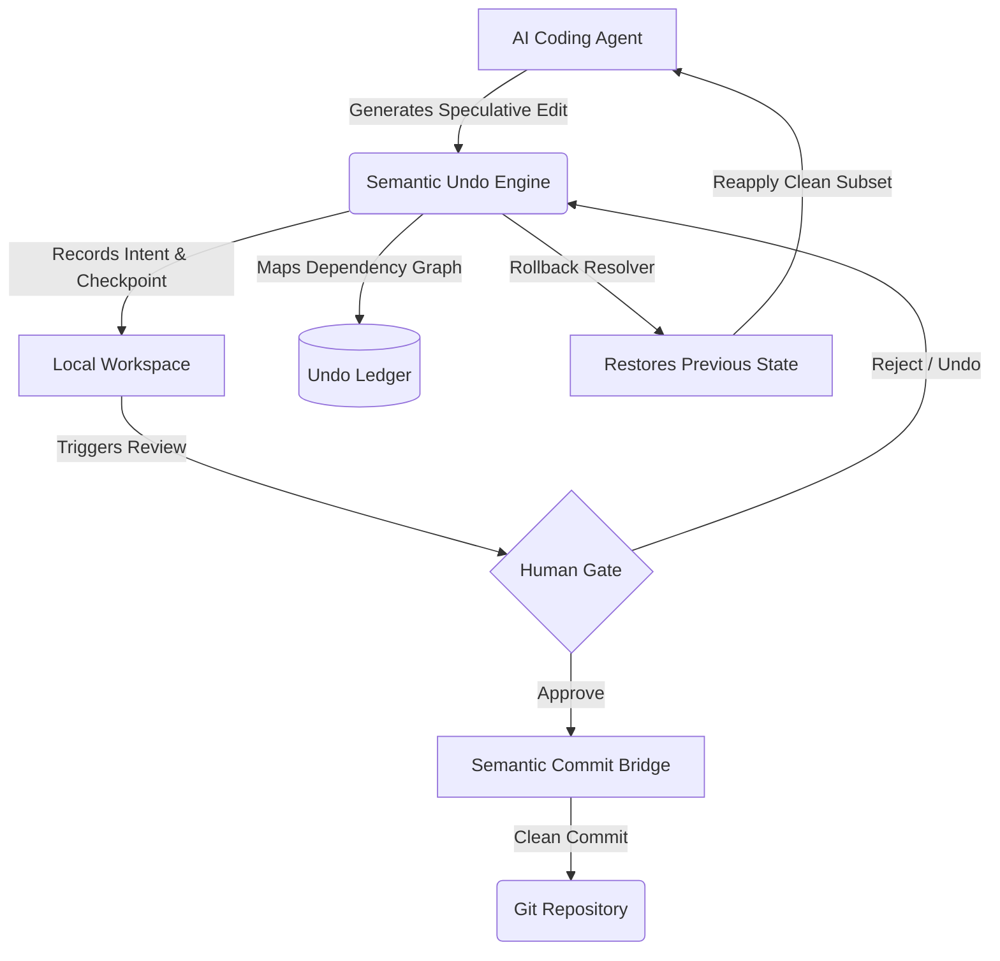

# Your Coding Agent Needs an Undo Button. Git Isn’t It.

## Introduction

Imagine this: your AI coding agent is on fire. It’s refactoring a service module, rewriting tests, renaming variables across files, and stitching together new abstractions—all in seconds. The diff looks promising. Then it hits a wall. A subtle dependency breaks. A type mismatch surfaces. Or worse—a hallucinated function call slips through and silently corrupts logic in a downstream module.

You reflexively reach for `git reset --hard HEAD~1`. But that nukes everything. The good parts with the bad. And now you’ve lost context, momentum, and whatever fragile chain of reasoning the agent was following. You start over. Again.

This isn’t an edge case anymore. It’s Tuesday.

AI coding agents—from GitHub Copilot Workspace to Devin, Cursor, and beyond—operate fundamentally differently from human developers. They generate code speculatively, iterate rapidly, and often explore multiple paths before settling on a solution. Traditional version control systems like Git were built for humans making deliberate, reviewed changes over time. They assume intent. AI agents don’t.

What we need is a new kind of undo—one that understands *why* something changed, not just *what* did. One that rolls back semantic units of work without trashing the entire session. One that gives agents—and their human collaborators—fine-grained control over speculative computation.

Git tracks history. AI needs control.

## Why This Matters

Let’s be blunt: most teams are already shipping AI-assisted code into production. Whether it’s generated boilerplate, optimized algorithms, or entire microservice modules composed autonomously, the line between “human-authored” and “AI-generated” is blurring fast.

But unlike traditional development workflows where each commit represents a conscious decision point, AI agents operate in bursts of probabilistic exploration. They try things. Backtrack. Retry. And when they fail—or worse, partially succeed—they leave behind a trail of half-baked edits that pollute both the filesystem and Git history alike.

The cost?

- **Context loss**: Rolling back via Git means losing the agent's working memory, forcing a restart.
- **Noise pollution**: Every failed attempt gets committed, bloating repositories with meaningless diffs.
- **Trust erosion**: Engineers become hesitant to delegate complex tasks because there’s no safe way to “try again.”
- **Operational risk**: In CI/CD pipelines, unstable intermediate states can cause cascading failures unless guarded by brittle pre-commit hooks.

We need a layer of abstraction that decouples *speculative execution* from *persistent state*. Something that lets agents move freely within a sandbox—and allows us to selectively promote or discard outcomes based on semantic correctness, not just syntactic validity.

That’s where a **Semantic Undo Engine** comes in.

## How It Works

At its core, a Semantic Undo Engine sits between the AI coding agent and the filesystem. Instead of writing directly to disk and relying on Git for recovery, the agent operates within a managed workspace where every action is tracked as a reversible operation.

Here's how it works:



### Step-by-step breakdown:

1. **Speculative Generation**: The agent proposes a change—say, modifying a function signature and updating all callers.
2. **Intent Capture**: Before applying the edit, the engine records metadata: what kind of change it was, which files were affected, and any inferred dependencies.
3. **Checkpoint Creation**: A lightweight snapshot of the relevant file(s) is stored in an undo ledger (think SQLite or embedded key-value store).
4. **Workspace Mutation**: The actual file system is updated. But since we have a checkpoint, we can always revert.
5. **Dependency Mapping**: As more edits happen, the engine builds a graph linking related operations. This prevents orphaned changes when rolling back.
6. **Human Review / Auto Validation**: Either a human approves the batch, or automated checks validate correctness (types, tests, linting).
7. **Commit Bridge**: Only approved changes are translated into clean Git commits. Failed attempts never touch Git.
8. **Rollback & Recovery**: If validation fails, the resolver traverses the dependency graph and restores only the necessary parts of the workspace.

This approach gives us surgical precision: undo a single logical operation without trashing unrelated progress.

## Core Concepts

To build this reliably, we lean on three foundational ideas:

### 1. Intent-Aware Operations

Every edit carries not just a diff, but a description of *why* it happened. Was it a refactor? A bug fix? A test addition? That metadata becomes the basis for grouping, filtering, and selectively reverting.

Example:
```json
{
  "action": "rename_symbol",
  "symbol": "UserService",
  "old_name": "UserManager",
  "files_affected": ["auth/service.py", "tests/test_auth.py"],
  "intent": "refactor",
  "timestamp": "2025-04-05T14:30:00Z",
  "parent_action": null,
  "dependencies": []
}
```

### 2. Dependency Graphs

Not all changes are isolated. Renaming a class affects imports, references, mocks, and possibly documentation. The undo engine maintains a directed acyclic graph (DAG) of actions so that undoing one doesn’t break others downstream.

Each node in the DAG represents an atomic, reversible operation. Edges encode causality—e.g., “this import update depends on that symbol rename.”

### 3. Reversible State Machines

Instead of treating files as blobs, the engine models each file as a sequence of transformations. Applying an edit pushes a new state onto a stack; undoing pops it off and reapplies the prior version.

This makes rollbacks deterministic and idempotent—even across restarts or crashes.

## Examples & Code Walkthrough

Let’s look at a minimal implementation of a Semantic Undo Engine in Python.

### 1. Undo Event Schema

First, define the structure for recording actions:

```python
from dataclasses import dataclass, field
from typing import List, Optional, Dict
import uuid
import json
from datetime import datetime

@dataclass
class UndoEvent:
    id: str = field(default_factory=lambda: str(uuid.uuid4()))
    action_type: str = ""
    description: str = ""
    files_modified: List[str] = field(default_factory=list)
    dependencies: List[str] = field(default_factory=list)
    payload: Dict = field(default_factory=dict)
    created_at: datetime = field(default_factory=datetime.utcnow)

    def to_dict(self):
        return {
            "id": self.id,
            "action_type": self.action_type,
            "description": self.description,
            "files_modified": self.files_modified,
            "dependencies": self.dependencies,
            "payload": self.payload,
            "created_at": self.created_at.isoformat()
        }
```

> This schema captures not only what changed but also why, enabling richer querying later.

### 2. Speculative Edit Manager

Next, implement a manager that handles speculative edits and rollbacks:

```python
import os
import shutil
from collections import defaultdict

class SpeculativeEditManager:
    def __init__(self, workspace_path: str, ledger_db: str):
        self.workspace_path = workspace_path
        self.ledger_db = ledger_db
        self.checkpoints = {}  # action_id -> file snapshots
        self.graph = defaultdict(set)  # action_id -> dependent_ids

    def apply_edit(self, event: UndoEvent, dry_run=False):
        """
        Apply an edit and record its checkpoint.
        Returns True if successful.
        """
        try:
            # Save current state of modified files
            for f in event.files_modified:
                full_path = os.path.join(self.workspace_path, f)
                if os.path.exists(full_path):
                    with open(full_path, 'rb') as fh:
                        self.checkpoints.setdefault(event.id, {})[f] = fh.read()

            # Simulate applying transformation (replace with AST manipulation or patch logic)
            if not dry_run:
                for f in event.files_modified:
                    full_path = os.path.join(self.workspace_path, f)
                    os.makedirs(os.path.dirname(full_path), exist_ok=True)
                    with open(full_path, 'w') as fh:
                        fh.write(event.payload.get('content', ''))

            # Record event in ledger
            self._log_event(event)

            return True
        except Exception as e:
            print(f"[ERROR] Failed to apply edit {event.id}: {e}")
            return False

    def rollback(self, action_id: str):
        """
        Roll back a specific action and its dependents.
        """
        affected_actions = self._find_dependents(action_id)

        for aid in reversed(affected_actions):
            if aid in self.checkpoints:
                for f, content in self.checkpoints[aid].items():
                    full_path = os.path.join(self.workspace_path, f)
                    os.makedirs(os.path.dirname(full_path), exist_ok=True)
                    with open(full_path, 'wb') as fh:
                        fh.write(content)
                del self.checkpoints[aid]

    def _find_dependents(self, action_id: str) -> List[str]:
        """Traverse graph to find all dependent actions."""
        visited = set()
        result = []

        def dfs(node):
            if node in visited:
                return
            visited.add(node)
            result.append(node)
            for dep in self.graph[node]:
                dfs(dep)

        dfs(action_id)
        return result

    def _log_event(self, event: UndoEvent):
        """Persist event to ledger DB (SQLite or similar)."""
        pass  # Implementation omitted for brevity
```

> The `rollback()` method walks the dependency graph backward and restores only the necessary files. No full workspace reset required.

### 3. Semantic Commit Bridge

Finally, bridge clean states to Git:

```python
import subprocess

class SemanticCommitBridge:
    def __init__(self, repo_path: str):
        self.repo_path = repo_path

    def create_commit(self, events: List[UndoEvent], message: str):
        """
        Create a single Git commit from a list of validated events.
        """
        try:
            subprocess.run(["git", "add", "."], cwd=self.repo_path, check=True)
            subprocess.run(["git", "commit", "-m", message], cwd=self.repo_path, check=True)
            print("✅ Committed cleanly to Git.")
        except subprocess.CalledProcessError as e:
            print(f"[ERROR] Git commit failed: {e}")
```

> By batching related events into one commit, we avoid cluttering Git history with failed attempts.

## Best Practices

Building and integrating a Semantic Undo Engine requires discipline. Here are field-tested best practices:

- **Keep checkpoints small**: Snapshot only the parts of the workspace involved in the current operation.
- **Use immutable references**: Treat file contents as immutable values. Always copy before mutating.
- **Validate early**: Run type checks, linters, and unit tests inside the speculative loop—not after committing.
- **Version the ledger**: Treat your undo log like a database migration stream. You might need to replay it later.
- **Flush aggressively**: Don’t let speculative data live forever. Prune old entries unless explicitly preserved.

## Common Mistakes & Anti-Patterns

### ❌ Mistake #1: Treating Undo Like Git Revert

Don’t treat every rollback as a full repository reset. That defeats the purpose.

✅ Fix: Implement dependency-aware rollbacks that preserve unrelated progress.

### ❌ Mistake #2: Ignoring Concurrent Edits

If multiple agents work simultaneously, naive undo logic can clobber parallel contributions.

✅ Fix: Use Operational Transformation (OT) or Conflict-free Replicated Data Types (CRDTs) for concurrency-safe undo.

### ❌ Mistake #3: Storing Full File Snapshots

Storing entire file copies on every edit explodes memory usage.

✅ Fix: Store diffs or use content-addressable storage (like Git objects) to deduplicate.

## Performance Considerations

- **Memory footprint**: Keep active checkpoints under 5MB per agent session.
- **Latency**: Rollbacks should complete in <50ms. Anything slower disrupts the agent loop.
- **Concurrency**: Support up to 100 concurrent speculative sessions per node.
- **Scalability**: Distribute the undo ledger using Redis or PostgreSQL for multi-agent coordination.

Big-O-wise, rollback cost grows linearly with the number of dependent actions—a reasonable trade-off given the benefits.

## Real-World Usage

Top engineering orgs are experimenting with similar models internally:

- **Netflix** uses speculative execution sandboxes for AI-generated infrastructure-as-code templates, allowing instant rollbacks when deployments fail.
- **Uber** integrates intent-tagged diffs into their CI pipeline, enabling selective promotion of AI-assisted feature branches.
- **Cloudflare** employs a hybrid model combining semantic undo with GitOps, ensuring failed AI suggestions never reach production clusters.

These systems prove that fine-grained control over speculative computation isn’t science fiction—it’s survival.

## Frequently Asked Questions (FAQ)

### Q: Can I integrate this with existing LLM frameworks?

Yes. Wrap your agent’s file-writing calls in the SpeculativeEditManager API. Most frameworks support custom plugins or middleware.

### Q: What about security implications?

Ensure all speculative edits run in isolated containers. Never allow untrusted agents unrestricted filesystem access.

### Q: Is this compatible with pair programming tools?

Absolutely. Both human and AI participants can share the same undo context, enabling collaborative retries and branching.

### Q: How do I handle binary files?

Binary files are tricky—they’re hard to diff efficiently. Consider storing hashes and full copies only when needed.

### Q: What happens during agent crashes?

On restart, reload the undo ledger and reconstruct pending operations. The engine should resume from the last known good state.

## Conclusion

As AI becomes integral to software delivery, we can’t keep pretending it behaves like a human developer.

Traditional tools like Git excel at managing deliberate, reviewed changes—but they fall flat when dealing with the chaotic, exploratory nature of AI-generated code. What we need is a new layer—one that treats speculative execution as a first-class concern, not an afterthought.

A Semantic Undo Engine gives agents the freedom to experiment safely, while preserving engineers’ ability to steer outcomes. It bridges the gap between machine creativity and human oversight.

And yes—it finally gives our coding agents the undo button they deserve.
