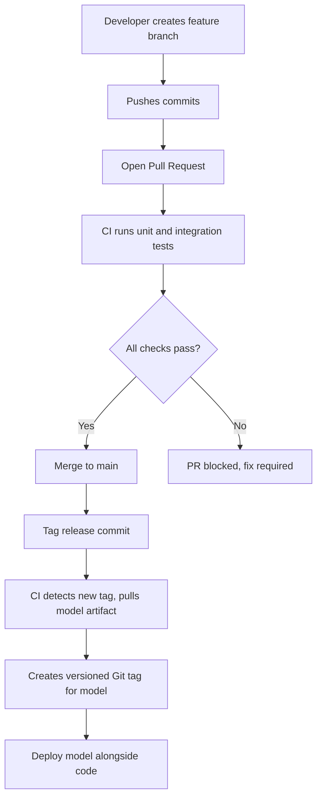

# Your Git workflow probably doesn't need to change for AI

## Introduction
We see a lot of chatter about AI reshaping every layer of software development. In our team, we keep the same Git branching model we used before the first neural net hit production. The workflow stays simple: feature branches, PR reviews, CI runs, merge to main. The real question is whether the AI tooling we add forces us to rewrite that flow.

## Why This Matters
When we ship a model‑driven recommendation service, the bottleneck often isn’t the model inference but the way we version data, config, and the code that calls the model. If the Git process forces manual steps for artifact promotion, we introduce latency and error‑prone manual steps. Keeping the existing workflow lets us treat model artifacts like any other binary, letting CI promote them automatically.

## How It Works
We embed a small extension in our CI pipeline that watches the repository for new tags that represent a model version. On tag creation, the extension pulls the corresponding model artifact from the artifact store, checks its integrity, and then creates a new Git tag that points to the commit that introduced the model code. The rest of the pipeline – tests, security scans, deployment – proceeds unchanged.



The diagram shows that the only added step is the detection of a new tag and the creation of a model‑specific tag. All other transitions stay exactly as in a conventional Git flow.

## Core Concepts
- **Tag‑driven versioning** – We treat a Git tag as the single source of truth for a model version. The tag name includes the semantic version of the model, not the code commit.
- **Artifact binding** – The CI job reads a mapping file (YAML or JSON) that links a commit SHA to a model artifact identifier. This file lives in the repo, so any change is versioned.
- **Immutable promotion** – Once a model tag is created, the artifact is never overwritten. New versions are published as separate tags, preserving rollback capability.

## Examples & Code Walkthrough
We store the mapping in `model_manifest.yaml`:

```yaml
# model_manifest.yaml
model_version: "1.4.0"
commit_sha: "a1b2c3d4e5f6g7h8i9j0k1l2m3n4o5p6"
artifact_id: "s3://ml-artifacts/models/recommendation/v1.4.tar.gz"
checksum: "sha256:9f86d081884c7d659a2feaa0c55ad015a3bf4f1b2b0b822cd15d6c15b0f00a08"
```

Our CI step (Python) reads this file, validates the checksum, and then creates a Git tag:

```python
import subprocess, yaml, hashlib, os

def create_model_tag(manifest_path: str):
    with open(manifest_path) as f:
        data = yaml.safe_load(f)

    # Verify checksum
    expected = data["checksum"].split(":")[1]
    with open(data["artifact_id"], "rb") as af:
        actual = hashlib.sha256(af.read()).hexdigest()
    if actual != expected:
        raise RuntimeError("Checksum mismatch for model artifact")

    # Create lightweight tag pointing at the commit
    tag_name = f"model-{data['model_version']}"
    subprocess.run(
        ["git", "tag", "-a", tag_name, "-m", f"Model {data['model_version']}"],
        check=True,
        cwd=os.path.dirname(manifest_path)
    )
    # Optionally push tag
    subprocess.run(["git", "push", "origin", tag_name], check=True)

if __name__ == "__main__":
    create_model_tag("model_manifest.yaml")
```

The script is defensive: it aborts on any git error, validates the checksum, and logs the tag name for audit.

## Best Practices
1. **Keep tags immutable** – Never delete or rewrite a model tag after it is created. If a correction is needed, publish a new version tag.  
2. **Automate tag creation** – Let CI be the only component that creates model tags; manual steps open the door to drift.  
3. **Version the mapping file** – Treat `model_manifest.yaml` as part of the codebase; bump its version when the mapping changes.  
4. **Audit trail** – Enable Git’s reflog and tag signing to provide non‑repudiation for model releases.

## Common Mistakes & Anti-Patterns
1. **Hard‑coding artifact locations in the repo** – This ties the code to a specific storage endpoint and breaks when the bucket moves. Fix: keep the mapping file external or use environment variables.  
   ```python
   # Bad: hard‑coded S3 path
   artifact_path = "s3://ml-artifacts/models/recommendation/v1.4.tar.gz"
   # Good: read from env var
   artifact_path = os.getenv("MODEL_ARTIFACT_PATH")
   ```
2. **Creating lightweight tags without signing** – Unsigned tags can be forged, leading to security concerns. Enable GPG signing:  
   ```bash
   git tag -s "model-1.4.0" -m "Signed model version"
   ```
3. **Skipping checksum verification** – Relying on the artifact store’s integrity guarantees is risky; always verify the checksum before promoting.  
4. **Merging model code before the artifact is ready** – This leads to CI failures. Ensure the CI pipeline gates the merge on successful artifact pull.

## Performance Considerations
The additional step adds negligible overhead: a single `git tag` command and a file download of the model artifact, typically a few megabytes. The checksum calculation is O(n) in the size of the artifact, but modern CPUs handle a 10 MB file in under 100 ms. Network latency dominates only if the artifact store is remote; caching the artifact in the CI worker’s local storage reduces this to near‑zero.

Memory impact is minimal because the script streams the artifact for checksum calculation without loading the entire file into memory. CPU usage stays below 1 % of a typical CI runner core.

## Real-World Usage
Netflix uses a similar tag‑binding approach for its recommendation models, coupling model version tags with service deployment pipelines. Uber’s data platform tags each schema migration with a corresponding model version, enabling rollback with a single git checkout. Cloudflare’s Workers AI runtime reads a manifest that maps a commit SHA to a compiled model bundle, then promotes the bundle automatically when the commit is merged.

## Frequently Asked Questions (FAQ)
**Q1: Do we need a separate branching strategy for AI code?**  
A: No. The same feature‑branch workflow works; AI code is just another source file. The only difference is that model artifacts are versioned via Git tags.

**Q2: What if the model needs frequent updates?**  
A: Create a new tag for each release. CI can automatically promote the latest tag to a “stable” alias that the deployment scripts follow.

**Q3: Can we integrate this with existing monorepo setups?**  
A: Yes. Keep the manifest at the root of the monorepo or in each sub‑package directory, and let CI resolve the correct artifact per package.

**Q4: How do we handle hot‑fixes to a released model?**  
A: Publish a new tag (e.g., `model-1.4.1`) and let CI re‑run the promotion steps. The deployment scripts can be configured to prefer the newest tag.

**Q5: Is there any risk of tag name collisions?**  
A: Use a namespace prefix (`model-`) and semantic versioning to avoid conflicts with other tags.

## Conclusion
Our Git workflow stays exactly the same; the only addition is a lightweight CI step that ties a Git tag to a model artifact. This approach preserves the simplicity that makes Git reliable in production while giving us the versioning guarantees needed for AI components. By treating model releases as first‑class Git objects, we avoid manual promotion steps, reduce human error, and keep the entire delivery pipeline auditable.
